# Remediation Blueprint & Action Plan: Thai Watsadu WDS Platform
**Document Identifier**: `TW-WDS-REMEDIATION-PLAN-V1`  
**Author**: Remediation Planning Explorer (`explorer_remediation_p1`)  
**Target Deliverables**:
1. `c:\atgv\wds\docs\01_project_management_delivery_framework.md` (Doc 01)
2. `c:\atgv\wds\docs\02_system_architecture_high_level_design.md` (Doc 02)
3. `c:\atgv\wds\docs\03_technical_specifications_implementation_guidelines.md` (Doc 03)  
**Date**: 2026-09-09  
**Status**: Authoritative Blueprint for Implementation Workers (`worker_pm_m1_1`, `worker_sa_m2_2`, `worker_dev_m3_3`)

---

## 1. Executive Summary & Synthesis of Review / Challenge Findings

Following rigorous architectural, functional, and technical reviews by `reviewer_1_arch`, `challenger_1_pm_sa`, and `challenger_2_tech`, three unanimous verdicts of **`REQUEST_CHANGES`** were issued against the baseline design documents. While the depth, domain coverage, and engineering caliber of the deliverables are exceptionally high, critical structural discrepancies and domain logic defects must be remediated:

```
+---------------------------------------------------------------------------------------------------------+
|                                    SYNTHESIS OF DEFECTS & REMEDIATIONS                                  |
+---------------------------------------------------------------------------------------------------------+
| Deliverable 01 (PM Framework):                                                                          |
|   1. Capacity Model Deficit: Headcount assumed 9 coders. Recalibrate to 6.5 Coding FTE (0.5 Dev Lead,  |
|      4 BE, 2 FE) vs. 2.5 Supporting/Governance FTE (1 QA, 1 DevOps, 0.5 Lead). Balance 440 SP.          |
|   2. Drop List Temporal Fallacy: 6 items (47 SP) were in S1-S5 and 4 items were already deferred.        |
|      Realign all 20 drop items (152 SP) to Sprints S6–S11 (post-CP3 gate).                              |
+---------------------------------------------------------------------------------------------------------+
| Deliverable 02 (System Architecture HLD):                                                               |
|   1. Polyglot Microservice Drift: C4 Container had Go/Kotlin. Standardize on NestJS 10 Modular Monolith.|
|   2. Thai Tax ID Modulo 11 Failure: Fix Seller Tax ID to 0107553000107 (valid check digit 7).            |
|   3. Stock Reservation TTL Contradiction: Standardize 30m / 1800s to 15m (900s) everywhere.            |
|   4. Credit Exposure PDC Sign Bug: Change + PDC to - PDC and define two-phase credit_reservations.     |
|   5. FEFO Aging Trap & Partial Crash: Rewrite Step 4 for multi-lot partial allocation & broken pallets. |
|   6. Float Literal Call: Purge decimal.NewFromFloat(0.07); enforce decimal.js / string constructor.     |
+---------------------------------------------------------------------------------------------------------+
| Deliverable 03 (Technical Specifications):                                                              |
|   1. Roadmap Desynchronization: Sync Section 6 roadmap table to individual sprints S0–S12 from Doc 01.  |
|   2. Immutability Transition Bypass: Update trg_prevent_posted_tax_invoice_mutation to guard posting.   |
|   3. Child Item Mutation Leak: Add trg_tax_invoice_items_immutable trigger on tax_invoice_items.        |
|   4. Credit Note DDL Missing: Add full DDL for credit_notes & credit_note_items under Section 86/10.   |
|   5. Concurrency Race in Sequence Gen: Replace UPDATE/INSERT with ON CONFLICT DO UPDATE atomic DDL.     |
|   6. JSON API Float Coercion: Quote all decimal numbers ("250.0000", "28.50") across API samples.       |
|   7. Missing Floor Override Link: Add floorOverrideRequestId to POST /api/v1/orders payload.             |
|   8. Flawed Husky Regex: Enforce 72-char limit, lowercase start, snake_case scope [a-z0-9_-].           |
+---------------------------------------------------------------------------------------------------------+
```

---

## 2. Deliverable 01 Remediation Plan: Project Management & Delivery Framework

### 2.1 Headcount & FTE Classification Calibration
- **Target File**: `c:\atgv\wds\docs\01_project_management_delivery_framework.md`
- **Target Section**: §1.3 (lines 87–117) & §1.4 (lines 118–151)
- **Defect Identified**: Sizing previously assumed all 9 engineers contribute full-time feature story points ($9 \times 40 = 360 \text{ hours}$ productive / sprint). In reality, 1 QA Automation Lead and 1 DevOps Engineer deliver supporting platform and quality engineering, and the Dev Lead has 50% governance/review overhead.
- **Remediation Specification**:
  Explicitly classify the 9 FTEs into **6.5 Coding FTE** and **2.5 Supporting/Governance FTE**:

```
+----------------------------------------------------------------------------------------------------+
|                                RECALIBRATED 9-FTE RESOURCE ALLOCATION                              |
+----------------------------------------------------------------------------------------------------+
| A. FEATURE CODING CAPACITY (6.5 FTE)                                                               |
|   - 1 Dev Lead / Architect     : 0.5 Coding FTE (50% Architecture, PR Reviews, SteerCo, ARB)      |
|   - 4 Backend Engineers (BE1-4): 4.0 Coding FTE (Master Data, Pricing, Credit, Inventory, Tax)     |
|   - 2 Frontend Engineers (FE1-2): 2.0 Coding FTE (Admin/Finance Portals, Sales Desk/Ops Portals)    |
|                                                                                                    |
| B. SUPPORTING & PLATFORM CAPACITY (2.5 FTE)                                                        |
|   - 1 QA Automation Lead       : 1.0 Supporting FTE (Playwright, E2E, Mock Services, RD Vectors)   |
|   - 1 DevOps / Platform Lead   : 1.0 Supporting FTE (CI/CD Gates, Neon DB, Redis/Kafka Infra, K8s) |
|   - Dev Lead Governance        : 0.5 Governance FTE (Scrum Ceremonies, Technical Risk Mgmt)        |
+----------------------------------------------------------------------------------------------------+
```

### 2.2 Mathematical Capacity Model & Velocity Calibration
- **Formula & Derivation**:
  - **Sprint Timebox**: 2 Weeks = 10 Working Days.
  - **Gross Coding Hours per Sprint**: $6.5 \text{ Coding FTE} \times 80 \text{ Gross Hours} = 520 \text{ Gross Coding Hours}$.
  - **Focus Factor**: **70%** (accounting for backlog refinement, architectural spikes, sprint rituals, PR turnarounds).
  - **Net Productive Coding Hours**: $520 \times 0.70 = 364 \text{ Net Coding Hours per Sprint}$.
  - **Supporting Capacity Hours**: $(1.0 \text{ QA} + 1.0 \text{ DevOps} + 0.5 \text{ Lead Gov}) \times 80 \times 0.70 = 140 \text{ Net Platform/Quality Hours per Sprint}$.
  - **Story Point Baseline Calibration**: Sizing baseline calibrates $1 \text{ SP} \approx 9.1 \text{ Net Coding Hours}$ (derived from $\frac{364 \text{ Net Hours}}{40 \text{ SP}}$).
  - **Sprint Velocity Baseline**:
    $$\text{Velocity} = \frac{364 \text{ Net Hours}}{9.1 \text{ Hours/SP}} = 40.0 \text{ SP / Sprint}$$
  - **Total 26-Week Delivery Budget (13 Sprints: S0–S12)**:
    - **Sprint S0 (Foundations & Platform Tooling)**: Budgeted at 25 SP (executed primarily by DevOps, Dev Lead, with initial schema scaffolding by BE).
    - **Sprints S1–S11 (11 Core Delivery Sprints)**: $11 \times 40 \text{ SP/Sprint} = 440 \text{ Delivered Functional SP}$.
    - **Sprint S12 (Cutover & Pilot Hypercare)**: Budgeted at 20 SP (cutover dry-runs, data delta migration, 3-store pilot).
    - **Gross Delivery Ceiling**: $25 + 440 + 20 = 485 \text{ SP}$.
    - **Scope Sizing**: Exactly 440 SP (249 requirements).
    - **Reserve Buffer**: $480 \text{ Planned Operational Capacity} - 440 \text{ Scope Sizing} = 40 \text{ SP (9.1\% Buffer)}$.

### 2.3 Frontend vs. Backend Capacity Balance
- **Workload Profile**: In an enterprise B2B transaction system, the domain logic is backend-intensive (tax algorithms, credit ledgers, multi-lock ATP, FEFO sorting, and RD compliance). The architectural split is approximately **68% Backend / 32% Frontend**.
- **Backend Coding Capacity**:
  - 4.5 FTE (4 BE + 0.5 Dev Lead) $\to 4.5 \times 80 \times 0.70 = 252 \text{ Net Hours/Sprint}$.
  - Backend Velocity: $\frac{252 \text{ Hours}}{9.1 \text{ Hours/SP}} \approx 27.7 \text{ SP/Sprint}$ ($11 \text{ Sprints} \times 27.7 \approx 305 \text{ SP}$ total).
- **Frontend Coding Capacity**:
  - 2.0 FTE (2 FE) $\to 2.0 \times 80 \times 0.70 = 112 \text{ Net Hours/Sprint}$.
  - Frontend Velocity: $\frac{112 \text{ Hours}}{9.1 \text{ Hours/SP}} \approx 12.3 \text{ SP/Sprint}$ ($11 \text{ Sprints} \times 12.3 \approx 135 \text{ SP}$ total).
- **Sum**: $305 \text{ BE SP} + 135 \text{ FE SP} = 440 \text{ SP Delivered}$. Cleanly eliminates the frontend capacity overflow.

### 2.4 Realigned 20-Item Drop List Protocol (All in Sprints S6–S11)
- **Target Section**: §5.1–§5.4 (lines 645–719)
- **Defect Identified**:
  1. Drop items #1, #2, #4, #5 in the baseline table were identical to features already deferred in Section 1.2 line 83 (e.g. Native iOS/Android apps, predictive ML forecasting). Dropping already-deferred features saves 0 SP from the committed 440 SP scope.
  2. Drop items #7, #10, #12, #14, #18, #19 (totaling 47 SP) were scheduled in Epics E01, E02, E03, E07 in Sprints S1 to S5. Because CP3 triggers at the *end of Sprint 5*, those sprints are in the past; past work cannot recover future delivery capacity for S6–S11.
- **Remediation Specification**:
  All 20 items in the Drop List are strictly realigned to features belonging to **Sprints S6 through S11** (Epics E04, E08, E10, E11, E12, E14, E15). Every item has a concrete, tested operational/manual fallback workaround and totals **152 Story Points (34.5% of R1 scope)** across 4 recovery tiers:

#### The Authoritative 20-Item Drop List Matrix (Post-CP3 Recovery)
| Drop # | Epic | Sprint | Feature Name & Scope Description | Justification for Deferral | Saved SP | Operational / Manual Fallback Workaround | Target Release |
|:---:|:---:|:---:|---|---|:---:|---|:---:|
| **1** | E11 | S9 | **Sales Rep Offline Quoting Mode (IndexedDB Sync)** | Offline conflict resolution complexity; sales reps operate in store catchment areas with reliable 4G/5G cellular coverage. | **8 SP** | Sales reps use live mobile web portal connected via cellular hotspot or mobile data. | R1.1 |
| **2** | E11 | S9 | **Driver Digital Sign-on-Glass (e-Sign) & Photo Upload** | Mobile device camera/canvas hardware tuning and offline sync can be deferred to post-pilot. | **7 SP** | Driver captures physical customer signature on tri-copy Delivery Order (DO) paper slip. | R1.1 |
| **3** | E11 | S9 | **Real-Time Delivery Truck GPS Telematics & Map** | IoT GPS telematics streaming and WebSocket broker infrastructure overhead. | **8 SP** | Transport dispatcher calls driver via telephone for location updates; logs milestone in dispatch UI. | R1.1 |
| **4** | E11 | S9 | **Automated Customer SMS Delivery ETA Alert Webhook** | Third-party SMS gateway integration and internationalized message template management. | **6 SP** | Store customer service notifies contractor contact via LINE Official Account or phone call. | R1.1 |
| **5** | E11 | S9 | **Contractor Quick-Reorder Barcode Scanner in Web** | WebRTC camera barcode decoding across variable mobile device browsers creates high QA burden. | **7 SP** | Contractor enters SKU code or selects previous invoice from order history to duplicate items. | R1.1 |
| **6** | E08 | S7 | **Automated Gate Pass License Plate Camera Bridge** | Physical DC gate camera OCR serial integration is vulnerable to site wiring and lighting variances. | **7 SP** | Gate guard verifies printed Gate Pass barcode and manually types truck registration number. | R1.1 |
| **7** | E08 | S7 | **Warehouse 2D Staging Bay Heatmap & Bin Optimizer** | Heavy graphical rendering; standard sequential bin picking slips provide 100% operational fulfillment. | **8 SP** | Warehouse workers pick items using printed pick-lists sorted by warehouse aisle and bin location. | R2.0 |
| **8** | E08 | S9 | **Multi-Stop Dynamic Route Optimization (VRP Engine)**| Complex combinatorial Vehicle Routing Problem algorithms; third-party map engine license overhead. | **9 SP** | Fleet supervisor manually clusters delivery destinations using pre-defined district zone maps. | R1.1 |
| **9** | E08 | S7 | **Automated Pallet Packing Slip 2D Consolidation** | Grouping multi-pallet manifests into single 2D DataMatrix barcode requires specialized scanner apps. | **6 SP** | Forklift operator attaches individual standard 1D barcode labels to each pallet. | R1.1 |
| **10** | E12 | S8 | **Cross-Branch Multi-Store Return & Restock Routing** | Complex inter-store cross-clearing accounting and multi-company inventory transfers. | **8 SP** | Material returns strictly accepted only at the original issuing branch or central DC. | R1.1 |
| **11** | E12 | S8 | **Automated Grade-B Clearance Repricing Rules** | Dynamic clearance price discounting engine based on inspection grade formulas. | **7 SP** | Branch store manager manually inspects returned goods and applies manual markdown in POS. | R1.1 |
| **12** | E12 | S8 | **Restocking Fee Automated Policy Override Matrix** | Intricate multi-tier return fee deduction rules based on customer tier and days elapsed. | **7 SP** | Customer service clerk manually selects flat 10% restocking fee checkbox during RMA creation. | R1.1 |
| **13** | E10 | S6 | **Automated SMS/Email e-Tax Invoice Distribution** | Integration with external notification queues and authenticated PDF attachment signing. | **6 SP** | Branch prints physical tax invoice for delivery or cashier emails PDF manually to buyer contact. | R1.1 |
| **14** | E10 | S6 | **Multi-Currency Billing & FX Valuation Engine** | Thai Watsadu domestic wholesale is 99.8% THB denominated; foreign currency contracts are negligible. | **6 SP** | System locked strictly to Thai Baht (THB); rare institutional foreign orders processed via ERP. | R2.0 |
| **15** | E10 | S7 | **Automated Batch PDF/A-3 Compression Packager** | Complex zip archive bundling with cryptographic manifest signing for monthly archives. | **7 SP** | Database stores individual signed PDF/A-3 blobs in S3; monthly audit extracts run via CLI script. | R1.1 |
| **16** | E14 | S10| **Real-Time Margin & Profitability Heatmap by KAM** | High OLAP query aggregation overhead on transactional database; requires BI cube tuning. | **8 SP** | Finance exports weekly sales reports to Excel and runs existing PowerBI margin models. | R2.0 |
| **17** | E14 | S10| **Interactive Executive BI Drill-down Simulation Cube** | Complex client-side charting, slice-and-dice multidimensional cube caching. | **8 SP** | Executive leadership uses standard scheduled tabular CSV/PDF reports emailed every Monday. | R2.0 |
| **18** | E14 | S10| **Automated ภ.พ.30 Discrepancy Reconciliation Alert Bot** | Automated cross-checking bot flagging delta between subledger and general ledger tax lines. | **7 SP** | Tax accountant runs manual monthly reconciliation query script between `tax_invoices` and GL. | R1.1 |
| **19** | E04 | S6 | **Multi-Warehouse Automated Split-Order Combinatorial**| Dynamic integer programming solver automatically splitting orders across 80 stores and DCs. | **10 SP** | Order desk sales rep manually chooses fulfillment source (Store vs. DC) per order line item. | R1.1 |
| **20** | E15 | S8 | **Automated Legacy POS Settlement Reconciliation Replayer**| Automated compensating saga replayer for legacy store POS network dropouts. | **8 SP** | POS reconciliation exceptions written to error queue; store IT re-triggers batch via admin button. | R1.1 |
| **TOTAL**| — | **S6–S11** | **ALL 20 DROP ITEMS SITUATED AFTER CHECKPOINT CP3** | — | **152 SP** | **100% COVERED BY VERIFIED MANUAL WORKAROUNDS** | — |

#### Cumulative Shedding Tiers
- **Tier 1 (Drops #1–#5, Sprint S9)**: Sheds **36 SP** (Mobility & remote field enhancements).
- **Tier 2 (Drops #6–#10, Sprints S7, S8, S9)**: Sheds **38 SP** (Advanced DC logistics & RMA cross-branch routing). Cumulative: **74 SP**.
- **Tier 3 (Drops #11–#15, Sprints S6, S7, S8)**: Sheds **33 SP** (Secondary tax automation, FX, RMA fee matrices). Cumulative: **107 SP**.
- **Tier 4 (Drops #16–#20, Sprints S6, S8, S10)**: Sheds **41 SP** (Executive BI analytics, algorithmic split order, POS replayer). Cumulative: **152 SP**.

---

## 3. Deliverable 02 Remediation Plan: System Architecture & High-Level Design

### 3.1 Standardize Architecture on NestJS 10 (Fastify) Modular Monolith
- **Target File**: `c:\atgv\wds\docs\02_system_architecture_high_level_design.md`
- **Target Section**: §1.2 C4 Container Diagram (lines 203–250), §1.3 (lines 255–385), and §4.5 (lines 1124–1153)
- **Defect Identified**: Doc 02 specified polyglot microservices in Go (`svc_master`, `svc_pricing`, `svc_inventory`, `svc_integration`, `daemon_reaper`) and Kotlin / Spring Boot (`svc_credit`, `svc_order`, `svc_tax`), contradicting the 9-person team staffing (Doc 01) and the NestJS 10 Modular Monolith specification in Doc 03.
- **Remediation Specification**:
  1. Remove all references to Go and Kotlin microservices.
  2. Replace C4 Container diagram in §1.2 with the unified **NestJS 10 (Fastify, TypeScript) Modular Monolith** container architecture:

```mermaid
C4Container
    title Container Diagram (C4 Level 2) - Thai Watsadu WDS Modular Monolith Architecture

    Person(contractor, "B2B Contractor", "Purchasing agent checking quotes and orders")
    Person(sales_rep, "Sales Rep / KAM", "Direct sales quoting, credit override request")
    Person(cashier, "Store Cashier / Fulfilled", "Branch POS cashier and warehouse picker")

    Container(spa_portal, "B2B Contractor Web Portal", "Next.js 14, React, Tailwind", "Self-service quoting, order confirmation, statement viewing.")
    Container(sales_app, "Sales & Branch Web Portal", "Next.js 14, React, Tailwind", "Field quoting, credit monitoring, order desk, pick-list release.")

    Container(api_gateway, "Reverse Proxy / Ingress", "Traefik / Nginx", "TLS 1.3 termination, rate limiting, gzip/brotli compression, OIDC JWT validation.")

    System_Boundary(wds_monolith_boundary, "Thai Watsadu WDS Modular Monolith") {
        Container(app_monolith, "WDS Modular Monolith Engine", "NestJS 10, Fastify, TypeScript", "Modular monolith executing in-process domain modules via NestJS dependency injection and transactional event bus.")
        
        Component(mod_master, "MasterDataModule", "TypeScript / Prisma", "Maker-Checker staging, catalog cache, RBAC authorization, audit triggers.")
        Component(mod_pricing, "PricingModule", "TypeScript / Decimal.js", "Tiered volume breaks, zone freight matrix, floor price guardrails.")
        Component(mod_credit, "CreditModule", "TypeScript / Decimal.js", "Credit exposure ledger, PDC state machine, two-phase credit reservations.")
        Component(mod_inventory, "InventoryModule", "TypeScript / Redis Redlock", "Two-phase stock reservations, ATP routing, FEFO cement lot allocator.")
        Component(mod_order, "OrderModule", "TypeScript", "Order state machine, floor override linking, checkout coordinator.")
        Component(mod_tax, "TaxModule", "TypeScript / Crypto", "Gapless tax sequence allocation, Section 86/10 Credit Notes, e-Tax XML/PDF generation.")
        Component(mod_integration, "IntegrationModule", "TypeScript / Kafka Consumer", "Merchandising I0a worker, POS settlement I0d, SAP ERP GL I0e outbox.")
        Component(task_reaper, "ReservationReaperTask", "NestJS Scheduled Task", "Scans expired 15-min stock and credit reservations every 60s.")
    }

    ContainerDb(db_postgres, "Primary Relational Database", "PostgreSQL 16.2+ (Neon)", "ICU collation 'th-TH-x-icu', TIMESTAMPTZ (UTC), NUMERIC types, row-level locks.")
    ContainerDb(cache_redis, "Distributed Cache & Mutex", "Redis 7.2 Cluster", "Redlock mutexes, ATP edge cache, 15-min reservation lease TTLs.")
    ContainerQueue(event_bus, "Enterprise Event Bus", "Apache Kafka 3.6+", "Transactional Outbox streaming for orders, tax events, ERP integration.")
    ContainerDb(obj_storage, "Document Archive Store", "MinIO / S3 Object Storage", "PAdES signed PDF/A-3 invoices, e-Tax XML digests, cheque scan images.")

    Rel(contractor, spa_portal, "Visits", "HTTPS")
    Rel(sales_rep, sales_app, "Submits quotes", "HTTPS")
    Rel(cashier, sales_app, "Settles & prints", "HTTPS")

    Rel(spa_portal, api_gateway, "REST API Calls", "JSON / HTTPS")
    Rel(sales_app, api_gateway, "REST API Calls", "JSON / HTTPS")

    Rel(api_gateway, app_monolith, "Routes requests", "HTTP / Fastify")
    Rel(app_monolith, db_postgres, "Transactional Reads/Writes", "Prisma / Kysely (PgBouncer)")
    Rel(app_monolith, cache_redis, "Locks & Session Cache", "ioredis")
    Rel(app_monolith, event_bus, "Produces & Consumes Events", "kafkajs")
    Rel(app_monolith, obj_storage, "Archives Invoices & Scans", "S3 SDK")
```



### 3.2 Correct Thai Watsadu Seller Tax ID to Valid Modulo 11 Check Digit
- **Target Section**: §3.5 line 900
- **Defect Identified**: Seller Tax ID was listed as `0105553043125`. Applying the Thai corporate Tax ID Modulo 11 check digit algorithm:
  $$\text{Sum} = (0\times 13) + (1\times 12) + (0\times 11) + (5\times 10) + (5\times 9) + (5\times 8) + (3\times 7) + (0\times 6) + (4\times 5) + (3\times 4) + (1\times 3) + (2\times 2) = 207$$
  $$207 \pmod{11} = 9 \implies (11 - 9) \pmod{10} = 2 \neq 5 \quad \text{(FAILED)}$$
- **Remediation Specification**:
  Update Seller Tax ID to CRC Thai Watsadu Co., Ltd. official tax ID: **`0107553000107`**.
  **Proof of Modulo 11 Validity**:
  $$\text{Sum} = (0\times 13) + (1\times 12) + (0\times 11) + (7\times 10) + (5\times 9) + (5\times 8) + (3\times 7) + (0\times 6) + (0\times 5) + (0\times 4) + (1\times 3) + (0\times 2)$$
  $$\text{Sum} = 0 + 12 + 0 + 70 + 45 + 40 + 21 + 0 + 0 + 0 + 3 + 0 = 191$$
  $$191 \pmod{11} = 4 \implies (11 - 4) \pmod{10} = 7 == 7 \quad \text{(VERIFIED VALID)}$$

### 3.3 Standardize Stock Reservation Lease TTL to 15 Minutes (900s) Everywhere
- **Target Section**: Lines 22, 192, 333, 420, 531, 545, 1163, 1181
- **Defect Identified**: Doc 02 repeatedly specified a 30-minute reservation lease (TTL 1800s), while Doc 01 line 789 and Doc 03 lines 204, 582, 1104, 1829 established a 15-minute lease (TTL 900s).
- **Remediation Specification**:
  Purge all references to 30 minutes / 1800s in Doc 02. Update to **15 minutes (900 seconds)** across all text, architecture diagrams, sequence diagrams, and edge-case tables.

### 3.4 Dynamic Credit Exposure Calculus & Two-Phase Credit Reservation Protocol
- **Target Section**: §1.3.3 (line 369) & §3.3 (lines 801–840)
- **Defect Identified**:
  1. Formula was $\text{TotalExposure} = \dots + \mathbf{PDC_{\text{Unpresented}}} - \dots$. Adding received unpresented cheques treats customer payment instruments as debt rather than collateral/payment.
  2. No formal schema or state machine existed for `credit_reservations` to prevent race conditions during concurrent checkouts.
- **Remediation Specification**:
  1. Correct Credit Exposure Formula:
     $$\text{TotalExposure} = \text{AR}_{\text{Unpaid}} + \text{Orders}_{\text{InFulfillment}} + \text{Credit}_{\text{Reserved}} - \text{PDC}_{\text{Holding}} - \text{CreditNotes}_{\text{Unapplied}}$$
     Where:
     - $\text{AR}_{\text{Unpaid}}$: Posted unpaid invoices ledger balance.
     - $\text{Orders}_{\text{InFulfillment}}$: Confirmed orders currently in pick, pack, or transit.
     - $\text{Credit}_{\text{Reserved}}$: Active 15-minute credit reservations from in-flight checkouts.
     - $\text{PDC}_{\text{Holding}}$: Post-dated cheques received and lodged in store vault, awaiting deposit maturity.
     - $\text{CreditNotes}_{\text{Unapplied}}$: Approved, unapplied statutory credit notes.
  2. Define the Two-Phase Credit Reservation Protocol (`credit_reservations`):

```sql
CREATE TYPE credit_reservation_status_enum AS ENUM ('ACTIVE', 'COMMITTED', 'EXPIRED', 'RELEASED');

CREATE TABLE credit_reservations (
    reservation_id          UUID PRIMARY KEY DEFAULT uuid_generate_v4(),
    customer_id             UUID NOT NULL REFERENCES customers(customer_id),
    order_reference         VARCHAR(64) NOT NULL,
    reserved_amount_thb     NUMERIC(15, 2) NOT NULL,
    status                  credit_reservation_status_enum NOT NULL DEFAULT 'ACTIVE',
    created_at              TIMESTAMPTZ NOT NULL DEFAULT CURRENT_TIMESTAMP,
    expires_at              TIMESTAMPTZ NOT NULL, -- Lease: CURRENT_TIMESTAMP + INTERVAL '15 minutes'
    committed_at            TIMESTAMPTZ,
    released_at             TIMESTAMPTZ,
    CONSTRAINT chk_cred_res_amount_pos CHECK (reserved_amount_thb > 0.00)
);

CREATE INDEX idx_credit_reservations_active ON credit_reservations(customer_id, status)
WHERE status = 'ACTIVE';
```

- **Protocol Execution Lifecycle**:
  - **Phase 1 (Soft Reserve)**: Checkout initiates `POST /api/v1/credit/reserve`. Acquires row lock on `customer_credit_profiles` via `SELECT ... FOR UPDATE`. Verifies $\text{TotalExposure} + \text{ProposedAmount} \le \text{EffectiveCreditLimit}$. Inserts row into `credit_reservations` with `status = 'ACTIVE'` and `expires_at = NOW() + INTERVAL '15 minutes'`.
  - **Phase 2 (Commit)**: Upon successful order placement, transitions status to `COMMITTED` and reflects amount in `Orders_InFulfillment`.
  - **Phase 3 (Reap / Release)**: If cart is abandoned or order fails, reservation transitions to `RELEASED`. The background `ReservationReaperTask` queries `WHERE status = 'ACTIVE' AND expires_at < NOW()` every 60 seconds and transitions expired rows to `EXPIRED`.

### 3.5 FEFO Pallet Allocation Algorithm (Eliminating the Aging Trap & Multi-Lot Partial Demand)
- **Target Section**: §3.4 lines 852–877
- **Defect Identified**:
  Step 3 prioritized full pallets, skipping older partial lots. Step 4 demanded `available_qty >= RequiredQuantity` on a single lot. If demand was 25 bags and lots were [Lot A: 15, Lot B: 15], Step 4 crashed/returned NULL, and older lots aged out while newer full pallets were shipped ("Aging Trap").
- **Remediation Specification**:
  Replace `FEFO_Pallet_Allocation` with the revised **Two-Phase Multi-Lot FEFO Algorithm**:

```
Algorithm: FEFO_Pallet_Allocation_V2 (Aging-Trap Free)
Input: SKU, RequiredQuantity, BranchStockLots
Output: AllocatedLotList (list of {lot_id, quantity, is_full_pallet})

1. Filter candidate lots WHERE (expiry_date - CURRENT_DATE) >= 30 days AND available_qty > 0
2. Sort candidate lots ASCENDING by expiry_date (strict FEFO ordering)
3. Initialize:
     AllocatedLotList = []
     pallet_size = SKU.units_per_pallet (e.g. 40 bags)
     remaining_demand = RequiredQuantity

4. PHASE 1: BROKEN-PALLET / ODD-QUANTITY DEPLETION (Prevents Aging Trap)
   // First, check if demand has an odd remainder or if older lots contain broken pallets
   For each lot in candidate lots:
       If remaining_demand == 0: Break
       broken_qty = lot.available_qty % pallet_size
       If broken_qty > 0:
           // Lot has an already opened/partial pallet; deplete it first regardless of full demand
           qty_to_take = MIN(broken_qty, remaining_demand)
           AllocatedLotList.Append({lot: lot.lot_id, quantity: qty_to_take, is_full_pallet: false})
           lot.available_qty = lot.available_qty - qty_to_take
           remaining_demand = remaining_demand - qty_to_take

5. PHASE 2: FULL-PALLET ALLOCATION (In Strict FEFO Order)
   For each lot in candidate lots:
       If remaining_demand < pallet_size: Break
       full_pallets_available = FLOOR(lot.available_qty / pallet_size)
       If full_pallets_available > 0:
           pallets_to_take = MIN(full_pallets_available, FLOOR(remaining_demand / pallet_size))
           qty_to_take = pallets_to_take * pallet_size
           AllocatedLotList.Append({lot: lot.lot_id, quantity: qty_to_take, is_full_pallet: true})
           lot.available_qty = lot.available_qty - qty_to_take
           remaining_demand = remaining_demand - qty_to_take

6. PHASE 3: MULTI-LOT REMAINDER FULFILLMENT (Resolves Partial Demand Failure)
   // If odd quantity remains and no broken pallets exist, break oldest available lot across multiple lots
   For each lot in candidate lots:
       If remaining_demand == 0: Break
       If lot.available_qty > 0:
           qty_to_take = MIN(lot.available_qty, remaining_demand)
           AllocatedLotList.Append({lot: lot.lot_id, quantity: qty_to_take, is_full_pallet: false})
           lot.available_qty = lot.available_qty - qty_to_take
           remaining_demand = remaining_demand - qty_to_take

7. If remaining_demand > 0:
       Raise Exception("INSUFFICIENT_ATP_STOCK: Unable to fulfill requested quantity")

8. Return AllocatedLotList
```

### 3.6 Strict Floating-Point Prohibition & String-Based Decimal Ingestion
- **Target Section**: §4.5 (lines 1120–1155)
- **Defect Identified**: Go code invoked `decimal.NewFromFloat(0.07)`, directly ingesting an IEEE 754 float literal.
- **Remediation Specification**:
  Replace the Go code with the standard TypeScript NestJS service implementation using `decimal.js`, constructing decimals strictly from strings:

```typescript
import Decimal from 'decimal.js';

// Configure Decimal precision and rounding mode globally
Decimal.set({ precision: 20, rounding: Decimal.ROUND_HALF_UP });

export interface InvoiceLineItem {
  lineNumber: number;
  netPrice: Decimal;    // String initialized: new Decimal('155.0000')
  quantity: Decimal;    // String initialized: new Decimal('250.0000')
  taxableAmount: Decimal;
  vatAmount: Decimal;
}

export function reconcileDocumentVat(
  taxableTotal: Decimal,
  lines: InvoiceLineItem[],
  vatRateString: string = '0.0700'
): InvoiceLineItem[] {
  const vatRate = new Decimal(vatRateString); // Strict String Ingestion
  const expectedTotalVat = taxableTotal.mul(vatRate).toDecimalPlaces(2, Decimal.ROUND_HALF_UP);

  let computedSumVat = new Decimal('0.00');
  let maxLineIdx = 0;
  let maxLineTaxable = new Decimal('-1.00');

  for (let i = 0; i < lines.length; i++) {
    const lineTaxable = lines[i].netPrice.mul(lines[i].quantity).toDecimalPlaces(2, Decimal.ROUND_HALF_UP);
    const lineVat = lineTaxable.mul(vatRate).toDecimalPlaces(2, Decimal.ROUND_HALF_UP);

    lines[i].taxableAmount = lineTaxable;
    lines[i].vatAmount = lineVat;
    computedSumVat = computedSumVat.plus(lineVat);

    if (lineTaxable.greaterThan(maxLineTaxable)) {
      maxLineTaxable = lineTaxable;
      maxLineIdx = i;
    }
  }

  const diff = expectedTotalVat.minus(computedSumVat);
  if (!diff.isZero()) {
    // Adjust penny difference on the largest line item per RD reconciliation practice
    lines[maxLineIdx].vatAmount = lines[maxLineIdx].vatAmount.plus(diff);
  }

  return lines;
}
```

---

## 4. Deliverable 03 Remediation Plan: Technical Specifications & Implementation Guidelines

### 4.1 Synchronize Section 6 Sprint Roadmap to Individual Sprints S0–S12
- **Target File**: `c:\atgv\wds\docs\03_technical_specifications_implementation_guidelines.md`
- **Target Section**: §6 (lines 1807–1841)
- **Defect Identified**: Doc 03 grouped sprints into two-sprint chunks with a disordered sequence (e.g. Tax Invoicing in S11–S12, ATP in S7–S8), rendering CP3 (end of S5) and CP4 (end of S8) impossible to evaluate.
- **Remediation Specification**:
  Replace lines 1807–1841 with individual sprint-by-sprint implementation specifications matching Doc 01 §2.3 and §2.4:

```markdown
# 6. Sprint-by-Sprint Implementation Roadmap (S0–S12)

The 26-week delivery roadmap is structured for the 9-engineer delivery unit (6.5 Coding FTE, 2.5 Supporting FTE) to implement and deploy the 249 Release 1 requirements across 12 Epics:

- **Sprint S0 (Weeks 1–2) — Architecture Foundations & Tooling Baseline (E13, E15) [25 SP]**:
  - Provision Neon PostgreSQL 16.2+ (`th-TH-x-icu`), Redis 7.2 Cluster, and Apache Kafka 3.6+.
  - Setup NestJS 10 (Fastify) modular monolith repository with strict TypeScript and Husky commit linter.
  - Implement base RBAC schemas, JWT authentication with token revocation, and SHA-256 HMAC audit log.
- **Sprint S1 (Weeks 3–4) — Master Data & Maker-Checker Staging Engine (E01, E13, E15) [38 SP]**:
  - Implement Customer, Product, Branch tables with `NUMERIC(18,4)` and Maker-Checker staging schema (`maker_checker_requests`).
  - Deploy I0a Merchandising catalog batch parser worker for 100k SKU ingestion.
  - Deliver Back-Office Admin UI for Maker-Checker queue and customer profile management.
- **Sprint S2 (Weeks 5–6) — Dynamic Pricing Engine Core & Catalog Ingestion (E02, E01, E15) [42 SP] [Checkpoint CP2]**:
  - Implement Tiered Volume Breaks, Customer Trade Tier discounts, and Zone Freight calculation matrix.
  - Implement Absolute Floor Price Guardrail and effective-dated VAT configuration engine (`system_vat_configs`).
  - Deliver `POST /api/v1/pricing/calculate` API endpoint and Interactive Pricing Calculator UI.
- **Sprint S3 (Weeks 7–8) — Credit Headroom Engine & Cheque Control (E03, E02) [40 SP]**:
  - Implement dynamic credit exposure ledger with two-phase credit reservations (`credit_reservations`).
  - Implement 6-stage Post-Dated Cheque (PDC) register and automatic credit hold on bounced cheque events.
  - Deliver `POST /api/v1/credit/check` API endpoint and Credit Risk Desk UI.
- **Sprint S4 (Weeks 9–10) — Inventory FEFO Engine & Credit Exception Overrides (E07, E03, E15) [40 SP]**:
  - Implement First-Expired, First-Out (FEFO) cement lot allocation algorithm (`idx_inv_lots_fefo`).
  - Implement 15-day shelf-life quarantine rule and HMAC-signed 24-hour Credit Exception Override token.
  - Deploy Interface I0b Retail Store Stock sync worker.
- **Sprint S5 (Weeks 11–12) — Order Management, ATP Engine & Contention Resolution (E04, E07) [42 SP] [Checkpoint CP3 Gate]**:
  - Implement Available-to-Promise (ATP) engine with Redis Redlock and PostgreSQL `SELECT ... FOR UPDATE SKIP LOCKED`.
  - Implement 15-minute stock reservation lease (`stock_reservations`, TTL 900s) and multi-store split fulfillment.
  - Deliver `POST /api/v1/orders` API endpoint and Sales Order Desk UI.
- **Sprint S6 (Weeks 13–14) — Statutory Tax Invoicing & Thai Revenue Dept Engine (E10, E04) [40 SP]**:
  - Implement gapless tax sequence allocation (`fn_get_next_tax_invoice_number`) and Output VAT reconciliation.
  - Implement legal immutability database triggers on `tax_invoices` and `tax_invoice_items`.
  - Deliver `POST /api/v1/tax-invoices/post` API endpoint and Invoice Viewer/Print Station UI.
- **Sprint S7 (Weeks 15–16) — Warehouse Fulfillment, Dispatch & Financial Credit Notes (E08, E10) [38 SP]**:
  - Implement heavy material pick-list generator, Delivery Order (DO), and Gate Pass generation with weighbridge logging.
  - Implement statutory Credit Note Engine (`credit_notes`, `credit_note_items`) under Thai Revenue Code Section 86/10.
  - Deliver Warehouse Dispatch Station UI and Financial Adjustment Desk.
- **Sprint S8 (Weeks 17–18) — Return Merchandise Authorization (RMA) & Integration Stubs (E12, E15) [38 SP] [Checkpoint CP4 Freeze]**:
  - Implement RMA workflow with inspection grading (Grade A restock to ATP, Grade B clearance markdown).
  - Build integration test harnesses and production stubs for Interface I0d (POS) and Interface I0e (SAP GL).
  - Deliver RMA Return Processing UI.
- **Sprint S9 (Weeks 19–20) — Direct Ship Integration, Sales Mobility & Proof of Delivery (E11, E08) [36 SP]**:
  - Implement Direct Ship supplier EDI integration (Interface I11) for direct-to-site dispatch.
  - Deliver Responsive Mobile B2B Sales Web App for field sales representatives.
  - Implement Driver Proof of Delivery (POD) mobile module for signature and photo capture.
- **Sprint S10 (Weeks 21–22) — Operational BI Reporting & Statutory ภ.พ.30 Dashboards (E14, E15) [35 SP]**:
  - Implement Statutory Monthly VAT Output Report (รายงานภาษีขาย ภ.พ.30) and AR Aging Matrix.
  - Deliver Executive Compliance Dashboard with CSV/Excel/PDF export.
- **Sprint S11 (Weeks 23–24) — UAT Hardening, OWASP Pen-Test & Concurrency Stress (E15) [26 SP] [Checkpoint CP5 Go/No-Go]**:
  - Execute 500 concurrent user stress testing on ATP reservation locks.
  - Complete OWASP Top 10 remediation, penetration testing, and disaster recovery rehearsal.
  - Complete 100% of commercial and financial business acceptance testing.
- **Sprint S12 (Weeks 25–26) — Production Cutover, Delta Migration & 3-Branch Pilot Launch (E15) [20 SP]**:
  - Final master data delta migration, cutover dry run, and 3-branch live pilot deployment.
  - Establish 24/7 engineering hypercare bridge and handover operational runbooks.
```

### 4.2 Hardened Tax Invoice Immutability Trigger (`trg_prevent_posted_tax_invoice_mutation`)
- **Target Section**: §2.7 (lines 814–838)
- **Defect Identified**: Trigger checked `IF OLD.is_posted = TRUE`. When updating an invoice from `is_posted = FALSE` to `is_posted = TRUE`, `OLD.is_posted` was `FALSE`, allowing financial amounts, customer IDs, and tax IDs to be altered in the exact same update statement.
- **Remediation Specification**:
  Replace `trg_prevent_posted_tax_invoice_mutation` with transition-guarded logic:

```sql
CREATE OR REPLACE FUNCTION trg_prevent_posted_tax_invoice_mutation()
RETURNS TRIGGER AS $$
BEGIN
    -- 1. If already posted, completely block any UPDATE or DELETE operation
    IF TG_OP = 'DELETE' THEN
        IF OLD.is_posted = TRUE THEN
            RAISE EXCEPTION 'REVENUE DEPARTMENT SECURITY VIOLATION: Tax Invoice % has been legally posted and cannot be deleted per Section 86/4. Issue a Section 86/10 Credit Note.', OLD.invoice_number
            USING ERRCODE = '27000';
        END IF;
        RETURN OLD;
    END IF;

    IF TG_OP = 'UPDATE' THEN
        IF OLD.is_posted = TRUE THEN
            RAISE EXCEPTION 'REVENUE DEPARTMENT SECURITY VIOLATION: Tax Invoice % has already been posted and is legally immutable per Thai Revenue Code Section 86/4.', OLD.invoice_number
            USING ERRCODE = '27000';
        END IF;

        -- 2. Guard the posting transition (OLD.is_posted = FALSE AND NEW.is_posted = TRUE)
        -- Prevent tampering with statutory, financial, customer, or order fields upon posting
        IF OLD.is_posted = FALSE AND NEW.is_posted = TRUE THEN
            IF (OLD.total_taxable_amount_thb IS DISTINCT FROM NEW.total_taxable_amount_thb) OR
               (OLD.total_vat_amount_thb IS DISTINCT FROM NEW.total_vat_amount_thb) OR
               (OLD.total_payable_amount_thb IS DISTINCT FROM NEW.total_payable_amount_thb) OR
               (OLD.customer_id IS DISTINCT FROM NEW.customer_id) OR
               (OLD.customer_tax_id IS DISTINCT FROM NEW.customer_tax_id) OR
               (OLD.customer_branch_code IS DISTINCT FROM NEW.customer_branch_code) OR
               (OLD.seller_tax_id IS DISTINCT FROM NEW.seller_tax_id) OR
               (OLD.seller_branch_code IS DISTINCT FROM NEW.seller_branch_code) OR
               (OLD.vat_rate_percent IS DISTINCT FROM NEW.vat_rate_percent) OR
               (OLD.order_id IS DISTINCT FROM NEW.order_id) OR
               (OLD.branch_code IS DISTINCT FROM NEW.branch_code) THEN
                RAISE EXCEPTION 'REVENUE DEPARTMENT SECURITY VIOLATION: Financial, statutory, and tax fields cannot be modified during posting transition for invoice %.', NEW.invoice_number
                USING ERRCODE = '27001';
            END IF;
        END IF;
    END IF;

    RETURN NEW;
END;
$$ LANGUAGE plpgsql;

CREATE TRIGGER trg_tax_invoice_immutable
BEFORE UPDATE OR DELETE ON tax_invoices
FOR EACH ROW EXECUTE FUNCTION trg_prevent_posted_tax_invoice_mutation();
```

### 4.3 Child Table Immutability Trigger (`trg_tax_invoice_items_immutable`)
- **Target Section**: §2.7
- **Defect Identified**: `tax_invoice_items` had no database trigger, allowing quantities, prices, or line items to be modified or deleted on posted invoices.
- **Remediation Specification**:
  Attach `trg_tax_invoice_items_immutable` to `tax_invoice_items`:

```sql
CREATE OR REPLACE FUNCTION trg_prevent_posted_tax_invoice_items_mutation()
RETURNS TRIGGER AS $$
DECLARE
    v_is_posted BOOLEAN;
    v_inv_num VARCHAR(32);
    v_target_invoice_id UUID;
BEGIN
    IF TG_OP = 'INSERT' THEN
        v_target_invoice_id := NEW.invoice_id;
    ELSE
        v_target_invoice_id := OLD.invoice_id;
    END IF;

    -- Query parent tax invoice status
    SELECT is_posted, invoice_number INTO v_is_posted, v_inv_num
    FROM tax_invoices
    WHERE invoice_id = v_target_invoice_id;

    IF v_is_posted = TRUE THEN
        RAISE EXCEPTION 'REVENUE DEPARTMENT SECURITY VIOLATION: Line items for posted Tax Invoice % are legally immutable per Thai Revenue Code Section 86/4. Issue a Section 86/10 Credit Note for adjustments.', v_inv_num
        USING ERRCODE = '27000';
    END IF;

    IF TG_OP = 'DELETE' THEN
        RETURN OLD;
    END IF;
    RETURN NEW;
END;
$$ LANGUAGE plpgsql;

CREATE TRIGGER trg_tax_invoice_items_immutable
BEFORE INSERT OR UPDATE OR DELETE ON tax_invoice_items
FOR EACH ROW EXECUTE FUNCTION trg_prevent_posted_tax_invoice_items_mutation();
```

### 4.4 Complete Production DDL for Credit Notes (Section 86/10 Statutory Compliance)
- **Target Section**: §2.4 (new subsection §2.4.7)
- **Defect Identified**: Doc 03 contained zero DDL schemas for `credit_notes` and `credit_note_items`, violating R2 (E10) statutory requirements.
- **Remediation Specification**:
  Add production-grade DDL schemas with statutory reason codes, foreign keys, and immutability triggers:

```sql
-- -----------------------------------------------------------------------------
-- 2.4.7 STATUTORY CREDIT NOTES (THAI REVENUE CODE SECTION 86/10)
-- -----------------------------------------------------------------------------

CREATE TYPE credit_note_reason_enum AS ENUM (
    'GOODS_RETURN',              -- 1. สินค้าส่งคืนเนื่องจากชำรุดหรือผิดข้อกำหนด
    'PRICE_REDUCTION_DEFECT',    -- 2. ลดราคาสินค้าเนื่องจากชำรุดบกพร่อง
    'CALCULATION_ERROR',         -- 3. คำนวณราคาสินค้าผิดพลาดสูงกว่าความเป็นจริง
    'DISCOUNT_COMMERCIAL',       -- 4. ส่วนลดการค้าหรือเงินชดเชยภายหลังการขาย
    'ORDER_CANCELLED'            -- 5. บอกเลิกสัญญาการซื้อขาย
);

CREATE TABLE credit_notes (
    credit_note_id                  UUID PRIMARY KEY DEFAULT uuid_generate_v4(),
    credit_note_number              VARCHAR(32) NOT NULL UNIQUE, -- CN-00012-2569-09-000001
    original_invoice_id             UUID NOT NULL REFERENCES tax_invoices(invoice_id),
    original_invoice_number         VARCHAR(32) NOT NULL,
    branch_code                     VARCHAR(5) NOT NULL,
    issue_date                      DATE NOT NULL,
    posting_timestamp               TIMESTAMPTZ NOT NULL DEFAULT CURRENT_TIMESTAMP,
    reason_code                     credit_note_reason_enum NOT NULL,
    reason_description_th           VARCHAR(500) COLLATE "th-TH-x-icu" NOT NULL,
    original_invoice_amount_thb     NUMERIC(15, 2) NOT NULL,
    correct_amount_thb              NUMERIC(15, 2) NOT NULL,
    difference_taxable_amount_thb   NUMERIC(15, 2) NOT NULL, -- Net reduction in tax base
    difference_vat_amount_thb       NUMERIC(15, 2) NOT NULL, -- 7% VAT reduction
    difference_total_amount_thb     NUMERIC(15, 2) NOT NULL, -- Total credit note value
    vat_rate_percent                NUMERIC(5, 2) NOT NULL DEFAULT 7.00,
    customer_id                     UUID NOT NULL REFERENCES customers(customer_id),
    customer_tax_id                 VARCHAR(13) NOT NULL,
    customer_branch_code            VARCHAR(5) NOT NULL,
    is_posted                       BOOLEAN NOT NULL DEFAULT FALSE,
    digital_signature_pades_id      VARCHAR(255),
    created_by                      UUID NOT NULL,
    approved_by                     UUID,
    created_at                      TIMESTAMPTZ NOT NULL DEFAULT CURRENT_TIMESTAMP,
    CONSTRAINT chk_cn_amounts CHECK (
        original_invoice_amount_thb > correct_amount_thb AND
        difference_taxable_amount_thb = (original_invoice_amount_thb - correct_amount_thb) AND
        difference_total_amount_thb = (difference_taxable_amount_thb + difference_vat_amount_thb)
    )
);

CREATE INDEX idx_credit_notes_num ON credit_notes(credit_note_number);
CREATE INDEX idx_credit_notes_orig ON credit_notes(original_invoice_id);
CREATE INDEX idx_credit_notes_cust ON credit_notes(customer_id, issue_date);

CREATE TABLE credit_note_items (
    credit_note_item_id         UUID PRIMARY KEY DEFAULT uuid_generate_v4(),
    credit_note_id              UUID NOT NULL REFERENCES credit_notes(credit_note_id) ON DELETE CASCADE,
    line_number                 INTEGER NOT NULL,
    original_invoice_item_id    UUID,
    product_id                  UUID NOT NULL REFERENCES products(product_id),
    sku_code                    VARCHAR(32) NOT NULL,
    item_description_th         VARCHAR(255) COLLATE "th-TH-x-icu" NOT NULL,
    return_quantity             NUMERIC(12, 4) NOT NULL,
    uom                         VARCHAR(16) NOT NULL,
    unit_price_thb              NUMERIC(18, 4) NOT NULL,
    adjusted_line_amount_thb    NUMERIC(15, 2) NOT NULL,
    adjusted_vat_amount_thb     NUMERIC(15, 2) NOT NULL,
    adjusted_total_amount_thb   NUMERIC(15, 2) NOT NULL,
    CONSTRAINT chk_cn_item_qty CHECK (return_quantity > 0.0000)
);

CREATE INDEX idx_cn_items_parent ON credit_note_items(credit_note_id);

-- Immutability Guard for Credit Notes
CREATE OR REPLACE FUNCTION trg_prevent_posted_credit_note_mutation()
RETURNS TRIGGER AS $$
BEGIN
    IF OLD.is_posted = TRUE THEN
        RAISE EXCEPTION 'REVENUE DEPARTMENT SECURITY VIOLATION: Credit Note % has already been posted and is legally immutable per Thai Revenue Code Section 86/10.', OLD.credit_note_number
        USING ERRCODE = '27000';
    END IF;
    RETURN NEW;
END;
$$ LANGUAGE plpgsql;

CREATE TRIGGER trg_credit_notes_immutable
BEFORE UPDATE OR DELETE ON credit_notes
FOR EACH ROW EXECUTE FUNCTION trg_prevent_posted_credit_note_mutation();
```

### 4.5 Gapless Sequence Generator DDL (`ON CONFLICT DO UPDATE`)
- **Target Section**: §2.4 (Doc 03) and §3.5 (Doc 02)
- **Defect Identified**: Original function executed `UPDATE ... IF NOT FOUND THEN INSERT`. Under concurrent checkouts at the beginning of a month, two transactions get `NOT FOUND`, both attempt `INSERT`, and one crashes with a primary key violation.
- **Remediation Specification**:
  Define `tax_invoice_sequences` table and atomic `fn_get_next_tax_invoice_number` using PostgreSQL `ON CONFLICT DO UPDATE`:

```sql
-- -----------------------------------------------------------------------------
-- GAPLESS TAX INVOICE SEQUENCE GENERATOR (CONCURRENCY-SAFE)
-- -----------------------------------------------------------------------------

CREATE TABLE tax_invoice_sequences (
    branch_code             VARCHAR(5) NOT NULL,
    fiscal_year_be          INTEGER NOT NULL,
    fiscal_month            INTEGER NOT NULL,
    last_assigned_sequence  INTEGER NOT NULL DEFAULT 0,
    PRIMARY KEY (branch_code, fiscal_year_be, fiscal_month)
);

CREATE OR REPLACE FUNCTION fn_get_next_tax_invoice_number(
    p_branch VARCHAR(5),
    p_year_be INTEGER,
    p_month INTEGER
) RETURNS VARCHAR(32) AS $$
DECLARE
    v_next_seq INTEGER;
    v_doc_number VARCHAR(32);
BEGIN
    -- Atomic Upsert with increment guarantees gapless sequence with zero race conditions
    INSERT INTO tax_invoice_sequences (branch_code, fiscal_year_be, fiscal_month, last_assigned_sequence)
    VALUES (p_branch, p_year_be, p_month, 1)
    ON CONFLICT (branch_code, fiscal_year_be, fiscal_month)
    DO UPDATE SET last_assigned_sequence = tax_invoice_sequences.last_assigned_sequence + 1
    RETURNING last_assigned_sequence INTO v_next_seq;

    v_doc_number := 'INV-' || p_branch || '-' || p_year_be || '-' || LPAD(p_month::TEXT, 2, '0') || '-' || LPAD(v_next_seq::TEXT, 6, '0');
    RETURN v_doc_number;
END;
$$ LANGUAGE plpgsql;
```

### 4.6 Strict Quoting of Decimals in JSON API Request/Response Samples
- **Target Section**: §3 (lines 880–1180)
- **Defect Identified**: API samples encoded fractional quantities and metrics as unquoted numbers (`"quantity": 250.0000`, `"deliveryDistanceKm": 28.50`, `"utilizationPercentage": 42.26`), which coerce to IEEE 754 Float64 in JavaScript/Node.js runtimes.
- **Remediation Specification**:
  Quote all fractional numbers as strings across all OpenAPI / REST contracts:
  - In `POST /api/v1/pricing/calculate` Request:
    - `"deliveryDistanceKm": "28.50"`
    - `"quantity": "250.0000"` (Line 1)
    - `"quantity": "100.0000"` (Line 2)
  - In `POST /api/v1/orders` Request:
    - `"quantity": "250.0000"`
    - `"quantity": "100.0000"`
  - In `POST /api/v1/credit/check` Response:
    - `"utilizationPercentage": "42.26"`
  - In `POST /api/v1/inventory/reserve` Request:
    - `"requestedQuantity": "250.0000"`

### 4.7 Integration of `floorOverrideRequestId` in `POST /api/v1/orders`
- **Target Section**: §3.3 lines 984–1010
- **Defect Identified**: API payload lacked a mechanism to pass an authorized Maker-Checker request ID for below-floor pricing approvals.
- **Remediation Specification**:
  Add optional field `floorOverrideRequestId` to `POST /api/v1/orders` request body:

```json
{
  "customerId": "8f683a42-7c85-48b2-b43e-c6d997b1050e",
  "branchId": "TW-BKK-01",
  "reservationId": "res-77218a00-1122-3344-5566-778899aabbcc",
  "floorOverrideRequestId": "req-99214b60-3129-450b-810a-2009a7b9c104",
  "paymentMethod": "CREDIT_TERM",
  "paymentTermDays": 30,
  "deliveryMethod": "DIRECT_DELIVERY",
  "deliveryAddressTh": "99/1 หมู่ 4 ตำบลบางพลีใหญ่ อำเภอบางพลี จังหวัดสมุทรปราการ 10540",
  "deliveryZoneId": "ZONE_BKK_EAST",
  "expectedTotalPayableThb": "61311.00",
  "items": [
    {
      "lineNumber": 1,
      "productId": "3f443b71-3cb5-4cf5-b108-a92440ea9011",
      "quantity": "250.0000",
      "uom": "BAG",
      "unitNetPriceThb": "155.0000"
    }
  ]
}
```
- **Contract Rule**: If any line item is priced below the minimum floor margin, the order is rejected with `422 Unprocessable Entity: FLOOR_PRICE_BREACH` unless `floorOverrideRequestId` is supplied and references an approved record in `maker_checker_requests` (`status = 'APPROVED'`) authorized by a Level-4 Commercial VP.

### 4.8 Refine Husky Commit Hook Regex & Enforcement Script
- **Target Section**: §4.1 (line 1244) & §4.2 (lines 1260–1315)
- **Defect Identified**: Original regex accepted uppercase initial subjects, trailing periods, and messages exceeding 72 characters, while rejecting valid snake_case scopes like `pricing_engine`.
- **Remediation Specification**:
  1. Refined Regex Pattern:
     ```regex
     ^\[FR-[A-Z0-9]{2,4}-[0-9]{3,4}\] (feat|fix|refactor|test|chore|docs)(\([a-z0-9_-]+\))?!?: [a-z0-9][^.\n]{1,70}[^.\s\n]$
     ```
  2. Upgraded `.husky/commit-msg` Bash Script:

```bash
#!/usr/bin/env bash
# ==============================================================================
# Thai Watsadu WDS Git Commit Message Linter Hook
# Location: .husky/commit-msg
# Pattern: ^\[FR-[A-Z0-9]{2,4}-[0-9]{3,4}\] (feat|fix|refactor|test|chore|docs)(\([a-z0-9_-]+\))?!?: [a-z0-9][^.\n]{1,70}[^.\s\n]$
# ==============================================================================

set -e

COMMIT_MSG_FILE=$1
COMMIT_MSG=$(head -n 1 "$COMMIT_MSG_FILE")

# Official WDS Requirement Traceability Pattern
PATTERN="^\[FR-[A-Z0-9]{2,4}-[0-9]{3,4}\] (feat|fix|refactor|test|chore|docs)(\([a-z0-9_-]+\))?!?: [a-z0-9][^.\n]{1,70}[^.\s\n]$"

if ! [[ "$COMMIT_MSG" =~ $PATTERN ]]; then
    echo "================================================================================"
    echo "❌ ERROR: GIT COMMIT MESSAGE REJECTED BY WDS ARCHITECTURAL POLICY"
    echo "--------------------------------------------------------------------------------"
    echo "Your commit message does not conform to the required traceability standard."
    echo ""
    echo "Violations detected in:"
    echo "   \"$COMMIT_MSG\""
    echo ""
    echo "Policy Rules Enforced:"
    echo "   1. Must start with bracketed Requirement ID: [FR-xx-xxx] or [FR-SYS-xxx]"
    echo "   2. Type must be: feat, fix, refactor, test, chore, docs"
    echo "   3. Scope is optional in parentheses: e.g. (pricing_engine), (tax), (fefo)"
    echo "   4. Subject MUST start with a lowercase character"
    echo "   5. Subject MUST NOT end with a period"
    echo "   6. Subject line must be concise (maximum 72 characters after colon)"
    echo ""
    echo "Valid Examples:"
    echo "   [FR-02-004] feat(pricing_engine): implement volume break tiered pricing"
    echo "   [FR-07-012] fix(inventory): enforce fefo sort order on cement allocation"
    echo "   [FR-03-008] test(credit): add test cases for post-dated cheque clearing"
    echo "   [FR-SYS-001] chore(ci): configure automated 5-gate pipeline in github actions"
    echo "================================================================================"
    exit 1
fi

# Explicit check on subject portion length (max 72 chars)
SUBJECT=$(echo "$COMMIT_MSG" | sed -E 's/^\[FR-[A-Z0-9]{2,4}-[0-9]{3,4}\] (feat|fix|refactor|test|chore|docs)(\([a-z0-9_-]+\))?!?: //')
if [ ${#SUBJECT} -gt 72 ]; then
    echo "❌ ERROR: Commit subject is too long (${#SUBJECT} chars). Maximum allowed is 72 characters."
    exit 1
fi

exit 0
```

---

## 5. Traceability & Worker Implementation Assignment Matrix

| # | Remediated Item | Target Document & Section | Assigned Worker Agent | Key Remediation Deliverable |
|---|---|---|:---:|---|
| 1 | Capacity Model & Velocity Calibration | Doc 01 §1.3 & §1.4 | `worker_pm_m1_1` | Reconcile 6.5 Coding FTE, 40 SP baseline, 440 SP scope, BE/FE balance |
| 2 | Realigned 20-Item Drop List (S6–S11) | Doc 01 §5.1–§5.4 | `worker_pm_m1_1` | 20 items situated post-CP3, 152 SP, 4 tiers, manual workarounds |
| 3 | Standardize on NestJS Modular Monolith | Doc 02 §1.2 & §1.3 | `worker_sa_m2_2` | Remove Go/Kotlin, update C4 Container diagram to NestJS 10 Monolith |
| 4 | Thai Watsadu Seller Tax ID Modulo 11 | Doc 02 §3.5 | `worker_sa_m2_2` | Update to `0107553000107`, document check digit proof |
| 5 | Standardize Reservation TTL to 15m | Doc 02 (all sections) | `worker_sa_m2_2` | Replace all 30m / 1800s occurrences with 15m / 900s |
| 6 | Credit Exposure PDC Sign & 2-Phase Protocol | Doc 02 §1.3.3 & §3.3 | `worker_sa_m2_2` | Fix formula (- PDC) and add `credit_reservations` protocol |
| 7 | FEFO Pallet Allocation V2 (Zero Aging Trap) | Doc 02 §3.4 | `worker_sa_m2_2` | Multi-lot partial demand allocation & broken pallet depletion |
| 8 | Purge Float Literals from Code Snippets | Doc 02 §4.5 | `worker_sa_m2_2` | TypeScript `reconcileDocumentVat` with `Decimal('0.0700')` |
| 9 | S0–S12 Implementation Roadmap Sync | Doc 03 §6 | `worker_dev_m3_3` | Synchronize roadmap table to individual sprints S0–S12 matching Doc 01 |
| 10 | Immutability Transition Guard Trigger | Doc 03 §2.7 | `worker_dev_m3_3` | Guard `OLD.is_posted = FALSE AND NEW.is_posted = TRUE` transition |
| 11 | Child Table Immutability Trigger | Doc 03 §2.7 | `worker_dev_m3_3` | Implement `trg_tax_invoice_items_immutable` on `tax_invoice_items` |
| 12 | Credit Note DDL Schemas & Triggers | Doc 03 §2.4.7 | `worker_dev_m3_3` | Full DDL for `credit_notes` & `credit_note_items` with Section 86/10 reasons |
| 13 | Gapless Sequence Generator DDL | Doc 03 §2.4 & Doc 02 §3.5 | `worker_dev_m3_3` | DDL for `tax_invoice_sequences` + `fn_get_next_tax_invoice_number` |
| 14 | Quote Decimals in API Contracts | Doc 03 §3 | `worker_dev_m3_3` | Quote all numeric floats (`"250.0000"`, `"28.50"`, `"42.26"`) |
| 15 | Floor Price Override Link in Orders API | Doc 03 §3.3 | `worker_dev_m3_3` | Add optional `floorOverrideRequestId: UUID` to `POST /api/v1/orders` |
| 16 | Refine Husky Commit Linter Regex & Hook | Doc 03 §4.1 & §4.2 | `worker_dev_m3_3` | Upgraded regex and bash script enforcing 72-char limit & snake_case |

---
**End of Remediation Blueprint (`TW-WDS-REMEDIATION-PLAN-V1`)**
