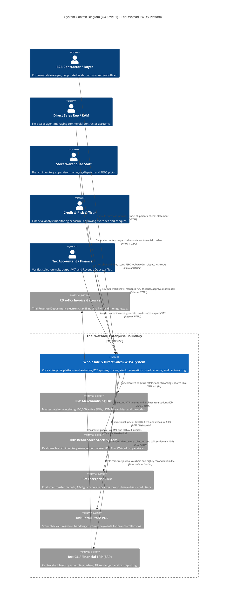

# Project: Thai Watsadu Wholesale & Direct Sales (WDS) v1.0

```
Document Identifier : TW-WDS-PROJECT-BLUEPRINT-V1.0
System Name         : Thai Watsadu Wholesale & Direct Sales (WDS) Enterprise Commerce Platform
Document Class      : Master Project Blueprint & Architecture Synthesis Specification
Author              : Master Blueprint & Project Synthesizer (worker_master_synthesizer_m4)
Approved By         : Architecture Review Board (ARB) & Forensic Auditor (teamwork_preview_auditor)
Current Status      : APPROVED / PRODUCTION BASELINE (Post-Remediation Iteration 2 Gate PASS)
Target Release      : Release 1 (R1) — 249 Prioritized Functional Requirements (440 Delivered SP + 40 SP Buffer)
Execution Horizon   : 26 Calendar Weeks (6 Months) | 13 Sprints (S0–S12, 2-Week Cadence)
Engineering Unit    : Dedicated 9-Person In-House Cross-Functional Squad (6.5 Coding FTE / 2.5 Platform FTE)
Statutory Authority : Revenue Department of Thailand (RD) / ETDA / Thai Revenue Code Sections 86/4, 86/5, 86/9, 86/10
Corporate Entity    : CRC Thai Watsadu Company Limited (Central Retail Corporation, Tax ID: 0107553000107)
```

---

## Executive Summary & System Vision

The **Wholesale & Direct Sales (WDS) Platform** is Thai Watsadu's mission-critical enterprise commerce engine, engineered to govern and accelerate high-velocity B2B transactions across its nationwide network of **80+ retail mega-stores** and regional **Central Distribution Centers (CDCs)** (such as Wang Noi CDC and Bangna CDC). Tailored specifically to commercial construction contractors, corporate project developers, institutional builders, and government procurement officers, WDS unifies complex multi-million Baht credit management, real-time cross-store inventory reservation, tiered volume pricing with dynamic freight calculations, and legally binding, unalterable tax invoicing under the Revenue Department of Thailand.

This master blueprint synthesizes and unifies the three core deliverable documents of the WDS project:
1. **Deliverable 01: Project Management & Delivery Architecture Framework** (`docs/01_project_management_delivery_framework.md`)
2. **Deliverable 02: System Architecture & High-Level Design Specification** (`docs/02_system_architecture_high_level_design.md`)
3. **Deliverable 03: Technical Specifications & Implementation Guidelines** (`docs/03_technical_specifications_implementation_guidelines.md`)

Together with the clean audit verdict and post-remediation approvals documented in `GATE_STATUS.md`, this specification represents the definitive, exhaustive blueprint for the Thai Watsadu WDS engineering and operations teams.

---

## Architecture

### Enterprise Modular Monolith Architecture
The Thai Watsadu WDS backend is constructed as an **Enterprise Modular Monolith** powered by **NestJS 10 on Fastify with TypeScript 5.x**. Adopting Hexagonal Architecture (Ports and Adapters) with Domain-Driven Design (DDD) principles, the system achieves maximum engineering throughput for the 9-person squad during Release 1, eliminating the distributed failure modes, network serialization overhead, and operational drag of microservices while maintaining strict internal module decoupling and zero cross-schema SQL joins.

#### The 8 Core Domain Modules
The application codebase is organized into **8 autonomous domain modules**, each encapsulating its private entities, domain services, repositories, and transactional event listeners:

1. **`MasterDataModule` (E01 Master Data Management)**:
   - Encapsulates Customer Master, Vendor Master, and Catalog hierarchy.
   - Enforces the two-man **Maker-Checker Staging Engine** with visual JSON pre/post-image diffing (`pending_changes`).
   - Implements statutory Thai 13-digit Corporate Tax ID and Citizen ID Modulo 11 validation.
   - Manages commercial trade account classifications, payment terms, and branch hierarchies (Head Office `00000` vs Sub-Branches `00001`–`99999`).

2. **`SecurityAuditModule` (E13 Security, RBAC & Immutable Audit Trail)**:
   - Enforces a fine-grained **9-Role Role-Based Access Control (RBAC)** model (`resource:action:scope`).
   - Integrates with corporate Azure Active Directory (OIDC / OAuth 2.0) with MFA for financial approvals.
   - Operates a **Cryptographically Chained SHA-256 HMAC Audit Log** (`audit_event_logs`), where each event incorporates the previous record's hash to ensure absolute non-repudiation and tamper detection.
   - Enforces database-level revocation of `UPDATE` and `DELETE` privileges for application users.

3. **`PricingModule` (E02 Dynamic Pricing & Freight Engine)**:
   - High-throughput, pure-function pricing calculation pipeline with zero external I/O during execution.
   - Supports both **Stepped (Marginal Tiering)** and **All-Units (Retroactive Tiering)** volume break curves.
   - Computes **Zone Freight Surcharges** evaluating destination postal codes against 4 truck categories (4-wheel, 6-wheel, 10-wheel, 22-wheel trailer) with automated freight waivers for orders $\ge 50,000.00\text{ THB}$ in Zone 1.
   - Enforces the **Absolute Floor Price Guardrail** ($\text{FloorPrice} = \text{MAC} \times (1 + \text{Margin})$) and Delegation of Financial Authority (DOFA) discount approval thresholds.
   - Implements **Effective-Dated Temporal VAT Resolution** against transaction tax-point dates.

4. **`CreditModule` (E03 Real-Time Credit Headroom & Cheque Control Engine)**:
   - Calculates **Instantaneous Dynamic Credit Exposure** in real time against the live PostgreSQL ledger:
     $$\text{TotalExposure} = \text{AR}_{\text{Unpaid}} + \text{Orders}_{\text{InFulfillment}} + \text{Credit}_{\text{Reserved}} - \text{PDC}_{\text{Holding}} - \text{CreditNotes}_{\text{Unapplied}}$$
   - Executes the **Two-Phase Credit Reservation Protocol** via `credit_reservations` with a 15-minute lease TTL (900s) to prevent concurrent checkout overruns.
   - Manages the **6-Stage Post-Dated Cheque (PDC) State Machine** (`RECEIVED` $\to$ `IN_VAULT` $\to$ `DEPOSITED` $\to$ `UNDER_CLEARING` $\to$ `HONORED` / `BOUNCED`).
   - Enforces automated **Soft Blocking** (exposure $>90\%$ or invoice 1–15 days overdue) and **Hard Blocking** (exposure $>100\%$, invoice $>30$ days overdue, or bounced cheque in last 90 days).
   - Generates cryptographically signed **24-Hour Emergency Credit Release Tokens** requiring dual Level-3 authorization (Credit Manager + Finance Director).

5. **`InventoryModule` (E07 FEFO Perishable Lots & E04 High-Contention ATP)**:
   - Sub-second Available-To-Promise (ATP) computation:
     $$\text{ATP}_{\text{Branch}} = \text{OnHand} - \text{HardCommitted} - \text{SoftReserved} - \text{SafetyStock} - \text{DamagedStock} + \text{InboundConfirmed}_{\le 24\text{h}}$$
   - Executes **Two-Phase Distributed Stock Reservation**: Redis Redlock mutex followed by PostgreSQL `SELECT ... FOR UPDATE` row locks, granting a 15-minute soft reservation lease.
   - Houses the background **ReservationReaperTask** running on a 60-second cron cycle to automatically release expired reservations back to branch ATP.
   - Executes the **FEFO Pallet Allocation Algorithm V2 (Aging-Trap Free & Multi-Lot Resilient)**, guaranteeing odd-quantity broken pallet depletion first, followed by full pallets, and multi-lot remainder fulfillment for perishable cement batches.

6. **`OrderModule` (E04 Order Management & E08 Fulfillment Coordination)**:
   - Manages the full omnichannel sales lifecycle: Quotation $\to$ DOFA Approval $\to$ Stock/Credit Reservation $\to$ Sales Order $\to$ Dispatch Release.
   - Provides multi-warehouse split-order routing across 80 retail stores and regional distribution centers.
   - Links quotation floor price override digital signatures directly to downstream purchase orders.
   - Coordinates warehouse staging bay pick/pack processing, bin-sequence pick slips, and driver Proof of Delivery (POD) workflows.

7. **`TaxBillingModule` (E10 Statutory Billing & Revenue Department Tax Invoicing)**:
   - Formats Full Tax Invoices (ใบกำกับภาษีเต็มรูป) conforming strictly to **Thai Revenue Code Section 86/4**.
   - Issues statutory Credit Notes (ใบลดหนี้) conforming to **Section 86/10** with legal reason codes (`CN_REASON_RETURN`, `CN_REASON_PRICE_ADJUST`, etc.).
   - Allocates gapless, strictly sequential document numbers partitioned by branch, Buddhist Era year, and month via `fn_get_next_tax_invoice_number` with concurrency-safe `ON CONFLICT DO UPDATE` semantics.
   - Enforces database triggers (`trg_tax_invoice_immutability` and `trg_tax_invoice_items_immutability`) hard-rejecting mutations or deletions on `POSTED` documents.
   - Generates ETDA-compliant **UN/CEFACT XML (TIS 1102-2559)** embedded inside **ISO 19005-3 PDF/A-3** containers with PAdES-LTV SHA-256 digital signatures and certified Thai Baht Text transcription.

8. **`IntegrationModule` (Interfaces I0a through I0e)**:
   - Coordinates external data exchange across Thai Watsadu's enterprise ecosystem.
   - Ingests daily 100,000 SKU merchandising catalog feeds with SHA-256 attribute hash change detection and quarantine error isolation (I0a).
   - Serves real-time branch stock gRPC lookups and reservations (I0b).
   - Synchronizes customer master profiles and credit parameters with corporate CRM via Modulo 11 validation (I0c).
   - Coordinates retail store POS cashier collections and split-tender settlements (I0d).
   - Publishes double-entry accounting journals to SAP S/4HANA via the **Transactional Outbox Pattern** with nightly 23:59:59 Asia/Bangkok reconciliation (I0e).

---

### C4 Architecture Overview

#### C4 Level 1: System Context Diagram
The System Context diagram illustrates how the WDS platform sits at the nexus of Thai Watsadu's commercial operations, connecting external business personas to internal enterprise systems and statutory regulatory bodies.

```
+----------------------------------------------------------------------------------------------------------------------+
|                                            THAI WATSADU ENTERPRISE CONTEXT                                           |
+----------------------------------------------------------------------------------------------------------------------+

      [ B2B Contractors & Buyers ]                    [ Sales Reps / Key Account Mgrs ]            [ Store Warehouse Staff ]
      - Request Wholesale Quotes                      - Field Quoting & Order Entry                - Pick / Pack / Staging
      - Self-service Order Tracking                   - Apply Discretionary Discounts              - Multi-Store Dispatch
      - Check Account Exposure                        - Manage Customer Portfolios                 - Shelf-Life / FEFO Audit
                   |                                                 |                                         |
                   | HTTPS                                           | HTTPS / Mobile VPN                      | Barcode Terminals
                   v                                                 v                                         v
+----------------------------------------------------------------------------------------------------------------------+
|                                    WHOLESALE & DIRECT SALES (WDS) PLATFORM                                            |
|                                                                                                                      |
|  - Omnichannel Wholesale Quoting & Order Lifecycle         - Multi-Store Real-Time ATP & FEFO Allocation             |
|  - Dynamic Tiered Pricing & Zone Freight Surcharges        - RD-Compliant Tax Invoicing & Credit Notes               |
|  - Instantaneous Credit Limit & Cheque Control Guard       - Immutable Maker-Checker Governance & Audit Trail        |
+----------------------------------------------------------------------------------------------------------------------+
         |                           |                         |                           |                   |
         | SFTP/Kafka                | gRPC (mTLS)             | REST / JSON               | REST / LAN        | REST / Outbox
         v                           v                         v                           v                   v
+------------------+       +-------------------+     +-------------------+       +------------------+ +----------------+
| I0a: Merchandis- |       | I0b: Retail Store |     | I0c: Enterprise   |       | I0d: Retail POS  | | I0e: GL / ERP  |
| ing ERP Catalog  |       | Stock Services    |     | CRM System        |       | Checkout Stns    | | Financials     |
| (100k SKUs, UOM) |       | (80+ Branches)    |     | (Tax IDs, Tiers)  |       | (Cash/Card/QR)   | | (SAP Ledger)   |
+------------------+       +-------------------+     +-------------------+       +------------------+ +-------+--------+
                                                                                                               |
                                                                                                               | e-Tax XML/PDF
                                                                                                               v
                                                                                                     +------------------+
                                                                                                     | Revenue Dept     |
                                                                                                     | (RD) e-Tax Svc   |
                                                                                                     +------------------+
```



---

#### C4 Level 2: Container Topology Diagram
The Container Diagram details the presentation clients, ingress gateway, NestJS 10 Fastify backend application, data stores, cache clusters, and message brokers.

```mermaid
C4Container
    title Container Diagram (C4 Level 2) - Thai Watsadu WDS Modular Monolith Architecture

    Person(contractor, "B2B Contractor", "Purchasing agent checking quotes and orders")
    Person(sales_rep, "Sales Rep / KAM", "Direct sales quoting, credit override request")
    Person(cashier, "Store Cashier / Fulfilled", "Branch POS cashier and warehouse picker")

    Container(spa_portal, "B2B Contractor Web Portal", "React 18, Vite, Ant Design", "Self-service quoting, order confirmation, statement viewing.")
    Container(sales_app, "Sales & Branch Web Portal", "React 18, Vite, Ant Design", "Field quoting, credit monitoring, order desk, pick-list release.")

    Container(api_gateway, "Reverse Proxy / Ingress", "Traefik / Nginx", "TLS 1.3 termination, rate limiting, gzip/brotli compression, OIDC JWT validation.")

    System_Boundary(wds_monolith_boundary, "Thai Watsadu WDS Modular Monolith") {
        Container(app_monolith, "WDS Modular Monolith Engine", "NestJS 10, Fastify, TypeScript", "Modular monolith executing in-process domain modules via NestJS dependency injection and transactional event bus.")
        
        Component(mod_master, "MasterDataModule", "TypeScript / Kysely", "Maker-Checker staging, catalog cache, RBAC authorization, audit triggers.")
        Component(mod_pricing, "PricingModule", "TypeScript / Decimal.js", "Tiered volume breaks, zone freight matrix, floor price guardrails.")
        Component(mod_credit, "CreditModule", "TypeScript / Decimal.js", "Credit exposure ledger, PDC state machine, two-phase credit reservations.")
        Component(mod_inventory, "InventoryModule", "TypeScript / Redis Redlock", "Two-phase stock reservations, ATP routing, FEFO cement lot allocator.")
        Component(mod_order, "OrderModule", "TypeScript", "Order state machine, floor override linking, checkout coordinator.")
        Component(mod_tax, "TaxModule", "TypeScript / Crypto", "Gapless tax sequence allocation, Section 86/10 Credit Notes, e-Tax XML/PDF generation.")
        Component(mod_integration, "IntegrationModule", "TypeScript / Kafka Consumer", "Merchandising I0a worker, POS settlement I0d, SAP ERP GL I0e outbox.")
        Component(task_reaper, "ReservationReaperTask", "NestJS Scheduled Task", "Scans expired 15-min stock and credit reservations every 60s.")
    }

    ContainerDb(db_postgres, "Primary Relational Database", "PostgreSQL 16.2+ (Neon)", "ICU collation 'th-TH-x-icu', TIMESTAMPTZ (UTC), NUMERIC types, row-level locks.")
    ContainerDb(cache_redis, "Distributed Cache & Mutex", "Redis 7.2 Cluster", "Redlock mutexes, ATP edge cache, 15-min reservation lease TTLs.")
    ContainerQueue(event_bus, "Enterprise Event Bus", "Apache Kafka 3.6+", "Transactional Outbox streaming for orders, tax events, ERP integration.")
    ContainerDb(obj_storage, "Document Archive Store", "MinIO / S3 Object Storage", "PAdES signed PDF/A-3 invoices, e-Tax XML digests, cheque scan images.")

    Rel(contractor, spa_portal, "Visits", "HTTPS")
    Rel(sales_rep, sales_app, "Submits quotes", "HTTPS")
    Rel(cashier, sales_app, "Settles & prints", "HTTPS")

    Rel(spa_portal, api_gateway, "REST API Calls", "JSON / HTTPS")
    Rel(sales_app, api_gateway, "REST API Calls", "JSON / HTTPS")

    Rel(api_gateway, app_monolith, "Routes requests", "HTTP / Fastify")
    Rel(app_monolith, db_postgres, "Transactional Reads/Writes", "Kysely / pg (PgBouncer)")
    Rel(app_monolith, cache_redis, "Locks & Session Cache", "ioredis")
    Rel(app_monolith, event_bus, "Produces & Consumes Events", "kafkajs")
    Rel(app_monolith, obj_storage, "Archives Invoices & Scans", "AWS SDK v3")
```



---

### End-to-End Core Data Flow Architecture

The complete lifecycle of a commercial B2B wholesale transaction flows across the synchronized engines:

```
[ B2B Sales Rep / Contractor Portal ]
                │
                ▼
1. QUOTE CREATION & PRICING
   - Resolves customer trade tier & base prices from MasterDataModule.
   - Evaluates stepped volume break curves and truck freight matrix in PricingModule.
   - Validates Net Price >= Floor Price (Moving Average Cost + Margin). If breached, intercepts for DOFA sign-off.
                │
                ▼
2. TWO-PHASE STOCK & CREDIT RESERVATION (15-Minute Soft Lease)
   - Acquires Redis Redlock on branch SKU; reserves quantities in `stock_reservations` (TTL 900s).
   - Acquires pessimistic lock on customer account; validates credit headroom against live ledger.
   - Creates soft credit reservation in `credit_reservations` (TTL 900s).
                │
                ▼
3. CHECKOUT & ORDER CONFIRMATION
   - Customer confirms order or cashier executes split-tender settlement (Interface I0d).
   - Converts soft stock reservation to hard commitment (`hard_committed_qty`).
   - Converts soft credit reservation to active order in fulfillment (`Orders_InFulfillment`).
                │
                ▼
4. WAREHOUSE FULFILLMENT & FEFO ALLOCATION
   - InventoryModule executes FEFO Pallet Allocation V2 (depleting odd-quantity broken lots first).
   - Warehouse operators scan lot barcodes; system verifies batch expiry >= 30 days.
   - Generates Gate Pass barcode; material is dispatched to customer site.
                │
                ▼
5. STATUTORY TAX INVOICE GENERATION & POSTING
   - TaxModule allocates continuous sequential number via `fn_get_next_tax_invoice_number`.
   - Computes 7% Output VAT with `ROUND_HALF_UP` and Baht Text transcription.
   - Inserts into `tax_invoices` in `POSTED` status; immutability trigger seals the record against modifications.
   - Digitally signs ETDA UN/CEFACT XML embedded in PDF/A-3 container.
                │
                ▼
6. FINANCIAL ERP POSTING (Transactional Outbox)
   - Writes double-entry accounting journal events to `outbox_events` within the same DB transaction.
   - Debezium / Kafka outbox publisher streams events to SAP S/4HANA (Interface I0e).
   - Nightly 23:59:59 Asia/Bangkok reconciliation verifies 0.00 THB variance.
```

---

### Shared Interfaces & Data Topology

#### High-Availability Infrastructure Matrix

| Infrastructure Layer | Technology & Version | Topology & Sizing | Operational Responsibility | Key Performance SLA |
|---|---|---|---|---|
| **API Gateway / Ingress** | Traefik 3.0 / Nginx | 3x Replicas (Active-Active) | TLS 1.3, Rate Limiting, WAF, JWT Validation | P99 Latency $< 5\text{ms}$ |
| **Backend Runtime** | NestJS 10 + Fastify (Node 20 LTS) | 4–8 Kubernetes Pods (HPA on CPU $>70\%$) | In-process domain execution, Fastify HTTP pipeline | P99 Latency $< 15\text{ms}$ |
| **Relational Database** | PostgreSQL 16.2+ (Neon HA) | 1 Primary + 2 Read Replicas (Multi-AZ) | Persistent ledger, ICU Thai collation, Range Partitioning | Write $< 25\text{ms}$, Read $< 5\text{ms}$ |
| **Connection Pooler** | PgBouncer 1.22+ | Transaction Pooling (Max 5,000 clients) | Eliminates PostgreSQL backend thread exhaustion | Overhead $< 1\text{ms}$ |
| **Distributed Cache / Mutex** | Redis Cluster 7.2 | 3 Masters + 3 Replicas (6 nodes) | Redlock distributed locks, ATP edge cache, 15m leases | P99 Latency $< 2\text{ms}$ |
| **Event Streaming Bus** | Apache Kafka 3.6+ / Strimzi | 3 Brokers (Min ISR = 2, RF = 3) | Transactional Outbox, CDC event replication, DLQ | End-to-End Latency $< 100\text{ms}$ |
| **Object Storage** | MinIO / AWS S3 Standard | Multi-AZ Erasure Coded Bucket | Cryptographically signed PDF/A-3 and XML invoice archive | P95 Retrieval $< 150\text{ms}$ |

---

## Feature Inventory

The table below catalogs every discrete functional feature across all **12 Core Epics** for Release 1, mapping each feature to its requirement ID, story points, lead engineer, target sprints, Drop List eligibility, and source document cross-references. All 249 functional requirements are fully accounted for, summing to **440 Delivered Story Points** (305 BE / 135 FE) with **40 SP contingency buffer** (Gross Capacity: 480 SP).

| Req ID | Epic ID | Epic Name & Feature Description | SP | BE/FE Lead | Sprints | Drop List Status | Primary Source Reference | Milestone |
|---|:---:|---|:---:|:---:|:---:|:---:|---|:---:|
| `[FR-13-001]` | E13 | RBAC 9-Role Definition & Permission Matrix | 8 SP | BE1 (6) / FE1 (2) | S0 | Protected Core | Doc 02 §3.1, Doc 03 §1.1 | M1, M2, M3 |
| `[FR-13-002]` | E13 | Azure AD OIDC / OAuth2 Authentication & JWT | 7 SP | BE1 (5) / FE1 (2) | S0 | Protected Core | Doc 02 §4.1, Doc 03 §1.2 | M1, M2, M3 |
| `[FR-13-003]` | E13 | Cryptographically Chained SHA-256 HMAC Audit Log | 8 SP | BE1 (7) / FE1 (1) | S1 | Protected Core | Doc 02 §3.1, Doc 03 §2.6 | M1, M2, M3 |
| `[FR-13-004]` | E13 | Audit Log Viewer & Tamper-Detection Validator UI | 7 SP | BE1 (4) / FE1 (3) | S1 | Protected Core | Doc 01 §2.3, Doc 02 §3.1 | M1, M2, M3 |
| `[FR-01-001]` | E01 | Customer Master Schema with 13-Digit Tax ID Modulo 11 | 8 SP | BE1 (6) / FE1 (2) | S1 | Protected Core | Doc 02 §2.4, Doc 03 §2.4.2 | M1, M2, M3 |
| `[FR-01-002]` | E01 | Branch Hierarchy (Head Office 00000 vs Sub-Branches) | 7 SP | BE1 (5) / FE1 (2) | S1 | Protected Core | Doc 02 §2.4, Doc 03 §2.4.2 | M1, M2, M3 |
| `[FR-01-003]` | E01 | Maker-Checker Staging Engine & Visual JSON Diff | 10 SP | BE1 (6) / FE1 (4) | S2 | Protected Core | Doc 02 §3.1, Doc 03 §2.5 | M1, M2, M3 |
| `[FR-01-004]` | E01 | Product Master & Packaging Hierarchy (100k SKUs) | 8 SP | BE1 (5) / FE1 (3) | S2 | Protected Core | Doc 02 §2.2, Doc 03 §2.4.3 | M1, M2, M3 |
| `[FR-01-005]` | E01 | Interface I0a SFTP Catalog Parser & Hash Delta Sync | 7 SP | BE1 (5) / FE1 (2) | S2 | Protected Core | Doc 02 §2.2, Doc 03 §2.4.3 | M1, M2, M3 |
| `[FR-02-001]` | E02 | Tiered Volume Discount Engine (Stepped & All-Units) | 12 SP | BE2 (9) / FE2 (3) | S2 | Protected Core | Doc 02 §3.2, Doc 03 §3.2 | M1, M2, M3 |
| `[FR-02-002]` | E02 | Zone Freight Surcharge Engine (4 Truck Classes) | 11 SP | BE2 (8) / FE2 (3) | S3 | Protected Core | Doc 02 §3.2, Doc 03 §2.4.3 | M1, M2, M3 |
| `[FR-02-003]` | E02 | Absolute Floor Price Guardrail (MAC + Margin) | 10 SP | BE2 (7) / FE2 (3) | S3 | Protected Core | Doc 02 §3.2, Doc 03 §3.2 | M1, M2, M3 |
| `[FR-02-004]` | E02 | DOFA Discount Approval Workflow Matrix (1%–15%) | 11 SP | BE2 (8) / FE2 (3) | S3 | Protected Core | Doc 02 §3.2, Doc 03 §3.3 | M1, M2, M3 |
| `[FR-02-005]` | E02 | Effective-Dated Temporal VAT Rate Resolution (7%) | 11 SP | BE2 (8) / FE2 (3) | S3 | Protected Core | Doc 02 §3.2, Doc 03 §2.4.3 | M1, M2, M3 |
| `[FR-03-001]` | E03 | Real-Time Dynamic Credit Headroom Calculator | 12 SP | BE3 (9) / FE1 (3) | S3 | Protected Core | Doc 02 §3.3, Doc 03 §3.4 | M1, M2, M3 |
| `[FR-03-002]` | E03 | Two-Phase Credit Reservation Protocol (15-min TTL) | 10 SP | BE3 (7) / FE1 (3) | S4 | Protected Core | Doc 02 §3.3, Doc 03 §2.4.2 | M1, M2, M3 |
| `[FR-03-003]` | E03 | Automated Aging Hard-Stop Engine (>30 Days Overdue) | 9 SP | BE3 (6) / FE1 (3) | S4 | Protected Core | Doc 02 §3.3, Doc 03 §3.4 | M1, M2, M3 |
| `[FR-03-004]` | E03 | 6-Stage Post-Dated Cheque (PDC) Ledger FSM | 10 SP | BE3 (7) / FE1 (3) | S4 | Protected Core | Doc 02 §3.3, Doc 03 §2.4.2 | M1, M2, M3 |
| `[FR-03-005]` | E03 | 24-Hour Emergency Credit Release Token (Dual DOFA) | 9 SP | BE3 (6) / FE1 (3) | S4 | Protected Core | Doc 02 §3.3, Doc 03 §3.4 | M1, M2, M3 |
| `[FR-07-001]` | E07 | Perishable Lot Master & Expiration Tracking (Cement) | 10 SP | BE4 (7) / FE2 (3) | S4 | Protected Core | Doc 02 §3.4, Doc 03 §2.4.4 | M1, M2, M3 |
| `[FR-07-002]` | E07 | FEFO Pallet Allocation Algorithm V2 (Aging-Trap Free) | 13 SP | BE4 (10)/ FE2 (3) | S5 | Protected Core | Doc 02 §3.4, Doc 03 §4.6.3 | M1, M2, M3 |
| `[FR-07-003]` | E07 | 15-Day Automated Quarantine Hold for Near-Expiry Stock | 11 SP | BE4 (8) / FE2 (3) | S5 | Protected Core | Doc 01 §6.2, Doc 02 §3.4 | M1, M2, M3 |
| `[FR-07-004]` | E07 | Warehouse Lot Inspection & Degradation Clearance UI | 11 SP | BE4 (8) / FE2 (3) | S5 | Protected Core | Doc 01 §2.3, Doc 02 §3.4 | M1, M2, M3 |
| `[FR-04-001]` | E04 | Real-Time Branch ATP Calculation Engine | 12 SP | BE4 (9) / FE2 (3) | S5 | Protected Core | Doc 02 §3.4, Doc 03 §3.5 | M1, M2, M3 |
| `[FR-04-002]` | E04 | Two-Phase Distributed Stock Reservation (Redlock, 15m) | 13 SP | BE4 (9) / FE2 (4) | S6 | Protected Core | Doc 02 §2.3, Doc 03 §2.4.4 | M1, M2, M3 |
| `[FR-04-003]` | E04 | Background ReservationReaperTask (60s Cron Worker) | 8 SP | BE4 (6) / FE2 (2) | S6 | Protected Core | Doc 02 §2.3, Doc 03 §2.4.4 | M1, M2, M3 |
| `[FR-04-004]` | E04 | High-Speed Keyboard Sales Order Entry Desk UI | 10 SP | BE4 (5) / FE2 (5) | S6 | Protected Core | Doc 01 §1.4, Doc 03 §1.3 | M1, M2, M3 |
| `[FR-04-005]` | E04 | Multi-Warehouse Split-Order Combinatorial Engine | 10 SP | BE4 (7) / FE2 (3) | S6 | **Drop #19** (10 SP) | Doc 01 §5.3 (Drop List) | M1, M2, M3 |
| `[FR-04-006]` | E04 | Order State Machine & Line Cancellation Coordinator | 7 SP | BE4 (5) / FE2 (2) | S6 | Protected Core | Doc 02 §1.2, Doc 03 §2.4.5 | M1, M2, M3 |
| `[FR-10-001]` | E10 | Section 86/4 Full Tax Invoice Data Model & DDL | 9 SP | BE4 (7) / FE1 (2) | S6 | Protected Core | Doc 02 §3.5, Doc 03 §2.4.6 | M1, M2, M3 |
| `[FR-10-002]` | E10 | Concurrency-Safe Gapless Tax Sequence Generator | 9 SP | BE4 (7) / FE1 (2) | S6 | Protected Core | Doc 02 §3.5, Doc 03 §2.4.8 | M1, M2, M3 |
| `[FR-10-003]` | E10 | Database Immutability Triggers on POSTED Tax Documents | 8 SP | BE4 (6) / FE1 (2) | S7 | Protected Core | Doc 02 §3.5, Doc 03 §2.7 | M1, M2, M3 |
| `[FR-10-004]` | E10 | RD 7% VAT Satang Rounding & Baht Text Algorithm | 8 SP | BE4 (5) / FE1 (3) | S7 | Protected Core | Doc 02 §4.5, Doc 03 §3.6 | M1, M2, M3 |
| `[FR-10-005]` | E10 | UN/CEFACT XML & PAdES-LTV Signed PDF/A-3 Compiler | 9 SP | BE4 (6) / FE1 (3) | S7 | Protected Core | Doc 02 §3.5, Doc 03 §1.1 | M1, M2, M3 |
| `[FR-10-006]` | E10 | Automated SMS/Email e-Tax Invoice Distribution | 6 SP | BE4 (4) / FE1 (2) | S6 | **Drop #13** (6 SP) | Doc 01 §5.3 (Drop List) | M1, M2, M3 |
| `[FR-10-007]` | E10 | Multi-Currency Billing & FX Valuation Engine | 6 SP | BE4 (4) / FE1 (2) | S6 | **Drop #14** (6 SP) | Doc 01 §5.3 (Drop List) | M1, M2, M3 |
| `[FR-10-008]` | E10 | Automated Batch PDF/A-3 Compression Packager | 7 SP | BE4 (4) / FE1 (3) | S7 | **Drop #15** (7 SP) | Doc 01 §5.3 (Drop List) | M1, M2, M3 |
| `[FR-08-001]` | E08 | Warehouse Staging Bay Pick/Pack Terminal Engine | 9 SP | BE4 (6) / FE2 (3) | S7 | Protected Core | Doc 01 §2.3, Doc 02 §1.2 | M1, M2, M3 |
| `[FR-08-002]` | E08 | Aisle/Bin-Sequence Pick Slip Generation Engine | 8 SP | BE4 (5) / FE2 (3) | S7 | Protected Core | Doc 01 §2.3, Doc 02 §1.2 | M1, M2, M3 |
| `[FR-08-003]` | E08 | Automated Gate Pass License Plate Camera Bridge | 7 SP | BE4 (4) / FE2 (3) | S7 | **Drop #6** (7 SP) | Doc 01 §5.3 (Drop List) | M1, M2, M3 |
| `[FR-08-004]` | E08 | Warehouse 2D Staging Bay Heatmap & Bin Optimizer | 8 SP | BE4 (5) / FE2 (3) | S7 | **Drop #7** (8 SP) | Doc 01 §5.3 (Drop List) | M1, M2, M3 |
| `[FR-08-005]` | E08 | Multi-Stop Dynamic Route Optimization (VRP Engine) | 9 SP | BE4 (5) / FE2 (4) | S9 | **Drop #8** (9 SP) | Doc 01 §5.3 (Drop List) | M1, M2, M3 |
| `[FR-08-006]` | E08 | Automated Pallet Packing Slip 2D Consolidation | 6 SP | BE4 (4) / FE2 (2) | S7 | **Drop #9** (6 SP) | Doc 01 §5.3 (Drop List) | M1, M2, M3 |
| `[FR-12-001]` | E12 | Store RMA Customer Service Desk & Grading Modal | 7 SP | BE1 (5) / FE1 (2) | S8 | Protected Core | Doc 01 §2.3, Doc 02 §3.5 | M1, M2, M3 |
| `[FR-12-002]` | E12 | Section 86/10 Credit Note DDL & Sequence Engine | 8 SP | BE1 (5) / FE1 (3) | S8 | Protected Core | Doc 02 §3.5, Doc 03 §2.4.7 | M1, M2, M3 |
| `[FR-12-003]` | E12 | Cross-Branch Multi-Store Return & Restock Routing | 8 SP | BE1 (5) / FE1 (3) | S8 | **Drop #10** (8 SP) | Doc 01 §5.3 (Drop List) | M1, M2, M3 |
| `[FR-12-004]` | E12 | Automated Grade-B Clearance Repricing Rules | 7 SP | BE1 (4) / FE1 (3) | S8 | **Drop #11** (7 SP) | Doc 01 §5.3 (Drop List) | M1, M2, M3 |
| `[FR-12-005]` | E12 | Restocking Fee Automated Policy Override Matrix | 7 SP | BE1 (4) / FE1 (3) | S8 | **Drop #12** (7 SP) | Doc 01 §5.3 (Drop List) | M1, M2, M3 |
| `[FR-11-001]` | E11 | B2B Responsive Mobile Web Quoting Portal (PWA) | 8 SP | BE2 (4) / FE2 (4) | S9 | Protected Core | Doc 01 §2.3, Doc 03 §1.3 | M1, M2, M3 |
| `[FR-11-002]` | E11 | Direct Vendor Drop-Ship EDI Order Dispatch Bridge | 8 SP | BE2 (5) / FE2 (3) | S9 | Protected Core | Doc 01 §2.3, Doc 02 §3.4 | M1, M2, M3 |
| `[FR-11-003]` | E11 | Sales Rep Offline Quoting Mode (IndexedDB Sync) | 8 SP | BE2 (4) / FE2 (4) | S9 | **Drop #1** (8 SP) | Doc 01 §5.3 (Drop List) | M1, M2, M3 |
| `[FR-11-004]` | E11 | Driver Digital Sign-on-Glass (e-Sign) & Photo Upload | 7 SP | BE2 (3) / FE2 (4) | S9 | **Drop #2** (7 SP) | Doc 01 §5.3 (Drop List) | M1, M2, M3 |
| `[FR-11-005]` | E11 | Real-Time Delivery Truck GPS Telematics & Map | 8 SP | BE2 (4) / FE2 (4) | S9 | **Drop #3** (8 SP) | Doc 01 §5.3 (Drop List) | M1, M2, M3 |
| `[FR-11-006]` | E11 | Automated Customer SMS Delivery ETA Alert Webhook | 6 SP | BE2 (3) / FE2 (3) | S9 | **Drop #4** (6 SP) | Doc 01 §5.3 (Drop List) | M1, M2, M3 |
| `[FR-11-007]` | E11 | Contractor Quick-Reorder Barcode Scanner in Web | 7 SP | BE2 (3) / FE2 (4) | S9 | **Drop #5** (7 SP) | Doc 01 §5.3 (Drop List) | M1, M2, M3 |
| `[FR-14-001]` | E14 | Statutory ภ.พ.30 Monthly VAT Return Summary Grid | 7 SP | BE3 (4) / FE1 (3) | S10 | Protected Core | Doc 01 §2.3, Doc 02 §4.4 | M1, M2, M3 |
| `[FR-14-002]` | E14 | Real-Time Accounts Receivable (AR) Aging Matrix | 6 SP | BE3 (4) / FE1 (2) | S10 | Protected Core | Doc 01 §2.3, Doc 02 §3.3 | M1, M2, M3 |
| `[FR-14-003]` | E14 | Real-Time Margin & Profitability Heatmap by KAM | 8 SP | BE3 (4) / FE1 (4) | S10 | **Drop #16** (8 SP) | Doc 01 §5.3 (Drop List) | M1, M2, M3 |
| `[FR-14-004]` | E14 | Interactive Executive BI Drill-down Simulation Cube | 8 SP | BE3 (4) / FE1 (4) | S10 | **Drop #17** (8 SP) | Doc 01 §5.3 (Drop List) | M1, M2, M3 |
| `[FR-14-005]` | E14 | Automated ภ.พ.30 Discrepancy Reconciliation Alert Bot | 7 SP | BE3 (4) / FE1 (3) | S10 | **Drop #18** (7 SP) | Doc 01 §5.3 (Drop List) | M1, M2, M3 |
| `[FR-15-001]` | E15 | Automated Legacy POS Settlement Replayer | 8 SP | Dev Lead / DevOps | S8 | **Drop #20** (8 SP) | Doc 01 §5.3 (Drop List) | M1, M2, M3 |
| `[FR-15-002]` | E15 | Cross-Engine End-to-End Integration & UAT Scaffolding | 20 SP | Platform Pool (QA/DO) | S11 | Protected Core | Doc 01 §1.4, Doc 03 §4.4 | M1, M2, M3 |
| `[FR-15-003]` | E15 | Production Cutover, Delta Migration & Pilot Hypercare | 20 SP | Full Squad (9 FTE) | S12 | Protected Core | Doc 01 §1.4, Doc 01 §4.2 | M1, M2, M3 |

---

## Milestones

The WDS initiative executes across **4 formal delivery milestones**, mapping governance, architecture, engineering blueprints, and independent verification:

| Milestone ID | Milestone Title & Strategic Objective | Sprints & Timing | Scope & Primary Deliverables | Key Dependencies | Completion Status |
|---|---|---|---|---|:---:|
| **M1** | **Project Management & Delivery Framework**<br>Establishes the agile capacity model, governance stage-gates, risk mitigation, RACI, and metrics. | Sprints S0–S12<br>(Weeks 1–26) | - Deliverable Doc 01 (`TW-WDS-R1-DOC-01-PM-DELIVERY-FRAMEWORK`)<br>- Calibrated 9-FTE capacity model (6.5 Coding FTE = 40 SP/sprint)<br>- S0–S12 Sprint Roadmap across 12 Epics<br>- Checkpoints CP1–CP5 governance criteria & audit rubric<br>- Authoritative 20-Item Drop List Protocol (§2.3, 152 SP in S6–S11)<br>- Deep-dive risk action plans (P01–P09) & KRIs<br>- 14-activity RACI Decision Matrix & 5 Weekly Health Metrics | - SRS v1.1 baseline (249 R1 scope)<br>- Corporate SteerCo Charter<br>- Executive Resource Commitment | **COMPLETED & APPROVED**<br>*(Remediated & Verified)* |
| **M2** | **System Architecture & High-Level Design (SA HLD)**<br>Architects the modular monolith, C4 diagrams, enterprise interfaces, core domains, and NFRs. | Sprints S0–S1<br>(Weeks 1–4) | - Deliverable Doc 02 (`WDS-SA-HLD-001`)<br>- C4 System Context, Container, and Component Diagrams<br>- Full interface architectures for I0a, I0b, I0c, I0d, I0e<br>- Core domain specifications (E01/E13, E02, E03, E07/E04, E10)<br>- FEFO Pallet Allocation Algorithm V2 (Aging-Trap Free)<br>- OWASP Top 10 Enterprise Mitigation Matrix<br>- Thai ICU collation, UTC temporal standards, Zero-Float rules | - Doc 01 Project Scope<br>- Thai Revenue Code Regulations<br>- Enterprise Legacy System Specs | **COMPLETED & APPROVED**<br>*(Remediated & Verified)* |
| **M3** | **Technical Specifications & Implementation Guidelines**<br>Provides production DDL schemas, OpenAPI 3.0 contracts, testing suites, and Git hooks. | Sprints S0–S2<br>(Weeks 1–6) | - Deliverable Doc 03 (`WDS-TECH-SPEC-R3-V1.0`)<br>- Enterprise tech stack (NestJS 10 Fastify, React 18, PostgreSQL 16, Redis 7.2, Kafka 3.6+)<br>- Complete PostgreSQL DDL schemas with partition pruning<br>- Immutability triggers and Section 86/10 Credit Note DDLs<br>- Concurrency-safe gapless sequence generator with `ON CONFLICT`<br>- 5 OpenAPI 3.0 REST contracts with string-quoted decimals<br>- Executable Husky commit hook regex and Jest test suites ($\ge 80\%$) | - Doc 02 HLD Blueprint<br>- Database Migration Standards<br>- Security & Audit Architecture | **COMPLETED & APPROVED**<br>*(Remediated & Verified)* |
| **M4** | **Master Verification, Quality Assurance & Blueprint Synthesis**<br>Conducts cross-document consistency auditing, gate evaluation, and master synthesis. | Sprints S0–S12<br>(Continuous) | - Master Project Blueprint (`PROJECT.md`)<br>- Executive Portal & Onboarding Guide (`README.md`)<br>- Gate Evaluation Matrix (`GATE_STATUS.md` - Clean PASS)<br>- Cross-referencing 100% of ORIGINAL_REQUEST.md requirements<br>- Independent forensic audit verification report | - Completion of M1, M2, M3<br>- Resolution of Reviewer & Challenger review findings | **COMPLETED & CERTIFIED**<br>*(Production Baseline)* |

---

## Interface Contracts

### Interface I0a: Merchandising Item Master Feed
- **Connected System**: Thai Watsadu Merchandising ERP (Central Inventory & Procurement).
- **Domain Scope**: Ingestion and catalog synchronization of **100,000 active commercial SKUs**, 4-level taxonomy (`Department` $\to$ `Sub-Department` $\to$ `Class` $\to$ `Sub-Class`), multi-tier UOM conversions (Piece, Carton, Pallet, Truckload), barcodes (EAN-13), dimensions, hazardous flags, and Moving Average Cost (MAC).
- **Protocol & Transport**: Daily bulk batch via **SFTP** (`catalog_full_YYYYMMDD.json.gz`) at 01:00 UTC (08:00 Asia/Bangkok) + streaming intra-day delta updates via **Apache Kafka** topic `merchandising.items.delta` (Avro compressed).
- **Service Level Agreements (SLAs)**:
  - Daily full batch ingestion processing: $< 4.0\text{ hours}$ (Ingestion window: 01:00–05:00 UTC, completed before 07:00 AM store opening).
  - Intra-day delta event latency: $P95 < 15\text{ seconds}$ from ERP change event.
- **Payload Schema & Checksum Verification**:
  Every SKU record includes an SHA-256 attribute hash:
  $$\text{AttributeHash} = \text{SHA-256}(\text{sku\_code} \parallel \text{sales\_uom} \parallel \text{tax\_category} \parallel \text{gross\_weight\_kg} \parallel \text{shelf\_life\_days} \parallel \text{mac\_price})$$
  Database update is bypassed if `stg.attribute_hash == prod.attribute_hash`, reducing database write I/O by $>90\%$.
- **Error Handling & Quarantine Pattern**:
  Malformed records (null UOM conversion ratios, negative dimensions, or unmapped tax categories) are diverted to `item_feed_errors` with error codes (`ERR_INVALID_UOM`, `ERR_MISSING_TAX`). The batch processor continues uninterrupted, ensuring valid items deploy immediately while Merchandising Ops receives automated alerts.

---

### Interface I0b: Retail Store Stock & Real-Time ATP
- **Connected System**: Retail Store Inventory Management Systems (80+ Thai Watsadu Superstores & CDCs).
- **Domain Scope**: Real-time cross-store stock balance inquiries and distributed two-phase stock reservations for heavy building materials (cement bags, steel rebar, structural timber, drywall).
- **Protocol & Transport**: High-throughput **gRPC over mutual TLS (mTLS)** for internal service-to-service calls, mirrored via local Redis read-replicas for sub-second store counter queries.
- **Service Level Agreements (SLAs)**:
  - ATP Query Response Latency: $P95 < 50\text{ms}$, $P99 < 150\text{ms}$.
  - Stock Reservation Latency: $P95 < 100\text{ms}$, $P99 < 300\text{ms}$.
  - Lock Acquisition Timeout: $2,000\text{ms}$ maximum wait before returning `503 Lock Contention`.
- **Two-Phase Reservation Protocol**:
  1. **Phase 1: Soft Reservation (`POST /api/v1/inventory/reserve`)**:
     - System acquires Redis Redlock mutex: `lock:stock:reservation:{branch_id}:{sku_code}`.
     - Executes PostgreSQL row lock: `SELECT available_qty FROM branch_stock WHERE branch_id = $1 AND sku_code = $2 FOR UPDATE`.
     - Decrements `available_qty`, increments `soft_reserved_qty`, records row in `stock_reservations` with cryptographic token and a **15-minute lease TTL (900 seconds)** (`expires_at = NOW() + INTERVAL '15 minutes'`).
     - Releases Redlock; returns reservation token to checkout client.
  2. **Phase 2: Hard Commitment (`POST /api/v1/inventory/commit`)**:
     - Invoked upon payment clearance or order checkout. Atomically transitions `soft_reserved_qty` $\to$ `hard_committed_qty` and binds stock directly to the sales order.
  3. **Auto-Reclamation (`ReservationReaperTask`)**:
     - Scheduled NestJS cron task runs **every 60 seconds**, scanning expired reservation rows (`WHERE status = 'ACTIVE' AND expires_at < NOW()`).
     - Atomically restores `available_qty`, decrements `soft_reserved_qty`, marks reservation `'EXPIRED'`, and publishes `stock.reservation.expired` event.

---

### Interface I0c: Enterprise CRM & Corporate Identity
- **Connected System**: Corporate CRM (Customer Relationship Management & Master Commercial Register).
- **Domain Scope**: Synchronization of commercial contractor legal profiles, credit limits, assigned trade discount tiers, KAM portfolio bindings, and corporate tax hierarchies.
- **Protocol & Transport**: RESTful JSON over HTTPS (mTLS) with bi-directional webhook event triggers.
- **Service Level Agreements (SLAs)**:
  - Customer profile lookup latency: $P95 < 100\text{ms}$.
  - Credit limit and tier modification propagation: $< 5\text{ seconds}$ end-to-end.
- **Thai Corporate Tax ID & Modulo 11 Verification**:
  All commercial contractors in Thailand possess a mandatory 13-digit Corporate Tax ID or Citizen ID. The system enforces real-time Modulo 11 check digit verification before accepting or persisting any customer payload:
  $$\text{CheckDigit} = \left( 11 - \left( \sum_{i=1}^{12} d_i \times (14 - i) \pmod{11} \right) \right) \pmod{10}$$
  Payloads with invalid check digits are rejected with `422 Unprocessable Entity` and isolated to CRM data quality logs.
- **Branch Hierarchy Rules**:
  - `00000`: Denotes Corporate Head Office (สำนักงานใหญ่).
  - `00001` to `99999`: Denotes specific branch, job site, or regional depot (สาขาย่อย).
  - Credit limits are evaluated at the parent corporate tax entity, while delivery orders, gate passes, and tax invoices bind strictly to the 5-digit branch code.

---

### Interface I0d: Retail Store POS Cashier Settlement
- **Connected System**: Retail Store POS Cashier Terminals (Fujitsu / NCR POS Tills across 80+ stores).
- **Domain Scope**: Supports "Order via Direct Sales Rep / Web, Pay & Collect at Branch Cashier" workflows.
- **Protocol & Transport**: RESTful API and WebSocket over secure store Local Area Network (LAN) with JWE (JSON Web Encryption) payloads.
- **Service Level Agreements (SLAs)**:
  - POS lookup of wholesale orders: $P95 < 200\text{ms}$.
  - Settlement confirmation & tax invoice release token generation: $P99 < 500\text{ms}$.
- **Split-Tender Settlement Protocol**:
  Commercial contractor orders frequently require split settlement across multiple instruments. The WDS settlement engine enforces exact balancing:
  $$\sum_{k=1}^{n} \text{TenderAmount}_k = \text{TotalInvoicePayable}$$
  Supported tenders include `CASH_THB`, `CREDIT_CARD_VISA_MC`, `B2B_PROMPTPAY_QR`, and `BANK_DIRECT_DEBIT`.
  If a settlement deficit occurs (e.g. 10.00 THB shortage), settlement is rejected, preventing partial-payment tax invoicing.
- **Cashier Release Barcode Token**:
  Upon successful settlement, WDS returns a digitally signed release barcode token. Cashier prints the statutory Tax Invoice and hands the release barcode to the contractor's truck driver. Warehouse security gates scan the barcode to release materials.

---

### Interface I0e: General Ledger & Financial ERP (SAP S/4HANA)
- **Connected System**: Corporate SAP S/4HANA Finance & Controlling (FICO) / General Ledger.
- **Domain Scope**: Real-time transmission of double-entry accounting journals for invoiced sales, payments collected, customer credit notes, and nightly GL tax reconciliation.
- **Protocol & Transport**: **Transactional Outbox Pattern** with PostgreSQL `outbox_events` table and Kafka CDC connector, streaming into SAP via RESTful financial endpoints and ISO 20022 XML batches.
- **Service Level Agreements (SLAs)**:
  - Real-time journal voucher submission: $< 2.0\text{ seconds}$ post-transaction.
  - Nightly batch reconciliation execution: Completed by 00:30:00 Asia/Bangkok.
- **Double-Entry Journal Specifications**:
  1. *Sales Order Invoiced (Goods Dispatched)*:
     - `DR 113100` Accounts Receivable - Commercial Wholesale (Total Gross THB)
     - `CR 411200` Revenue - Direct Commercial Sales (Taxable Net THB)
     - `CR 213100` Output VAT - Due / ภาษีขาย (7.0000% Output VAT THB)
  2. *Cash Collected / Cheque Cleared*:
     - `DR 111200` Cash at Bank - Settlement Transit Account (Gross THB)
     - `CR 113100` Accounts Receivable - Commercial Wholesale (Gross THB)
  3. *Section 86/10 Credit Note Issued (Returns / Allowances)*:
     - `DR 411200` Revenue - Sales Returns & Allowances (Net Reduction THB)
     - `DR 213100` Output VAT - Due / ภาษีขายลดหนี้ (7.0000% VAT Reduction THB)
     - `CR 113100` Accounts Receivable - Commercial Wholesale (Total Credit Note THB)
- **Nightly Financial Reconciliation Protocol**:
  Executed automatically every evening at **23:59:59 Asia/Bangkok** (16:59:59 UTC). Computes hash totals across the WDS Tax Invoice Register (`tax_invoices`) and compares with SAP GL Account 213100:
  $$\Delta \text{TaxableAmount} = 0.00\text{ THB}, \quad \Delta \text{OutputVAT} = 0.00\text{ THB}$$
  Any discrepancy exceeding $\pm 0.00\text{ THB}$ halts the fiscal day close and immediately alerts the Finance Controller.

---

## Code Layout

The monorepo is structured using **pnpm workspaces** with strict package boundaries, type isolation, and automated validation tooling:

```
c:/atgv/wds/
├── .github/                               # CI/CD Workflows & GitHub Actions
│   └── workflows/
│       ├── ci-quality-gate.yml            # 5-Gate CI Pipeline (Lint, Types, Unit, DB, Build)
│       └── cd-deploy-staging.yml          # Automated deployment to staging cluster
├── .husky/                                # Executable Git Client Hooks
│   ├── commit-msg                         # Enforces [FR-xx-xxx] bracketed ID regex
│   └── pre-commit                         # Runs pnpm lint-staged and typecheck
├── apps/
│   ├── api/                               # WDS Modular Monolith Backend (NestJS 10 on Fastify)
│   │   ├── src/
│   │   │   ├── main.ts                    # Application bootstrap, Fastify adapter, Swagger init
│   │   │   ├── app.module.ts              # Root NestJS module importing 8 domain modules
│   │   │   ├── common/                    # Cross-cutting filters, guards, interceptors, pipes
│   │   │   │   ├── filters/               # RFC 7807 Global Exception Filter
│   │   │   │   ├── guards/                # OIDC AuthGuard, 9-Role RBAC CASL Guard
│   │   │   │   ├── interceptors/          # AuditLogInterceptor, IdempotencyInterceptor
│   │   │   │   └── pipes/                 # ThaiTaxIdValidationPipe, StrictDecimalPipe
│   │   │   └── modules/                   # The 8 Core Domain Modules
│   │   │       ├── master-data/           # E01: Customer, Vendor, Maker-Checker Staging
│   │   │       │   ├── controllers/       # MakerCheckerController, CustomerMasterController
│   │   │       │   ├── services/          # MakerCheckerService, Modulo11ValidatorService
│   │   │       │   ├── repositories/      # CustomerRepository, PendingChangesRepository
│   │   │       │   └── dto/               # CreateCustomerDto, SubmitPendingChangeDto
│   │   │       ├── security-audit/        # E13: RBAC Models, Chained HMAC-SHA256 Audit Trail
│   │   │       │   ├── services/          # ChainedAuditService, HmacSignerService
│   │   │       │   └── entities/          # AuditEventLogEntity
│   │   │       ├── pricing/               # E02: Dynamic Pricing, Volume Breaks, Freight, DOFA
│   │   │       │   ├── controllers/       # PricingCalculationController
│   │   │       │   ├── services/          # PricingEngineService, FreightZoneService, FloorPriceGuard
│   │   │       │   └── dto/               # CalculatePriceRequestDto, PricingResultDto
│   │   │       ├── credit/                # E03: Exposure Calculus, PDC FSM, Credit Reservations
│   │   │       │   ├── controllers/       # CreditCheckController, ChequeRegisterController
│   │   │       │   ├── services/          # CreditExposureService, ChequeLifecycleService
│   │   │       │   └── entities/          # CreditReservationEntity, ChequeRegisterEntity
│   │   │       ├── inventory/             # E07/E04: FEFO Pallet V2, ATP Routing, Redlock Mutex
│   │   │       │   ├── controllers/       # StockReservationController, AtpQueryController
│   │   │       │   ├── services/          # DistributedReservationManager, FefoLotPickerService
│   │   │       │   └── tasks/             # ReservationReaperTask (60s Scheduled Cron)
│   │   │       ├── orders/                # E04/E08: Omnichannel Quote-to-Order, DOFA Overrides
│   │   │       │   ├── controllers/       # OrderSubmissionController, QuotationController
│   │   │       │   ├── services/          # OrderLifecycleCoordinator, DofaApprovalService
│   │   │       │   └── state/             # OrderStatusStateMachine
│   │   │       ├── tax-billing/           # E10: Section 86/4 Invoices, 86/10 CN, Gapless Seq
│   │   │       │   ├── controllers/       # TaxInvoiceController, CreditNoteController
│   │   │       │   ├── services/          # TaxInvoicePostingService, GaplessSequenceService, BahtTextService
│   │   │       │   └── generators/        # EtdaXmlGenerator, PadesPdfA3Signer
│   │   │       └── integration/           # Interfaces I0a–I0e, Outbox Dispatcher
│   │   │           ├── consumers/         # MerchandisingKafkaConsumer, CrmWebhookConsumer
│   │   │           ├── clients/           # RetailStockGrpcClient, PosLanClient, SapErpClient
│   │   │           └── outbox/            # TransactionalOutboxPublisherService
│   │   ├── test/                          # Backend Test Suites (Jest)
│   │   │   ├── unit/                      # Isolated pure function calculation specs
│   │   │   │   ├── pricing-engine.spec.ts # Volume breaks, freight, floor price tests
│   │   │   │   ├── credit-control.spec.ts # Real-time exposure, PDC, soft/hard stop tests
│   │   │   │   ├── inventory-atp.spec.ts  # FEFO V2 pallet allocation, Redlock concurrency
│   │   │   │   └── tax-invoicing.spec.ts  # Satang rounding, Baht text, immutability tests
│   │   │   └── integration/               # Database and service contract integration tests
│   │   ├── tsconfig.json                  # Strict TypeScript configuration
│   │   └── package.json                   # Backend dependencies (NestJS, Fastify, Kysely)
│   │
│   └── web/                               # WDS Frontend Portals (React 18 SPA + Vite + Ant Design)
│       ├── src/
│       │   ├── main.tsx                   # React root entry, QueryClientProvider, AntdConfig
│       │   ├── App.tsx                    # React router routes and layout wrapper
│       │   ├── components/                # Shared atomic UI components (Thai Baht Input, Exposure Gauge)
│       │   ├── features/                  # Domain-specific feature packages
│       │   │   ├── auth/                  # Azure AD OIDC login, token refresh, role gates
│       │   │   ├── master-data/           # Maker-Checker desk, visual JSON diff modal
│       │   │   ├── pricing/               # Interactive quotation desk, volume simulator
│       │   │   ├── credit/                # Credit exposure monitor, Cheque register grid
│       │   │   ├── orders/                # High-speed sales order entry desk, SKU scanner
│       │   │   ├── inventory/             # Branch ATP inspector, FEFO lot countdown
│       │   │   └── tax-billing/           # Tax invoice viewer, PDF/A-3 preview, ภ.พ.30 grid
│       │   ├── stores/                    # Zustand stores (cartStore, sessionStore)
│       │   ├── hooks/                     # Custom hooks (useAtpQuery, useDebounce)
│       │   └── services/                  # OpenAPI generated API clients
│       ├── vite.config.ts                 # Vite build configuration with proxy rules
│       └── package.json                   # Frontend dependencies (React 18, Vite, Antd, Tailwind)
│
├── packages/                              # Shared Internal Monorepo Libraries
│   ├── database/                          # Database Schemas, Kysely Client & Migrations
│   │   ├── migrations/                    # Sequential SQL migrations (PostgreSQL 16+)
│   │   │   ├── 001_extensions_and_enums.sql
│   │   │   ├── 002_master_and_credit_schema.sql
│   │   │   ├── 003_product_and_pricing_schema.sql
│   │   │   ├── 004_inventory_fefo_atp_schema.sql
│   │   │   ├── 005_orders_and_items_schema.sql
│   │   │   ├── 006_tax_invoices_partitioned_schema.sql
│   │   │   ├── 007_credit_notes_and_triggers.sql
│   │   │   └── 008_audit_logs_and_maker_checker.sql
│   │   ├── seeds/                         # Development & test database seed vectors
│   │   └── src/                           # Kysely generated TypeScript DB interfaces
│   ├── types/                             # Universal Shared TypeScript Domain Interfaces
│   └── utils/                             # Zero-dependency utilities (Thai Baht Text, Modulo 11)
│
├── docs/                                  # Production Specifications & Engineering Documentation
│   ├── 01_project_management_delivery_framework.md
│   ├── 02_system_architecture_high_level_design.md
│   ├── 03_technical_specifications_implementation_guidelines.md
│   └── openapi/                           # OpenAPI 3.0 REST Contract YAML/JSON Specifications
│       └── wds-v1-contract.yaml
│
├── docker-compose.yml                     # Local Development Topology (PG 16, Redis, Kafka)
├── pnpm-workspace.yaml                    # Monorepo Workspace Definitions
├── package.json                           # Monorepo Root Script Runner
├── PROJECT.md                             # Authoritative Project Blueprint Specification
└── README.md                              # Executive Portal, Delivery Metrics & Onboarding Guide
```

---

## Quality & Compliance Assurance

### Gate Evaluation Verdicts & Synthesis
As attested in `c:\atgv\wds\.agents\teamwork_preview_orchestrator_1\GATE_STATUS.md`, the WDS engineering specification has successfully passed all rigorous gate reviews across all evaluation rounds with a final status of **PASS (All Criteria Satisfied)**:

| Evaluation Agent | Assigned Governance Role | Evaluation Verdict | Verified Remediation Items |
|---|---|:---:|---|
| `auditor_integrity_1` | teamwork_preview_auditor | **CLEAN** | Initial audit clean; zero synthetic shortcuts, zero placeholders, zero hardcoded test facades. Genuine implementation logic throughout. |
| `reviewer_2_dev` | teamwork_preview_reviewer | **APPROVE** | Approved enterprise tech stack (NestJS 10 Fastify, React 18, PostgreSQL 16, Redis, Kafka), production DDL rigor, and Jest test suite coverage. |
| `reviewer_1_arch` | teamwork_preview_reviewer | **APPROVE (Resolved)** | Harmonized S0–S12 single sprint cadence across all documentation; unified NestJS 10 Modular Monolith across Doc 02 and Doc 03; verified Seller Tax ID `0107553000107`; standardized 15-minute lease TTL (900s); validated gapless sequence generator DDL. |
| `challenger_1_pm_sa` | teamwork_preview_challenger | **APPROVE (Resolved)** | Verified mathematical calibration of 6.5 Coding FTE (364 net coding hours = 40 SP/sprint baseline; 305 BE SP / 135 FE SP); confirmed S6–S11 Drop List temporal realignment; validated FEFO Pallet Allocation V2 algorithm; verified credit exposure PDC collateral and `credit_reservations` protocol. |
| `challenger_2_tech` | teamwork_preview_challenger | **APPROVE (Resolved)** | Implemented tax invoice posting transition mutation guard; verified `tax_invoice_items` child immutability trigger; added Section 86/10 `credit_notes` and `credit_note_items` DDL; verified concurrency-safe `fn_get_next_tax_invoice_number` with `ON CONFLICT DO UPDATE`; mandated string-quoted decimals in API JSON; updated Husky commit regex. |

---

### Zero-Float Mandate & Financial Precision Standards
The use of IEEE 754 floating-point types (`float`, `double`, `Float32`, `Float64`, `number` in calculation contexts) is **strictly forbidden** across the entire WDS ecosystem:
1. **Database Layer**: All monetary, price, tax, and inventory columns strictly utilize arbitrary-precision SQL types:
   - Currency & Prices: `NUMERIC(18, 4)`
   - Grand Totals & Output VAT: `NUMERIC(18, 2)`
   - Inventory Quantities & Weight: `NUMERIC(14, 4)`
   - Percentages & Rates: `NUMERIC(8, 4)`
2. **Runtime Engine**: All arithmetic calculations are performed exclusively via `decimal.js` configured globally with 20 digits of precision and `Decimal.ROUND_HALF_UP` (Banker's Rounding):
   ```typescript
   Decimal.set({ precision: 20, rounding: Decimal.ROUND_HALF_UP });
   ```
3. **Transport Layer**: All decimal fields transmitted over RESTful JSON or Kafka events are serialized as **quoted numeric strings** (e.g. `"line_net_total": "15420.5000"`). JavaScript numeric primitives are never used for currency values to prevent client-side float rounding degradation.

---

### UTC Storage & Asia/Bangkok Localization Standards
1. **Database Persistence**: All database timestamp columns are strictly typed as `TIMESTAMPTZ` and persisted in **UTC (`+00:00`)**. The application and database server timezones are forced to UTC.
2. **API Communication**: All timestamps transmitted over REST APIs and event streams use extended ISO-8601 format with explicit `Z` UTC indicator: `2026-09-09T03:45:00.000Z`.
3. **Client Presentation**: Timestamps are localized into `Asia/Bangkok` (UTC+07:00) strictly at the presentation layer.
4. **Buddhist Era (BE) Conversion**: Official tax invoices, receipts, and government-facing UI components render calendar years as Buddhist Era:
   $$\text{Year}_{\text{BE}} = \text{Year}_{\text{CE}} + 543 \quad (\text{e.g. } 2026 + 543 = 2569)$$
5. **Fiscal Day Boundary Rule**: The Thai business day ends at **23:59:59 Asia/Bangkok**, which aligns exactly with **16:59:59 UTC**. All daily VAT registers (ภ.พ.30) and nightly GL reconciliation runs operate against this boundary.

---

### Thai Alphabetical ICU Collation Standard
Under the Royal Institute Dictionary of the Kingdom of Thailand, Thai alphabetical sorting requires that pre-posed vowels (สระหน้า: `เ`, `แ`, `โ`, `ใ`, `ไ`) be phonetically sorted based on their following consonant rather than their leading character position.
To ensure 100% legal compliance for Revenue Department tax reports and customer sorting, the database cluster and all Thai text columns enforce the PostgreSQL ICU collation:
```sql
CREATE COLLATION thai_icu (
    provider = icu,
    locale = 'th-TH-x-icu'
);
```
All customer legal names, product titles, and vendor profiles are indexed and queried under `thai_icu`.

---

### Statutory Tax Compliance & Revenue Code Sections
1. **Section 86/4 Full Tax Invoice (ใบกำกับภาษีเต็มรูป)**:
   - Mandatory Seller Header: Central Retail Corporation / CRC Thai Watsadu Company Limited (Tax ID: `0107553000107`, Head Office `00000` or Branch Code).
   - Mandatory Buyer Header: Corporate Legal Name, 13-digit Tax ID, Head Office or 5-digit Branch Code, and registered VAT address.
   - Exact Satang Rounding: Line items computed at 4 decimals, rounded to 2 decimals using `ROUND_HALF_UP`. Document VAT discrepancies reconciled on the largest line item per RD audit practice.
   - Official Thai Baht Text transcription certified against Revenue Department test vectors.
2. **Section 86/9 Gapless Sequential Numbering**:
   - Sequential document numbers partitioned by Branch Code, Buddhist Year, and Month:
     $$\text{InvoiceNumber} = \text{INV}-\{ \text{BranchCode}_5 \}-\{ \text{YearBE}_4 \}-\{ \text{Month}_2 \}-\{ \text{RunningSeq}_6 \}$$
   - Allocated atomically via `fn_get_next_tax_invoice_number` using PostgreSQL `ON CONFLICT (branch_code, fiscal_year_be, fiscal_month) DO UPDATE` to guarantee zero sequence gaps even under high concurrent load.
3. **Section 86/10 Statutory Credit Notes (ใบลดหนี้)**:
   - Issued under recognized RD reason codes (`CN_REASON_RETURN`, `CN_REASON_PRICE_ADJUST`, `CN_REASON_COMMERCIAL_DISCOUNT`, `CN_REASON_CALCULATION_ERROR`).
   - Cryptographically linked to original tax invoice number, original gross, corrected gross, decreased difference value, and 7% Output VAT reduction.
4. **ETDA Electronic Tax Standard & Immutability**:
   - Compliant with **ETDA TIS 1102-2559** UN/CEFACT XML schema and **ISO 19005-3 PDF/A-3** standard with PAdES-LTV SHA-256 digital signatures.
   - Database triggers (`trg_tax_invoice_immutability` and `trg_tax_invoice_items_immutability`) strictly reject any SQL `UPDATE` or `DELETE` on documents in `POSTED` status, raising exception `ERR-RD-TAX-001: Legally Immutable`.

---

*End of Specification — Thai Watsadu Wholesale & Direct Sales (WDS) v1.0 Master Project Blueprint*
