```mermaid
C4Context
    title System Context Diagram (C4 Level 1) - Thai Watsadu WDS Omnichannel Platform

    Person(contractor, "B2B Commercial Contractor", "Corporate builder, project developer, or government procurement officer.")
    Person(surveyor, "Field Surveyor / Site Engineer", "Conducts on-site inspections, records BoQ dimensions, validates truck road clearance.")
    Person(sales_rep, "Direct Sales Rep / KAM", "Manages commercial client portfolios, configures quotes, and applies DOFA discounts.")
    Person(cashier, "Store Cashier / POS Operator", "Executes multi-tender retail checkout and cash collections across 80+ branches.")
    Person(warehouse_staff, "Yard & Warehouse Supervisor", "Oversees staging bay picking, cement lot FEFO allocation, and truck dispatch.")

    Enterprise_Boundary(b0, "Thai Watsadu Enterprise Commerce Boundary") {
        System(wds, "Wholesale & Direct Sales (WDS) Core Platform", "Modular monolith orchestrating lead intake, mobile site visits, quotation pricing, credit control, ATP reservations, and gapless tax billing.")
        
        System_Ext(line_oa, "INT-01: Line Official Account", "Verified Line OA webhook ingesting contractor chat messages and project inquiries.")
        System_Ext(cti_tel, "INT-02: Avaya/Cisco CTI Telephony", "Contact center CTI telephony server triggering agent screen-pops on customer calls.")
        System_Ext(mobile_app, "Mobile Visit & e-PoD App", "Offline-first React Native tablet app for field surveyors and delivery drivers.")
        System_Ext(eordering, "E-ordering Platform", "B2B web/mobile portal for quotation drafting, BoQ extraction, and DOFA sign-off.")
        System_Ext(merch_erp, "I0a: Merchandising ERP", "Master catalog containing 100,000 active commercial SKUs, UOM hierarchies, and barcodes.")
        System_Ext(retail_stock, "I0b: Retail Store Stock System", "Real-time branch inventory management across 80+ Thai Watsadu mega-stores.")
        System_Ext(crm, "I0c: Enterprise CRM", "Customer master records, 13-digit corporate Tax IDs, branch hierarchies, credit tiers.")
        System_Ext(pos, "I0d / INT-06: Retail Store POS", "Store checkout registers handling customer split-tender payments for branch collections.")
        System_Ext(tms, "INT-08: 3rd-Party Carrier TMS", "Logistics transport management system routing multi-axle freight vehicles.")
        System_Ext(gl_erp, "I0e: SAP S/4HANA Finance FICO", "Central double-entry accounting ledger, AR sub-ledger, and tax reporting.")
    }

    System_Ext(rd_gateway, "RD e-Tax Invoice Gateway", "Thai Revenue Department electronic tax filing and PKI validation gateway.")

    Rel(contractor, line_oa, "Sends project inquiries & order requests", "HTTPS")
    Rel(contractor, wds, "Reviews quotes, tracks shipments, confirms e-PoD", "HTTPS")
    Rel(surveyor, mobile_app, "Executes GPS check-in, logs BoQ, captures photos", "React Native / SQLite")
    Rel(sales_rep, eordering, "Drafts quotations, applies DOFA discounts", "HTTPS")
    Rel(cashier, pos, "Collects payments, prints statutory tax invoices", "LAN")
    Rel(warehouse_staff, wds, "Picks cement lots via FEFO, prints gate passes", "Internal HTTPS")

    Rel(line_oa, wds, "Streams inbound lead webhooks (INT-01)", "HTTPS")
    Rel(cti_tel, wds, "Triggers CTI customer screen-pops (INT-02)", "TCP / REST")
    Rel(mobile_app, wds, "Bi-directional delta sync & e-PoD callback (INT-04)", "HTTPS")
    Rel(eordering, wds, "Quotation calculations & DOFA approvals (INT-05)", "REST")
    Rel(wds, merch_erp, "Ingests daily catalog delta & SHA-256 hash sync (I0a)", "SFTP / Kafka")
    Rel(wds, retail_stock, "Sub-second ATP queries & 2-phase reservations (I0b)", "gRPC / mTLS")
    Rel(wds, crm, "Syncs Tax IDs, tiers, and exposure (I0c)", "REST / Webhooks")
    Rel(wds, pos, "Coordinates split settlement & release tokens (I0d / INT-06)", "REST / JSON")
    Rel(wds, tms, "Transmits delivery manifests & vehicle dispatches (INT-08)", "REST")
    Rel(wds, gl_erp, "Streams transactional journal vouchers via Outbox (I0e)", "Kafka / CDC")
    Rel(gl_erp, rd_gateway, "Transmits signed e-Tax XML and PDF/A-3 invoices", "ETDA / AS4")
```

# Project: Thai Watsadu Wholesale & Direct Sales (WDS) v1.0

```
Document Identifier : TW-WDS-PROJECT-BLUEPRINT-V1.0
System Name         : Thai Watsadu Wholesale & Direct Sales (WDS) Enterprise Commerce Platform
Document Class      : Master Project Blueprint & Architecture Synthesis Specification
Author              : Master Blueprint & Project Synthesizer (worker_m4_synthesizer_gen3)
Approved By         : Architecture Review Board (ARB) & Forensic Auditor (teamwork_preview_auditor)
Current Status      : APPROVED / PRODUCTION BASELINE (Milestone M4 Synthesized)
Target Release      : Release 1 (R1) — 249 Prioritized Functional Requirements (440 Delivered SP + 40 SP Buffer)
Execution Horizon   : 26 Calendar Weeks (6 Months) | 13 Sprints (S0–S12, 2-Week Cadence)
Engineering Unit    : Dedicated 9-Person In-House Cross-Functional Squad (6.5 Coding FTE / 2.5 Platform FTE)
Statutory Authority : Revenue Department of Thailand (RD) / ETDA / Thai Revenue Code Sections 86/4, 86/5, 86/9, 86/10
Corporate Entity    : CRC Thai Watsadu Company Limited (Central Retail Corporation, Tax ID: 0107553000107)
```

---

## Executive Summary & System Vision

The **Wholesale & Direct Sales (WDS) Platform** is Thai Watsadu's mission-critical enterprise commerce engine, engineered to govern and accelerate high-velocity B2B transactions across its nationwide network of **80+ retail mega-stores** and regional **Central Distribution Centers (CDCs)** (such as Wang Noi CDC and Bangna CDC). Tailored specifically to commercial construction contractors, corporate project developers, institutional builders, and government procurement officers, WDS unifies complex multi-million Baht credit management, real-time cross-store inventory reservation, tiered volume pricing with dynamic freight calculations, mobile field surveying, and legally binding, unalterable tax invoicing under the Revenue Department of Thailand.

This master blueprint synthesizes and unifies the complete WDS documentation ecosystem:
1. **Master Architecture Index & Omnichannel Traceability** (`docs/00_master_architecture_index.md`)
2. **Omnichannel Lead-to-Delivery Architecture Suite**:
   - Deliverable 01: Scope of Work, Business Process & Delivery Framework (`docs/01_sow_business_process_and_delivery_framework.md`)
   - Deliverable 02: End-to-End System Architecture & Flexible Integration Blueprint (`docs/02_system_architecture_and_integration_blueprint.md`)
   - Deliverable 03: Technical Specifications, Data Contracts & Concrete Test Suites (`docs/03_technical_specifications_and_api_contracts.md`)
3. **Baseline Enterprise Core Suite**:
   - Project Management & Delivery Architecture Framework (`docs/01_project_management_delivery_framework.md`)
   - System Architecture & High-Level Design Specification (`docs/02_system_architecture_high_level_design.md`)
   - Technical Specifications & Implementation Guidelines (`docs/03_technical_specifications_implementation_guidelines.md`)

---

## The Omnichannel Lead-to-Delivery Commercial Continuum

The WDS platform bridges customer demand across five contiguous operational phases:
1. **Phase 1: Demand Intake & Ingestion**:
   - Ingests leads across digital messaging (Line Official Account - `INT-01`), telephony (Call Center CTI Screen-Pop - `INT-02`), and physical store commercial desks (`INT-03`).
   - Executes real-time Modulo 11 checksum validation on 13-digit Thai Corporate Tax IDs or Citizen IDs, triple-key de-duplication, store catchment assignment, and 2-hour SLA countdown.
2. **Phase 2: Field Mobility & Site Inspection**:
   - Dispatches survey requests to mobile surveyor tablets (`INT-04`) running an offline-first React Native app with WatermelonDB/SQLite.
   - Enforces GPS geofenced check-in (`Site On`) within $\le 500$ meters Haversine distance, Bluetooth laser measure integration, structural Bill of Quantities (BoQ) logging, truck road access validation, and customer sign-on-glass with closed-loop callback.
3. **Phase 3: Dual-Branch Post-Visit Execution**:
   - **Branch A (Custom Quoting)**: Transforms field BoQs into E-ordering draft quotations (`INT-05`), evaluating Stepped and All-Units volume break curves, zone freight surcharges across 4 truck classes, cost-floor price guardrails, and 4-tier Delegation of Financial Authority (DOFA) approvals.
   - **Branch B (Direct Field Check-out)**: Executes instant field order closure without discretionary discounts, triggering immediate credit exposure evaluation, multi-tender payment settlement, two-phase ATP stock reservation, and direct-to-site delivery dispatch.
4. **Phase 4: Instantaneous Dynamic Credit Risk & Settlement**:
   - Evaluates dynamic credit headroom against the live PostgreSQL ledger: $\text{Exposure} = \text{AR} + \text{Orders} + \text{Reserved} - \text{PDC} - \text{CN}$.
   - Enforces automated soft/hard blocking, two-phase credit reservations (15-min lease TTL), Post-Dated Cheque (PDC) vault management, and multi-tender settlement (`INT-06` POS Split, `INT-07` PromptPay QR).
5. **Phase 5: Distributed ATP Fulfillment & Direct-to-Site Logistics**:
   - Executes two-phase stock reservation (Redis Redlock + PostgreSQL `SELECT ... FOR UPDATE` row locks) and FEFO Pallet Allocation V2 for perishable cement lots.
   - Manages warehouse staging bay pick/pack, weighbridge tare/gross tracking, carrier TMS integration (`INT-08`), and driver mobile electronic Proof of Delivery (e-PoD) with 6-digit OTP and 3 mandatory damage photos.
   - Allocates gapless, sequential Section 86/4 tax invoices with immutability triggers on `POSTED` and asynchronous SAP S/4HANA GL Outbox synchronization.

---

## Architecture

### Enterprise Modular Monolith Architecture
The Thai Watsadu WDS backend is constructed as an **Enterprise Modular Monolith** powered by **NestJS 10 on Fastify with TypeScript 5.x**, coupled with an **Event-Driven Transactional Outbox (Apache Kafka 3.7+ / Debezium CDC)** and an **Offline-First Mobile Extension (React Native / WatermelonDB / SQLite)**. Adopting Hexagonal Architecture (Ports and Adapters) with Domain-Driven Design (DDD) principles, the system achieves maximum engineering throughput for the 9-person squad during Release 1, eliminating distributed microservice overhead while maintaining strict module decoupling and zero cross-schema joins.

#### Autonomous Core Domain Modules
The application codebase is organized into **autonomous domain modules**, each encapsulating its private entities, domain services, repositories, and transactional event listeners:

1. **`LeadModule` (E05 Inbound Demand Intake)**:
   - Ingests leads from Line OA (`INT-01`), Call Center CTI (`INT-02`), and Walk-in Store Desks (`INT-03`).
   - Validates Thai 13-digit Corporate Tax IDs / Citizen IDs via Modulo 11 check.
   - Enforces triple-key de-duplication (`tax_id`, `phone_number`, `project_postal_code`) and 2-hour SLA tracking.
2. **`SiteVisitModule` (E08 Field Mobility & Surveying)**:
   - Manages visit dispatch, calendar scheduling, manager approval, and mobile surveyor assignment.
   - Validates Haversine GPS geofencing ($\le 500$m) and distinguishes OS mock spoofing (hard reject HTTP 403) from atmospheric drift (>500m supervisor PIN override).
   - Ingests structural BoQ measurements, photo attachments, and customer sign-on-glass signatures via closed-loop callbacks.
3. **`MasterDataModule` (E01 Master Data Management)**:
   - Encapsulates Customer Master, Vendor Master, and Catalog hierarchy (100,000 active SKUs via Interface `I0a`).
   - Enforces two-man **Maker-Checker Staging Engine** with visual JSON pre/post-image diffing (`pending_changes`).
   - Manages commercial branch hierarchies (Head Office `00000` vs Sub-Branches `00001`–`99999`).
4. **`SecurityAuditModule` (E13 Security, RBAC & Immutable Audit Trail)**:
   - Enforces fine-grained **9-Role RBAC** model (`resource:action:scope`) and Azure AD OIDC / OAuth 2.0 integration.
   - Operates a **Stream-Partitioned HMAC SHA-256 Chained Audit Log** (`audit_event_logs`), partitioned by `(aggregate_type, aggregate_id)` to eliminate table lock contention.
   - Revokes database `UPDATE` and `DELETE` privileges for application users.
5. **`PricingModule` (E02 Dynamic Pricing & Freight Engine)**:
   - Pure-function pricing calculation pipeline with zero external I/O during execution.
   - Supports **Stepped (Marginal Tiering)** and **All-Units (Retroactive Tiering)** volume break curves.
   - Computes **Zone Freight Surcharges** evaluating destination postal codes against 4 truck classes (4-wheel, 6-wheel, 10-wheel, 22-wheel trailer).
   - Enforces **Absolute Floor Price Guardrail** ($\text{FloorPrice} = \text{MAC} \times (1 + \text{Margin})$) and 4-tier DOFA discount approval matrix (AE $\le 3\%$, Mgr $\le 8\%$, VP $\le 15\%$).
   - Resolves effective-dated temporal VAT against transaction tax-point dates.
6. **`CreditModule` (E03 Real-Time Credit Headroom & Cheque Control Engine)**:
   - Calculates dynamic credit exposure in real time: $\text{Exposure} = \text{AR} + \text{Orders} + \text{Reserved} - \text{PDC} - \text{CN}$.
   - Executes **Two-Phase Credit Reservation Protocol** with 15-minute lease TTL (900s) to prevent concurrent checkout overruns.
   - Manages 6-stage Post-Dated Cheque (PDC) state machine and enforces automated soft/hard blocking.
   - Generates cryptographically signed 24-hour emergency credit release tokens under dual DOFA authorization.
7. **`InventoryModule` (E07 FEFO Perishable Lots & E04 High-Contention ATP)**:
   - Real-time Available-To-Promise (ATP) computation across 80+ retail stores and regional CDCs.
   - Executes **Two-Phase Distributed Stock Reservation**: Redis Redlock mutex followed by PostgreSQL `SELECT ... FOR UPDATE` row locks, enforced with **Canonical SKU Sorting** (`ORDER BY sku ASC`) to eliminate `SQLSTATE 40P01` deadlocks.
   - Background **ReservationReaperTask** running on a 60-second cron cycle releases expired 15-minute reservations.
   - Executes **FEFO Pallet Allocation Algorithm V2 (Aging-Trap Free & Multi-Lot Resilient)**, depleting odd-quantity broken pallets first, followed by full pallets, and multi-lot remainder fulfillment.
8. **`OrderModule` (E04 Order Lifecycle & E06 Quotation Builder)**:
   - Governs the omnichannel sales lifecycle: Lead $\to$ Visit $\to$ Quotation $\to$ DOFA $\to$ Order $\to$ Dispatch.
   - Provides multi-warehouse split-order routing across 80 retail mega-stores and regional distribution centers.
   - Binds quotation floor price override digital signatures directly to downstream purchase orders.
9. **`DeliveryModule` (E11 Direct Logistics & E12 Claims/e-PoD)**:
   - Integrates with 3rd-party carrier TMS (`INT-08`), manages vehicle queueing, staging bay pick/pack, and weighbridge tare/gross metrics.
   - Enforces driver mobile electronic Proof of Delivery (e-PoD) with customer 6-digit OTP verification and 3 mandatory damage inspection photos. Supports offline HMAC/TOTP verification for zero-signal construction zones.
10. **`TaxBillingModule` (E10 Statutory Billing & Revenue Department Tax Invoicing)**:
    - Formats Full Tax Invoices conforming strictly to **Thai Revenue Code Section 86/4** and Credit Notes under **Section 86/10**.
    - Allocates gapless, strictly sequential document numbers partitioned by branch, Buddhist Era year, and month via dedicated `tax_invoice_counters` with pessimistic row locking.
    - Enforces database triggers (`trg_tax_invoice_immutability`) rejecting mutations or deletions on `POSTED` documents.
    - Generates ETDA-compliant UN/CEFACT XML (TIS 1102-2559) embedded inside ISO 19005-3 PDF/A-3 containers with PAdES-LTV SHA-256 digital signatures and certified Thai Baht Text transcription.
11. **`IntegrationModule` (Interfaces I0a–I0e & Adapters INT-01–INT-08)**:
    - Coordinates external data exchange across Thai Watsadu's enterprise ecosystem.
    - Streams domain events to SAP S/4HANA General Ledger via the **Transactional Outbox Pattern** (`outbox_events`) and Debezium CDC on Kafka 3.7+. Employs explicit `settlement_target: 'ORDER_FULFILLMENT'` flag to prevent misallocation of upfront cash to delinquent open AR.

---

### C4 Architecture Overview

#### C4 Level 1: System Context Diagram
The System Context diagram illustrates the WDS platform at the center of Thai Watsadu's omnichannel commercial ecosystem, connecting customer touchpoints, field engineers, store associates, and enterprise backends.

```
+=======================================================================================================================+
|                                        THAI WATSADU ENTERPRISE CONTEXT (C4 LEVEL 1)                                   |
+=======================================================================================================================+

  [ Commercial Contractors / Buyers ]        [ Mobile Surveyors / Site Engineers ]        [ Store Associates / KAMs ]
  - Inquire via Line OA / Phone              - Mobile Field App (Offline WatermelonDB)    - Commercial Sales Desk (INT-03)
  - Review Quotations (Branch A)             - GPS Geofence Check-in (Site On <=500m)     - POS Cashier Collection (INT-06)
  - Sign-on-Glass & e-PoD (Branch B)         - Structural BoQ & Truck Clearance Logging   - DOFA Margin Override Entry
               |                                                |                                      |
               | HTTPS / Webhook                                | HTTPS (Delta Sync)                   | Store LAN / HTTPS
               v                                                v                                      v
+-----------------------------------------------------------------------------------------------------------------------+
|                                      WHOLESALE & DIRECT SALES (WDS) PLATFORM CORE                                      |
|                                                                                                                       |
|  - Omnichannel Demand Intake & Modulo 11 Check             - Two-Phase ATP Stock Reservation & Redlock Mutex         |
|  - Field Mobility Dispatch & Geofencing Governance         - FEFO Pallet Allocation V2 (Perishable Cement Lots)      |
|  - Dynamic Volume Break & Zone Freight Pricing Engine      - Section 86/4 Gapless Sequential Tax Invoicing           |
|  - Real-Time Credit Headroom & PDC Cheque Vault Control    - Transactional Outbox Streaming & Cryptographic Audit     |
+-----------------------------------------------------------------------------------------------------------------------+
        |                    |                    |                   |                   |                   |
        | SFTP / Kafka       | gRPC (mTLS)        | REST / Webhooks   | REST / LAN        | REST / Webhooks   | Outbox / CDC
        v                    v                    v                   v                   v                   v
+---------------+    +---------------+    +---------------+   +---------------+   +---------------+   +---------------+
| I0a: Merchand-|    | I0b: Retail   |    | I0c: Enter-   |   | I0d: Retail   |    | INT-08: 3rd-  |   | I0e: SAP S/4- |
| ising ERP     |    | Store Stock   |    | prise CRM     |   | POS Registers |   | Party Carrier |   | HANA Finance  |
| (100k Catalog)|    | (80+ Stores)  |    | (Tax ID Sync) |   | (Cash/Card/QR)|   | TMS & Trucks  |   | (GL Journals) |
+---------------+    +---------------+    +---------------+   +---------------+   +---------------+   +-------+-------+
                                                                                                              |
                                                                                                              | e-Tax XML/PDF
                                                                                                              v
                                                                                                      +---------------+
                                                                                                      | Revenue Dept  |
                                                                                                      | (RD) e-Tax    |
                                                                                                      +---------------+
```



---

#### C4 Level 2: Container Topology Diagram
The Container Diagram details presentation clients, ingress gateways, backend services, persistence engines, and external integration points:

```mermaid
C4Container
    title Container Diagram (C4 Level 2) - Thai Watsadu WDS Modular Monolith Architecture

    Person(contractor, "B2B Contractor", "Purchasing agent checking quotes and orders")
    Person(surveyor, "Field Surveyor", "Site inspector logging structural BoQs")
    Person(sales_rep, "Sales Rep / KAM", "Direct sales quoting, credit override request")
    Person(cashier, "Store Cashier", "Branch POS cashier settling payments")

    Container(spa_portal, "B2B Contractor Web Portal", "React 18, Vite, Ant Design", "Self-service quoting, order confirmation, statement viewing.")
    Container(sales_app, "Sales & Branch Web Portal", "React 18, Vite, Ant Design", "Field quoting, credit monitoring, order desk, pick-list release.")
    Container(mobile_app, "Mobile Visit & e-PoD App", "React Native, WatermelonDB, SQLite", "Offline-first site visits, GPS geofencing, BoQ logging, e-PoD.")

    Container(api_gateway, "Reverse Proxy / Ingress Gateway", "Traefik 3.0 / Nginx", "TLS 1.3 termination, rate limiting, gzip/brotli compression, OIDC JWT validation.")

    System_Boundary(wds_monolith_boundary, "Thai Watsadu WDS Modular Monolith") {
        Container(app_monolith, "WDS Modular Monolith Engine", "NestJS 10, Fastify, TypeScript", "Modular monolith executing in-process domain modules via NestJS dependency injection and transactional event bus.")
        
        Component(mod_lead, "LeadModule", "TypeScript / Kysely", "Inbound lead intake (Line/CTI/Store), Modulo 11 Tax ID check, 2h SLA.")
        Component(mod_visit, "SiteVisitModule", "TypeScript / WatermelonSync", "Surveyor dispatch, GPS geofence <=500m, BoQ capture, check-out closed loop.")
        Component(mod_master, "MasterDataModule", "TypeScript / Kysely", "Maker-Checker staging, catalog cache, RBAC authorization, audit triggers.")
        Component(mod_pricing, "PricingModule", "TypeScript / Decimal.js", "Tiered volume breaks, zone freight matrix, floor price guardrails.")
        Component(mod_credit, "CreditModule", "TypeScript / Decimal.js", "Credit exposure ledger, PDC state machine, two-phase credit reservations.")
        Component(mod_inventory, "InventoryModule", "TypeScript / Redis Redlock", "Two-phase stock reservations, canonical lock ordering, FEFO lot allocator.")
        Component(mod_order, "OrderModule", "TypeScript", "Order state machine, BoQ-to-Quotation conversion, DOFA workflows.")
        Component(mod_delivery, "DeliveryModule", "TypeScript", "TMS vehicle queueing, weighbridge tare/gross, mobile e-PoD verification.")
        Component(mod_tax, "TaxBillingModule", "TypeScript / Crypto", "Gapless tax sequence allocation, Section 86/10 Credit Notes, e-Tax XML/PDF generation.")
        Component(mod_integration, "IntegrationModule", "TypeScript / Kafka Consumer", "Adapters INT-01–08, Interfaces I0a–I0e, Transactional Outbox publisher.")
        Component(task_reaper, "ReservationReaperTask", "NestJS Scheduled Task", "Scans expired 15-min stock and credit reservations every 60s.")
    }

    ContainerDb(db_postgres, "Primary Relational Database", "PostgreSQL 16.2+ (Neon HA)", "ICU collation 'th-TH-x-icu', TIMESTAMPTZ (UTC), NUMERIC types, row-level locks.")
    ContainerDb(cache_redis, "Distributed Cache & Mutex", "Redis 7.2 Cluster", "Redlock mutexes, ATP edge cache, 15-min reservation lease TTLs, Lua Idempotency.")
    ContainerQueue(event_bus, "Enterprise Event Bus", "Apache Kafka 3.7+ / Strimzi", "Transactional Outbox streaming for orders, tax events, ERP integration.")
    ContainerDb(obj_storage, "Document Archive Store", "MinIO / S3 Object Storage", "PAdES signed PDF/A-3 invoices, e-Tax XML digests, site photos, e-signatures.")

    Rel(contractor, spa_portal, "Reviews quotes, tracks shipments", "HTTPS")
    Rel(surveyor, mobile_app, "Logs inspections, offline sync", "SQLite Sync")
    Rel(sales_rep, sales_app, "Submits quotes, requests DOFA", "HTTPS")
    Rel(cashier, sales_app, "Settles & prints invoices", "HTTPS")

    Rel(spa_portal, api_gateway, "REST API Calls", "JSON / HTTPS")
    Rel(sales_app, api_gateway, "REST API Calls", "JSON / HTTPS")
    Rel(mobile_app, api_gateway, "Delta Sync & Media Uploads", "JSON / Multipart")

    Rel(api_gateway, app_monolith, "Routes requests", "HTTP / Fastify")
    Rel(app_monolith, db_postgres, "Transactional Reads/Writes", "Kysely / pg (PgBouncer)")
    Rel(app_monolith, cache_redis, "Locks, Session Cache & Idempotency", "ioredis")
    Rel(app_monolith, event_bus, "Produces & Consumes Events via Outbox", "kafkajs")
    Rel(app_monolith, obj_storage, "Archives Invoices & Scans", "AWS SDK v3")
```



---

## Feature Inventory

The WDS platform accommodates **249 prioritized requirements** across **12 Core Epics** for Release 1, encompassing both baseline commerce and omnichannel extensions:

### Comprehensive 29-Feature Omnichannel Master Catalog
| # | Feature Name | Epic ID | Description | Milestone | Source Reference |
|---|---|:---:|---|:---:|---|
| **1** | Inbound Lead Intake & De-dup | E01/E05 | Capture leads from Line OA, Call Center CTI, and Walk-in Store; triple-key de-dup and Modulo 11 Thai Tax ID validation. | M1, M2, M3 | Doc 01 §2.2, Doc 02 §2.4.1, Doc 03 §2.4.1 |
| **2** | Lead SLA & Qualification FSM | E01/E13 | 6-state Lead machine (`DRAFT` to `CONVERTED`) with 2-hour SLA tracking and credit tiering. | M1, M2, M3 | Doc 01 §3.2, Doc 02 §3.1, Doc 03 §3.2 |
| **3** | Site Visit Dispatch & Scheduling | E08 | Push visit request to Mobile Visit App, calendar slot booking, and manager approval. | M1, M2, M3 | Doc 01 §2.3, Doc 02 §3.2, Doc 03 §2.4.2 |
| **4** | GPS Geofencing Check-in (Site On) | E08/E13 | Mobile GPS validation against registered site coordinates with $\le 500$m Haversine threshold; mock spoofing rejection. | M1, M2, M3 | Doc 01 §2.3, Doc 02 §3.2, Doc 03 §5.3 |
| **5** | Mobile Field Report & Offline Sync | E08 | Offline logging of site photos, soil/road measurements; WatermelonDB delta sync with WDS Core. | M1, M2, M3 | Doc 01 §2.3, Doc 02 §4.1, Doc 03 §3.7 |
| **6** | Field Check-out & Sign-on-Glass | E08/E13 | Closed-loop check-out callback to WDS Core with customer digital e-signature capture. | M1, M2, M3 | Doc 01 §2.3, Doc 02 §3.2, Doc 03 §2.4.2 |
| **7** | Branch A: BoQ to Quotation Conversion | E02/E04 | Transform site inspection BoQ into E-ordering draft quotation with automated item mapping. | M1, M2, M3 | Doc 01 §2.4, Doc 02 §3.3, Doc 03 §2.4.5 |
| **8** | Dynamic Pricing & Volume Breaks | E02 | Stepped and all-units volume discount calculation with zone freight matrix across 4 truck classes. | M1, M2, M3 | Doc 01 §2.4, Doc 02 §3.3, Doc 03 §3.4 |
| **9** | Margin Floor Guard & DOFA Approval | E02/E13 | Enforce minimum cost floor; 4-tier DOFA approval matrix (AE $\le 3\%$, Mgr $\le 8\%$, VP $\le 15\%$). | M1, M2, M3 | Doc 01 §2.4, Doc 02 §3.3, Doc 03 §2.4.5 |
| **10** | Branch B: Real-time Credit Evaluation | E03 | Dynamic credit exposure: $AR + Orders + Reservations - PDC - CN$; enforce hard stops at $>100\%$ or $>30$d overdue. | M1, M2, M3 | Doc 01 §2.5, Doc 02 §3.4, Doc 03 §5.2 |
| **11** | Multi-Tender Payment Settlement | E03/E10 | Support Trade Credit, POS split-tender, PromptPay dynamic QR, and Post-Dated Cheques (PDC). | M1, M2, M3 | Doc 01 §2.5, Doc 02 §2.4.3, Doc 03 §2.4.7 |
| **12** | Two-Phase ATP Inventory Reservation | E04/E07 | Redis Redlock + PostgreSQL reservation with 15-minute soft lease TTL and canonical lock ordering. | M1, M2, M3 | Doc 01 §2.6, Doc 02 §3.5, Doc 03 §5.4 |
| **13** | FEFO Cement Lot Allocation V2 | E07 | First-Expired First-Out cement lot allocation; aging-trap free, odd broken pallets first, multi-lot resilient. | M1, M2, M3 | Doc 01 §2.6, Doc 02 §3.5, Doc 03 §2.4.8 |
| **14** | Delivery Dispatch & TMS Integration | E08/E11 | Direct-to-site vehicle assignment, delivery queueing, weighbridge tare/gross tracking, and TMS sync. | M1, M2, M3 | Doc 01 §2.6, Doc 02 §3.5, Doc 03 §2.4.8 |
| **15** | Driver Mobile e-PoD & OTP Verification | E11/E12 | Electronic proof of delivery with customer OTP validation, photographic damage inspection, offline TOTP. | M1, M2, M3 | Doc 01 §2.6, Doc 02 §3.5, Doc 03 §2.4.9 |
| **16** | Section 86/4 Compliant Tax Invoicing | E10 | Gapless sequence numbering, immutability trigger on `POSTED`, Thai Baht Text, Satang rounding. | M1, M2, M3 | Doc 01 §2.7, Doc 02 §4.4.2, Doc 03 §2.4.10 |
| **17** | RACI Matrix & Organizational Roles | Gov | Cross-functional RACI across Sales, Field Surveyor, Branch Manager, Credit Officer, Logistics (28 activities). | M1 | Doc 01 §4.1–§4.3, Doc 02 §4.4.1 |
| **18** | SOW & WBS Breakdown | Gov | Work Breakdown Structure across 6 components (1.0–6.0) and 8 integration endpoints (INT-01–08). | M1 | Doc 01 §5.1–§5.2, Doc 02 §2.4 |
| **19** | Phased S0-S12 Roadmap & 9-Engineer Capacity | Gov | 26-week capacity model (440 Delivered SP + 40 Buffer), S0–S12 sprint plan, and P01–P09 risk mitigation. | M1 | Doc 01 §1.3, §6.1–§6.4 |
| **20** | 20-Item Drop List Protocol (§2.3) | Gov | CP3 velocity gate ($<85\%$) triggering 4-tier scope drop (152 SP) while protecting statutory core (288 SP). | M1 | Doc 01 §6.5, Doc 03 §4.5 |
| **21** | Governance & Acceptance (DoR/DoD/KPIs) | Gov | Definition of Ready (6 gates), Definition of Done (8 criteria), and 5 weekly core project metrics. | M1 | Doc 01 §7.1–§7.3, Doc 03 §4.5 |
| **22** | C4 Component & Integration Blueprint | Arch | Complete C4 Container/Component topology covering all omnichannel actors and external systems. | M2 | Doc 02 §2.1–§2.4 |
| **23** | 5 Core Sequence Diagrams | Arch | Omnichannel Inbound, Site Visit & Geofence, E-ordering Quotation, Credit & Payment, Delivery Dispatch. | M2 | Doc 02 §3.1–§3.5 |
| **24** | Resilience, Offline Sync & Idempotency | Arch | Redis idempotency (24h TTL), exponential backoff, Kafka transactional outbox, RBAC, PDPA masking. | M2 | Doc 02 §1.2, §4.1–§4.4 |
| **25** | Domain Data Models & PostgreSQL DDL | Dev | 12 DDL schemas with strict Zero-Float (`NUMERIC(18,4)`), audit tables, enums, triggers, ICU collation. | M3 | Doc 03 §2.1–§2.4 |
| **26** | RESTful / OpenAPI 3.0 API Specifications | Dev | API contracts for `/leads`, `/site-visits`, `/quotations`, `/credit`, `/payments`, `/deliveries`, `/mobile-sync`. | M3 | Doc 03 §3.1–§3.7 |
| **27** | Engineering Standards & Automated CI/CD | Dev | 5-gate CI/CD automated pipeline, Git commit conventions `[FR-xx-xxx]`, AST Zero-Float linter rule. | M3 | Doc 03 §4.1–§4.4 |
| **28** | Comprehensive Test Strategy & Scenarios | Dev | Concrete test suites: Happy Path E2E, Credit Overdue Block, Geofence Mismatch, Stock Contention. | M3 | Doc 03 §5.1–§5.4 |
| **29** | Master Architecture Index & Traceability | Synth | Unified index in `docs/` cross-referencing SRS v1.1, Epics E01–E15, and all omnichannel deliverables. | M4 | Doc 00 §1–§9 |

---

## Architectural Resolution of Transferred M2 Technical Challenges

During Milestone M2 architectural review, 7 critical technical challenges were identified and transferred to Milestone M3 for concrete specification, DDL modeling, and test verification. All 7 items have been fully resolved in the production codebase:

```
+-----------------------------------------------------------------------------------------------------------------------+
|                                    7 TRANSFERRED M2 TECHNICAL REFINEMENT RESOLUTIONS                                  |
+-----------------------------------------------------------------------------------------------------------------------+
|  #1. MULTI-SKU CANONICAL LOCK ORDERING                                                                                |
|      - Root Hazard: Out-of-order row locks during concurrent multi-line orders cause PostgreSQL SQLSTATE 40P01 deadlocks.|
|      - Concrete Solution: Enforce deterministic sorting (ORDER BY sku ASC) prior to acquiring Redis Redlock and SQL     |
|        row locks; explicit branching handles insufficient ATP.                                                        |
|      - Production Reference: Deliverable 03 §1.6 Item 1, §2.4.8 (DDL); verified in Test Suite 4 (inventory-concurrency)|
|                                                                                                                       |
|  #2. IDEMPOTENCY STATE MACHINE ATOMICITY                                                                              |
|      - Root Hazard: Race conditions on concurrent client retries causing duplicate order creation or double charging. |
|      - Concrete Solution: Redis Lua Script executing SET NX EX with atomic transitions: PENDING, COMPLETED, and FAILED.|
|      - Production Reference: Deliverable 03 §1.4.1 (Lua Script); enforced across all mutating API contracts.         |
|                                                                                                                       |
|  #3. DRIVER MOBILE OFFLINE e-PoD PROTOCOL                                                                             |
|      - Root Hazard: Mobile network drops in rural construction yards prevent online OTP roundtrips, halting deliveries.|
|      - Concrete Solution: Pre-cached HMAC TOTP validation tokens, offline damage photo queues, and WatermelonDB sync.  |
|      - Production Reference: Deliverable 03 §1.6 Item 3, §2.4.9 (DDL); verified in Test Suite 1 (omnichannel-happy-path)|
|                                                                                                                       |
|  #4. GPS MOCK SPOOFING VS ATMOSPHERIC DRIFT SEPARATION                                                                |
|      - Root Hazard: Spoofed mock GPS locations accepted, or valid visits blocked due to urban multipath / indoor drift.|
|      - Concrete Solution: OS mock provider flag strictly rejected (HTTP 403, non-overridable); drift >500m permits    |
|        Branch Manager supervisor PIN override with photographic proof.                                                |
|      - Production Reference: Deliverable 03 §1.6 Item 4, §2.4.2 (DDL); verified in Test Suite 3 (geofence-security)    |
|                                                                                                                       |
|  #5. UPFRONT CASH ERP CLEARING FLAG                                                                                   |
|      - Root Hazard: SAP S/4HANA Finance automatically diverts upfront cash receipts to clear old delinquent open AR.  |
|      - Concrete Solution: Explicit settlement_target: 'ORDER_FULFILLMENT' flag in payment payload and outbox event.   |
|      - Production Reference: Deliverable 03 §1.6 Item 5, §2.4.7 (DDL); verified in Test Suite 1 (omnichannel-happy-path)|
|                                                                                                                       |
|  #6. GAPLESS TAX COUNTER SCHEMA & IMMUTABILITY                                                                        |
|      - Root Hazard: Standard sequence rollbacks cause missing invoice numbers, violating Revenue Dept Section 86/4.   |
|      - Concrete Solution: Dedicated tax_invoice_counters table with SELECT FOR UPDATE, gapless stored procedure, and   |
|        PostgreSQL immutability triggers rejecting mutations on POSTED documents.                                      |
|      - Production Reference: Deliverable 03 §1.6 Item 6, §2.4.10 (DDL); verified in Test Suite 1 (tax invoice tests)  |
|                                                                                                                       |
|  #7. AUDIT LOG STREAM PARTITIONING                                                                                    |
|      - Root Hazard: Global table locking for HMAC SHA-256 hash chaining collapses database write throughput.          |
|      - Concrete Solution: Partition audit ledger by stream_partition_key (aggregate_type:aggregate_id), enabling 100%|
|        parallel writes across distinct orders and visits without lock contention.                                     |
|      - Production Reference: Deliverable 03 §1.6 Item 7, §2.4.11 (DDL); validated across all domain modules.           |
+-----------------------------------------------------------------------------------------------------------------------+
```

---

## Milestones

The WDS initiative executes across **4 formal delivery milestones**, mapping governance, architecture, engineering blueprints, and master synthesis:

| Milestone ID | Milestone Title & Strategic Objective | Sprints & Timing | Scope & Primary Deliverables | Key Dependencies | Completion Status |
|---|---|---|---|---|:---:|
| **M1** | **Scope of Work, Business Process & Delivery Framework**<br>Establishes SOW, 5 FSMs, RACI, WBS, agile capacity model, stage-gates, risk mitigation, and metrics. | Sprints S0–S12<br>(Weeks 1–26) | - Deliverable Doc 01 (`01_sow_business_process_and_delivery_framework.md`)<br>- Calibrated 9-FTE capacity model (6.5 Coding FTE = 40 SP/sprint)<br>- S0–S12 Sprint Roadmap across 12 Epics (440 SP + 40 Buffer)<br>- Checkpoints CP1–CP5 governance criteria & audit rubric<br>- Authoritative 20-Item Drop List Protocol (§2.3, 152 SP shedding)<br>- Deep-dive risk action plans (P01–P09) & KRIs<br>- 28-activity RACI Decision Matrix & 5 Weekly Health Metrics | - SRS v1.1 baseline (249 R1 scope)<br>- Corporate SteerCo Charter<br>- Executive Resource Commitment | **PASS**<br>*(Audited & Certified)* |
| **M2** | **Flexible Integration Architecture & System Blueprint**<br>Architects the modular monolith, C4 diagrams, enterprise interfaces, core domains, and NFRs. | Sprints S0–S1<br>(Weeks 1–4) | - Deliverable Doc 02 (`02_system_architecture_and_integration_blueprint.md`)<br>- C4 System Context, Container, and Component Diagrams<br>- Full integration architectures for INT-01–08 and I0a–I0e<br>- 5 Core Sequence Diagrams (Inbound, Visit, QT, Credit, Delivery)<br>- FEFO Pallet Allocation Algorithm V2 (Aging-Trap Free)<br>- Offline-First Mobile WatermelonDB sync & conflict resolution matrix<br>- Thai ICU collation, UTC temporal standards, Zero-Float rules | - Doc 01 Project Scope<br>- Thai Revenue Code Regulations<br>- Enterprise Legacy System Specs | **PASS**<br>*(Audited & Certified)* |
| **M3** | **Technical Specifications, Data Contracts & API Specs**<br>Provides production DDL schemas, OpenAPI 3.0 contracts, testing suites, and Git hooks. | Sprints S0–S2<br>(Weeks 1–6) | - Deliverable Doc 03 (`03_technical_specifications_and_api_contracts.md`)<br>- Enterprise tech stack (NestJS 10 Fastify, React 18, PostgreSQL 16, Redis 7.2, Kafka 3.7+)<br>- 12 Production PostgreSQL DDL schemas with partition pruning<br>- Immutability triggers and Section 86/10 Credit Note DDLs<br>- Dedicated `tax_invoice_counters` gapless sequencer<br>- 7 OpenAPI 3.0 REST contracts with string-quoted decimals<br>- 4 Executable TypeScript / Jest Test Suites (18/18 passing)<br>- Full resolution of 7 transferred M2 technical challenges | - Doc 02 HLD Blueprint<br>- Database Migration Standards<br>- Security & Audit Architecture | **GATE_VERIFIED**<br>*(100% Tests Pass)* |
| **M4** | **Master Integration, Traceability & Architectural Synthesis**<br>Unifies master architecture portal, exhaustive RTM, repository navigation, and project blueprint. | Sprints S0–S12<br>(Continuous) | - Master Architecture Index (`docs/00_master_architecture_index.md`)<br>- Master Project Blueprint (`PROJECT.md`)<br>- Public Repository Executive Portal (`README.md`)<br>- Exhaustive Requirements Traceability Matrix (Initial & Follow-up mandates)<br>- 7 Architectural Invariants & 7 Transferred Challenge Resolutions<br>- Cross-referencing 100% of ORIGINAL_REQUEST.md requirements | - Completion of M1, M2, M3<br>- Resolution of Reviewer & Challenger findings | **SYNTHESIZED**<br>*(Authoritative Baseline)* |

---

## Interface Contracts

### Enterprise Core Interfaces (I0a through I0e)
- **Interface I0a (Merchandising Item Master Feed)**: Daily bulk SFTP + Kafka delta stream synchronizing 100,000 SKUs with SHA-256 attribute hash change detection. SLA: $<4.0$ hours full batch, $P95 < 15$ seconds delta.
- **Interface I0b (Retail Store Stock & Real-Time ATP)**: High-speed gRPC over mTLS querying real-time store inventory across 80+ branches. SLA: $P95 < 50$ms query, $P95 < 100$ms reservation. Two-phase reservation with 15-min soft lease TTL and 60s reaper cron.
- **Interface I0c (Enterprise CRM & Corporate Identity)**: RESTful JSON over HTTPS (mTLS) with bi-directional webhooks. Mandates 13-digit Thai Tax ID Modulo 11 check digit verification. Manages Head Office `00000` vs Sub-Branches `00001`–`99999`.
- **Interface I0d (Retail Store POS Cashier Settlement)**: Store LAN RESTful API & WebSocket for "Order via Rep, Pay at Branch" workflows. Split-tender balance validation ($\sum \text{Tenders} = \text{InvoicePayable}$) and release barcode generation.
- **Interface I0e (General Ledger & SAP S/4HANA Finance)**: Transactional Outbox Pattern (`outbox_events`) streaming double-entry journal vouchers to SAP FICO via Kafka CDC. Employs `settlement_target: 'ORDER_FULFILLMENT'` and nightly 23:59:59 reconciliation ($\Delta = 0.00$ THB).

### Omnichannel Integration Adapters (INT-01 through INT-08)
- **INT-01 (Line OA Inbound Adapter)**: Ingests chat inquiries and form submissions via Line Webhooks with HMAC SHA-256 signature verification.
- **INT-02 (Call Center CTI Screen-Pop Adapter)**: Avaya/Cisco telephony CTI bridge triggering customer account screen-pops on inbound agent calls.
- **INT-03 (Store Commercial Desk Adapter)**: Walk-in counter terminal bridge validating The 1 Card loyalty and 13-digit national identity numbers.
- **INT-04 (Surveyor Mobility Sync Connector)**: Bi-directional delta sync for React Native Mobile Visit App with WatermelonDB/SQLite, Haversine GPS geofence ($\le 500$m), and sign-on-glass.
- **INT-05 (E-ordering Quotation Engine Connector)**: Converts field BoQs into E-ordering draft quotations, evaluating stepped/all-units volume breaks and 4-tier DOFA discounts.
- **INT-06 (Store POS Split-Tender Adapter)**: Coordinates multi-tender store cashier collections combining trade credit, cash, corporate debit cards, and post-dated cheques.
- **INT-07 (Payment Gateway & PromptPay QR Adapter)**: 2C2P / Bank payment gateway generating dynamic Thai QR (EMVCo PromptPay) codes with automated webhook confirmation.
- **INT-08 (3rd-Party Carrier TMS Connector)**: Logistics dispatch connector transmitting vehicle manifests to freight haulers and tracking driver mobile e-PoD with 6-digit OTP verification.

---

## Code Layout

The monorepo is structured using **pnpm workspaces** with strict package boundaries, type isolation, and automated validation tooling:

```
c:/atgv/wds/
├── .github/                               # CI/CD Workflows & GitHub Actions
│   └── workflows/
│       ├── ci-quality-gate.yml            # 5-Gate CI Pipeline (Lint, Types, Unit, DB, Build)
│       └── cd-deploy-staging.yml          # Automated deployment to staging cluster
├── .husky/                                # Executable Git Client Hooks
│   ├── commit-msg                         # Enforces [FR-xx-xxx] bracketed ID regex
│   └── pre-commit                         # Runs pnpm lint-staged and typecheck
│
├── apps/
│   ├── api/                               # WDS Modular Monolith Backend (NestJS 10 on Fastify)
│   │   ├── src/
│   │   │   ├── main.ts                    # Bootstrap, Fastify adapter, Swagger init
│   │   │   ├── app.module.ts              # Root NestJS module importing 10 domain modules
│   │   │   ├── common/                    # Filters, guards, interceptors, pipes
│   │   │   │   ├── filters/               # RFC 7807 Global Exception Filter
│   │   │   │   ├── guards/                # OIDC AuthGuard, 9-Role RBAC CASL Guard
│   │   │   │   ├── interceptors/          # AuditLogInterceptor, IdempotencyInterceptor
│   │   │   │   └── pipes/                 # ThaiTaxIdValidationPipe, StrictDecimalPipe
│   │   │   └── modules/                   # Autonomous Domain Modules
│   │   │       ├── lead/                  # E05: Line OA, CTI, Store Desk, Modulo 11
│   │   │       ├── site-visit/            # E08: Mobile Dispatch, GPS Geofence, BoQ Capture
│   │   │       ├── master-data/           # E01: Customer, Vendor, Maker-Checker Staging
│   │   │       ├── security-audit/        # E13: RBAC Models, Stream-Partitioned Audit Trail
│   │   │       ├── pricing/               # E02: Volume Breaks, Zone Freight, Floor Price
│   │   │       ├── credit/                # E03: Exposure Calculus, PDC FSM, Credit Holds
│   │   │       ├── inventory/             # E07/E04: FEFO Pallet V2, Canonical Locks, ATP
│   │   │       ├── orders/                # E04/E06: Quote-to-Order, DOFA Overrides
│   │   │       ├── delivery/              # E11/E12: TMS Dispatch, Weighbridge, Mobile e-PoD
│   │   │       ├── tax-billing/           # E10: Section 86/4 Invoices, 86/10 CN, Gapless Seq
│   │   │       └── integration/           # Adapters INT-01–08, Interfaces I0a–I0e, Outbox
│   │   ├── test/                          # Backend Test Suites (Jest)
│   │   │   ├── unit/                      # Isolated pure function calculation specs
│   │   │   └── integration/               # Database and service contract integration tests
│   │   └── package.json                   # Backend dependencies (NestJS, Fastify, Kysely)
│   │
│   ├── web/                               # WDS Frontend Portals (React 18 SPA + Vite + Ant Design)
│   │   └── src/features/                  # Domain portals (Lead, Visit, Quotation, Credit, Tax)
│   │
│   └── mobile/                            # Field Mobility Applications (React Native + WatermelonDB)
│       ├── surveyor/                      # Mobile Visit App (Offline BoQ, GPS Geofence, Photos)
│       └── driver/                        # Driver e-PoD App (OTP Verification, Signatures)
│
├── packages/                              # Shared Internal Monorepo Libraries
│   ├── database/                          # Database Schemas, Kysely Client & Migrations (12 DDLs)
│   ├── types/                             # Universal Shared TypeScript Domain Interfaces
│   └── utils/                             # Zero-dependency utilities (Thai Baht Text, Modulo 11)
│
├── docs/                                  # Authoritative Engineering Specifications
│   ├── README.md                          # Documentation Portal Guide & Role Paths
│   ├── 00_master_architecture_index.md    # Master Architecture Index & Traceability (M4)
│   │
│   ├── [ Omnichannel Lead-to-Delivery Suite ]
│   ├── 01_sow_business_process_and_delivery_framework.md  # SOW, 5 FSMs, RACI, WBS, S0-S12 (M1)
│   ├── 02_system_architecture_and_integration_blueprint.md# C4 Architecture, 5 Sequences, NFRs (M2)
│   ├── 03_technical_specifications_and_api_contracts.md   # 12 DDLs, OpenAPI Specs, 4 Tests (M3)
│   │
│   └── [ Baseline WDS Core Suite ]
│       ├── 01_project_management_delivery_framework.md    # Baseline PM Framework & Capacity
│       ├── 02_system_architecture_high_level_design.md    # Baseline C4 HLD & Interfaces I0a-I0e
│       └── 03_technical_specifications_implementation_guidelines.md # Baseline DDLs & APIs
│
├── docker-compose.yml                     # Local Development Topology (PG 16, Redis, Kafka)
├── pnpm-workspace.yaml                    # Monorepo Workspace Definitions
├── package.json                           # Monorepo Root Script Runner
├── PROJECT.md                             # Authoritative Master Project Blueprint
└── README.md                              # Public Repository Executive Portal
```

---

## Quality & Compliance Assurance

### Zero-Float Mandate & Financial Precision Standards
The use of IEEE 754 floating-point types (`float`, `double`, `Float32`, `Float64`, `number` in calculation contexts) is **strictly forbidden** across the entire WDS ecosystem:
1. **Database Layer**: All monetary, price, tax, and inventory columns strictly utilize arbitrary-precision SQL types:
   - Currency & Prices: `NUMERIC(18, 4)`
   - Grand Totals & Output VAT: `NUMERIC(18, 2)`
   - Inventory Quantities & Weight: `NUMERIC(14, 4)`
   - Percentages & Rates: `NUMERIC(8, 4)`
   - Geospatial Coordinates: `NUMERIC(10, 7)` (~1.11 cm ground resolution)
2. **Runtime Engine**: All arithmetic calculations are performed exclusively via `decimal.js` configured globally with 20 digits of precision and `Decimal.ROUND_HALF_UP` (Banker's Rounding):
   ```typescript
   Decimal.set({ precision: 20, rounding: Decimal.ROUND_HALF_UP });
   ```
3. **Transport Layer**: All decimal fields transmitted over RESTful JSON or Kafka events are serialized as **quoted numeric strings** (e.g. `"line_net_total": "15420.5000"`). JavaScript numeric primitives are never used for currency values.

---

### UTC Storage & Asia/Bangkok Localization Standards
1. **Database Persistence**: All database timestamp columns are strictly typed as `TIMESTAMPTZ` and persisted in **UTC (`+00:00`)**.
2. **API Communication**: All timestamps transmitted over REST APIs and event streams use extended ISO-8601 format with explicit `Z` UTC indicator: `2026-09-11T07:30:00.000Z`.
3. **Client Presentation**: Timestamps are localized into `Asia/Bangkok` (UTC+07:00) strictly at the presentation layer.
4. **Buddhist Era (BE) Conversion**: Official tax invoices, receipts, and government-facing UI components render calendar years as Buddhist Era: $\text{Year}_{\text{BE}} = \text{Year}_{\text{CE}} + 543$ (e.g. $2026 + 543 = 2569$).
5. **Fiscal Day Boundary Rule**: The Thai business day ends at **23:59:59 Asia/Bangkok** (16:59:59 UTC). All daily VAT registers (ภ.พ.30) and nightly GL reconciliation runs operate against this boundary.

---

### Thai Alphabetical ICU Collation Standard
Under the Royal Institute Dictionary of Thailand, Thai alphabetical sorting requires that pre-posed vowels (สระหน้า: `เ`, `แ`, `โ`, `ใ`, `ไ`) be phonetically sorted based on their following consonant rather than their leading character position.
The database cluster and all Thai text columns enforce the PostgreSQL ICU collation:
```sql
CREATE COLLATION thai_icu (
    provider = icu,
    locale = 'th-TH-x-icu'
);
```

---

### Statutory Tax Compliance & Revenue Code Sections
1. **Section 86/4 Full Tax Invoice (ใบกำกับภาษีเต็มรูป)**:
   - Mandatory Seller Header: Central Retail Corporation / CRC Thai Watsadu Company Limited (Tax ID: `0107553000107`, Head Office `00000` or Branch Code).
   - Mandatory Buyer Header: Corporate Legal Name, 13-digit Tax ID, Head Office or 5-digit Branch Code, and registered VAT address.
   - Exact Satang Rounding: Line items computed at 4 decimals, rounded to 2 decimals using `ROUND_HALF_UP`.
   - Official Thai Baht Text transcription certified against Revenue Department test vectors.
2. **Section 86/9 Gapless Sequential Numbering**:
   - Sequential document numbers partitioned by Branch Code, Buddhist Year, and Month:
     $$\text{InvoiceNumber} = \text{INV}-\{ \text{BranchCode}_5 \}-\{ \text{YearBE}_4 \}-\{ \text{Month}_2 \}-\{ \text{RunningSeq}_6 \}$$
   - Allocated atomically via dedicated `tax_invoice_counters` with pessimistic row locking (`SELECT ... FOR UPDATE`) to guarantee zero sequence gaps even under high concurrent load.
3. **Section 86/10 Statutory Credit Notes (ใบลดหนี้)**:
   - Issued under recognized RD reason codes (`CN_REASON_RETURN`, `CN_REASON_PRICE_ADJUST`, `CN_REASON_COMMERCIAL_DISCOUNT`, `CN_REASON_CALCULATION_ERROR`).
   - Cryptographically linked to original tax invoice number, original gross, corrected gross, decreased difference value, and 7% Output VAT reduction.
4. **ETDA Electronic Tax Standard & Immutability**:
   - Compliant with **ETDA TIS 1102-2559** UN/CEFACT XML schema and **ISO 19005-3 PDF/A-3** standard with PAdES-LTV SHA-256 digital signatures.
   - Database triggers (`trg_tax_invoice_immutability`) strictly reject any SQL `UPDATE` or `DELETE` on documents in `POSTED` status, raising exception `ERR-RD-TAX-001: Legally Immutable`.

---

*End of Specification — Thai Watsadu Wholesale & Direct Sales (WDS) v1.0 Master Project Blueprint*
