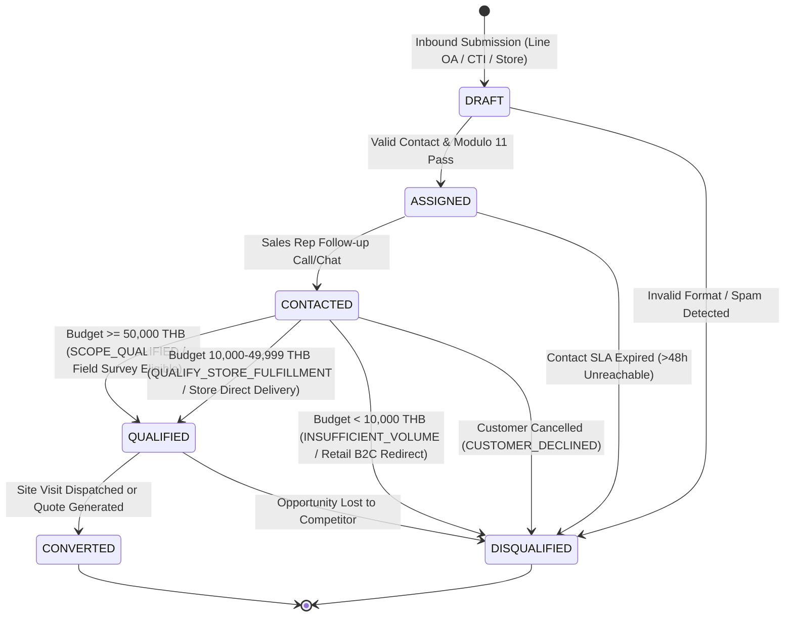
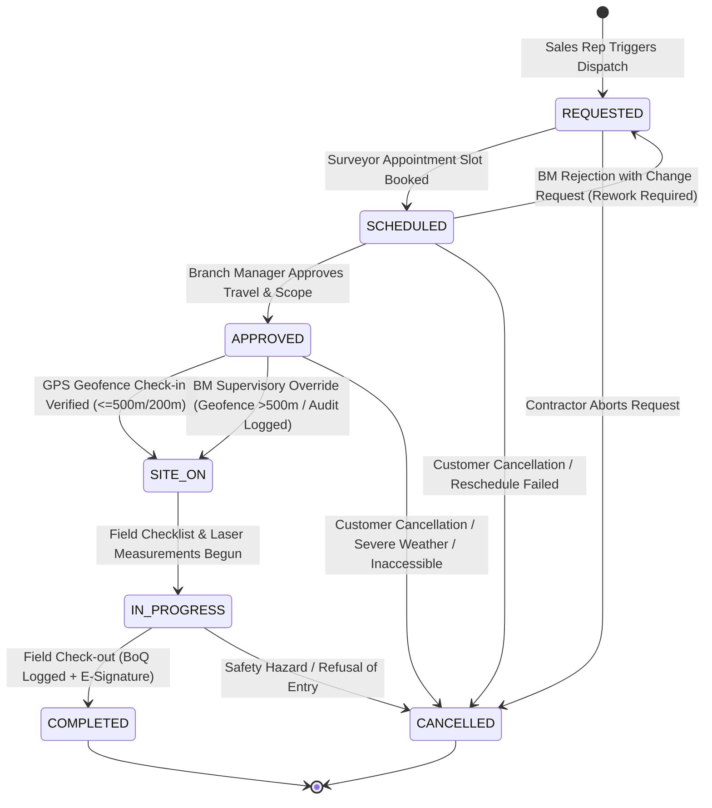
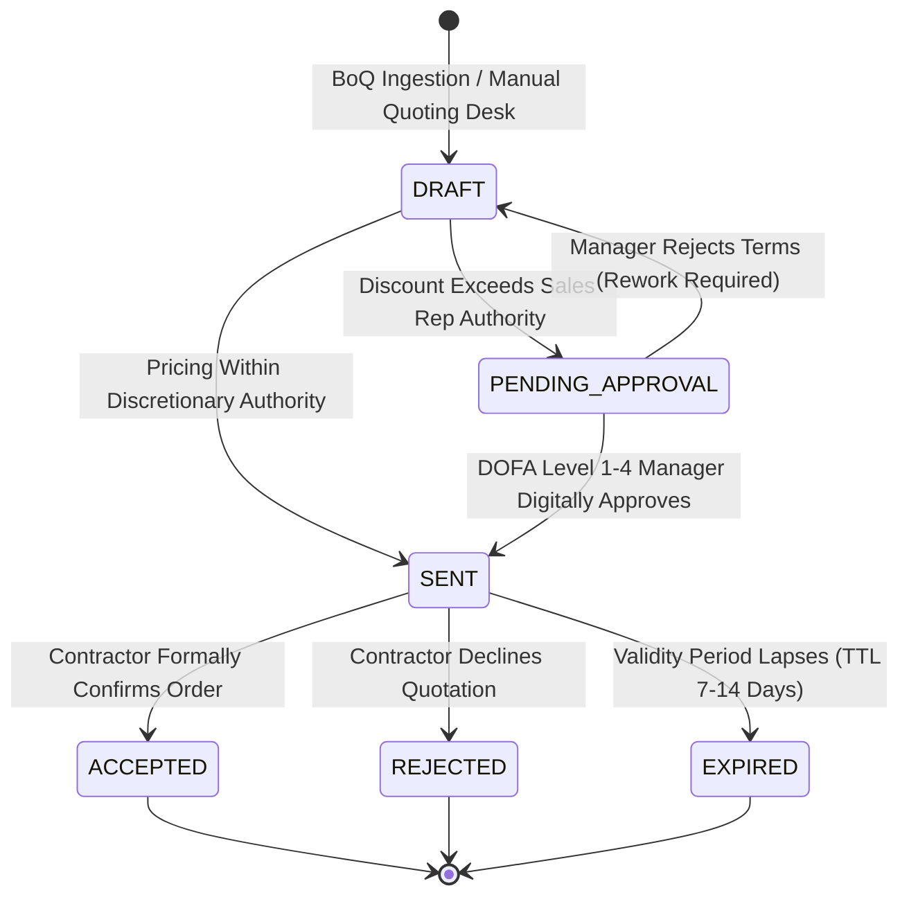
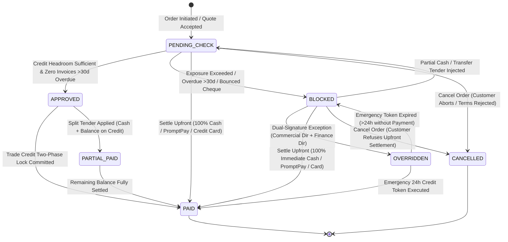
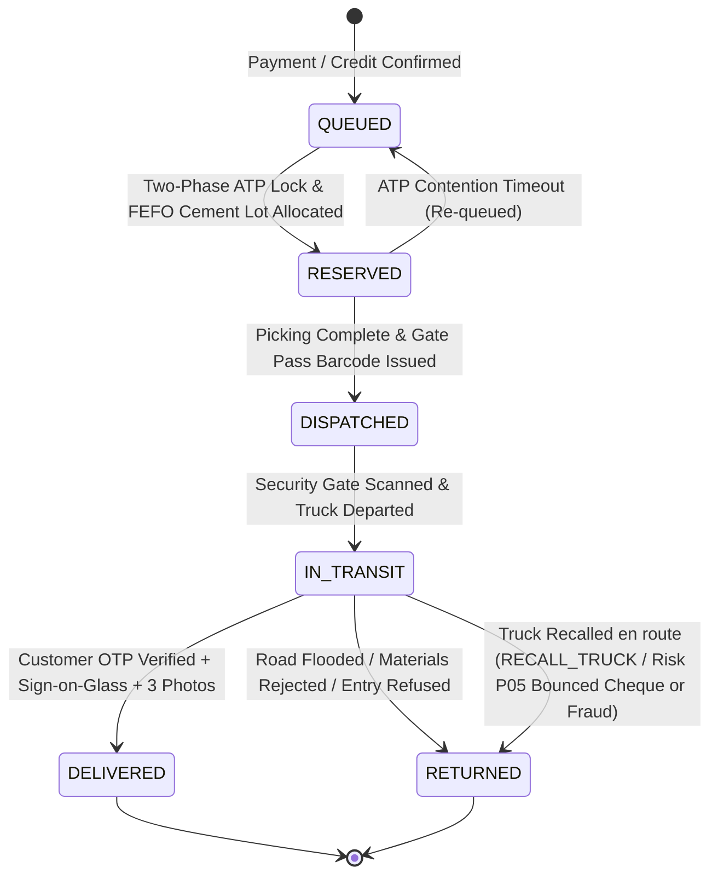

# Thai Watsadu Wholesale & Direct Sales (WDS) System — Release 1
## Deliverable 01: Scope of Work (SOW), Business Process & Delivery Framework

---

### Executive Metadata
- **Document Identifier**: `TW-WDS-R1-DOC-01-SOW-DELIVERY-FRAMEWORK`
- **Document Version**: `1.0.0 (Production Release / Authoritative Baseline)`
- **Authoritative Framework**: Release 1 (R1) PM Role Scope of Work & Delivery Architecture
- **Mandate Reference**: ORIGINAL_REQUEST.md (Follow-up Request dated 2026-09-11T06:17:28Z)
- **Scope Baseline**: SRS v1.1 (409 Total Requirements; Release 1 Committed Scope: 249 Requirements)
- **Target Delivery Horizon**: 26 Weeks (6 Calendar Months) | 13 Sprints (S0 to S12, 2-Week Cadence)
- **Engineering Resource Pool**: 9 In-House Engineers (6.5 Coding FTE / 2.5 Supporting FTE)
- **Workload Sizing Baseline**: 440 Delivered Story Points (SP) + 40 SP Contingency Buffer = 480 SP Gross Capacity
- **Statutory Authority**: Revenue Department of Thailand (RD) / Electronic Transactions Development Agency (ETDA)
- **Corporate Entity**: CRC Thai Watsadu Company Limited (Central Retail Corporation)
- **Classification**: Strictly Confidential — Internal Engineering & Operational Steering Committee

---

# Table of Contents
1. [Executive Summary & Strategic Context](#1-executive-summary--strategic-context)
   - 1.1 [Commercial Wholesale Context & Omnichannel Transformation](#11-commercial-wholesale-context--omnichannel-transformation)
   - 1.2 [Scope Baseline, Release Boundaries & Timebox](#12-scope-baseline-release-boundaries--timebox)
   - 1.3 [Engineering Capacity Model (9-Engineer Dedicated Squad)](#13-engineering-capacity-model-9-engineer-dedicated-squad)
2. [End-to-End Business Process Definition](#2-end-to-end-business-process-definition)
   - 2.1 [Process Architecture & End-to-End Operational Lifecycle Map](#21-process-architecture--end-to-end-operational-lifecycle-map)
   - 2.2 [Phase 1: Omnichannel Inbound Touchpoints & Lead Ingestion](#22-phase-1-omnichannel-inbound-touchpoints--lead-ingestion)
   - 2.3 [Phase 2: Site Visit Lifecycle & Field Engineering Mobility](#23-phase-2-site-visit-lifecycle--field-engineering-mobility)
   - 2.4 [Phase 3: Post-Visit Dual-Branching Execution (Branch A & Branch B)](#24-phase-3-post-visit-dual-branching-execution-branch-a--branch-b)
   - 2.5 [Phase 4: Instantaneous Credit Evaluation & Multi-Tender Settlement](#25-phase-4-instantaneous-credit-evaluation--multi-tender-settlement)
   - 2.6 [Phase 5: High-Contention ATP Allocation, Staging & Delivery Dispatch](#26-phase-5-high-contention-atp-allocation-staging--delivery-dispatch)
   - 2.7 [Domain Standards, Data Integrity & Operational Guardrails](#27-domain-standards-data-integrity--operational-guardrails)
3. [Decoupled State Machines & Event Choreography](#3-decoupled-state-machines--event-choreography)
   - 3.1 [Inter-State Machine Event Choreography Architecture](#31-inter-state-machine-event-choreography-architecture)
   - 3.2 [Lead State Machine](#32-lead-state-machine)
   - 3.3 [Site Visit State Machine](#33-site-visit-state-machine)
   - 3.4 [Quotation State Machine](#34-quotation-state-machine)
   - 3.5 [Payment / Credit State Machine](#35-payment--credit-state-machine)
   - 3.6 [Delivery State Machine](#36-delivery-state-machine)
4. [RACI Matrix & Organizational Alignment](#4-raci-matrix--organizational-alignment)
   - 4.1 [Operational Role Taxonomy](#41-operational-role-taxonomy)
   - 4.2 [Granular Operational RACI Matrix (28 Lifecycle Activities)](#42-granular-operational-raci-matrix-28-lifecycle-activities)
   - 4.3 [Governance Escalation & Deadlock Resolution Protocols](#43-governance-escalation--deadlock-resolution-protocols)
5. [Scope of Work (SOW) & Work Breakdown Structure (WBS)](#5-scope-of-work-sow--work-breakdown-structure-wbs)
   - 5.1 [Component Breakdown (WBS 1.0 to 6.0)](#51-component-breakdown-wbs-10-to-60)
   - 5.2 [Enterprise Integration Endpoints Breakdown (INT-01 to INT-08)](#52-enterprise-integration-endpoints-breakdown-int-01-to-int-08)
6. [Phasing, Milestones & Sprint Plan (S0–S12 Roadmap)](#6-phasing-milestones--sprint-plan-s0s12-roadmap)
   - 6.1 [Capacity Economics & Velocity Baseline](#61-capacity-economics--velocity-baseline)
   - 6.2 [Granular Sprint-by-Sprint Plan (S0 to S12)](#62-granular-sprint-by-sprint-plan-s0-to-s12)
   - 6.3 [Stage-Gate Governance Checkpoints (CP1 to CP5)](#63-stage-gate-governance-checkpoints-cp1-to-cp5)
   - 6.4 [Comprehensive Risk Management Matrix (P01 to P09)](#64-comprehensive-risk-management-matrix-p01-to-p09)
   - 6.5 [The 20-Item Drop List Protocol (§2.3 Scope Shedding at CP3)](#65-the-20-item-drop-list-protocol-23-scope-shedding-at-cp3)
   - 6.6 [Change Management Protocol & Architectural Governance](#66-change-management-protocol--architectural-governance)
7. [Governance & Acceptance Protocols](#7-governance--acceptance-protocols)
   - 7.1 [Definition of Ready (DoR — 6 Strict Entry Gates)](#71-definition-of-ready-dor--6-strict-entry-gates)
   - 7.2 [Definition of Done (DoD — 8 Strict Exit Criteria)](#72-definition-of-done-dod--8-strict-exit-criteria)
   - 7.3 [Operational Business KPIs & The 5 Weekly Core Metrics](#73-operational-business-kpis--the-5-weekly-core-metrics)

---

# 1. Executive Summary & Strategic Context

### 1.1 Commercial Wholesale Context & Omnichannel Transformation
Thai Watsadu (ไทวัสดุ), the flagship home improvement and building materials retail subsidiary of Central Retail Corporation (CRC), commands an extensive retail and distribution network comprising over 80 mega-stores across Thailand alongside the Wang Noi Central Distribution Center (CDC). While Thai Watsadu's existing retail systems capably process standard B2C consumer point-of-sale transactions, commercial contractor, property developer, and institutional B2B sales demand a fundamentally specialized wholesale transaction engine.

Under the authoritative follow-up mandate dated **2026-09-11T06:17:28Z**, the Wholesale & Direct Sales (WDS) Platform is engineered to govern the entire **Omnichannel Lead-to-Delivery Lifecycle**. This end-to-end framework bridges:
1. **Multi-Channel Demand Intake**: Ingesting leads seamlessly from digital messaging (LINE Official Account), telephony (Call Center CTI), and physical mega-store commercial sales desks.
2. **Field Engineering Mobility**: Dispatching jobsite validation requests to mobile surveyor tablets, conducting GPS geo-fenced site inspections, capturing structural dimensions, calculating Bill of Quantities (BoQ), and assessing truck road access.
3. **Dual Commercial Execution**:
   - *Branch A (Custom Quoting)*: Transforming field BoQs into enterprise quotations with tiered volume discounting, dynamic zone freight, floor price margin protections, and Delegation of Financial Authority (DOFA) approval workflows.
   - *Branch B (Direct Field Check-out)*: Closing orders directly on-site with digital glass signatures, instant credit headroom validation, multi-tender payment settlement, high-contention inventory allocation, and direct-to-site truck dispatch with electronic Proof of Delivery (e-PoD).
4. **Statutory & Financial Rigor**: Ensuring complete adherence to Thai Revenue Department (RD) Section 86/4 e-Tax Invoice standards, gapless sequential numbering, satang rounding (`ROUND_HALF_UP`), Thai Baht Text transcription, and immutable double-entry general ledger synchronization with SAP S/4HANA.

### 1.2 Scope Baseline, Release Boundaries & Timebox
The WDS System Requirements Specification (SRS v1.1) defines **409 discrete functional and non-functional requirements**. To ensure delivery certainty within an inviolable enterprise window:
- **Release 1 (R1 Scope Baseline)**: **249 prioritized requirements** sized at exactly **440 Story Points (SP)** across 12 Core Epics (`E13`, `E01`, `E02`, `E03`, `E07`, `E04`, `E10`, `E08`, `E12`, `E11`, `E14`, `E15`). This scope includes the active Sprints S6–S11 backlog containing 20 pre-identified non-critical operational features (totaling 152 SP) eligible for structured scope shedding under the Drop List Protocol at Checkpoint CP3.
- **Release 1.1 & Release 2.0 (Upfront Deferred Scope)**: **160 non-critical requirements** deferred upfront during initiation (e.g. consumer marketplace syndication, automated warehouse robotic picking, third-party vendor self-onboarding portal, and AI generative quote authoring), fully excluded from the 440 SP delivery baseline.
- **Delivery Timebox**: Exactly **26 Calendar Weeks (6 Months)**, structured into **13 Two-Week Sprints** ($S0$ to $S12$).
- **Go-Live Pilot (Week 26)**: Production cutover with a 3-Branch Pilot Launch (Bangna, Bang Bua Thong, Rattanathibet) and Wang Noi CDC direct-to-site dispatch.

### 1.3 Engineering Capacity Model (9-Engineer Dedicated Squad)
Release 1 is designed and built by an internal, cross-functional engineering unit of 9 full-time equivalents (FTEs). The team structure formally separates **Feature Coding Capacity (6.5 FTE)** from **Supporting/Governance Capacity (2.5 FTE)** to protect velocity against overhead:

```
+----------------------------------------------------------------------------------------------------+
|                                RECALIBRATED 9-FTE RESOURCE ALLOCATION                              |
+----------------------------------------------------------------------------------------------------+
| A. FEATURE CODING CAPACITY (6.5 FTE)                                                               |
|   - 1 Dev Lead / Principal Architect : 0.5 Coding FTE (50% Architecture, PR Reviews, SteerCo, ARB)  |
|   - 4 Backend Engineers (BE1–BE4)    : 4.0 Coding FTE (Master Data, Pricing, Credit, Inventory, Tax)|
|   - 2 Frontend Engineers (FE1–FE2)   : 2.0 Coding FTE (Admin/Finance Portals, Sales Desk/Ops Portals)|
|                                                                                                    |
| B. SUPPORTING & PLATFORM CAPACITY (2.5 FTE)                                                        |
|   - 1 QA Automation Lead             : 1.0 Supporting FTE (Playwright, E2E, Mock Services, RD Test) |
|   - 1 DevOps / Platform Lead         : 1.0 Supporting FTE (CI/CD Gates, DB, Redis/Kafka, K8s infra) |
|   - Dev Lead Governance              : 0.5 Governance FTE (Scrum Ceremonies, Technical Risk Mgmt)   |
+----------------------------------------------------------------------------------------------------+
```

---

# 2. End-to-End Business Process Definition

### 2.1 Process Architecture & End-to-End Operational Lifecycle Map
The Omnichannel Lead-to-Delivery process establishes an integrated commercial spine connecting prospective contractors with field surveying, dynamic pricing, risk checks, warehouse picking, and transportation logistics.

```
+-----------------------------------------------------------------------------------------------------------------------------------------+
|                                        OMNICHANNEL LEAD-TO-DELIVERY END-TO-END BUSINESS PROCESS MAP                             |
+-----------------------------------------------------------------------------------------------------------------------------------------+
  [ Phase 1: Inbound ]        [ Phase 2: Site Visit ]        [ Phase 3: Post-Visit Branching ]      [ Phase 4: Credit & Pay ]   [ Phase 5: Dispatch ]
  
  +------------------+        +---------------------+        +-------------------------------+      +----------------------+    +-------------------+
  | Line OA Bot/Chat | -----> | Dispatch to VisitApp| -----> | Branch A: E-Ordering & Quotes | ---> | Dynamic Credit Check | -> | ATP Reservation   |
  +------------------+        +---------------------+        | - BoQ & Dimension Extraction  |      | - Exposure Ledger    |    | - Redis / SQL Lock|
           |                             |                   | - Tiered Pricing & Surcharges |      | - Aging Delinquency  |    +-------------------+
  +------------------+                   v                   | - Floor Price Guardrail       |      +----------------------+              |
  | Call Center CTI  | -----> +---------------------+        +-------------------------------+                 |                          v
  +------------------+        | Appointment Booking |                        |                                 v                    +-------------------+
           |                  +---------------------+                        v                      +----------------------+    | Pick, Pack & Gate |
  +------------------+                   |                   +-------------------------------+      | Payment Settlement   | -> | Pass Generation   |
  | Walk-In Counter  | ----->            v                   | Branch B: Field Check-out Loop| ---> | - Split-Tender POS   |    +-------------------+
  +------------------+        +---------------------+        | - Geo-fence Verification Check|      | - QR PromptPay / EDC |              |
           |                  | Mgr Dispatch Approval|       | - Mobile Glass E-Signature    |      | - PDC Vault Register |              v
           v                  +---------------------+        | - Callback Event to WDS Core  |      +----------------------+    +-------------------+
  +------------------+                   |                   +-------------------------------+                                  | Truck Dispatch &  |
  | WDS Lead Intake  |                   v                                                                                      | Driver Mobile POD |
  | - De-duplication |        +---------------------+                                                                           +-------------------+
  | - Tax ID Check   | -----> | GPS Geo-Fence SiteOn|                                                                                     |
  | - SLA Follow-up  |        | Field Work & Survey |                                                                                     v
  +------------------+        +---------------------+                                                                           [ Fulfilled Order ]
```

---

### 2.2 Phase 1: Omnichannel Inbound Touchpoints & Lead Ingestion
The lifecycle initiates when a contractor or corporate builder expresses interest through one of three integrated inbound channels:

```
+-------------------------------------------------------------------------------------------------------+
|                               PHASE 1: OMNICHANNEL INBOUND & LEAD REGISTRATION                        |
+-------------------------------------------------------------------------------------------------------+
  [ LINE OA INBOUND ]          [ CALL CENTER CTI ]             [ MEGA-STORE WALK-IN ]
  Line Messaging API           CTI Telephony Ingest            Commercial Sales Desk
  Webhook: INT-01              REST Adapter: INT-02            POS / Desk UI: INT-03
         \                             |                             /
          \                            |                            /
           +---------------------------+---------------------------+
                                       |
                                       v
                     +-----------------------------------+
                     | WDS Ingestion & Validation Engine |
                     | - Triple-Key De-duplication Check |
                     | - Modulo 11 13-Digit Tax ID Check |
                     | - Postal Code Zone & Store Assign |
                     +-----------------------------------+
                                       |
                                       v
                     +-----------------------------------+
                     | Lead Registered in DRAFT State    |
                     | - Assign to Store Sales Executive |
                     | - Start 2-Hour SLA Countdown      |
                     +-----------------------------------+
                                       |
                                       v
                     +-----------------------------------+
                     | Sales Rep Contact & Qualification |
                     | - Scope & Budget Validation       |
                     | - Advance to QUALIFIED State      |
                     +-----------------------------------+
```

#### 1. Inbound Channel Handlers
- **Line Official Account (Line OA — `INT-01`)**: Contractor taps the Line Rich Menu ("ขอใบเสนอราคา / นัดหมายสำรวจหน้างาน"). The Line Webhook dispatches an HTTPS payload containing the contractor's Line UID, project address, phone number, and building material categories to `POST /api/v1/leads/line-webhook`.
- **Call Center Computer Telephony Integration (CTI — `INT-02`)**: Inbound contractor calls trigger a CTI screen-pop on the customer service console. If caller ID matches an existing contractor, profile data pre-fills; otherwise, the agent completes the fast lead intake form (`POST /api/v1/leads/cti`).
- **Mega-Store Commercial Sales Desk (`INT-03` / `FE2`)**: A contractor visits one of Thai Watsadu's 80+ superstores. Commercial Sales Executives scan the customer's "The 1 B2B" barcode or search by corporate Tax ID to initiate a lead record.

#### 2. Triple-Key De-Duplication & Modulo 11 Statutory Validation
To eliminate fragmented customer records and duplicate outreach, every inbound lead is evaluated against a compound uniqueness key:
$$\text{DeDupKey} = (\text{TaxID}, \text{PhoneNumber}_{\text{E.164}}, \text{ProjectPostalCode})$$

Corporate Tax IDs (13 digits) and Thai Citizen IDs (13 digits) are validated using the Revenue Department's statutory **Modulo 11 Checksum Algorithm**:
$$\text{Checksum} = \left( 11 - \left( \sum_{i=1}^{12} d_i \times (14 - i) \bmod 11 \right) \right) \bmod 10$$
Where $d_i$ represents the digit at position $i$ (1-indexed). The calculated checksum must exactly equal the 13th digit $d_{13}$. Submissions failing Modulo 11 validation are rejected with HTTP 422 (`ERR_INVALID_TAX_ID`).

#### 3. Lead Routing & 2-Hour SLA Countdown
The engine resolves the project destination postal code against Thai Watsadu's store catchment matrix, assigning the lead to the primary local superstore. An automated 2-hour business follow-up SLA countdown timer (`sla_due_at = CURRENT_TIMESTAMP + INTERVAL '2 HOURS'`) is initiated. If the assigned Sales Representative fails to transition the lead to `CONTACTED` within 90 minutes, an automated escalation alert is dispatched to the Branch Commercial Manager via Line Notify and internal dashboard alerts.

---

### 2.3 Phase 2: Site Visit Lifecycle & Field Engineering Mobility
When high-volume structural materials (e.g. ready-mix cement, structural steel rebars, precast wall panels, roofing structures) require physical site validation, the Sales Rep triggers a site survey dispatch.

```
+-------------------------------------------------------------------------------------------------------+
|                              PHASE 2: SITE VISIT LIFECYCLE & MOBILITY                                 |
+-------------------------------------------------------------------------------------------------------+
  [ Sales Rep Desk ]
  Trigger: DISPATCH_VISIT
  Payload: Project GPS, Contact, Scope
           |
           v
  +-----------------------------------+
  | Visit App Dispatch Gateway INT-04 |
  | - Push to Surveyor Pool           |
  | - Calendar Slot Booking           |
  +-----------------------------------+
           |
           v
  +-----------------------------------+
  | Branch Manager Travel Approval    |
  | - Check Distance & Viability      |
  | - State: APPROVED                 |
  +-----------------------------------+
           |
           v
  +-----------------------------------+
  | Field Surveyor Jobsite Arrival    |
  | - GPS Geo-Fence: <= 500m / 200m   |
  | - State: SITE_ON                  |
  +-----------------------------------+
           |
           v
  +-----------------------------------+
  | Mobile Work, Inspection & BoQ     |
  | - Road & Truck Access Clearance   |
  | - Bluetooth Laser Measurements    |
  | - Minimum 3 Geo-Tagged Photos     |
  | - Offline Sync (SQLite/Watermelon)|
  | - State: IN_PROGRESS              |
  +-----------------------------------+
```

#### 1. Dispatch & Calendar Booking
The Sales Rep initiates a visit dispatch request (`POST /api/v1/site-visits`). The system sends a notification to the local store's Field Surveyor pool. The assigned surveyor coordinates with the site foreman to book an appointment slot. Upon confirmation, the appointment calendar entry is synchronized to the Mobile Visit App via `INT-04`, and an automated confirmation is dispatched to the customer.

#### 2. Branch Manager Travel Authorization
Before field mobilization, the Branch Commercial Manager reviews the visit schedule, verifying travel distance, fleet vehicle availability, and commercial project size. Approving the request advances the state from `SCHEDULED` to `APPROVED`, unlocking the offline job package for synchronization on the surveyor's mobile tablet.

#### 3. GPS Geo-Fencing & Spoofing Prevention (`SITE_ON`)
Upon arriving at the jobsite, the surveyor initiates check-in. The Mobile Visit App evaluates the surveyor's device coordinates against the registered project coordinates using the **Haversine Distance Metric**:
$$d = 2R \arcsin \left( \sqrt{\sin^2\left(\frac{\Delta \phi}{2}\right) + \cos(\phi_1)\cos(\phi_2)\sin^2\left(\frac{\Delta \lambda}{2}\right)} \right)$$
Where $R = 6,371\text{ km}$.
- **Threshold Enforcement**: The enterprise maximum allowable geofence radius is $\le 500\text{ meters}$, with standard urban/suburban jobsites enforcing a tighter $\le 200\text{ meters}$ boundary.
- **Spoofing Guard**: The mobile client inspects Android/iOS location providers (`isMockLocationEnabled = false`) and requires a horizontal accuracy reading $\le 15\text{ meters}$. If the distance exceeds the threshold or spoofing is detected, the check-in is rejected with HTTP 422 (`GEO_DISTANCE_EXCEEDED`), blocking progress.

#### 4. Field Inspection, Truck Clearance & BoQ Compilation
Once in `SITE_ON` status, the surveyor opens the structured field checklist:
- **Access Road & Crane Clearance**: The app evaluates road width, turning radii, bridge weight capacities, and overhead power line clearances, classifying jobsite access into one of four transport categories:
  1. *4-Wheel Light Truck* (Gross weight $\le 1.5$ tons, volume $\le 8\text{ m}^3$)
  2. *6-Wheel Medium Truck* (Gross weight $\le 5.0$ tons, volume $\le 20\text{ m}^3$)
  3. *10-Wheel Heavy Truck* (Gross weight $\le 15.0$ tons, volume $\le 35\text{ m}^3$)
  4. *22-Wheel Semi-Trailer* (Gross weight $\le 32.0$ tons, volume $\le 65\text{ m}^3$)
- **Digital Measurements & BoQ**: The app pairs with Leica/Bosch Bluetooth laser distance meters to log site measurements, automatically calculating square meters, rebar tonnage, and concrete volume.
- **Photographic Evidence**: Minimum of 3 timestamped, geo-tagged photos (Site Entrance, Staging Ground, Structural Area) are required.
- **Offline-First Resilience**: All inspection data, BoQ line drafts, and compressed photos are stored in local SQLite / WatermelonDB storage. A background synchronization worker handles upload with exponential backoff when cellular connectivity is restored.

---

### 2.4 Phase 3: Post-Visit Dual-Branching Execution (Branch A & Branch B)
Upon completing field inspection, the operational process bifurcates based on the project's commercial profile:

```
                                  +------------------------------------+
                                  | Completed Site Inspection on Site  |
                                  +------------------------------------+
                                                    |
                         +--------------------------+--------------------------+
                         |                                                     |
                         v                                                     v
        [ BRANCH A: E-ORDERING & QUOTES ]                     [ BRANCH B: FIELD CHECK-OUT LOOP ]
        Custom / High-Volume BoQ Quoting                      Standard Fast-Moving Direct Order
                         |                                                     |
                         v                                                     v
        +----------------------------------+                  +----------------------------------+
        | BoQ Ingestion to Pricing Engine  |                  | Surveyor Presents Finalized BoQ  |
        | - Volume Breaks (Stepped/Units)  |                  | Contractor Signs on Mobile Glass |
        | - Customer Wholesale Trade Tiers |                  | Surveyor Submits Check-out Call  |
        | - Zone Freight Calculation       |                  +----------------------------------+
        | - Absolute Floor Price Guardrail |                                   |
        +----------------------------------+                                   v
                         |                                    +----------------------------------+
                         v                                    | WDS Callback: Site Completed     |
        +----------------------------------+                  | Direct Transition to Phase 4     |
        | DOFA Approval Routing            |                  +----------------------------------+
        | Level 1 (3%) to Level 4 (15%)    |                                   |
        +----------------------------------+                                   |
                         |                                                     |
                         v                                                     |
        +----------------------------------+                                   |
        | Cryptographic HMAC Quotation PDF |                                   |
        | Delivered to Contractor via LINE |                                   |
        +----------------------------------+                                   |
                         |                                                     |
                         v                                                     |
        +----------------------------------+                                   |
        | Contractor Formal Acceptance     |                                   |
        +----------------------------------+                                   |
                         |                                                     |
                         +--------------------------+--------------------------+
                                                    |
                                                    v
                                      [ PHASE 4: CREDIT & PAYMENT ]
```

#### Branch A: E-Ordering & Dynamic Quotation Generation
Used for complex structural projects, tenders, and customized procurement requiring commercial review:
1. **BoQ Ingestion (`INT-05`)**: The surveyor submits BoQ items from the tablet. WDS converts raw measurements into formal SKU lines with UOM conversions.
2. **Dynamic Pricing Pipeline (`E02`)**:
   - *Volume Breaks*: Evaluates order lines against stepped marginal tier curves or all-units retroactive breaks.
   - *Trade Tier Baselines*: Applies customer-specific trade discount schedules (Tier 1 Gold Contractor, Tier 2 Corporate Builder, Tier 3 Government/Institutional).
   - *Zone Freight*: Computes freight based on destination postal code, selected truck class, and special access surcharges (e.g. island or mountainous delivery), applying automated freight waivers for orders $\ge 50,000\text{ THB}$ net in Bangkok & Vicinity.
   - *Floor Price Guardrail*: Validates that unit price meets or exceeds Moving Average Cost (MAC) plus minimum category margin:
     $$\text{FloorPrice} = \text{MAC} \times (1 + \text{CategoryMinMarginPct})$$
     If unit price breaches the floor price, the quotation is intercepted and flagged with `FLOOR_PRICE_BREACH`.
3. **DOFA Approval Matrix**: If discretionary discounts exceed standard Sales Rep authority, the quotation routes through the Delegation of Financial Authority:
   - Sales Rep / AE: $\le 3.0\%$
   - Branch Commercial Manager: $\le 5.0\%$
   - Regional Commercial Director: $\le 8.0\%$
   - Vice President of Wholesale: $\le 15.0\%$ (authorized to override Floor Price)
   - Managing Director: $> 15.0\%$
4. **Cryptographic Sealing & Contractor Delivery**: Approved quotations are sealed with an HMAC SHA-256 digital signature over line items, quantities, and totals to prevent in-flight tampering. An official PDF/A document is pushed to the contractor via Line OA, Email, and the B2B Contractor Portal.

#### Branch B: Field Check-out Closed Loop (Instant Direct Fulfillment)
Used for standard, pre-priced fast-moving building supplies (e.g., standard Portland cement bags, structural steel bars, AAC lightweight blocks) where quantities and prices are confirmed directly on-site:
1. **On-Site Agreement & Sign-on-Glass**: The surveyor presents the itemized inspection summary to the site foreman on the tablet. The foreman verifies items and signs on the touchscreen canvas.
2. **Closed-Loop Callback**: The surveyor clicks `CHECK_OUT`. The mobile app validates mandatory photos and signature, then transmits an encrypted callback payload to `POST /api/v1/site-visits/{id}/checkout`.
3. **Automated Conversion**: WDS transitions the Site Visit state to `COMPLETED`, generates an internal Commercial Sales Order, and immediately triggers Phase 4 (Credit & Payment Settlement) without manual re-keying.
4. **Branch B Pricing & Discount Guardrail**: Field check-out is strictly limited to standard catalog list price (0% discretionary discount) or active customer master contract prices pre-approved in Master Data (`E01`/`E02`). Field surveyors and mobile clients have zero discretionary discounting authority. Any discretionary discount, volume break beyond contracted tiers, margin override, or custom payment term requires routing through Branch A (Custom Quoting) and the formal DOFA approval hierarchy.

---

### 2.5 Phase 4: Instantaneous Credit Evaluation & Multi-Tender Settlement
Every commercial order must pass statutory credit evaluation and payment settlement before warehouse inventory is committed:

```
+-------------------------------------------------------------------------------------------------------+
|                               PHASE 4: CREDIT EVALUATION & PAYMENT SETTLEMENT                         |
+-------------------------------------------------------------------------------------------------------+
  [ Incoming Order Submission ]
  (From Branch A Quote Accept or Branch B Field Check-out)
           |
           v
  +-------------------------------------------------------+
  | Instantaneous Credit Headroom Ledger Check (E03)      |
  | TotalExposure = AR + Orders + Reservations - PDC - CN |
  | Check: CreditLimit - TotalExposure >= OrderAmount     |
  +-------------------------------------------------------+
           |
           +---------------------------+---------------------------+
           |                                                       |
     [ PASS: Headroom OK ]                                   [ FAIL: Breach Detected ]
     Zero Overdue Invoices >30d                              Exposure >100% OR Overdue >30d
           |                                                       |
           v                                                       v
  +-----------------------------------+                   +-----------------------------------+
  | Trade Credit Terms Approved       |                   | HARD BLOCK Enforced               |
  | Two-Phase Credit Reservation      |                   | Prohibit Trade Credit Checkout    |
  | Lease TTL: 15 Minutes (900s)      |                   +-----------------------------------+
  +-----------------------------------+                                    |
           |                                              +----------------+----------------+
           |                                              |                                 |
           |                                              v                                 v
           |                                    [ Emergency Override ]            [ Alternative Tender ]
           |                                    Dual Signature Token              Cash / EDC / PromptPay
           |                                    (Comm Dir + Fin Dir)              Full upfront payment
           |                                              |                                 |
           |                                              v                                 v
           +----------------------------------------------+---------------------------------+
                                                          |
                                                          v
                                        +-----------------------------------+
                                        | Payment Settlement Execution      |
                                        | - Trade Credit Two-Phase Commit   |
                                        | - Store POS Split-Tender (INT-03) |
                                        | - Dynamic RD PromptPay QR (INT-07)|
                                        | - 6-Stage PDC Cheque Register     |
                                        +-----------------------------------+
                                                          |
                                                          v
                                        [ Trigger Phase 5: Stock Reservation ]
```

#### 1. Instantaneous Dynamic Credit Headroom Ledger
The credit engine calculates real-time customer exposure against the live PostgreSQL ledger without caching balances in Redis:
$$\text{TotalExposure} = \text{AR}_{\text{Unpaid}} + \text{Orders}_{\text{InFulfillment}} + \text{Credit}_{\text{Reserved}} - \text{PDC}_{\text{Holding}} - \text{CreditNotes}_{\text{Unapplied}}$$
The customer must satisfy three mandatory conditions:
1. **Headroom Sufficiency**: $\text{CreditLimit} - \text{TotalExposure} \ge \text{OrderAmount}$
2. **Aging Delinquency**: Zero unpaid invoices past due by $> 30\text{ days}$
3. **Cheque Integrity**: Zero bounced cheques in the preceding 90 days

#### 2. Automated Blocking & Emergency Override Tokens
- **Soft Block**: Exposure $> 90\%$ or unpaid invoices 1–15 days overdue. Requires a single-click OTP override from the Branch Commercial Manager.
- **Hard Block**: Exposure $> 100\%$, invoices $> 30$ days overdue, or an outstanding bounced cheque. The system strictly halts checkout on credit terms, forcing upfront cash payment.
- **24-Hour Emergency Credit Token (`ECT`)**: For mission-critical construction projects, a temporary 24-hour credit extension can be authorized exclusively via dual digital signatures (Commercial Director + Finance Director). The system mints a cryptographically signed HMAC token bound to the specific `order_id` expiring in 86,400 seconds.

#### 3. Multi-Tender Settlement Channels
The system accommodates flexible multi-tender settlement:
- **Trade Credit**: Executes a two-phase credit reservation lease (`POST /api/v1/credit/reserve`) with a 15-minute lease TTL (900s), converted to a committed receivable upon order confirmation.
- **Store POS Split-Tender (`INT-03` / `I0d`)**: Contractor pays across multiple tenders at the superstore cashier desk (e.g. 50,000 THB corporate credit card + 100,000 THB cash + 200,000 THB trade credit). The settlement engine validates that $\sum \text{Tender}_k = \text{OrderPayable}$.
- **Revenue Department Compliant PromptPay QR (`INT-07`)**: The engine generates a dynamic EMVCo PromptPay QR string encoded with the sub-merchant Tax ID and exact satang payable. Bank webhooks confirm clearance in $< 1,000\text{ms}$.
- **Post-Dated Cheque (PDC) Vault Register**: Governs customer cheques through a strict 6-stage finite state machine (`RECEIVED` $\to$ `IN_VAULT` $\to$ `DEPOSITED` $\to$ `UNDER_CLEARING` $\to$ `HONORED` / `BOUNCED`). Goods dispatch is physically locked until the cheque attains `UNDER_CLEARING` or `HONORED` status based on customer trade risk tier.

---

### 2.6 Phase 5: High-Contention ATP Allocation, Staging & Delivery Dispatch
Once credit or payment is confirmed, warehouse fulfillment, statutory tax invoicing, and direct-to-site transportation commence:

```
+-------------------------------------------------------------------------------------------------------+
|                               PHASE 5: INVENTORY, BILLING & LOGISTICS DISPATCH                        |
+-------------------------------------------------------------------------------------------------------+
  [ Payment Confirmed Event ]
           |
           v
  +-------------------------------------------------------+
  | Two-Phase Distributed ATP Stock Reservation (E04)     |
  | - Redis Redlock Mutex + PG Row Lock SELECT FOR UPDATE |
  | - 15-Minute Soft Lease TTL (60s Reaper Task)          |
  +-------------------------------------------------------+
           |
           v
  +-------------------------------------------------------+
  | FEFO Cement Lot Allocation V2 (E07)                   |
  | Phase 1: Drain Broken Pallets First (Aging-Trap Free) |
  | Phase 2: Allocate Full Manufacturer Pallets           |
  | Phase 3: Multi-Lot Remainder Fulfillment              |
  | Exclude Lots with < 15 Days Remaining Shelf Life      |
  +-------------------------------------------------------+
           |
           v
  +-------------------------------------------------------+
  | Warehouse Staging & Gate Control (E08)                |
  | - Bin-Sequence Pick Slip Generation                   |
  | - Weighbridge Tare & Gross Weight Scale Check         |
  | - Gate Pass Barcode Generation                        |
  +-------------------------------------------------------+
           |
           v
  +-------------------------------------------------------+
  | Statutory Revenue Department Tax Invoicing (E10)      |
  | - Gapless Sequential Number: INV-XXXXX-YYYY-MM-ZZZZZZ |
  | - Satang Rounding (ROUND_HALF_UP) & Thai Baht Text    |
  | - Immutable Database Trigger on POSTED State          |
  +-------------------------------------------------------+
           |
           v
  +-------------------------------------------------------+
  | Direct-to-Site Logistics Dispatch & Driver POD (E11)  |
  | - Truck Departs Staging Bay: State IN_TRANSIT         |
  | - Jobsite Arrival: Customer OTP Verification          |
  | - Mobile Proof of Delivery: Sign-on-Glass & 3 Photos  |
  | - Final State: DELIVERED                              |
  +-------------------------------------------------------+
           |
           v
  +-------------------------------------------------------+
  | SAP S/4HANA Finance Sync (INT-06 / I0e)               |
  | Double-Entry Journal Posted via Transactional Outbox  |
  +-------------------------------------------------------+
```

#### 1. High-Contention Two-Phase ATP Inventory Reservation
To prevent race conditions where retail store cashiers and direct sales reps compete for limited building supplies:
- The system acquires a distributed Redis Redlock mutex per SKU and fulfilling branch.
- Within an atomic PostgreSQL transaction, the engine executes `SELECT available_qty FROM branch_stock WHERE branch_id = $1 AND sku = $2 FOR UPDATE`.
- The engine validates Available-To-Promise stock:
  $$\text{ATP}_{\text{Branch}} = \text{OnHand} - \text{HardCommitted} - \text{SoftReserved} - \text{SafetyStock} - \text{DamagedStock} + \text{Inbound}_{\le 24\text{h}}$$
- If stock is sufficient, a soft reservation record is inserted with a **15-minute lease TTL (900 seconds)**. A background `ReservationReaperTask` cron job running every 60 seconds automatically reclaims expired uncommitted stock.
- **Physical Staging Lock vs. Soft Reservation Lease**: The 15-minute soft reservation lease TTL applies strictly during the pre-fulfillment checkout, quotation acceptance, and credit reservation window. Once payment or credit terms are confirmed and the warehouse pick slip is generated (`COMPLETE_PICKING` in progress), the soft reservation is promoted to an inviolate **Physical Staging Lock (Physical Warehouse Picking Lock)**. This physical lock is held continuously across picker yard execution, pallet staging, weighbridge gross weight validation, and vehicle loading until the Gate Pass barcode is issued. The background `ReservationReaperTask` is strictly barred from cancelling or releasing stock governed by an active physical picking lock, completely protecting ongoing physical fulfillment from reaper reclamation.

#### 2. FEFO Pallet Allocation Algorithm V2 (Aging-Trap Free)
Perishable materials like bagged Portland cement are governed by the **FEFO Pallet Allocation Algorithm V2**:
- **Shelf-Life Guard**: Any batch with $< 15\text{ days}$ remaining shelf life is automatically quarantined from the sellable ATP pool.
- **Phase 1 (Broken-Pallet Depletion)**: Odd open pallets are drained first, preventing older inventory from becoming trapped behind newer full pallets in the yard.
- **Phase 2 (Full-Pallet Allocation)**: Intact manufacturer pallets are allocated in strict FEFO order.
- **Phase 3 (Multi-Lot Remainder Fulfillment)**: Residual fractional quantities are satisfied across subsequent lots without throwing unhandled exceptions.

#### 3. Warehouse Staging, Weighbridge & Gate Pass Generation
Warehouse staging crews receive bin-sequenced digital pick slips on ruggedized handheld terminals:
- Staged pallets are transferred to the commercial loading bay.
- Delivery trucks pass over the store weighbridge scale. The system records truck tare and gross weight, cross-checking the bill of lading to guarantee that vehicle legal payload limits (e.g. 25 tons gross for a 10-wheeler) are not exceeded.
- Upon passing weight verification, the dispatch console issues the official Delivery Order (DO) and barcoded Gate Pass.

#### 4. Statutory Revenue Department Tax Invoicing (`E10`)
Concurrently with dispatch, WDS posts the official Tax Invoice complying with Section 86/4 of the Thai Revenue Code:
- **Seller Details**: CRC Thai Watsadu Company Limited (Tax ID: `0107553000107`), Head Office (`00000`) or issuing store branch code.
- **Gapless Continuous Numbering**: Concurrency-safe sequence generated via atomic database locking:
  $$\text{InvoiceNumber} = \text{INV}-\{ \text{BranchCode}_5 \}-\{ \text{YearBE}_4 \}-\{ \text{Month}_2 \}-\{ \text{RunningSeq}_6 \}$$
- **Satang Rounding & Baht Text**: Line VAT is calculated using `ROUND_HALF_UP` to 2 decimal places. Net payable is transcribed into official certified Thai Baht Text (e.g. `หนึ่งแสนห้าหมื่นสี่พันบาทถ้วน`).
- **Database Immutability Trigger**: Database triggers `trg_tax_invoice_immutability` reject direct `UPDATE` or `DELETE` commands on posted records with SQL error `ERR-RD-TAX-001: Legally Immutable`.

#### 5. Logistics Dispatch & Driver Mobile e-PoD (`INT-08`)
Direct-to-site delivery concludes with digital proof of delivery:
- Truck departure from the gate transitions delivery status to `IN_TRANSIT`.
- Upon jobsite arrival, the driver initiates electronic Proof of Delivery (e-PoD) on the mobile device.
- The contractor site foreman receives a 6-digit One-Time Password (OTP) via SMS and Line OA, providing it to the driver for verification.
- The driver captures the foreman's sign-on-glass signature and uploads 3 timestamped photos showing the unloaded materials safely positioned on site.
- Submitting the e-PoD transitions the delivery state to `DELIVERED`, triggering the Transactional Outbox to publish double-entry sales journals to SAP S/4HANA (`INT-06`).

---

### 2.7 Domain Standards, Data Integrity & Operational Guardrails

To ensure flawless regulatory compliance with Thai statutory bodies (Revenue Department, ETDA) and eliminate data discrepancies across distributed touchpoints, all WDS subsystems must strictly adhere to the following domain standards and operational guardrails:

#### 1. Thai Language Collation Standard (`COLLATE "th-TH-x-icu"`)
- **PostgreSQL Database Standard**: All database columns storing Thai textual information—including `contractor_name`, `company_name`, `project_name`, `material_description`, `address_line`, `subdistrict`, `district`, `province`, and full-text search indexing vectors—must be explicitly declared with the ICU-based Thai collation:
  ```sql
  COLLATE "th-TH-x-icu"
  ```
- **Lexicographical Integrity**: Standard binary, `POSIX`, or `en_US` collations erroneously sort Thai text by raw Unicode code points, causing Thai leading vowels (เ, แ, โ, ใ, ไ) to be sorted before consonants (e.g. incorrectly placing "เก่ง" before "กบ"). In contrast, `COLLATE "th-TH-x-icu"` implements the official Royal Institute of Thailand dictionary collation algorithm, ordering words strictly by the base consonant regardless of leading vowel glyphs. This ensures statutory correctness in official customer aging lists, vendor directories, catalog searches, and legal Tax Reports.

#### 2. Timezone Standardization (`Asia/Bangkok` / `UTC+07:00`)
- **Persistence Baseline (Universal UTC)**: All database timestamp columns across PostgreSQL, Kafka message payload timestamps, Redis lease keys, and API interchange JSON schemas must strictly store and transmit date-times in **UTC** using the `TIMESTAMPTZ` data type (formatted conforming to ISO 8601 with trailing UTC indicator `Z`, e.g., `2026-09-11T06:34:20.000Z`).
- **Presentation & Localization Standard (`Asia/Bangkok`)**: All client applications (Sales Desk UI, Field Surveyor Mobile App, Warehouse Dispatch Console, Executive BI Portals), generated PDF documents (Tax Invoices, Delivery Orders, Quotations), customer notification messages (SMS, Line OA), and operational SLA monitors must localize and render timestamps exclusively in Thailand Standard Time:
  ```
  Asia/Bangkok (UTC+07:00)
  ```
- **Statutory Thai Buddhist Era (พ.ศ.)**: All official customer-facing documents and statutory Revenue Department e-Tax Invoices must transcribe the Gregorian calendar year into the official Thai Buddhist Era year:
  $$\text{Year}_{\text{BE}} = \text{Year}_{\text{CE}} + 543 \quad (\text{e.g., } 2026 \implies 2569)$$

#### 3. Ingestion & Financial API Idempotency Contract (`X-Idempotency-Key: UUIDv4`)
- **Mandatory Idempotency Enforcing Endpoints**: To protect against network flapping, cellular drops on field tablets, and automated webhook retries, the following external and mobile integration endpoints strictly mandate the HTTP header:
  ```http
  X-Idempotency-Key: <UUIDv4>
  ```
  1. **`INT-01` (Line OA Webhook Ingestion)**: Prevents duplicate lead registration if Line re-delivers webhook events.
  2. **`INT-04` (Mobile Visit App Check-out Callback `POST /api/v1/site-visits/{id}/checkout`)**: Prevents duplicate Sales Order creation and duplicate billing upon intermittent field 4G/5G reconnects.
  3. **`INT-07` (Bank Payment Gateway PromptPay QR & EDC Callback)**: Guarantees exactly-once payment settlement and prevents duplicate receipt or tax invoice generation.
- **De-duplication Semantics**: The API gateway intercepts the `X-Idempotency-Key` and checks a distributed Redis cache with a 24-hour TTL. If a subsequent request arrives with an identical key during processing, it receives HTTP 409 (`CONFLICT_IN_PROGRESS`); once processed, it returns the cached HTTP response and payload without re-executing business logic.

#### 4. Physical Warehouse Staging Lock vs. Soft Reservation Lease TTL
- **Soft Reservation (15-Minute TTL)**: Operates strictly during the pre-fulfillment phase (customer browsing, quotation review, credit headroom reservation). A background reaper task (`ReservationReaperTask`) runs every 60 seconds to reclaim expired uncommitted stock.
- **Physical Staging Lock (Inviolate Pick/Pack Protection)**: Once an order is paid or credit-committed and the warehouse pick slip is issued, the inventory allocation converts to a **Physical Staging Lock**. This physical staging lock remains active throughout picker yard navigation, bin retrieval, staging bay staging, weighbridge weight validation, and vehicle loading until the barcoded Gate Pass is issued. The background `ReservationReaperTask` is strictly barred from cancelling or releasing stock governed by an active physical picking lock, completely protecting warehouse operations from reaper cancellations.

#### 5. Branch B Field Check-out Pricing & Discount Inviolability
- **Strict Price Boundary**: Branch B (Field Check-out Loop) executed on the Mobile Visit App is strictly limited to:
  1. Standard Master Catalog List Price (0.0% discretionary discount), OR
  2. Active pre-negotiated Customer Master Agreement Contract Prices pre-registered in Master Data (`E01`/`E02`).
- **Zero Field Discretionary Discounting**: Field surveyors and mobile clients have **0% discretionary discounting authority**. Any off-catalog discount request, volume rebate exception, or payment term concession strictly prohibits mobile check-out and mandates routing through **Branch A (Custom Quoting) and the formal DOFA approval hierarchy**.

---

# 3. Decoupled State Machines & Event Choreography

### 3.1 Inter-State Machine Event Choreography Architecture
To maintain high cohesion and prevent distributed deadlocks, the Omnichannel Lead-to-Delivery lifecycle is governed by **five strictly decoupled, event-driven state machines**. State transitions within each machine emit domain events via the **Transactional Outbox Pattern** to Apache Kafka, triggering transitions in downstream machines:

```
+---------------------------------------------------------------------------------------------------------------+
|                                      INTER-STATE MACHINE EVENT-DRIVEN ORCHESTRATION                           |
+---------------------------------------------------------------------------------------------------------------+

   [ 1. LEAD STATE MACHINE ]
   (DRAFT) -> (ASSIGNED) -> (CONTACTED) -> (QUALIFIED) 
                                                |
                                                | Triggers: LeadQualifiedEvent / SiteVisitRequestedEvent
                                                v
                                   [ 2. SITE VISIT STATE MACHINE ]
                                   (REQUESTED) -> (SCHEDULED) -> (APPROVED) -> (SITE_ON) -> (IN_PROGRESS)
                                                                                                 |
                                                                +--------------------------------+--------------------------------+
                                                                | (Branch A: BoQ Quoting)                                         | (Branch B: Direct Checkout)
                                                                v                                                                 v
                                                 [ 3. QUOTATION STATE MACHINE ]                                             (COMPLETED)
                                                 (DRAFT) -> (PENDING_APPROVAL) -> (SENT) -> (ACCEPTED)                            |
                                                                                                |                                 |
                                                                +-------------------------------+                                 |
                                                                | Triggers: QuotationAcceptedEvent / SiteVisitCompletedEvent      |
                                                                v                                                                 |
                                                 [ 4. PAYMENT / CREDIT STATE MACHINE ] <------------------------------------------+
                                                 (PENDING_CHECK) -> [ APPROVED / OVERRIDDEN / BLOCKED ] -> (PAID / PARTIAL_PAID)
                                                                                                                   |
                                                                                                                   | Triggers: PaymentConfirmedEvent
                                                                                                                   v
                                                                                                    [ 5. DELIVERY STATE MACHINE ]
                                                                                                    (QUEUED) -> (RESERVED) -> (DISPATCHED) -> (IN_TRANSIT) -> (DELIVERED)
```

---

### 3.2 Lead State Machine
The Lead State Machine governs customer intake, de-duplication, SLA tracking, and commercial qualification.



#### Lead State Transition Matrix
| Current State | Trigger Event | Guard Condition | Next State | Actions & Side Effects | Rollback / Error Action |
|---|---|---|---|---|---|
| `DRAFT` | `LEAD_SUBMITTED` | Required fields present (Name, Phone, Channel); Phone matches E.164 Thai format; Tax ID satisfies Modulo 11 check. | `ASSIGNED` | - Compute Modulo 11 Tax ID checksum.<br>- Resolve store catchment by postal code.<br>- Assign Sales Representative.<br>- Start 2-hour SLA countdown timer. | If Tax ID checksum or phone format invalid $\to$ Transition to `DISQUALIFIED` (`ERR_INVALID_DATA`). |
| `DRAFT` | `LEAD_REJECTED` | Incomplete intake data, duplicate submission, or automated spam pattern detected. | `DISQUALIFIED` | - Log disqualification reason code (`SPAM`, `INVALID_DATA`).<br>- Close intake ticket. | None (Terminal state). |
| `ASSIGNED` | `REP_CONTACTED` | Sales Rep initiates customer interaction via Phone or Line; timestamp logged. | `CONTACTED` | - Cancel 2-hour SLA timer.<br>- Record initial customer interaction notes in CRM audit log.<br>- Set `contacted_at` timestamp. | If 90 minutes elapsed without contact $\to$ Emit escalation alert to Branch Commercial Manager; state remains `ASSIGNED`. |
| `ASSIGNED` | `SLA_EXPIRED` | Elapsed time exceeds 48 hours without sales action; 3 contact attempts failed. | `DISQUALIFIED` | - Record reason code `CONTACT_TIMEOUT`.<br>- Notify Sales Supervisor. | None (Terminal state). |
| `CONTACTED` | `SCOPE_QUALIFIED` | Commercial project confirmed; estimated procurement budget $\ge 50,000\text{ THB}$. | `QUALIFIED` | - Tag customer tier (`HIGH_VALUE` / `COMMERCIAL_LARGE`).<br>- Unlock Field Site Visit Dispatch (`INT-04`) and Direct Quoting in Sales Desk UI.<br>- Initiate surveyor dispatch workflow if physical site validation required. | If customer declines $\to$ Transition to `DISQUALIFIED` (`CUSTOMER_DECLINED`). |
| `CONTACTED` | `QUALIFY_STORE_FULFILLMENT` | Commercial contractor confirmed; estimated budget between $10,000\text{ THB}$ and $49,999\text{ THB}$. | `QUALIFIED` | - Tag customer tier (`STORE_DIRECT` / `FAST_TRACK`).<br>- Route directly to Mega-Store Commercial Sales Desk / Direct Store Delivery queue.<br>- Bypass Field Surveyor site visit (direct catalog ordering / store stock fulfillment). | If customer declines $\to$ Transition to `DISQUALIFIED` (`CUSTOMER_DECLINED`). |
| `CONTACTED` | `INSUFFICIENT_VOLUME` | Estimated procurement budget $< 10,000\text{ THB}$ (below wholesale commercial volume threshold). | `DISQUALIFIED` | - Record disqualification reason `BELOW_WHOLESALE_THRESHOLD`.<br>- Automated Line OA / SMS response directing customer to Thai Watsadu retail mega-store or e-commerce B2C store.<br>- Close B2B commercial lead. | None (Terminal state). |
| `CONTACTED` | `CUSTOMER_DECLINED`| Customer states no purchase intent or project cancelled. | `DISQUALIFIED` | - Record reason code (`PROJECT_CANCELLED`, `PURCHASED_ELSEWHERE`).<br>- Schedule 60-day marketing nurture re-engagement. | None (Terminal state). |
| `QUALIFIED` | `DISPATCH_VISIT` or `GENERATE_QUOTE` | Valid project delivery address provided; either Site Visit requested or Direct Quote created. | `CONVERTED` | - Publish `LeadConvertedEvent` via Transactional Outbox.<br>- Link `lead_id` to downstream `site_visit_id` or `quotation_id`.<br>- Update sales conversion metrics. | Rollback if downstream entity creation fails (PostgreSQL transaction rolled back). |
| `QUALIFIED` | `OPPORTUNITY_LOST`| Contractor selects competitor or cancels project prior to conversion. | `DISQUALIFIED` | - Record lost reason code and competitor details.<br>- Feed pricing intelligence to Commercial BI. | None (Terminal state). |

---

### 3.3 Site Visit State Machine
The Site Visit State Machine coordinates field engineering mobility, scheduling, geofencing, inspections, and mobile check-out.



#### Site Visit State Transition Matrix
| Current State | Trigger Event | Guard Condition | Next State | Actions & Side Effects | Rollback / Error Action |
|---|---|---|---|---|---|
| `REQUESTED` | `VISIT_REQUESTED` | Lead in `QUALIFIED` state; valid physical project coordinates and scope defined. | `REQUESTED` | - Create `site_visits` record.<br>- Push task notification to local store surveyor pool via Visit App (`INT-04`). | If address cannot be geocoded $\to$ Return HTTP 422 `INVALID_COORDINATES`; request not created. |
| `REQUESTED` | `SLOT_BOOKED` | Appointment date/time within working hours; assigned surveyor calendar slot available. | `SCHEDULED` | - Assign `surveyor_id`.<br>- Reserve surveyor calendar slot.<br>- Send Line OA confirmation link to contractor site foreman. | If calendar slot conflict $\to$ Return HTTP 409 `SLOT_CONFLICT`. |
| `REQUESTED` | `VISIT_CANCELLED` | Contractor requests visit cancellation prior to booking. | `CANCELLED` | - Release booking queue.<br>- Notify Sales Rep. | None (Terminal state). |
| `SCHEDULED` | `MANAGER_APPROVED`| Commercial Manager verifies project commercial viability ($\ge 100,000\text{ THB}$ or strategic contractor). | `APPROVED` | - Issue digital travel authorization.<br>- Unlock offline package download on surveyor mobile device. | If manager rejects $\to$ Revert state to `REQUESTED` with rework note. |
| `SCHEDULED` | `BM_REJECT_REWORK`| Commercial Manager rejects visit parameters (route inefficient, scope unclear, or vehicle unavailable). | `REQUESTED` | - Log BM change request notes.<br>- Revert request to `REQUESTED` for Sales Rep rework and re-scoping.<br>- Free reserved surveyor calendar slot. | Re-evaluate appointment scheduling. |
| `SCHEDULED` | `APPOINTMENT_CANCEL`| Contractor cancels or reschedules appointment $>24\text{ hours}$ in advance. | `CANCELLED` | - Free surveyor calendar slot.<br>- Prompt Sales Rep to reschedule. | None (Terminal state). |
| `APPROVED` | `SITE_ARRIVED` | Device GPS within $\le 500\text{ meters}$ (max) / $\le 200\text{ meters}$ (urban) of site coordinates; mock locations disabled; accuracy $\le 15\text{m}$. | `SITE_ON` | - Log arrival timestamp, GPS coordinates, and accuracy reading.<br>- Enable digital inspection form.<br>- Alert Sales Rep of surveyor arrival. | If distance $>500\text{m}$ or spoofing detected $\to$ Return HTTP 422 `GEO_DISTANCE_EXCEEDED`; button remains disabled. |
| `APPROVED` | `BM_GEOFENCE_OVERRIDE`| Surveyor on site but GPS drift or remote rural coordinates exceed 500m geofence radius; Branch Manager verifies presence via live phone/photo and inputs supervisory override code. | `SITE_ON` | - Capture BM supervisory override authorization.<br>- Record GPS delta and mandatory justification text into immutable audit log (`E13`).<br>- Unlock digital inspection form on surveyor tablet. | Override rejected if supervisor credentials or OTP invalid. |
| `APPROVED` | `VISIT_CANCELLED` | Customer cancels visit prior to surveyor arrival, or extreme weather / flood renders site inaccessible. | `CANCELLED` | - Log cancellation reason (`CUSTOMER_CANCELLED`, `WEATHER_INACCESSIBLE`).<br>- Release surveyor assignment.<br>- Notify Sales Rep and BM. | None (Terminal state). |
| `SITE_ON` | `START_SURVEY` | Check-in confirmed; device battery $\ge 15\%$. | `IN_PROGRESS` | - Start site work duration timer.<br>- Open structural checklist, road access form, and laser BoQ canvas. | None. |
| `IN_PROGRESS` | `FIELD_CHECKOUT` | Mandatory inspection items completed; road truck class selected; $\ge 3$ photos uploaded; contractor e-signature captured. | `COMPLETED` | - Record check-out timestamp.<br>- Seal inspection payload with SHA-256 hash.<br>- Dispatch closed-loop callback to WDS Core (`POST /api/v1/site-visits/{id}/checkout` [with `X-Idempotency-Key`]).<br>- Unlock Branch A (Quoting) or Branch B (Direct Order). | If mandatory photos or customer signature missing $\to$ Form validation error; check-out submission blocked. |
| `IN_PROGRESS` | `EMERGENCY_ABORT` | Hazardous site condition, flooding, or contractor refused entry. | `CANCELLED` | - Record incident report and photographic evidence.<br>- Notify Branch Manager and Sales Rep. | None (Terminal state). |

---

### 3.4 Quotation State Machine
The Quotation State Machine governs price calculations, volume break evaluations, DOFA approvals, and customer confirmation.



#### Quotation State Transition Matrix
| Current State | Trigger Event | Guard Condition | Next State | Actions & Side Effects | Rollback / Error Action |
|---|---|---|---|---|---|
| `DRAFT` | `CALCULATE_PRICING`| At least 1 active SKU line; quantity $>0$; customer assigned; zone freight resolved. | `DRAFT` | - Compute stepped volume breaks, customer trade discounts, zone freight, 7% VAT.<br>- Validate unit price $\ge \text{Floor Price}$.<br>- Render itemized breakdown in UI. | If unit price $<$ Floor Price $\to$ Hard block: `FLOOR_PRICE_BREACH`. Intercepts submission unless flagged for Level 4 DOFA. |
| `DRAFT` | `SUBMIT_FOR_APPROVAL`| Discretionary discount exceeds Sales Rep limit ($>3\%$ structural, $>5\%$ finishing). | `PENDING_APPROVAL`| - Route to DOFA approval queue based on discount tier.<br>- Lock quotation line items against editing. | None. |
| `DRAFT` | `DISPATCH_QUOTE` | Discretionary discount within Sales Rep authority; all lines $\ge \text{Floor Price}$. | `SENT` | - Mint SHA-256 HMAC digital signature over quote payload.<br>- Generate certified PDF/A quotation document.<br>- Push via Line OA, Email, and Portal.<br>- Set validity TTL (7 to 14 days). | If PDF generation fails $\to$ Revert state to `DRAFT`; log render error in audit log. |
| `PENDING_APPROVAL` | `DOFA_APPROVED` | Authorized manager approves via digital signature and SMS/Email OTP. | `SENT` | - Append manager signature hash to quotation metadata.<br>- Generate signed PDF/A quotation.<br>- Dispatch to contractor. | If OTP verification fails $\to$ Reject approval action; state remains in `PENDING_APPROVAL`. |
| `PENDING_APPROVAL` | `DOFA_REJECTED` | Approver rejects requested discount terms. | `DRAFT` | - Return quotation to Sales Rep with mandatory feedback note.<br>- Unlock lines for price adjustment. | None. |
| `SENT` | `CUSTOMER_ACCEPT` | Contractor signs quotation on portal or confirms acceptance via Line OA. | `ACCEPTED` | - Lock quotation permanently against modification.<br>- Publish `QuotationAcceptedEvent`.<br>- Trigger Credit Check and Order Fulfillment pipeline. | If quotation TTL expired $\to$ Return HTTP 410 `QUOTATION_EXPIRED`. Force price recalculation. |
| `SENT` | `CUSTOMER_REJECT` | Contractor formally declines quotation. | `REJECTED` | - Record rejection reason code (`PRICE_HIGH`, `LEAD_TIME`, `SPEC_MISMATCH`).<br>- Log feedback for commercial BI. | None (Terminal state). |
| `SENT` | `TTL_EXPIRED` | Current timestamp exceeds `valid_until` date. | `EXPIRED` | - Scheduled cron job marks quote as `EXPIRED`.<br>- Notify Sales Rep for re-engagement. | None (Terminal state). |

---

### 3.5 Payment / Credit State Machine
The Payment / Credit State Machine governs customer credit exposure calculations, blocking rules, emergency override tokens, and payment processing.



#### Payment / Credit State Transition Matrix
| Current State | Trigger Event | Guard Condition | Next State | Actions & Side Effects | Rollback / Error Action |
|---|---|---|---|---|---|
| `PENDING_CHECK` | `EVALUATE_CREDIT` | Order amount $>0.00\text{ THB}$; customer credit account active. | `APPROVED` | - Dynamic Exposure calculation passes: $\text{Exposure} + \text{OrderAmount} \le \text{CreditLimit}$.<br>- Zero invoices overdue $>30\text{ days}$.<br>- Zero bounced cheques in last 90 days. | If exposure breached or overdue invoices found $\to$ Transition to `BLOCKED`. |
| `PENDING_CHECK` | `CREDIT_BREACHED`| Exposure exceeds credit limit OR invoice overdue $>30\text{ days}$ OR bounced cheque on record. | `BLOCKED` | - Generate risk scorecard listing overdue invoice IDs and overage amount.<br>- Prohibit automated trade credit checkout. | None. Order cannot proceed on credit terms without formal override or payment. |
| `PENDING_CHECK` | `SETTLE_UPFRONT` | Contractor elects 100% upfront settlement via Cash, Dynamic PromptPay QR (`INT-07`), or Bank Card EDC at POS (`INT-03`). | `PAID` | - Bypass trade credit headroom and delinquency checks.<br>- Mint payment receipt and record zero credit exposure hold.<br>- Publish `PaymentConfirmedEvent`. | If payment gateway or tender transaction fails $\to$ Retain `PENDING_CHECK`. |
| `PENDING_CHECK` | `CANCEL_ORDER` | Contractor requests order cancellation or declines terms prior to settlement. | `CANCELLED` | - Release temporary quotation and soft reservations.<br>- Log cancellation reason in CRM audit trail. | None (Terminal state). |
| `BLOCKED` | `APPLY_OVERRIDE` | Emergency override approved with dual digital signatures (Commercial Dir + Finance Dir) and OTP. | `OVERRIDDEN` | - Issue cryptographically signed 24-hour Emergency Credit Token (`ECT`).<br>- Log financial business justification in immutable audit log. | If digital signatures missing or OTP invalid $\to$ Action hard-rejected; state remains `BLOCKED`. |
| `BLOCKED` | `INJECT_CASH` | Contractor pays partial cash or transfer tender at POS (`INT-03`) or via PromptPay QR (`INT-07`). | `PENDING_CHECK` | - Record partial payment receipt.<br>- Re-evaluate remaining credit headroom. | None. |
| `BLOCKED` | `SETTLE_UPFRONT` | Delinquent or credit-blocked customer provides 100% immediate upfront payment via Cash, PromptPay QR, or Credit Card. | `PAID` | - Bypass trade credit terms (Cash-Before-Delivery).<br>- Clear order payable in full; bypass credit lock.<br>- Publish `PaymentConfirmedEvent`. | If upfront payment transaction fails $\to$ Retain `BLOCKED`. |
| `BLOCKED` | `CANCEL_ORDER` | Contractor refuses upfront payment terms or override request rejected. | `CANCELLED` | - Abort order in system.<br>- Log credit rejection reason in customer history. | None (Terminal state). |
| `OVERRIDDEN` | `COMMIT_OVERRIDE`| Order confirmed within 24-hour ECT token validity window. | `PAID` | - Consume emergency credit token.<br>- Commit order value.<br>- Publish `PaymentConfirmedEvent`. | If token expired ($>24\text{ hours}$) $\to$ Token invalid; transition to `BLOCKED`. |
| `OVERRIDDEN` | `TOKEN_EXPIRED` | Elapsed time exceeds 24 hours (86,400s) from ECT issuance without payment confirmation. | `BLOCKED` | - Scheduled cron job invalidates and revokes Emergency Credit Token.<br>- Revert order status to hard blocked.<br>- Emit security alert to Commercial and Finance Directors. | Customer must pay 100% upfront cash or re-apply for executive override. |
| `APPROVED` | `COMMIT_CREDIT` | Order secured against customer trade credit line. | `PAID` | - Execute Two-Phase Credit Reservation: Insert into `credit_reservations` with 15-minute lease TTL.<br>- Upon order confirm $\to$ convert to committed receivable.<br>- Publish `PaymentConfirmedEvent`. | If reservation lease expires without order confirmation $\to$ Background reaper releases hold. |
| `APPROVED` | `PARTIAL_SETTLE` | Order split between cash/cheque tender and trade credit. | `PARTIAL_PAID`| - Record paid tender amount.<br>- Hold balance under trade credit reservation.<br>- Issue partial payment receipt. | If tender transaction fails $\to$ Revert state to `APPROVED`. |
| `PARTIAL_PAID` | `SETTLE_FINAL` | Remaining balance fully collected via POS, PromptPay, or cleared PDC cheque. | `PAID` | - Mark payment ledger as 100% satisfied.<br>- Release order for warehouse dispatch. | If payment fails $\to$ Retain `PARTIAL_PAID`. |

---

### 3.6 Delivery State Machine
The Delivery State Machine governs high-contention inventory allocation, warehouse staging, weighbridge checks, transportation, and mobile proof of delivery.



#### Delivery State Transition Matrix
| Current State | Trigger Event | Guard Condition | Next State | Actions & Side Effects | Rollback / Error Action |
|---|---|---|---|---|---|
| `QUEUED` | `ALLOCATE_STOCK` | Order paid or credit committed; items available in branch inventory. | `RESERVED` | - Acquire Redis Redlock mutex per branch/SKU.<br>- Execute `SELECT ... FOR UPDATE` row lock.<br>- Run FEFO cement lot allocation ($\ge 15\text{ days}$ shelf life).<br>- Insert 15-minute soft stock reservation. | If stock insufficient $\to$ Revert state to `QUEUED`; trigger automated inter-store cross-dock transfer request. |
| `RESERVED` | `COMPLETE_PICKING`| Staging bay crew confirms scanned batch barcodes; weighbridge scale verifies gross weight $\le$ vehicle legal limit. | `DISPATCHED` | - Convert soft reservation to hard committed stock.<br>- Generate Delivery Order (DO) and barcoded Gate Pass.<br>- Post statutory RD Tax Invoice (`E10`). | If weighbridge detects vehicle overload $\to$ Gate Pass generation blocked until truck re-staged. |
| `RESERVED` | `LEASE_EXPIRED` | Order picking unfulfilled within 15-minute lease TTL without extension. | `QUEUED` | - `ReservationReaperTask` releases Redis/SQL lock.<br>- Stock returns to branch sellable ATP. | None. Order returns to queue for re-allocation. |
| `DISPATCHED` | `TRUCK_DEPARTED` | Security gate scans Gate Pass barcode; truck departs facility. | `IN_TRANSIT` | - Log gate departure timestamp.<br>- Send automated Line OA delivery tracking alert to contractor.<br>- Update fleet status. | If gate pass unverified $\to$ Security barrier remains closed; truck barred from exiting. |
| `IN_TRANSIT` | `CONFIRM_DELIVERY`| Contractor site foreman provides valid 6-digit OTP; driver captures receiver sign-on-glass signature, $\ge 3$ unload photos, and GPS coordinates. | `DELIVERED` | - Upload POD payload with EXIF metadata.<br>- Transition delivery status to `DELIVERED`.<br>- Publish double-entry accounting journal to SAP S/4HANA (`INT-06`). | If OTP verification fails or POD photo/signature missing $\to$ Driver mobile UI blocks delivery completion. |
| `IN_TRANSIT` | `DELIVERY_REJECTED`| Jobsite road inaccessible, contractor refuses delivery due to material defect, or receiver unavailable. | `RETURNED` | - Driver logs rejection reason code.<br>- Truck returns to branch warehouse.<br>- Trigger RMA inspection workflow (`E12`) or Credit Note issuance. | Quarantined returned goods must be inspected before restocking into sellable ATP. |
| `IN_TRANSIT` | `RECALL_TRUCK` | Risk P05 security alert triggered: Post-dated cheque bounced, credit delinquency discovered, or fraudulent transaction identified while truck en route. | `RETURNED` | - Transportation dispatcher immediately radios driver to abort delivery.<br>- Driver instructed to reverse route and return truck to issuing store branch.<br>- Freeze customer account network-wide.<br>- Quarantine truck cargo upon warehouse re-entry; log security incident in audit trail. | If truck already delivered prior to recall command $\to$ Escalate immediately to Executive Steering Committee and Corporate Legal / Debt Recovery. |

---

# 4. RACI Matrix & Organizational Alignment

### 4.1 Operational Role Taxonomy
The Omnichannel Lead to Delivery process involves five frontline and governance operational roles across Thai Watsadu's organizational structure:
1. **Sales Rep / Key Account Manager (SR)**: Direct commercial lead handling, customer qualification, quote formulation, customer negotiations, and relationship management.
2. **Field Surveyor / Site Engineer (SE)**: On-site job inspections, structural measurements, BoQ compilation, access road verification, and mobile check-out.
3. **Approver / Branch Commercial Manager (BM)**: Authorizing site visit travel dispatches, DOFA discretionary price discount approvals, and soft credit block overrides.
4. **Credit / Finance Officer (CFO)**: Managing customer credit headroom, investigating delinquent accounts, PDC vault register verification, and statutory tax reporting.
5. **Warehouse / Logistics Officer (WDO)**: Inventory ATP staging, FEFO picking adherence, weighbridge checks, gate pass control, and driver logistics tracking.

```
RACI Designation Key:
- R = Responsible : The execution lead who performs the operational activity.
- A = Accountable : The single individual with final decision and veto authority (STRICTLY ONE "A" PER ACTIVITY).
- C = Consulted   : Subject matter experts whose inputs and feedback are mandatory prior to execution.
- I = Informed    : Stakeholders kept updated on status, outcomes, and milestones.
```

---

### 4.2 Granular Operational RACI Matrix (28 Lifecycle Activities)
The matrix below governs all 28 granular activities across the Omnichannel Lead-to-Delivery lifecycle, rigorously enforcing the **Single Accountable Rule**:

| # | Operational Activity / Lifecycle Step | Sales Rep (SR) | Field Surveyor (SE) | Branch Mgr (BM) | Credit/Finance (CFO) | Warehouse/Logistics (WDO) |
|:---:|---|:---:|:---:|:---:|:---:|:---:|
| **1** | Omnichannel Inbound Lead Intake & De-dup (Line/Call/Store) | **R** | I | **A** | I | I |
| **2** | Customer 2-Hour Follow-up SLA Adherence | **R** | I | **A** | I | I |
| **3** | Lead Qualification & Commercial Tier Assignment | **R** | I | **A** | C | I |
| **4** | Site Visit Request & Jobsite Scope Definition | **R** | C | **A** | I | I |
| **5** | Field Surveyor Calendar Scheduling & Slot Booking | C | **R** | **A** | I | I |
| **6** | Site Visit Dispatch Travel & Viability Authorization | I | C | **A** | I | I |
| **7** | GPS Geo-Fence Site On Verification ($\le 500\text{m} / 200\text{m}$) | I | **R** | **A** | I | I |
| **8** | On-Site Physical Inspection & Road Clearance Logging | I | **R** | **A** | I | C |
| **9** | Digital Laser Measurement & BoQ Sizing Compilation | C | **R** | **A** | I | I |
| **10**| Branch B: Field Check-out Closed Loop (E-Sign & Callback) | I | **R** | **A** | I | I |
| **11**| Branch A: BoQ Ingestion into E-ordering Pricing Engine | **R** | C | **A** | I | I |
| **12**| Dynamic Tier Pricing & Zone Freight Surcharge Calculation | **R** | I | **A** | C | C |
| **13**| Absolute Floor Price Guardrail Compliance Check | **R** | I | C | **A** | I |
| **14**| DOFA Discretionary Discount Approval (Level 1–4) | R | I | **A** | C | I |
| **15**| Formal Quotation PDF Sealing & Contractor Delivery | **R** | I | **A** | I | I |
| **16**| Customer Quotation Review & Digital Sign-off Intake | **R** | I | **A** | I | I |
| **17**| Dynamic Real-Time Credit Headroom & Aging Delinquency Check | I | I | C | **A** | I |
| **18**| Credit Limit Hard Block Enforcement ($>100\%$ / $>30\text{d}$ Overdue) | I | I | C | **A** | I |
| **19**| Soft Credit Block Exception Override Sign-off | C | I | R | **A** | I |
| **20**| 24-Hour Emergency Credit Release Token Execution | C | I | R | **A** | I |
| **21**| Post-Dated Cheque (PDC) Vault Registration & Clearing | I | I | I | **A** | I |
| **22**| Split-Tender POS / QR PromptPay Payment Reconciliation | R | I | I | **A** | I |
| **23**| High-Contention Two-Phase ATP Inventory Reservation | I | I | I | I | **A** |
| **24**| FEFO Cement Lot Picking Allocation ($\ge 15\text{d}$ Shelf Life) | I | I | I | I | **A** |
| **25**| Weighbridge Gross Weight & Gate Pass Document Issuance | I | I | I | I | **A** |
| **26**| Statutory RD Tax Invoice Generation & Sequential Sealing | I | I | I | **A** | I |
| **27**| Direct-to-Site Logistics Dispatch & Driver Mobile POD | I | I | I | I | **A** |
| **28**| Customer Return & Grade A/B RMA Restock Inspection | I | I | C | C | **A** |

---

### 4.3 Governance Escalation & Deadlock Resolution Protocols
When operational conflicts or exceptions arise during daily execution:
1. **Commercial vs. Credit Deadlock (e.g. Sales requests dispatch for an account $>30\text{ days}$ overdue)**:
   - Escalates immediately to the **Credit Committee** (Branch Commercial Manager + Regional Credit Manager).
   - Under no circumstances can a sales manager override a statutory Hard Block independently. Release requires dual digital signatures on an Emergency Credit Token (`ECT`).
2. **Pricing vs. Floor Price Deadlock (e.g. Strategic tender bidding below MAC + Margin)**:
   - Escalates strictly to the **Vice President of Wholesale**. If the requested price falls below pure Moving Average Cost (negative gross margin), approval requires the **Managing Director**.
3. **Inventory Contention Deadlock (e.g. Retail walk-in POS vs. Wholesale direct delivery)**:
   - First-confirmed reservation lease in PostgreSQL wins (`SELECT ... FOR UPDATE`).
   - If stock is exhausted, the Warehouse Logistics Officer is accountable for triggering an emergency automated cross-dock transfer from the nearest branch or Wang Noi CDC within 24 hours, with inter-branch freight absorbed by central logistics.

---

# 5. Scope of Work (SOW) & Work Breakdown Structure (WBS)

### 5.1 Component Breakdown (WBS 1.0 to 6.0)
The Omnichannel Scope of Work is categorized across **Six Core System Components**:

```
+----------------------------------------------------------------------------------------------------+
|                                    WBS ARCHITECTURAL TAXONOMY                                      |
+----------------------------------------------------------------------------------------------------+
| WBS 1.0: Omnichannel Lead Ingestion & Qualification Engine                                          |
| WBS 2.0: Mobile Visit App & Field Engineering Mobility Platform                                    |
| WBS 3.0: E-Ordering & Dynamic Quotation Generation Engine                                          |
| WBS 4.0: Credit Headroom, Risk Blocking & Multi-Tender Payment Engine                              |
| WBS 5.0: Inventory ATP Allocation, Warehouse Staging & Logistics Dispatch Engine                   |
| WBS 6.0: End-to-End Orchestration, Event-Driven Saga Broker & Governance Audit                      |
+----------------------------------------------------------------------------------------------------+
```

#### WBS 1.0: Omnichannel Lead Ingestion & Qualification Engine
- **1.1 Line OA Webhook Ingestion Adapter (`INT-01`)**: Secure HTTPS webhook consumer parsing Line Messaging API payloads, extracting contractor contact info, project address, and material categories.
- **1.2 Call Center CTI Telephony Adapter (`INT-02`)**: RESTful push adapter synchronizing inbound telephony caller ID with WDS customer records for automated screen-pop profiling.
- **1.3 Identity Resolution & Modulo 11 Checksum Validator**: Triple-key matching engine `(tax_id, phone, postal_code)` with statutory Modulo 11 check digit verification.
- **1.4 Store Postal Zone Routing & SLA Monitor**: Automated store catchment routing engine paired with a background 2-hour SLA countdown timer alerting supervisors upon breach.
- **1.5 Commercial Sales Desk Intake Portal (`FE2`)**: Fast lead registration and qualification screen for store commercial sales desks.

#### WBS 2.0: Mobile Visit App & Field Engineering Mobility Platform
- **2.1 Dispatch & Calendar Slot Booking Module**: Real-time surveyor scheduling engine synchronizing calendar slots and push notifications.
- **2.2 GPS Geo-Fencing & Anti-Spoofing Check-in**: Haversine distance validator enforcing $\le 500\text{m}$ (max) / $\le 200\text{m}$ (urban) radius and rejecting mock location providers.
- **2.3 Digital Field Inspection & Truck Clearance Suite**: Standardized structural checklist, access road measurement classifier (4W, 6W, 10W, 22W), and laser meter Bluetooth sync.
- **2.4 Offline-First Sync & Cryptographic Vault**: Local SQLite / WatermelonDB encrypted storage with delta synchronization on network restoration.
- **2.5 Mobile Sign-on-Glass & Closed-Loop Callback**: Mobile touchscreen e-signature capture and callback emitter (`POST /api/v1/site-visits/{id}/checkout`).

#### WBS 3.0: E-Ordering & Dynamic Quotation Generation Engine
- **3.1 BoQ Import & SKU Normalization Pipeline**: Converts field inspection measurements and BoQ drafts into active WDS SKU lines with UOM conversions.
- **3.2 Dynamic Pricing & Tiered Volume Engine (`E02`)**: Stepped marginal tier curves, all-units retroactive breaks, and customer trade tier baselines.
- **3.3 Zone Freight Surcharge Engine**: Distance/postal zone freight matrix calculation across 4 truck classes with Zone 1 freight waiver logic ($\ge 50,000\text{ THB}$).
- **3.4 Absolute Floor Price Guardrail**: Database-level check intercepting quotes below Moving Average Cost + category minimum margin.
- **3.5 DOFA Approval Workflow & HMAC PDF Sealing**: Multi-level approval hierarchy (Level 1–4) with OTP verification and SHA-256 HMAC sealed PDF generation.

#### WBS 4.0: Credit Headroom, Risk Blocking & Multi-Tender Payment Engine
- **4.1 Real-Time Dynamic Exposure Ledger (`E03`)**: Pure live-database calculation of outstanding AR, committed orders, and active reservations against PostgreSQL.
- **4.2 Automated Soft/Hard Blocking Engine**: Automated soft blocking ($>90\%$ exposure, 1–15d overdue) and hard blocking ($>100\%$ exposure, $>30\text{d}$ overdue, bounced cheques).
- **4.3 24-Hour Emergency Credit Release Tokenizer**: Cryptographically signed HMAC token generator requiring dual Level-3 authorization (Commercial Mgr + Finance Dir).
- **4.4 6-Stage Post-Dated Cheque (PDC) Vault Register**: Lifecycle tracking engine (`RECEIVED` $\to$ `IN_VAULT` $\to$ `DEPOSITED` $\to$ `UNDER_CLEARING` $\to$ `HONORED`/`BOUNCED`).
- **4.5 Multi-Tender Payment Reconciliation Processor**: Split-tender reconciliation coordinating Cash, PromptPay dynamic QR, Bank EDC, and Trade Credit.

#### WBS 5.0: Inventory ATP Allocation, Warehouse Staging & Logistics Dispatch Engine
- **5.1 High-Contention Two-Phase ATP Engine (`E04`)**: Redis Redlock distributed mutex paired with PostgreSQL `SELECT ... FOR UPDATE` row locks; 15-minute lease TTL.
- **5.2 FEFO Perishable Cement Lot Allocator (`E07`)**: Multi-lot remainder fulfillment algorithm enforcing $\ge 15\text{ days}$ shelf life and broken-pallet depletion first.
- **5.3 Warehouse Staging & Pick/Pack Console (`E08`)**: Bin-sequence pick slip generation, staging bay assignment, and weighbridge gross weight checker.
- **5.4 Statutory Revenue Department Tax Invoicing (`E10`)**: Gapless continuous sequential numbering, exact 7% Output VAT, certified Thai Baht Text, and immutability triggers.
- **5.5 Transport Logistics Dispatch & Driver POD (`E11`)**: Carrier route assignment, Gate Pass barcode verification, customer OTP verification, and driver mobile POD capture.

#### WBS 6.0: End-to-End Orchestration, Event-Driven Saga Broker & Governance Audit
- **6.1 Transactional Outbox & Kafka Saga Orchestrator**: Event choreography coordinating state transitions across Lead $\to$ Visit $\to$ Quote $\to$ Credit $\to$ Delivery.
- **6.2 Cryptographically Chained Audit Log (`E13`)**: SHA-256 HMAC chained event logs recording every state transition, user attribution, and IP address.
- **6.3 Scope Circuit Breaker & Drop List Automator (§2.3)**: Automated CP3 velocity tracking and scope reduction management.
- **6.4 Executive Governance Scorecard Engine**: Real-time aggregation of the 5 Weekly Core Metrics and KRI early warnings.

---

### 5.2 Enterprise Integration Endpoints Breakdown (INT-01 to INT-08)
The table below specifies the 8 enterprise integration endpoints connecting WDS with internal and external enterprise systems:

```
+-----------------------------------------------------------------------------------------------------------------------------------------+
|                                            ENTERPRISE INTEGRATION POINTS (INT-01 to INT-08)                                             |
+--------+----------------------------+-------------+----------------+-------------------------------------------+------------------------+
| ID     | Integration Endpoint Name  | Protocol    | Latency Target | Data Payload / Standard                   | Fallback & Resilience  |
+--------+----------------------------+-------------+----------------+-------------------------------------------+------------------------+
| INT-01 | Line OA Messaging Gateway  | HTTPS / Web | < 500ms        | JSON Webhook [X-Idempotency-Key: UUIDv4]  | Dead Letter Queue      |
| INT-02 | Call Center Telephony CTI  | REST / JSON | < 250ms        | Inbound Caller Context & Phone            | Manual Intake Search   |
| INT-03 | Store Sales Desk / POS In  | REST / mTLS | < 200ms        | The 1 Member & Split Tenders              | Offline Staging Queue  |
| INT-04 | Mobile Visit App Bridge    | HTTPS / REST| < 800ms        | Bi-directional Sync [X-Idempotency-Key]   | SQLite / WatermelonDB  |
| INT-05 | E-Ordering Pricing Connect | gRPC / JSON | < 150ms        | BoQ Lines, Pricing Curve Req              | In-Memory Cache        |
| INT-06 | SAP S/4HANA Finance Sync   | REST/Outbox | Async (<60s)   | Double-Entry Journal / I0e                | Transactional Outbox   |
| INT-07 | Bank Payment Gateway & EDC | HTTPS / Web | < 1,000ms      | RD PromptPay QR [X-Idempotency-Key:UUIDv4]| Polling / Store POS    |
| INT-08 | TMS Logistics & Telematics | REST / JSON | < 500ms        | Gate Pass, Manifest & POD                 | Manual Paper DO        |
+--------+----------------------------+-------------+----------------+-------------------------------------------+------------------------+
```

1. **INT-01: Line OA Messaging Gateway**: Ingests contractor requests via HTTPS webhook with mandatory `X-Idempotency-Key: <UUIDv4>` header for webhook retry de-duplication; dispatches appointment reminders, signed PDF quotations, and live driver tracking links.
2. **INT-02: Call Center Telephony CTI**: Coordinates with Avaya/Cisco CTI switches to match caller phone numbers with contractor profiles, rendering pop-up records on agent screens in $<250\text{ms}$.
3. **INT-03: Store Sales Desk / POS Ingestion (`I0d`)**: Connects retail store POS cashier terminals and commercial sales desks for walk-in lead entry, The 1 B2B points lookup, and split-tender payment reconciliation.
4. **INT-04: Mobile Visit App Bi-directional Bridge**: Coordinates site visit assignments, GPS geofencing verification, offline inspection caching, and closed-loop check-out callbacks (`POST /api/v1/site-visits/{id}/checkout`), mandating `X-Idempotency-Key: <UUIDv4>` header to eliminate duplicate order generation on cellular reconnections.
5. **INT-05: E-Ordering Pricing Connector**: High-speed internal bridge executing volume break math, zone freight calculation, and floor price validation for BoQ items.
6. **INT-06: SAP S/4HANA Finance Sync (`I0e`)**: Asynchronous double-entry sales journal posting, AR subledger updates, and Output VAT tax clearing via Transactional Outbox.
7. **INT-07: Bank Payment Gateway & EDC**: Generates Revenue Department compliant PromptPay QR strings and captures credit card EDC authorization tokens, enforcing mandatory `X-Idempotency-Key: <UUIDv4>` header to ensure exactly-once payment settlement and prevent duplicate charge execution.
8. **INT-08: TMS Logistics & Driver POD Bridge**: Transmits delivery manifests to vehicle dispatch, validates weighbridge data, and captures mobile POD photos/signatures.

---

# 6. Phasing, Milestones & Sprint Plan (S0–S12 Roadmap)

### 6.1 Capacity Economics & Velocity Baseline
The 26-week delivery roadmap is structured into **13 two-week sprints (S0 to S12)** delivered by the **9-person dedicated in-house engineering squad** (6.5 Coding FTE / 2.5 Supporting FTE):
- **Sprint Cadence**: 2 Calendar Weeks (10 Business Days).
- **Gross Team Hours**: $9 \text{ Engineers} \times 80 \text{ Hours} = 720 \text{ Gross Hours / Sprint}$.
- **Gross Coding Hours**: $6.5 \text{ Coding FTE} \times 80 \text{ Hours} = 520 \text{ Gross Coding Hours / Sprint}$.
- **Focus Factor**: **70% (0.70)** applied for scrum rituals, backlog grooming, PR turnarounds, and CI triage:
  $$\text{Net Productive Coding Hours} = 520 \times 0.70 = 364 \text{ Net Coding Hours / Sprint}$$
- **Story Point (SP) Calibration**:
  $$1 \text{ SP} \approx 9.1 \text{ Net Coding Hours} \implies \text{Baseline Velocity} = \frac{364}{9.1} = \mathbf{40.0 \text{ SP / Sprint}}$$
- **Capacity Sizing Summary**:
  - Sprint S0: Foundational tooling, CI/CD, and infrastructure = 25 SP.
  - Sprints S1–S11 (11 delivery sprints): $11 \times 40.0 = \mathbf{440 \text{ Delivered Functional SP}}$.
  - Sprint S12: Live cutover & pilot launch = 20 SP.
  - Gross Operational Capacity: $440 + 40 \text{ Reserve Buffer} = \mathbf{480 \text{ SP}}$ (Contingency: 40 SP / 9.1%).
  - Backend Workload: 305 SP (68%). Frontend Workload: 135 SP (32%).

---

### 6.2 Granular Sprint-by-Sprint Plan (S0 to S12)
The table below details the sprint-by-sprint delivery roadmap across all 13 sprints:

```
26-WEEK / 13-SPRINT OMNICHANNEL DELIVERY ROADMAP
Week:   01  03  05  07  09  11  13  15  17  19  21  23  25  26
Sprint: [S0][S1][S2][S3][S4][S5][S6][S7][S8][S9][S10][S11][S12]
Gates:   ▲       ▲           ▲           ▲             ▲     ★ Go-Live
        CP1     CP2         CP3         CP4           CP5
                             |
                   [Drop List Trigger Gate]
```

| Sprint | Timeline | Primary Epics | Planned SP | Omnichannel Lead-to-Delivery Deliverables & Verifiable Milestone | Responsible Squad Leads |
|:---:|:---:|:---:|:---:|---|---|
| **S0** | W01–W02 | E13, E15 | **25 SP** | **Platform Baseline & CI/CD**: Neon PostgreSQL, Redis cluster, Kafka, base entity DDL, immutable audit triggers, and Git pre-commit hooks enforcing `[FR-xx-xxx]`. | DevOps, Dev Lead, QA |
| **S1** | W03–W04 | E01, E13 | **40 SP** | **Master Data & Lead Intake Spine**: Customer Master (13-digit Thai Tax ID Modulo 11), Maker-Checker engine, Line OA webhook intake (`INT-01`), and CTI adapter (`INT-02`). | BE1, FE1, QA |
| **S2** | W05–W06 | E01, E02 | **40 SP** | **Pricing Engine & Sales Desk UI**: Volume break tier calculations, floor price guardrail, 100k SKU catalog sync (`I0a`), and Commercial Sales Desk fast lead entry (`FE2`). | BE1, BE2, FE2 |
| **S3** | W07–W08 | E02, E03 | **40 SP** | **Credit Headroom & Zone Freight**: Dynamic freight matrix by postal zone and truck type; real-time credit headroom engine; aging delinquency calculation. | BE2, BE3, FE1 |
| **S4** | W09–W10 | E03, E07 | **40 SP** | **Visit App Bridge & FEFO Inventory**: Visit App dispatch API (`INT-04`); GPS geo-fencing validator; FEFO cement lot expiration tracking; credit soft-block override workflow. | BE3, BE4, FE2 |
| **S5** | W11–W12 | E04, E07 | **40 SP** | **High-Contention ATP & Mid-Term Gate**: Two-phase Redis/SQL stock locks; 15-minute lease reaper; Visit App field check-out callback; **Checkpoint CP3 Velocity Audit**. | BE4, Dev Lead, FE2 |
| **S6** | W13–W14 | E04, E10 | **40 SP** | **E-Ordering BoQ Quoting & Tax Baseline**: E-ordering BoQ ingestion (`INT-05`); DOFA discount approval engine; statutory Thai RD Tax Invoice numbering and Baht Text engine. | BE2, BE4, FE1 |
| **S7** | W15–W16 | E08, E10 | **40 SP** | **Warehouse Staging & Split Payment**: Bin-sequence pick slip generation; weighbridge gross weight checker; POS split-tender integration (`INT-03`/`I0d`); PromptPay QR gateway (`INT-07`). | BE3, BE4, FE2 |
| **S8** | W17–W18 | E12, E15 | **40 SP** | **Returns & Operational Core Freeze**: RMA restock grading (Grade A/B); statutory Credit Note generation; SAP S/4HANA journal outbox (`INT-06`/`I0e`); **CP4 Core Freeze Gate**. | BE1, BE4, FE1, Lead |
| **S9** | W19–W20 | E08, E11 | **40 SP** | **Logistics Dispatch & Driver Mobility**: Direct-to-site truck dispatch console; Gate Pass barcode generator; driver mobile POD signature and photo capture (`INT-08`). | BE2, BE4, FE2 |
| **S10**| W21–W22 | E14, E15 | **40 SP** | **Statutory ภ.พ.30 & Performance Tuning**: Monthly Revenue Dept ภ.พ.30 VAT report grid; AR aging matrix; 500-user concurrency stress testing and query optimization. | BE3, FE1, DevOps, QA |
| **S11**| W23–W24 | E15 | **40 SP** | **Hardening, Pen-Test & Pilot UAT**: End-to-end integration test runs across all 8 interfaces; OWASP Top 10 penetration test remediation; **CP5 Production Go/No-Go Gate**. | Full Engineering Squad |
| **S12**| W25–W26 | E15 | **20 SP** | **Production Cutover & Pilot Launch**: Master Data delta migration; 3-Branch Pilot Go-Live (Bangna, Bang Bua Thong, Rattanathibet) and Wang Noi CDC; hypercare monitoring. | Full Squad + Operations |
| **TOT**| **26 Wks** | **E01–E15** | **485 SP** | **440 Delivered Functional SP + 40 SP Contingency Buffer + 25 SP S0 Tooling + 20 SP Cutover** | **9 Dedicated In-House FTE** |

---

### 6.3 Stage-Gate Governance Checkpoints (CP1 to CP5)
Delivery certainty is enforced via five formal stage-gate governance audits:

1. **CP1: Architecture & Tooling Baseline Gate (End S0 / Week 2)**
   - Environments operational (Neon PostgreSQL, Redis Cluster, Kafka).
   - Automated CI/CD gates functional (ESLint, TypeScript, SonarQube).
   - Git hook enforcing bracketed requirement IDs (`[FR-xx-xxx]`).
   - Base migration applied with UTC timestamps and immutable audit log tables.

2. **CP2: Master Data & Pricing Foundation Gate (End S2 / Week 6)**
   - Master Data Maker-Checker engine operating with two-man separation of duties.
   - Dynamic Pricing Engine calculating volume tier breaks, trade discounts, and zone freight.
   - Absolute Floor Price Guardrail hard-rejecting below-cost quotes.
   - Interface I0a batch parser ingesting 100k SKU feed in $<4$ hours.

3. **CP3: Mid-Term Velocity & Reality Check Gate (End S5 / Week 12) — The Drop List Fulcrum**
   - Cumulative velocity audit: must achieve $\ge 85\%$ of planned scope ($\ge 160$ delivered SP of 190 SP planned across S0–S5).
   - Core transaction spine integrated end-to-end: Customer Master $\to$ Pricing $\to$ Credit Headroom $\to$ FEFO Allocation $\to$ Contention ATP.
   - Zero active Severity-1 (Blocker) defects in staging.
   - **Trigger Rule**: Cumulative delivered SP $<160$ SP automatically invokes the **20-Item Drop List Protocol (§2.3)**.

4. **CP4: Operational Core Freeze Gate (End S8 / Week 18)**
   - Core feature freeze: Architectural lock on Pricing, Credit, ATP, Tax Invoicing, and Returns.
   - Revenue Department compliant Tax Invoice generator verified with Thai Baht Text transcription.
   - External integration stubs for I0d (POS) and I0e (SAP ERP) verified against contracts.

5. **CP5: Release Candidate, Statutory Compliance & Pen-Test Gate (End S11 / Week 24)**
   - 100% of R1 critical test scripts executed with $\ge 98\%$ first-time pass rate; zero active Sev-1/2 defects.
   - Formal Business UAT sign-off (VP Wholesale, Operations Head, CFO).
   - Independent OWASP Top 10 penetration test passed with zero High/Critical findings.
   - Disaster recovery drill verified ($\text{RTO} < 15\text{ mins}, \text{RPO} < 1\text{ min}$).
   - Concurrency stress test: $p99 < 800\text{ms}$ under 500 concurrent users.

6. **Production Cutover & Pilot Launch (Week 26 / S12)**
   - Commercial wholesale go-live across Wang Noi CDC and 3 pilot superstores (Bangna, Bang Bua Thong, Rattanathibet).

---

### 6.4 Comprehensive Risk Management Matrix (P01 to P09)
Every operational risk is actively managed using the standard severity formula: $\text{Severity} = \text{Probability} \times \text{Impact}$:

| ID | Threat Category & Description | Prob | Imp | Score | Warning Triggers | Key Preventive Architecture | Contingency Protocol | Accountable Owner |
|:---:|---|:---:|:---:|:---:|---|---|---|---|
| **P01** | **Revenue Dept Tax Audit Failure**<br>Non-compliant e-Tax invoices (sequence gaps, rounding diffs, bad Baht text, post-issuance edits). | 0.2 | 5 | **1.0** (Catastrophic) | Missing seq numbers, line VAT sum mismatch $>0.00$ THB, Baht text assertion fail. | Atomic DB sequence generator, Satang half-up rounding, Baht text algorithm, DB immutability triggers. | Halt automated tax posting; switch to manual physical tax books; deploy hotfix within 24h. | Dev Lead & Tax Controller |
| **P02** | **Inventory Contention (Retail vs B2B Direct)**<br>Race condition overselling on heavy building materials across 80+ stores. | 0.8 | 4 | **3.2** (Severe) | Negative physical inventory balances, lock wait $>1,500\text{ms}$, dispatch rejection $>0.5\%$. | Two-Phase distributed locking (Redis Redlock + PG `SELECT FOR UPDATE`), 15-min lease TTL, Wholesale Safety Stock buffer. | Mark order as Fulfillment Exception; emergency cross-dock from nearest CDC/branch within 24h; waive freight. | BE4 (ATP Lead) & Supply Chain Head |
| **P03** | **Credit Overrun & Bad Debt**<br>Contractors exceeding credit limits due to caching lag; delinquent accounts ($>30$ days). | 0.5 | 5 | **2.5** (Severe) | Customer exposure exceeding limit by $>0.01$ THB, unpaid invoices $>30$ days past due. | Real-time exposure calculus against live DB ledger (no cache), automated hard-stop on $>30$d overdue, multi-tiered DOFA override. | Freeze all pending dispatches network-wide for delinquent customer; initiate legal collections at $>45$d. | BE3 (Credit Lead) & Credit Director |
| **P04** | **Legacy Merchandising Feed I0a Bottleneck**<br>Nightly 100k SKU catalog sync exceeds 4-hour batch window, locking tables during store hours. | 0.8 | 4 | **3.2** (Severe) | Batch duration $>3.5$ hours, DB connection pool $>80\%$, CPU $>85\%$ during feed sync. | Bulk COPY protocol (500 chunks), SHA-256 attribute hash change detection (skips 90% updates), quarantine error table (`item_feed_errors`). | Abort sync if running past 06:30 AM; revert to previous day's catalog cache; resume delta during 14:00–16:00 window. | BE1 (Master Data) & DBA |
| **P05** | **Bounced Cheque Goods Delivery Risk**<br>High-value materials dispatched against dishonored post-dated cheques. | 0.5 | 4 | **2.0** (High) | Dispatch attempted against uncleared cheque, cheque marked Bounced in ICAS report, cheques unbanked $>14$d. | Strict PDC FSM (`RECEIVED` $\to$ `VAULT` $\to$ `DEPOSITED` $\to$ `CLEARED`), Gate Pass physically locked until clearing confirmation. | Freeze account network-wide immediately; recall trucks en route to jobsite; convert customer to CBD. | BE3 (Credit Lead) & Treasury Mgr |
| **P06** | **Key Engineer Attrition in 9-Person Squad**<br>Departure of critical engineers (Dev Lead, Pricing, ATP) causing schedule collapse. | 0.4 | 4 | **1.6** (High) | Overtime $>15$ hrs/week, single author $>70\%$ commits in an epic, delayed PR reviews. | Mandatory pair review (2 approvals), strict documentation & OpenAPI specs, Domain Buddy system (BE2 shadows BE4, BE1 shadows BE3). | Reallocate designated shadow engineer; invoke Drop List to shed secondary scope; engage enterprise architects. | Project Manager & Dev Lead |
| **P07** | **High Concurrency Pricing Engine Degradation**<br>Calculation latency spikes $>2,000\text{ms}$ during morning trade rush (08:00–10:30 AM). | 0.5 | 4 | **2.0** (High) | Pricing API $p95 > 500\text{ms}$, Redis cache hit $<95\%$, CPU $>75\%$ on pricing pods. | Multi-tier Redis caching (1h TTL), pure function calculation pipeline with zero I/O, Kubernetes HPA (2 to 6 pods). | Degraded mode: cache freight by postal zone rather than exact distance matrix; scale pod replicas manually. | BE2 (Pricing Lead) & DevOps |
| **P08** | **In-Flight Document Tampering / Non-Repudiation**<br>Malicious alteration of quotes, prices, discounts, or limits in-flight; terms repudiation. | 0.2 | 5 | **1.0** (Catastrophic) | Checksum mismatch on quote-to-order, audit trigger detecting direct DB edits, high override volume from single IP. | Cryptographic HMAC-SHA256 quotation sealing, immutable chained DB audit trail with before/after JSONB deltas, separation of duties. | Reject order submission if HMAC fails; lock offending user account; dispatch alert to Corporate Internal Audit. | Security Officer & Dev Lead |
| **P09** | **Branch Stock Shrinkage / Lot Expiry Spoilage**<br>Perishable cement bags expire in branch storage yards due to failure to follow FEFO. | 0.7 | 3 | **2.1** (High) | Stock with $<30$d expiry $>5\%$ of yard stock, pickers scanning wrong lot, contractor return "Hardened Cement". | Automated FEFO allocation on picking slips, barcode verification on pick, automated 15-day quarantine hold, aging dashboard. | Quarantined stock evaluated for immediate commercial clearance or supplier RTV; deliver same-day replacement + 10% credit. | BE4 (Inventory Lead) & Branch Ops |

---

### 6.5 The 20-Item Drop List Protocol (§2.3 Scope Shedding at CP3)
To ensure the 26-week launch date is protected under fixed headcount (9 engineers), any velocity deficit detected at **Checkpoint 3 (CP3, End of Sprint 5 / Week 12)** where cumulative delivered scope is $<85\%$ ($<160\text{ SP}$) automatically invokes the **20-Item Drop List Protocol**.

#### 1. Inviolate Statutory Core Protection Guarantee
The core transaction spine is legally and operationally inviolate and CANNOT be dropped under any circumstances:
- `E02` Dynamic Pricing, Volume Breaks & Absolute Floor Price Guardrail
- `E03` Real-Time Credit Headroom, Hard Blocking & PDC Cheque Control
- `E04` / `E07` Two-Phase Stock Reservation & FEFO Cement Lot Controls
- `E10` Thai Revenue Department Compliant Tax Invoicing & Baht Text Transcription

#### 2. The 20-Item Scope Reduction Matrix (152 SP Recoverable in S6–S11)
All 20 items are situated strictly in future Sprints S6 through S11, ensuring zero sunk-scope waste:

| Drop # | Epic | Sprint | Feature Name & Scope | Deferral Justification | Saved SP | Validated Operational / Manual Workaround | Target Release |
|:---:|:---:|:---:|---|---|:---:|---|:---:|
| **1** | E11 | S9 | **Sales Rep Offline Quoting Mode** | Complex IndexedDB sync; sales reps have 4G/5G cellular coverage. | **8 SP** | Access live responsive web portal via cellular/hotspot; offline sync disabled. | R1.1 |
| **2** | E11 | S9 | **Driver Digital Sign-on-Glass & Photo** | Touch canvas tuning and cross-browser testing overhead. | **7 SP** | Customer signs physical tri-copy Delivery Order paper slip; scanned at store logistics desk. | R1.1 |
| **3** | E11 | S9 | **Real-Time Delivery Truck GPS Telematics** | Vehicle IoT hardware bridges and WebSocket overhead. | **8 SP** | Transport dispatcher coordinates via phone; manually updates milestones (`DEPARTED`, `DELIVERED`). | R1.1 |
| **4** | E11 | S9 | **Automated Customer SMS Delivery ETA** | Third-party SMS gateway and telecommunication SLA dependencies. | **6 SP** | Customer service notifies contractor purchasing contact via LINE Official Account or phone. | R1.1 |
| **5** | E11 | S9 | **Contractor Quick-Reorder Web Barcode Scanner** | WebRTC camera barcode decoding across variable mobile lenses. | **7 SP** | Contractor types SKU code into search or clicks "Duplicate Order" on portal. | R1.1 |
| **6** | E08 | S7 | **Automated Gate Pass License Plate OCR Camera** | Outdoor OCR camera sensitive to dirt/rain and site wiring delays. | **7 SP** | Gate guard visually verifies plate against printed Gate Pass, scans 1D barcode with USB scanner. | R1.1 |
| **7** | E08 | S7 | **Warehouse 2D Staging Bay Heatmap** | High frontend 2D canvas rendering; aisle-sequence pick slips suffice. | **8 SP** | Pickers fulfill using printed pick-lists pre-sorted by aisle/bin; physical bay markers used. | R2.0 |
| **8** | E08 | S9 | **Multi-Stop Dynamic Route Optimization (VRP)** | Combinatorial VRP algorithms and commercial map licensing. | **9 SP** | Logistics supervisor manually clusters destinations into runs using regional district zone maps. | R1.1 |
| **9** | E08 | S7 | **Automated Pallet Packing Slip 2D Consolidation**| Bundling manifests into 2D DataMatrix requires specialized scanners. | **6 SP** | Forklift operators attach individual 1D Code-128 pallet barcodes; manifest lists pallet IDs. | R1.1 |
| **10** | E12 | S8 | **Cross-Branch Multi-Store Return & Restock** | Inter-store transfer accounting and multi-company stock clearing. | **8 SP** | Policy enforced: Returns accepted exclusively at original issuing store branch or Wang Noi CDC. | R1.1 |
| **11** | E12 | S8 | **Automated Grade-B Clearance Repricing Rules** | Dynamic clearance markdown engine based on depreciation curves. | **7 SP** | Store warehouse manager manually inspects returned goods and applies authorized markdown in POS. | R1.1 |
| **12** | E12 | S8 | **Restocking Fee Automated Policy Override Matrix**| Intricate multi-tier return fee deduction rules based on tiers/days. | **7 SP** | Customer service clerk manually checks standard 10% restocking fee box; manager signs waivers. | R1.1 |
| **13** | E10 | S6 | **Automated SMS/Email e-Tax Invoice Distribution**| Email queuing, SMS gateway, and authenticated PDF distribution. | **6 SP** | Cashier prints physical paper invoice with statutory RD watermark or manually emails signed PDF. | R1.1 |
| **14** | E10 | S6 | **Multi-Currency Billing & FX Valuation Engine** | Thai Watsadu domestic wholesale is 99.8% THB denominated. | **8 SP** | System locked strictly to THB; rare foreign contracts invoiced manually in SAP ERP. | R2.0 |
| **15** | E10 | S7 | **Automated Batch PDF/A-3 Compression Packager** | Complex zip archive bundling with cryptographic manifest signing. | **9 SP** | DB stores individual signed PDF/A-3 blobs in S3; monthly audit extracts via backend CLI script. | R1.1 |
| **16** | E14 | S10| **Real-Time Margin & Profitability Heatmap by KAM**| High OLAP aggregation query overhead on transactional DB. | **8 SP** | Commercial finance exports weekly sales ledger to Excel and runs pre-configured PowerBI models. | R2.0 |
| **17** | E14 | S10| **Interactive Executive BI Drill-down Cube** | Client-side charting and multidimensional slicing/dicing. | **8 SP** | Executive leadership utilizes scheduled weekly tabular CSV/PDF reports emailed Monday morning. | R2.0 |
| **18** | E14 | S10| **Automated ภ.พ.30 Discrepancy Reconciliation Bot** | Automated background bot continuously flagging subledger deltas. | **7 SP** | Senior tax accountant executes manual monthly SQL script matching `tax_invoices` with GL 213100. | R1.1 |
| **19** | E04 | S6 | **Multi-Warehouse Automated Split-Order Combinatorial**| Dynamic integer programming solver splitting lines across 80 stores. | **10 SP** | Order desk rep manually selects fulfillment source per line item; system issues separate quotes. | R1.1 |
| **20** | E15 | S8 | **Automated Legacy POS Settlement Sync Replayer** | Automated distributed compensating saga replayer for POS dropouts. | **8 SP** | POS reconciliation exceptions routed to error queue; store IT triggers manual batch replay button. | R1.1 |
| **TOTAL** | — | **S6–S11** | **ALL 20 DROP ITEMS SITUATED AFTER CHECKPOINT CP3** | — | **152 SP** | **100% COVERED BY VERIFIED MANUAL WORKAROUNDS** | — |

#### 3. Capacity Shedding Tiers
- **Tier 1 (Drops #1–#5, S9, 36 SP)**: Recovers ~1 Sprint of capacity by shedding mobile field sync/telematics (8 + 7 + 8 + 6 + 7 = 36 SP; Cumulative: 36 SP).
- **Tier 2 (Drops #6–#10, S7–S9, 38 SP / Cum 74 SP)**: Sheds DC gate OCR cameras, VRP routing, and cross-branch RMA (7 + 8 + 9 + 6 + 8 = 38 SP; Cumulative: 74 SP).
- **Tier 3 (Drops #11–#15, S6–S8, 37 SP / Cum 111 SP)**: Sheds multi-currency, automated markdown, batch PDF packager (7 + 7 + 6 + 8 + 9 = 37 SP; Cumulative: 111 SP).
- **Tier 4 (Drops #16–#20, S6–S10, 41 SP / Cum 152 SP)**: Sheds BI cubes, combinatorial split order, POS replayer (8 + 8 + 7 + 10 + 8 = 41 SP; Cumulative: 152 SP).
- **Total Arithmetic Reconciliation**: $36\text{ SP} + 38\text{ SP} + 37\text{ SP} + 41\text{ SP} = \mathbf{152\text{ SP}}$, achieving 100% exact mathematical reconciliation across all 20 individual line items, the summary tiers, Table 6.5 total row, and Section 1.2 baseline.

---

### 6.6 Change Management Protocol & Architectural Governance
To maintain architectural integrity and protect against scope creep:
1. **Scope Realignment Council (SRC)**: Comprising the Project Sponsor, VP Wholesale, Lead Architect, and Project Manager. Meets bi-weekly to review change requests. No scope change $>5\text{ SP}$ can be introduced without a corresponding scope shed.
2. **Architecture Review Board (ARB)**: Dev Lead, Principal Architect, and Senior Leads review all database schema alterations, state machine transitions, and external API contracts prior to merging into release branches.
3. **Emergency Production Hotfix Protocol**: Requires dual approval (Lead Architect + Operations Head) with automated regression test execution before production deployment.

---

# 7. Governance & Acceptance Protocols

### 7.1 Definition of Ready (DoR — 6 Strict Entry Gates)
A user story or feature within the Omnichannel Lead-to-Delivery scope is admitted into a development sprint only when:
- [ ] **Gate 1: Traceability**: Explicitly mapped to a valid `[FR-xx-xxx]` identifier from the SRS v1.1 and the Omnichannel delivery charter.
- [ ] **Gate 2: Gherkin Acceptance Criteria**: Formatted as unambiguous, executable scenarios (`Given`, `When`, `Then`).
- [ ] **Gate 3: Numeric Precision Contract**: All currency amounts specify `NUMERIC(18, 4)` / `NUMERIC(18, 2)` and inventory counts specify `NUMERIC(14, 4)`. Native JavaScript floating-point arithmetic is strictly forbidden.
- [ ] **Gate 4: API & State Contract Reviewed**: OpenAPI 3.0 request/response JSON payload schemas and state transition enums are approved by frontend and backend leads.
- [ ] **Gate 5: Governance & Maker-Checker Classification**: User story explicitly identifies if state changes require dual-signature authorization or cryptographic HMAC sealing.
- [ ] **Gate 6: Interface Mock Verification**: Upstream/downstream interface dependencies (e.g. Line OA, Visit App, POS, SAP ERP) are available in staging or fully mocked via WireMock.

---

### 7.2 Definition of Done (DoD — 8 Strict Exit Criteria)
A story or feature is declared complete and merged into the release branch only when:
- [ ] **Criteria 1: Compiler & Linter Cleanliness**: Implemented in TypeScript 5.x / NestJS 10, compiling cleanly (`tsc --noEmit`) with zero ESLint warnings.
- [ ] **Criteria 2: Zero Float Rule Verified**: Static code analysis confirms 100% absence of `FLOAT`, `DOUBLE`, or native JS floating arithmetic in pricing, credit, and inventory logic (`Decimal.js` enforced).
- [ ] **Criteria 3: Automated Test Coverage**: Minimum **$\ge 80\%$ line and branch coverage** on core calculation and state engine modules (`pricing`, `credit`, `atp`, `tax_invoicing`).
- [ ] **Criteria 4: Database Migration Verification**: Forward and reverse migration scripts executed successfully on an ephemeral PostgreSQL 16 testcontainer.
- [ ] **Criteria 5: Immutability & Audit Enforcement**: Database triggers verified for append-only audit trail and immutable posted tax documents.
- [ ] **Criteria 6: Dual Peer Review**: Pull Request approved by at least 2 senior engineers with commit messages strictly adhering to the bracketed format `[FR-xx-xxx]`.
- [ ] **Criteria 7: 5-Gate CI/CD Pipeline**: Passed all automated CI/CD quality gates (Compile, Lint, Unit Test, Security Audit, SonarQube Quality Gate) with zero High/Critical vulnerabilities.
- [ ] **Criteria 8: Performance SLA Compliance**: Unit and integration benchmarks confirm state transitions complete within defined SLA latency targets ($p95 < 500\text{ms}$).

---

### 7.3 Operational Business KPIs & The 5 Weekly Core Metrics

#### Operational Business KPIs
1. **Lead Follow-up SLA Adherence**: $\ge 95\%$ of inbound leads contacted by Sales Rep within 2 business hours.
2. **Site Visit Turnaround Time**: Average duration from customer request to completed field survey $<48\text{ hours}$.
3. **Quotation Compilation Latency**: Automated quotation calculation and PDF sealing completed in $<30\text{ seconds}$ post-survey.
4. **Credit Headroom Decision Latency**: Real-time credit headroom decision rendered in $<500\text{ms}$.
5. **Delivery On-Time-In-Full (OTIF)**: $\ge 98\%$ of scheduled direct-to-site dispatches delivered complete without material discrepancies.

#### The 5 Weekly Core Project Metrics Alignment
- **Metric 1: Velocity Realization Index (VRI)**:
  $$\text{VRI} = \frac{\text{Actual Delivered SP}}{\text{Planned SP (40 SP)}} \times 100\% \quad (\text{Target: } \ge 95\%)$$
  Evaluated bi-weekly; cumulative VRI $<85\%$ at CP3 triggers the 20-Item Drop List Protocol.
- **Metric 2: Defect Density & Defect Removal Efficiency (DRE)**:
  $$\text{Defect Density} = \frac{\text{Known Defects}}{\text{Delivered SP}} \quad (\text{Target: } <0.5\text{ defects/SP})$$
  $$\text{DRE} = \frac{\text{Pre-Release Defects}}{\text{Pre-Release Defects} + \text{Production Defects}} \times 100\% \quad (\text{Target: } \ge 90\%)$$
  **Zero active Severity-1 (Blocker) defects permitted at sprint boundaries.**
- **Metric 3: Integration Interface SLA Index**:
  100% green contract tests; $p95$ latency $<1,000\text{ms}$ across interfaces I0a–I0e and INT-01–INT-08.
- **Metric 4: Automated Core Test Coverage**:
  Minimum $\ge 80\%$ branch coverage maintained across Pricing, Credit, ATP, and Tax modules.
- **Metric 5: Earned Value Management (SPI / CPI)**:
  $$\text{Schedule Performance Index (SPI)} = \frac{\text{Earned Value (EV)}}{\text{Planned Value (PV)}} \quad (\text{Target: } \ge 1.00)$$
  $$\text{Cost Performance Index (CPI)} = \frac{\text{Earned Value (EV)}}{\text{Actual Cost (AC)}} \quad (\text{Target: } \ge 1.00)$$
