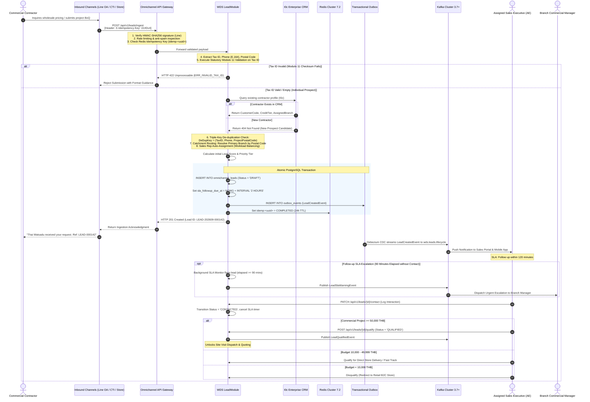
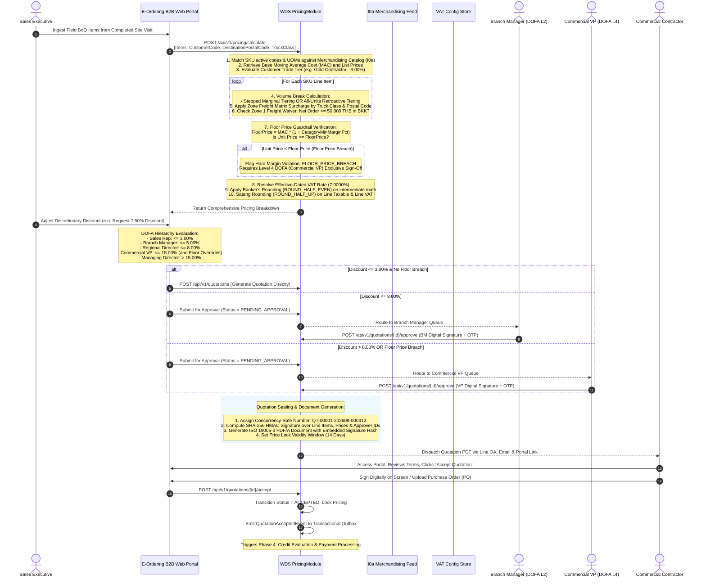
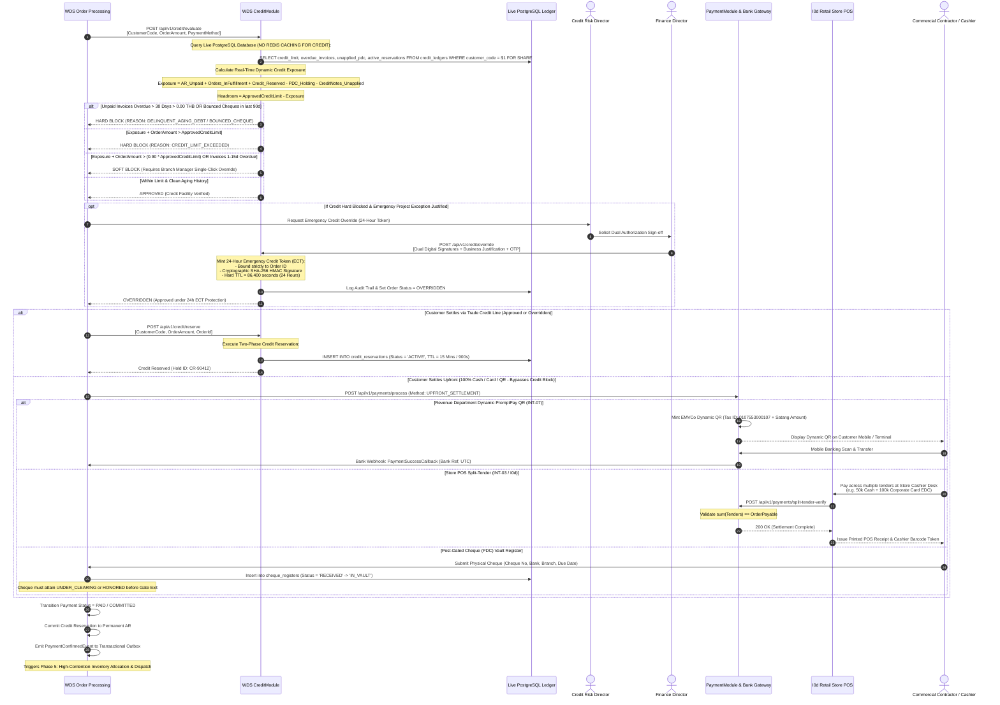

# Thai Watsadu Wholesale & Direct Sales (WDS) System — Release 1
## Deliverable 02: End-to-End System Architecture & Flexible Integration Blueprint

---

### Executive Document Control & Metadata
- **Document Identifier**: `TW-WDS-R1-DOC-02-SYSTEM-ARCHITECTURE-BLUEPRINT`
- **Document Version**: `1.0.0 (Enterprise Architecture Baseline / Authoritative Release)`
- **Role Authority**: Solution Architect (SA Role - Milestone M2)
- **Mandate Reference**: `ORIGINAL_REQUEST.md` (Follow-up Request dated 2026-09-11T06:17:28Z)
- **Foundational Inputs**: 
  - `docs/01_sow_business_process_and_delivery_framework.md` (Approved SOW, 5 State Machines, RACI, WBS, Roadmap)
  - `teamwork_preview_explorer_survey_3/analysis.md` (R2/R3 Technical Survey)
  - `teamwork_preview_spec_miner_survey_1/analysis.md` (Baseline Domain Rules & Interfaces I0a–I0e)
  - `teamwork_preview_orchestrator_2/PROJECT.md` (Feature Inventory & Contract Specifications)
- **Core Architecture Paradigm**: Hybrid Modular Monolith (NestJS 10 / Fastify) + Event-Driven Transactional Outbox (Apache Kafka 3.7+ / Debezium CDC) + Offline-First Mobile Extension (React Native / WatermelonDB / SQLite)
- **Data Persistence**: PostgreSQL 16+ with ICU Thai Collation (`th-TH-x-icu`), Redis Cluster 7.2 (Distributed Locks & Caching)
- **Target Deployment**: Multi-AZ Kubernetes (EKS / Bare-Metal K8s), Central Distribution Center (Wang Noi CDC) & 80+ Mega-Stores
- **Statutory Authority**: Revenue Department of Thailand (RD Sec 86/4, 86/5, 86/10), ETDA e-Tax Invoice, PDPA B.E. 2562
- **Corporate Entity**: CRC Thai Watsadu Company Limited (Central Retail Corporation)
- **Classification**: Strictly Confidential — Enterprise Architecture Review Board (ARB) & Engineering Core

---

# Table of Contents
1. [Executive Summary & Core Architectural Tenets](#1-executive-summary--core-architectural-tenets)
   - 1.1 [System Vision & Omnichannel Evolution](#11-system-vision--omnichannel-evolution)
   - 1.2 [Core Architectural Invariants](#12-core-architectural-invariants)
     - 1.2.1 [Zero-Float Financial & Physical Precision Standard](#121-zero-float-financial--physical-precision-standard)
     - 1.2.2 [Idempotency Everywhere Contract (`X-Idempotency-Key`)](#122-idempotency-everywhere-contract-x-idempotency-key)
     - 1.2.3 [Event-Driven Transactional Outbox Pattern](#123-event-driven-transactional-outbox-pattern)
     - 1.2.4 [Offline-First Mobile Synchronization Strategy](#124-offline-first-mobile-synchronization-strategy)
     - 1.2.5 [Tamper-Evident Cryptographic Audit Ledger (HMAC SHA-256 Chaining)](#125-tamper-evident-cryptographic-audit-ledger-hmac-sha-256-chaining)
     - 1.2.6 [Temporal & Thai Locale Normalization](#126-temporal--thai-locale-normalization)
2. [Component & Integration Architecture (C4 Model)](#2-component--integration-architecture-c4-model)
   - 2.1 [C4 Level 1: System Context Diagram](#21-c4-level-1-system-context-diagram)
   - 2.2 [C4 Level 2: Container Topology Diagram](#22-c4-level-2-container-topology-diagram)
   - 2.3 [C4 Level 3: WDS Core Component Architecture](#23-c4-level-3-wds-core-component-architecture)
   - 2.4 [Enterprise Integration Topology (INT-01 to INT-08 & Interfaces I0a to I0e)](#24-enterprise-integration-topology-int-01-to-int-08--interfaces-i0a-to-i0e)
     - 2.4.1 [Omnichannel Touchpoint Adapters (INT-01, INT-02, INT-03)](#241-omnichannel-touchpoint-adapters-int-01-int-02-int-03)
     - 2.4.2 [Field Mobility & Pricing Connectors (INT-04, INT-05)](#242-field-mobility--pricing-connectors-int-04-int-05)
     - 2.4.3 [Enterprise Financial & Settlement Interfaces (INT-06, INT-07, INT-08)](#243-enterprise-financial--settlement-interfaces-int-06-int-07-int-08)
     - 2.4.4 [Core Enterprise Systems Interconnect (I0a, I0b, I0c, I0d, I0e)](#244-core-enterprise-systems-interconnect-i0a-i0b-i0c-i0d-i0e)
3. [Core Workflow & Sequence Diagrams](#3-core-workflow--sequence-diagrams)
   - 3.1 [Workflow 1: Omnichannel Inbound Lead Ingestion & Qualification Flow](#31-workflow-1-omnichannel-inbound-lead-ingestion--qualification-flow)
   - 3.2 [Workflow 2: Site Visit Lifecycle, Dispatch & Mobile Geofencing Flow](#32-workflow-2-site-visit-lifecycle-dispatch--mobile-geofencing-flow)
   - 3.3 [Workflow 3: E-ordering Quotation Engine Flow (Branch A: Custom Quoting)](#33-workflow-3-e-ordering-quotation-engine-flow-branch-a-custom-quoting)
   - 3.4 [Workflow 4: Credit Control, Risk Evaluation & Payment Flow (Branch B: Direct Check-out)](#34-workflow-4-credit-control-risk-evaluation--payment-flow-branch-b-direct-check-out)
   - 3.5 [Workflow 5: Delivery Dispatch, ATP Allocation & Mobile e-PoD Flow](#35-workflow-5-delivery-dispatch-atp-allocation--mobile-e-pod-flow)
4. [Resilience, Mobility & Non-Functional Requirements (NFRs)](#4-resilience-mobility--non-functional-requirements-nfrs)
   - 4.1 [Offline-First Mobile Synchronization Protocol](#41-offline-first-mobile-synchronization-protocol)
     - 4.1.1 [Mobile Storage Architecture & Local Schemas](#411-mobile-storage-architecture--local-schemas)
     - 4.1.2 [Bi-Directional Delta Sync Protocol (Pull / Push)](#412-bi-directional-delta-sync-protocol-pull--push)
     - 4.1.3 [Conflict Resolution Strategy Matrix](#413-conflict-resolution-strategy-matrix)
   - 4.2 [Distributed Idempotency & Fault-Tolerant Retry Strategy](#42-distributed-idempotency--fault-tolerant-retry-strategy)
     - 4.2.1 [Redis Distributed Idempotency State Machine](#421-redis-distributed-idempotency-state-machine)
     - 4.2.2 [Exponential Backoff with Full Jitter Formula](#422-exponential-backoff-with-full-jitter-formula)
     - 4.2.3 [Dead-Letter Queue (DLQ) & Poison Message Quarantine](#423-dead-letter-queue-dlq--poison-message-quarantine)
   - 4.3 [Event-Driven Architecture & Transactional Outbox Pattern](#43-event-driven-architecture--transactional-outbox-pattern)
     - 4.3.1 [PostgreSQL Outbox Table & Debezium CDC Engine](#431-postgresql-outbox-table--debezium-cdc-engine)
     - 4.3.2 [Kafka Topic Topologies, Partitioning & Compaction](#432-kafka-topic-topologies-partitioning--compaction)
     - 4.3.3 [Consumer Group Idempotency & Deduplication](#433-consumer-group-idempotency--deduplication)
   - 4.4 [Security Architecture, RBAC & Regulatory Data Governance](#44-security-architecture-rbac--regulatory-data-governance)
     - 4.4.1 [Role-Based Access Control (RBAC) Matrix across 5 Roles](#441-role-based-access-control-rbac-matrix-across-5-roles)
     - 4.4.2 [PDPA Compliance, Thai Tax ID Masking & Synthetic Data Generation](#442-pdpa-compliance-thai-tax-id-masking--synthetic-data-generation)
     - 4.4.3 [Cryptographically Chained Audit Trail Engine](#443-cryptographically-chained-audit-trail-engine)
5. [Architectural Traceability Matrix & Cross-Reference Mapping](#5-architectural-traceability-matrix--cross-reference-mapping)

---

# 1. Executive Summary & Core Architectural Tenets

### 1.1 System Vision & Omnichannel Evolution
Thai Watsadu (CRC Thai Watsadu Company Limited) operates Thailand's largest home improvement and building materials commercial network, consisting of over 80 mega-stores nationwide, specialized distribution centers including the Wang Noi Central Distribution Center (CDC), and direct-from-manufacturer drop-shipping infrastructure (e.g., SCG cement mills, Siam Yamato Steel).

While standard retail point-of-sale (POS) systems handle consumer carry-out retail, commercial wholesale procurement demands an integrated, end-to-end digital transaction spine. Commercial contractors, project developers, and government infrastructure contractors do not operate solely inside retail store aisles. Their demand originates across multiple inbound touchpoints (instant messaging via Line Official Account, customer service telephony via Call Center CTI, and physical mega-store commercial sales desks). Furthermore, commercial building materials—such as bagged cement, ready-mix concrete, structural rebar, precast wall panels, and roofing trusses—mandate physical jobsite surveying, road clearance validation for heavy multi-axle freight vehicles, dynamic structural Bill of Quantities (BoQ) calculation, strict multi-million Baht credit governance, high-contention store yard stock reservation, and electronic Proof of Delivery (e-PoD) tied to statutory tax invoices.

The **Wholesale & Direct Sales (WDS) System** is engineered as a **Hybrid Modular Monolith** coupled with an **Event-Driven Outbox Backbone** and an **Offline-First Mobile Extension**. This architecture bridges multi-channel lead capture, mobile engineering mobility in remote low-connectivity construction yards, enterprise quotation simulation, strict credit control, distributed inventory reservation, and statutory revenue reporting.

```
+===================================================================================================================+
|                                  THAI WATSADU WDS OMNICHANNEL COMMERCIAL CONTINUUM                                 |
+===================================================================================================================+
  [ 1. DEMAND INTAKE ]       [ 2. FIELD MOBILITY ]        [ 3. DUAL EXECUTION ]    [ 4. RISK & SETTLE ]   [ 5. FULFILLMENT ]
  Line OA Webhook (INT-01)   Surveyor Dispatch (INT-04)   Branch A: E-ordering     Credit Exposure (E03)  Two-Phase ATP (E04)
  CTI Screen-Pop (INT-02)    GPS Geofence (<=500m/200m)   - Volume Breaks (E02)    - AR + Orders - PDC    Redlock (15-min TTL)
  Store Desk POS (INT-03)    Laser Meter Bluetooth        - Zone Freight (4 Truck) Hard/Soft Block Matrix FEFO Cement Lots (V2)
  Modulo 11 Tax ID Check     Structural BoQ Logging       - Floor Price Guard      Emergency Token (24h)  Physical Pick Lock
  Store Catchment Routing    Offline WatermelonDB         - 4-Tier DOFA Approval   Multi-Tender POS / QR  Weighbridge Tare/Gross
  2-Hour SLA Countdown       Customer Sign-on-Glass       Branch B: Field Checkout Statutory Tax Invoicing Mobile e-PoD (OTP/Photo)
                             Closed-Loop Callback         (0% Discretionary Disc)  (RD Sec 86/4 Gapless)  SAP S/4HANA GL Outbox
+===================================================================================================================+
```

---

### 1.2 Core Architectural Invariants

To safeguard financial integrity, operational consistency across 80+ branches, and strict regulatory compliance with Thai statutory bodies, the WDS platform enforces six inviolable architectural invariants:

```
+-------------------------------------------------------------------------------------------------------------------+
|                                      THE 6 CORE ARCHITECTURAL INVARIANTS                                          |
+-------------------------------------------------------------------------------------------------------------------+
| 1. ZERO FLOAT STANDARD       : Strict arbitrary-precision decimals across all DB, runtime, and API layers.        |
| 2. IDEMPOTENCY EVERYWHERE    : Mandatory X-Idempotency-Key on all mutating operations with 24h Redis caching.     |
| 3. TRANSACTIONAL OUTBOX      : Zero dual-write; local PostgreSQL outbox table streamed via Debezium CDC to Kafka.|
| 4. OFFLINE-FIRST MOBILE      : Local SQLite/WatermelonDB persistence with optimistic delta sync and conflict rules|
| 5. CRYPTOGRAPHIC AUDIT       : SHA-256 HMAC chained audit log; tamper-evident state transitions across all entities|
| 6. TEMPORAL & LOCALE RIGOR   : UTC storage, Asia/Bangkok presentation, Buddhist Era (พ.ศ.), and th-TH-x-icu.      |
+-------------------------------------------------------------------------------------------------------------------+
```

#### 1.2.1 Zero-Float Financial & Physical Precision Standard
Under no circumstances may native IEEE 754 floating-point primitives (`float`, `double`, or primitive `number` in calculation contexts) be utilized for financial values, tax computations, discount percentages, or inventory measurements. Floating-point binary representation errors ($0.1 + 0.2 \neq 0.3$) introduce cumulative satang drift, resulting in statutory Revenue Department audit failures and subledger reconciliation discrepancies.
- **Database Column Types (PostgreSQL 16+)**:
  - Currency, Line Amounts, Output VAT, Subtotals: `NUMERIC(18, 4)`
  - Statutory Document Grand Total & Net Payable: `NUMERIC(18, 2)`
  - Stock Quantities, Pallet Weights, Volumetric Freight: `NUMERIC(14, 4)`
  - Discount Percentages, Surcharges, Effective VAT Rates: `NUMERIC(8, 4)`
  - GPS Telemetry Coordinates (Sub-meter accuracy): `NUMERIC(10, 7)`
- **Application Runtime Math**: Executed exclusively via arbitrary-precision decimal libraries (`decimal.js` in TypeScript / Node.js) configured with 20 digits of precision and Banker's Rounding (`ROUND_HALF_EVEN`) for intermediate calculations, with final line tax rounded via `ROUND_HALF_UP` to 2 decimal places per Revenue Department standards.
- **Serialization Standard**: All numeric quantities in REST API JSON payloads and Kafka events must be serialized as **explicitly quoted numeric strings** (e.g. `"net_price": "145.5000"`, `"total_taxable": "154200.00"`). Unquoted JSON numbers are rejected by API gateway schema validation.

#### 1.2.2 Idempotency Everywhere Contract (`X-Idempotency-Key`)
Distributed network instability, cellular packet drops on mobile surveyor tablets, and automated webhook retries create high risks of duplicate lead registration, duplicate quotation generation, phantom credit deductions, and double stock bookings.
- **Mandatory Header**: All state-mutating HTTP endpoints (`POST`, `PUT`, `PATCH`) across internal APIs and external gateways strictly require:
  ```http
  X-Idempotency-Key: <UUIDv4>
  ```
- **Atomicity & State Transitions in Redis**: Distributed Redis 7.2 clusters track keys under `idemp:<uuid>` across three states: `PENDING`, `COMPLETED`, and `FAILED` with a mandatory 24-hour (86,400 seconds) Time-To-Live (TTL).
- **Semantics**: Concurrent requests with an identical key receive `HTTP 409 Conflict` (`CONFLICT_IN_PROGRESS`). Subsequent retries of an already completed key return the byte-for-byte identical cached response without re-executing business logic.

#### 1.2.3 Event-Driven Transactional Outbox Pattern
To guarantee consistency between the relational database state (PostgreSQL 16+) and distributed event consumers without dual-write race conditions or distributed two-phase commits (XA transactions):
- Business state mutations and outbound event records are committed within the **same atomic local database transaction**:
  ```sql
  INSERT INTO trade_sales_orders (...) VALUES (...);
  INSERT INTO outbox_events (event_id, aggregate_type, aggregate_id, event_type, payload, trace_id)
  VALUES (gen_random_uuid(), 'ORDER', $1, 'OrderPaymentConfirmedEvent', $payload, $trace_id);
  ```
- Debezium CDC (Change Data Capture) or a dedicated high-throughput outbox publisher worker polls the PostgreSQL Write-Ahead Log (WAL), publishing events to Apache Kafka 3.7+ with guaranteed **at-least-once delivery**.

#### 1.2.4 Offline-First Mobile Synchronization Strategy
Field surveyors operating in rural construction zones, basement parking garages, or structural steel shells frequently encounter zero cellular reception.
- The Mobile Visit App functions as an autonomous offline unit powered by **WatermelonDB backed by SQLite with Write-Ahead Logging (WAL)**.
- Inspections, laser distance measurements, BoQ itemization, and compressed photo evidence are persisted to local SQLite tables and queued in a local `mutation_queue`.
- Upon network restoration, an intelligent background sync engine executes a **two-phase pull/push delta synchronization** against the WDS Mobile Sync Gateway with deterministic conflict resolution rules.

#### 1.2.5 Tamper-Evident Cryptographic Audit Ledger (HMAC SHA-256 Chaining)
Every lifecycle state transition across leads, site visits, quotations, credit evaluations, payments, and delivery dispatches is written to an append-only ledger `audit_event_logs`.
- Each record computes a cryptographic HMAC SHA-256 hash chaining back to the previous log entry:
  $$\text{RecordHash}_k = \text{HMAC-SHA256}\left( K_{\text{audit}}, \; \text{Hash}_{k-1} \parallel \text{EventID}_k \parallel \text{AggregateID}_k \parallel \text{OldState} \parallel \text{NewState} \parallel \text{Timestamp}_{\text{UTC}} \right)$$
- Any direct SQL alteration or row deletion instantly breaks the cryptographic chain, triggering high-severity SIEM alerts to Corporate Internal Audit.

#### 1.2.6 Temporal & Thai Locale Normalization
- **Universal UTC Persistence**: All database timestamp columns use `TIMESTAMPTZ` and store date-times in **UTC (`+00:00`)**. All API JSON interchanges use extended ISO 8601 with trailing `Z` (e.g., `2026-09-11T06:40:00.000Z`).
- **Asia/Bangkok Presentation**: Client applications, printed Delivery Orders, and mobile interfaces render time strictly in `Asia/Bangkok` (UTC+07:00).
- **Statutory Buddhist Era (พ.ศ.)**: Customer-facing documents, quotations, and official Revenue Department tax invoices format calendar years as Buddhist Era:
  $$\text{Year}_{\text{BE}} = \text{Year}_{\text{CE}} + 543 \quad (\text{e.g., } 2026 \implies 2569)$$
- **Thai ICU Alphabetical Collation (`th-TH-x-icu`)**: All database columns storing Thai company names, customer names, addresses, and material descriptions declare `COLLATE "th-TH-x-icu"`. This enforces the Royal Institute of Thailand dictionary collation standard, preventing Thai leading vowels (เ, แ, โ, ใ, ไ) from improperly sorting before consonants.

---

# 2. Component & Integration Architecture (C4 Model)

### 2.1 C4 Level 1: System Context Diagram

The System Context diagram illustrates the external customer touchpoints, internal user personas, and integrated enterprise systems interfacing with the WDS platform:

```mermaid
C4Context
    title System Context Diagram (C4 Level 1) - Thai Watsadu WDS Omnichannel Platform

    Person(customer, "Commercial Contractor / Buyer", "Corporate builders, developers, and government contractors.")
    Person(sales_rep, "Direct Sales Executive / KAM", "Commercial sales reps managing accounts, BoQs, and quotations.")
    Person(surveyor, "Field Surveyor / Site Engineer", "Mobile surveyors conducting site visits, measuring, and checking out.")
    Person(branch_mgr, "Branch Commercial Manager", "Approves site visits, DOFA discounts, and credit soft blocks.")
    Person(credit_officer, "Credit Risk & Treasury Officer", "Evaluates credit headroom, manages PDC vault, and reviews overrides.")
    Person(warehouse_driver, "Warehouse Staff & Fleet Driver", "Picks FEFO stock, operates weighbridge, and executes e-PoD.")
    Person(finance_officer, "Tax Accountant & Controller", "Audits gapless tax invoices, outputs VAT, and files ภ.พ.30.")

    Enterprise_Boundary(tw_enterprise, "Thai Watsadu Enterprise System Boundary") {
        System(wds, "Wholesale & Direct Sales (WDS) Platform", "Core enterprise engine orchestrating Omnichannel Leads, Mobile Visits, Dynamic Pricing, Credit Controls, ATP Inventory, Billing, and e-PoD Dispatch.")
        
        System_Ext(merch_erp, "I0a: Merchandising ERP", "Corporate master catalog containing 100,000 active SKUs, unit of measures, and base cost feeds.")
        System_Ext(retail_stock, "I0b: Retail Store Stock System", "Real-time stock ledger across 80+ retail superstores and CDC warehouse.")
        System_Ext(crm, "I0c: Enterprise Corporate CRM", "Master contractor identities, 13-digit Thai Tax IDs, branches, and corporate credit limits.")
        System_Ext(pos, "I0d: Retail Store POS (Fujitsu)", "Front-of-store cashier POS registers handling walk-in split-tender payments.")
        System_Ext(gl_erp, "I0e: SAP S/4HANA Finance ERP", "Corporate General Ledger (GL), Accounts Receivable (AR), and statutory tax ledgers.")
        System_Ext(tms_fleet, "TMS Logistics & Fleet Telematics", "3rd-party logistics fleet routing, GPS truck tracking, and vehicle dispatching.")
    }

    System_Ext(line_oa, "Line Official Account (Line OA)", "Instant messaging channel for commercial customer lead intake and quote delivery.")
    System_Ext(cti_telephony, "Call Center Telephony CTI", "Avaya / Genesys CTI telephony system capturing contractor phone calls.")
    System_Ext(bank_gw, "Commercial Bank Payment Switch", "Dynamic PromptPay QR, EDC credit card settlement, and bank statement webhooks.")
    System_Ext(rd_gateway, "Revenue Department e-Tax Gateway", "ETDA PKI validation and electronic tax invoice XML/PDF filing.")

    Rel(customer, line_oa, "Inquires wholesale prices, submits BoQs, accepts quotes", "HTTPS")
    Rel(customer, cti_telephony, "Calls commercial sales hotline", "PSTN / SIP")
    Rel(customer, wds, "Accesses B2B E-ordering portal", "HTTPS / TLS 1.3")

    Rel(line_oa, wds, "Webhook lead intake & message delivery (INT-01)", "HTTPS / HMAC-SHA256")
    Rel(cti_telephony, wds, "Screen-pop caller context & lead push (INT-02)", "REST / JSON")
    Rel(sales_rep, wds, "Manages leads, builds quotes, monitors SLA", "HTTPS / OIDC PKCE")
    Rel(surveyor, wds, "Synchronizes visit tasks, submits field BoQs & e-Sign (INT-04)", "HTTPS REST / SQLite Sync")
    Rel(branch_mgr, wds, "Authorizes travel, DOFA discounts, credit exceptions", "HTTPS / MFA")
    Rel(credit_officer, wds, "Monitors credit ledger, audits PDC cheques", "HTTPS / OIDC")
    Rel(warehouse_driver, wds, "Generates pick slips, weighbridge scale, e-PoD (INT-08)", "HTTPS / Barcode")
    Rel(finance_officer, wds, "Monitors gapless tax invoices & SAP GL sync", "HTTPS / OIDC")

    Rel(wds, merch_erp, "SFTP daily bulk catalog & Kafka delta stream (I0a)", "SFTP / Kafka Avro")
    Rel(wds, retail_stock, "Sub-second branch ATP & 2-phase reservations (I0b)", "gRPC / mTLS")
    Rel(wds, crm, "Bi-directional customer master & tax ID sync (I0c)", "REST / mTLS")
    Rel(wds, pos, "In-store split settlement & cashier release (INT-03 / I0d)", "REST / LAN mTLS")
    Rel(wds, gl_erp, "Asynchronous double-entry journal outbox (INT-06 / I0e)", "Kafka / Outbox CDC")
    Rel(wds, bank_gw, "Dynamic PromptPay QR & EDC charge hooks (INT-07)", "HTTPS / mTLS")
    Rel(wds, tms_fleet, "Dispatch queue, weighbridge, and e-PoD sync (INT-08)", "REST / Webhooks")
    Rel(wds, rd_gateway, "Signs & transmits Section 86/4 e-Tax PDF/A-3", "ETDA AS4 / WebService")
```



---

### 2.2 C4 Level 2: Container Topology Diagram

The WDS platform deploys as a containerized ecosystem orchestrated within Kubernetes clusters across Central Retail Corporation's enterprise data centers and AWS (Asia-Pacific Bangkok region):

```
+==================================================================================================================================+
|                                              THAI WATSADU WDS CONTAINER TOPOLOGY (C4 LEVEL 2)                                    |
+==================================================================================================================================+
                                    [ Inbound External Ingress & Clients ]
       Line OA Webhook            Call Center CTI Screen-Pop        Store Associate Sales Desk        Mobile Field Surveyor Tablet
     (Line Messaging API)             (Telephony Adapter)             (Next.js 14 Web Portal)          (React Native / WatermelonDB)
             |                                 |                                 |                                 |
             v                                 v                                 v                                 v
+----------------------------------------------------------------------------------------------------------------------------------+
|                                        AWS ALB / NGINX ENTERPRISE API GATEWAY & REVERSE PROXY                                    |
|   - TLS 1.3 Termination (mTLS on Enterprise Backends)            - WAF Layer (OWASP Top 10 Injection & Rate Limiting)             |
|   - OAuth 2.0 / OIDC JWT Verification (Azure AD / Okta)          - X-Idempotency-Key Header Routing & De-duplication Cache         |
+----------------------------------------------------------------------------------------------------------------------------------+
                                                                |
                                                                | High-Speed HTTP/2 & gRPC
                                                                v
+==================================================================================================================================+
|                                           WDS CORE MODULAR MONOLITH (CONTAINER CLUSTER)                                          |
|                                       (NestJS 10 on Fastify Engine, Strict TypeScript 5.x)                                       |
|                                                                                                                                  |
|  +------------------------+  +------------------------+  +------------------------+  +------------------------+                  |
|  | LeadModule             |  | SiteVisitModule        |  | PricingModule          |  | CreditModule           |                  |
|  | - De-dup & Modulo 11   |  | - Calendar Scheduler   |  | - Volume Breaks        |  | - Dynamic Exposure     |                  |
|  | - Catchment Auto-Route |  | - GPS Geofence Check   |  | - 4-Truck Zone Freight |  | - Soft/Hard Blocking   |                  |
|  | - 2-Hour SLA Countdown |  | - Closed-Loop Callback |  | - Floor Margin Guard   |  | - 24h Emergency Token  |                  |
|  +-----------+------------+  +-----------+------------+  +-----------+------------+  +-----------+------------+                  |
|              |                           |                           |                           |                               |
|  +-----------v------------+  +-----------v------------+  +-----------v------------+  +-----------v------------+                  |
|  | PaymentModule          |  | InventoryModule        |  | DeliveryModule         |  | TaxModule              |                  |
|  | - Multi-Tender Split   |  | - Two-Phase ATP Lock   |  | - Vehicle Queueing     |  | - Gapless Sec 86/4 INV |                  |
|  | - Dynamic PromptPay QR |  | - FEFO Pallet Alloc V2 |  | - Weighbridge Scale    |  | - Satang Banker's Round|                  |
|  | - 6-Stage PDC Register |  | - 15-min Soft Lease TTL|  | - Mobile e-PoD (OTP)   |  | - Immutable Triggers   |                  |
|  +-----------+------------+  +-----------+------------+  +-----------+------------+  +-----------+------------+                  |
|              |                           |                           |                           |                               |
|              +---------------------------+---------------------------+---------------------------+                               |
|                                                              |                                                                   |
|                                            +-----------------v-----------------+                                                 |
|                                            | PlatformModule & Core Governance  |                                                 |
|                                            | - RBAC Guards (CASL Matrix)       |                                                 |
|                                            | - SHA-256 HMAC Audit Log Engine   |                                                 |
|                                            | - Transactional Outbox Publisher  |                                                 |
|                                            +-----------------------------------+                                                 |
+==================================================================================================================================+
          |                                            |                                             |
          | Read / Write Pool                          | Distributed Lock & Cache                    | WAL Streaming
          v                                            v                                             v
+-------------------------------+             +-------------------------------+             +-------------------------------+
| PRIMARY POSTGRESQL 16+ DB     |             | REDIS CLUSTER 7.2             |             | DEBEZIUM CDC / KAFKA CONNECT  |
| - ICU Thai Collation (th-TH)  |             | - Redlock Distributed Mutex   |             | - Real-time Outbox Table Read |
| - Arbitrary Precision Numerics|             | - 15-min Soft Lease TTL Keys  |             | - Guaranteed At-Least-Once    |
| - Immutable DB Triggers       |             | - Idempotency Cache (24h TTL) |             +---------------+---------------+
| - Chained Audit Event Tables  |             | - Catalog Cache (1h TTL)      |                             |
+-------------------------------+             +-------------------------------+                             v
                                                                                            +-------------------------------+
                                                                                            | APACHE KAFKA 3.7+ CLUSTER     |
                                                                                            | - wds.leads.lifecycle         |
                                                                                            | - wds.sitevisits.events       |
                                                                                            | - wds.quotations.events       |
                                                                                            | - wds.credit.evaluations      |
                                                                                            | - wds.payments.transactions   |
                                                                                            | - wds.deliveries.dispatch     |
                                                                                            | - wds.outbox.sap-gl-sync      |
                                                                                            +-------------------------------+
```

---

### 2.3 C4 Level 3: WDS Core Component Architecture

The internal modular architecture of the WDS Core Monolith enforces strict module boundaries, loose coupling via Domain Events, and clear separation of concerns:

```
+==================================================================================================================================+
|                                    WDS CORE MODULAR MONOLITH (C4 LEVEL 3 COMPONENT STRUCTURE)                                     |
+==================================================================================================================================+

   +----------------------------------------------------------------------------------------------------------------------------+
   | 1. LeadModule                                                                                                              |
   |    - InboundLeadController       : Exposes REST & Webhook endpoints (/api/v1/leads, /line-webhook, /cti).                   |
   |    - DeduplicationService        : Executes triple-key matching (TaxID, E.164 Phone, PostalCode) against CRM profiles.    |
   |    - Modulo11Validator           : Validates 13-digit Thai Tax IDs and Citizen IDs against statutory checksum math.        |
   |    - CatchmentRoutingService     : Resolves customer project postal code to primary store branch and assigned Sales Rep.   |
   |    - LeadSlaTrackingService      : Initiates 2-hour SLA timer, triggers escalation alerts if uncontacted in 90 minutes.    |
   +----------------------------------------------------------------------------------------------------------------------------+
                                                               | (LeadQualifiedEvent)
                                                               v
   +----------------------------------------------------------------------------------------------------------------------------+
   | 2. SiteVisitModule                                                                                                         |
   |    - SiteVisitController         : Handles booking, dispatch, check-in, field log submission, and check-out callback.      |
   |    - CalendarSchedulingService   : Coordinates surveyor pool calendars, locks appointment time slots.                     |
   |    - GeofenceValidationService   : Executes Haversine distance math (<=500m/200m), detects mock GPS location spoofing.     |
   |    - FieldInspectionService      : Validates road access (4W/6W/10W/22W), laser measurements, and mandatory 3 photos.      |
   |    - MobileSyncController        : Serves WatermelonDB delta pull and push endpoints with optimistic locking.              |
   +----------------------------------------------------------------------------------------------------------------------------+
                                                               |
                               +-------------------------------+-------------------------------+
                               | (Branch A: Custom BoQ)                                        | (Branch B: Field Check-out)
                               v                                                               v
   +-----------------------------------------------------------+   +------------------------------------------------------------+
   | 3. PricingModule (Branch A Engine)                        |   | 4. CreditModule (Risk & Headroom Engine)                   |
   |    - PricingCalculationController: Quotation simulator.   |   |    - CreditEvaluationController: /api/v1/credit/evaluate.  |
   |    - VolumeDiscountCalculator    : Stepped & All-Units.   |   |    - ExposureLedgerCalculator  : Real-time DB AR calculus. |
   |    - ZoneFreightMatrixService    : 4 truck freight rates. |   |    - CreditBlockingService     : Soft & Hard block rules.  |
   |    - FloorPriceGuardrailService  : MAC + minimum margin.  |   |    - EmergencyTokenService     : Mints 24h HMAC tokens.    |
   |    - DofaApprovalWorkflowEngine  : 4-tier approval state. |   |    - PostDatedChequeService    : 6-stage PDC vault register|
   |    - QuotationDocumentSigner     : HMAC SHA-256 PDF seal. |   +------------------------------------------------------------+
   +-----------------------------------------------------------+                               |
                               | (QuotationAcceptedEvent)                                      |
                               +-------------------------------+-------------------------------+
                                                               |
                                                               v
   +----------------------------------------------------------------------------------------------------------------------------+
   | 5. PaymentModule                                                                                                           |
   |    - PaymentProcessingController : Handles multi-tender settlement (/api/v1/payments/process).                             |
   |    - SplitTenderReconciliationSvc: Enforces sum(Tender_k) == InvoicePayable across Cash, Credit, Card, and PromptPay.     |
   |    - DynamicPromptPayQrGenerator : Mints EMVCo dynamic QR strings with embedded Tax ID and exact Satang payable.          |
   |    - PaymentWebhookConsumer      : Consumes bank clearing webhooks, verifies RSA/HMAC signature, updates order state.      |
   +----------------------------------------------------------------------------------------------------------------------------+
                                                               | (PaymentConfirmedEvent)
                                                               v
   +----------------------------------------------------------------------------------------------------------------------------+
   | 6. InventoryModule                                                                                                         |
   |    - InventoryReservationController: Two-phase reservation endpoints (/api/v1/inventory/reserve, /commit).                 |
   |    - RedlockDistributedMutexService: Manages Redis distributed locks per branch/SKU across cluster nodes.                  |
   |    - FefoPalletAllocationEngineV2  : Executes 3-phase allocation (Broken pallets -> Full pallets -> Remainder).            |
   |    - ReservationReaperCronTask     : Runs every 60s, releases expired soft reservations while honoring physical pick locks.|
   +----------------------------------------------------------------------------------------------------------------------------+
                                                               |
                                                               v
   +----------------------------------------------------------------------------------------------------------------------------+
   | 7. DeliveryModule                                                                                                          |
   |    - DeliveryDispatchController  : Vehicle queueing, staging bay assignment, departure, and e-PoD submission.             |
   |    - WeighbridgeIntegrationSvc   : Records truck tare and gross weight scale readings, prevents gross vehicle overload.    |
   |    - GatePassBarcodeGenerator    : Generates cryptographically signed 1D/2D Gate Pass barcodes for security barrier exit.   |
   |    - MobileEpodVerificationSvc   : Validates customer 6-digit OTP, sign-on-glass signature, and 3 delivery site photos.     |
   +----------------------------------------------------------------------------------------------------------------------------+
                                                               |
                               +-------------------------------+-------------------------------+
                               |                                                               |
                               v                                                               v
   +-----------------------------------------------------------+   +------------------------------------------------------------+
   | 8. TaxModule (Statutory Invoicing)                        |   | 9. PlatformModule (Governance & Security)                  |
   |    - TaxInvoiceController        : Post & query invoices. |   |    - CaslRbacGuard             : Enforces 9-role matrix.   |
   |    - GaplessSequenceNumberService: Atomically locks &     |   |    - ChainedAuditLogService    : SHA-256 HMAC event chain. |
   |      generates INV-XXXXX-YYYY-MM-ZZZZZZ without gaps.     |   |    - TransactionalOutboxWriter : Commits outbox events.    |
   |    - ThaiBahtTextConverter       : Certified transcription|   |    - PiiDataMaskingInterceptor : Masks Tax IDs and phones. |
   |    - EtdaXmlPdfA3Signer          : Embeds UN/CEFACT XML.  |   |    - IdempotencyInterceptor    : Governs Redis keys.       |
   +-----------------------------------------------------------+   +------------------------------------------------------------+
```

---

### 2.4 Enterprise Integration Topology (INT-01 to INT-08 & Interfaces I0a to I0e)

The WDS platform connects external channels, store hardware, mobile tablets, and core corporate backends through an enterprise integration framework:

```
+=======================================================================================================================================+
|                                              ENTERPRISE INTEGRATION TOPOLOGY MATRIX                                                   |
+========+============================+=============+===============+==========================+========================================+
| ID     | Interface / Endpoint Name  | Transport   | Serialization | Latency SLA / Cadence    | Security & Authentication Mechanism    |
+========+============================+=============+===============+==========================+========================================+
| INT-01 | Line OA Messaging Gateway  | HTTPS POST  | JSON          | P95 < 500ms              | HMAC-SHA256 (X-Line-Signature Header)  |
| INT-02 | Call Center Telephony CTI  | REST / WebS | JSON          | P95 < 250ms Screen-Pop   | Mutual TLS (mTLS) + Bearer JWT         |
| INT-03 | Store Sales Desk / POS In  | REST / LAN  | JSON          | P95 < 200ms              | OAuth 2.0 / OIDC PKCE + Store IP Allow |
| INT-04 | Mobile Visit App Bridge    | HTTPS REST  | JSON (Gzip)   | P95 < 800ms              | Device Fingerprint + Session JWT       |
| INT-05 | E-Ordering Pricing Connect | gRPC / REST | Protobuf/JSON | P95 < 150ms              | In-process / Local Cluster mTLS        |
| INT-06 | SAP S/4HANA Finance Sync   | Kafka / REST| JSON / IDoc   | Async (< 60s Outbox)     | Mutual TLS + SAP RFC Service Principal |
| INT-07 | Bank Payment Gateway & EDC | HTTPS Webh. | JSON          | P95 < 1,000ms            | RSA-SHA256 Signature + IP Whitelisting |
| INT-08 | TMS Fleet Logistics & e-PoD| HTTPS Webh. | JSON          | P95 < 500ms              | HMAC-SHA256 + Static API Key           |
+--------+----------------------------+-------------+---------------+--------------------------+----------------------------------------+
| I0a    | Merchandising ERP Catalog  | SFTP/Kafka  | CSV / Avro    | Daily < 4h / Delta < 15s | SSH Ed25519 Key / SASL SCRAM-SHA-512   |
| I0b    | Retail Store Stock (80+)   | gRPC        | Protobuf      | Query < 50ms, Res < 100ms| Mutual TLS (mTLS)                      |
| I0c    | Enterprise Corporate CRM   | REST / Webh.| JSON          | Profile < 100ms          | Mutual TLS + Corporate API Gateway JWT |
| I0d    | Retail Store POS (Fujitsu) | REST / LAN  | Encrypted JSON| Settle < 500ms           | Local mTLS + AES-256 Payload Token     |
| I0e    | SAP GL Double-Entry Ledger | Kafka / REST| ISO 20022 XML | Real-time < 2s / Nightly | mTLS over Dedicated AWS Direct Connect |
+========+============================+=============+===============+==========================+========================================+
```

#### 2.4.1 Omnichannel Touchpoint Adapters (INT-01, INT-02, INT-03)
- **INT-01: Line OA Messaging Gateway**: Ingests contractor quotation requests and BoQ documents uploaded to the Line Official Account. The Line Platform dispatches HTTPS webhooks to `POST /api/v1/leads/line-webhook`. The gateway validates the `X-Line-Signature` HTTP header by computing an HMAC-SHA256 over the raw request body using the channel secret. The gateway extracts contractor profile metadata, initiates lead de-duplication, and issues outbound replies (quotation approval links, PDF documents, driver tracking links) via the Line Messaging API with rate-limiting circuit breakers.
- **INT-02: Call Center Telephony CTI Adapter**: Interfaces with enterprise telephony switches (Avaya / Genesys / Asterisk). Upon an incoming contractor call, the CTI switch pushes caller telemetry (Caller ID, IVR selection) via WebSocket or REST to `POST /api/v1/leads/cti`. The adapter queries customer identity records in $<250\text{ms}$, triggering an automated screen-pop on the customer service desk. If the caller is an existing contractor, historical credit balance and open orders display instantly; if new, an automated draft lead record is initialized.
- **INT-03: Mega-Store Commercial Sales Desk & POS Ingestion (`I0d`)**: Connects in-store commercial sales terminals and Fujitsu retail POS registers across 80+ superstores. Operates over the secure store local area network (LAN) with IP whitelisting and corporate OIDC authentication. Enables sales associates to scan contractor barcodes ("The 1 B2B"), query real-time wholesale pricing, execute split-tender settlements across credit lines and store cashiers, and issue signed cashier release tokens for yard pickup.

#### 2.4.2 Field Mobility & Pricing Connectors (INT-04, INT-05)
- **INT-04: Mobile Visit App Bi-Directional Bridge**: Facilitates offline-first communication between field surveyors and WDS Core. Supports two key endpoints: `GET /api/v1/mobile-sync/pull` for delta updates (new appointments, status modifications) and `POST /api/v1/mobile-sync/push` for batch mutation submissions from the local SQLite queue. Enforces mandatory `X-Idempotency-Key` headers on check-ins, field logs, and check-out callbacks (`POST /api/v1/site-visits/{id}/checkout`).
- **INT-05: E-Ordering Dynamic Pricing Connector**: Connects the contractor B2B ordering portal and internal sales quoting desk with the `PricingModule`. Executes sub-second pricing simulations over gRPC, applying multi-tiered volume breaks, zone freight calculations, and floor price margin verifications.

#### 2.4.3 Enterprise Financial & Settlement Interfaces (INT-06, INT-07, INT-08)
- **INT-06: SAP S/4HANA Finance Sync (`I0e`)**: Integrates WDS with corporate finance. Employs the Transactional Outbox pattern to asynchronously stream double-entry accounting journals (invoiced sales, output VAT 213100, accounts receivable 113100, cost of goods sold, and Section 86/10 credit notes) via Kafka CDC. Ensures continuous reconciliation between subledgers and SAP General Ledger.
- **INT-07: Bank Payment Gateway & EDC Switch**: Direct HTTPS integration with commercial banking switches (Bangkok Bank, Kasikornbank, SCB). Mints Revenue Department compliant dynamic PromptPay QR strings encoded with Thai Watsadu's corporate Tax ID (`0107553000107`), invoice reference, and exact Satang amount. Processes bank clearing webhooks with RSA-SHA256 signature verification and IP whitelisting to confirm funds settlement in $<1,000\text{ms}$.
- **INT-08: TMS Logistics Fleet & Driver e-PoD Bridge**: Connects WDS with 3rd-party fleet management and telematics platforms. Transmits delivery manifests, captures weighbridge gross weight readings, tracks vehicle GPS coordinates en route, and processes driver mobile e-PoD completion callbacks (customer OTP, receiver digital signature, and photos).

#### 2.4.4 Core Enterprise Systems Interconnect (I0a, I0b, I0c, I0d, I0e)
- **Interface I0a: Merchandising ERP Catalog Feed**: Ingests master catalog data (100,000 active SKUs, base retail prices, UOM conversions, packaging weights, and Moving Average Costs). Executes nightly batch synchronization via SFTP at 01:00 UTC using streaming CSV/JSON parsers with PostgreSQL bulk `COPY` operations in chunks of 500 rows. SHA-256 attribute hash change detection bypasses $>90\%$ of unmodified SKUs, completing the full feed in $<3.5\text{ hours}$. Intra-day pricing and SKU updates stream in real time via Kafka topic `merchandising.items.delta` with $P95 < 15\text{ seconds}$.
- **Interface I0b: Retail Store Stock & Real-Time ATP**: Sub-second gRPC service querying inventory across 80+ superstores and Wang Noi CDC. Implements the Two-Phase Stock Reservation protocol (`RESERVE` with 15-minute lease TTL $\to$ `COMMIT`) using Redis Redlock distributed mutexes and PostgreSQL `SELECT ... FOR UPDATE` row locks.
- **Interface I0c: Enterprise Corporate CRM & Identity**: RESTful JSON service synchronizing contractor identities, corporate parent-child hierarchies (Head Office `00000` vs branch `00001`–`99999`), 13-digit Thai Tax IDs, and commercial credit tiers. Enforces statutory Modulo 11 check digit verification on intake.
- **Interface I0d: Retail Store POS & Settlement (Fujitsu Store POS)**: Coordinates in-store payment collection and warehouse gate clearance. Supports multi-tender split settlement (`CashierTender + TradeCredit = InvoicePayable`) and issues encrypted 2D cashier release tokens for gate pass exit.
- **Interface I0e: SAP S/4HANA General Ledger & Financials**: Governs statutory accounting journals, Accounts Receivable subledgers, Output VAT records, and Section 86/10 credit notes. Enforces nightly fiscal day boundary reconciliation at 23:59:59 Asia/Bangkok (16:59:59 UTC) with strict $\pm 0.00\text{ THB}$ tolerance.

---

# 3. Core Workflow & Sequence Diagrams

### 3.1 Workflow 1: Omnichannel Inbound Lead Ingestion & Qualification Flow

This workflow captures customer leads across Line OA, Call Center CTI, and Walk-in Mega-Store Commercial Desks, deduplicating contacts against the Corporate CRM, validating Thai Tax IDs, routing to the designated store branch, and initiating the 2-hour follow-up SLA countdown.



#### Step-by-Step Logic & Architectural Decisions:
1. **Signature & Idempotency Verification**: Gateway intercepts payload, verifies `X-Line-Signature` or mTLS certificate, and performs atomic `SET NX` in Redis on the `X-Idempotency-Key` to block replay attacks.
2. **Statutory Modulo 11 Validation**: Enforces Revenue Department checksum validation on 13-digit Thai Corporate Tax IDs and Citizen IDs before database insertion:
   $$\text{Checksum} = \left( 11 - \left( \sum_{i=1}^{12} d_i \times (14 - i) \bmod 11 \right) \right) \bmod 10$$
3. **Compound Deduplication**: Matches `(TaxID, Phone, ProjectPostalCode)` against open leads in the last 30 days to eliminate fragmented duplicate entries.
4. **Store Catchment Routing**: Destination postal code is resolved against Thai Watsadu's geographical branch mapping table (`store_catchment_zones`), assigning the lead to the nearest store (e.g. Bangna, Rattanathibet).
5. **2-Hour SLA Monitor**: A dedicated background cron task inspects active leads every 60 seconds. If an assigned Sales Rep fails to transition a lead to `CONTACTED` within 90 minutes, an escalation warning pushes to the Branch Commercial Manager.

---

### 3.2 Workflow 2: Site Visit Lifecycle, Dispatch & Mobile Geofencing Flow

This workflow coordinates field engineering mobility: dispatching survey tasks to the surveyor pool, calendar booking, Branch Manager travel authorization, anti-spoofing GPS check-in ("Site On"), field logging of 4 truck access classes, Bluetooth laser distance measurements, photographic evidence, customer sign-on-glass, and closed-loop check-out callback.

```mermaid
sequenceDiagram
    autonumber
    actor AE as Sales Executive
    participant WDS as WDS SiteVisitModule
    actor BM as Branch Commercial Manager
    participant SyncGW as WDS Mobile Sync Gateway
    participant Mobile as Mobile Visit App (Surveyor)
    participant S3 as AWS S3 / MinIO Storage
    actor Foreman as Customer Site Foreman

    AE->>WDS: POST /api/v1/site-visits (Request Survey for Lead)
    Note over WDS: Validate Lead State = QUALIFIED<br/>Verify Physical Coordinates (Lat/Lon)
    WDS->>WDS: Set Status = REQUESTED, push task to Branch Surveyor Pool
    
    Mobile->>WDS: POST /api/v1/site-visits/{id}/book-slot (Select Calendar Slot)
    WDS->>WDS: Verify Surveyor Availability & Lock Slot<br/>Transition Status = SCHEDULED
    
    WDS-->>BM: Notification: Travel Authorization Required
    BM->>WDS: POST /api/v1/site-visits/{id}/approve (Status = APPROVED)
    Note over WDS: Travel Authorized; Package unlocked for Mobile Offline Sync
    
    Mobile->>SyncGW: GET /api/v1/mobile-sync/pull?last_pulled_at=...
    SyncGW-->>Mobile: Return Visit Task Payload & Target Coordinates
    Note over Mobile: Surveyor travels to jobsite (enters offline construction zone)
    
    Note over Mobile: Surveyor initiates Check-in on Mobile App
    Mobile->>Mobile: 1. Read Native GPS (Lat, Lon, Accuracy)<br/>2. Inspect isMockLocationEnabled == false<br/>3. Verify Horizontal Accuracy <= 15m
    
    Mobile->>WDS: POST /api/v1/site-visits/{id}/site-on<br/>[Payload: Lat, Lon, Accuracy, Provider, Timestamp]<br/>[Header: X-Idempotency-Key: UUIDv4]
    
    Note over WDS: Compute Haversine Distance to Registered Site Coordinates:
    Note over WDS: d = 2R * arcsin(sqrt(sin²(Δφ/2) + cos φ1 * cos φ2 * sin²(Δλ/2)))
    
    alt Distance <= 500m (Urban Site <= 200m) & Anti-Spoofing Clean
        WDS->>WDS: Transition Status = SITE_ON, Log Geo-Verified = TRUE
        WDS-->>Mobile: HTTP 200 OK (Site-On Verified)
    else Distance > 500m (Geofence Mismatch)
        alt Branch Manager Live Supervisory Override
            BM->>WDS: POST /api/v1/site-visits/{id}/bm-override (Supervisor OTP + Justification)
            WDS->>WDS: Transition Status = SITE_ON (Flag: BM_OVERRIDE_AUDITED)
            WDS-->>Mobile: HTTP 200 OK (Supervisory Override Accepted)
        else No Override
            WDS-->>Mobile: HTTP 422 Unprocessable (GEO_DISTANCE_EXCEEDED)
            Note over Mobile: Mobile App blocks check-in; inspection form locked
        end
    end
    
    Note over Mobile: Surveyor begins inspection (Status = IN_PROGRESS):<br/>- Classify Road Access: 4W Light / 6W Medium / 10W Heavy / 22W Trailer<br/>- Pair Bluetooth Laser Meter (Leica/Bosch) for Room Dimensions<br/>- Capture >= 3 Timestamped Geo-Tagged Photos (Entrance, Staging, Structure)
    
    Mobile->>S3: Upload encrypted photos via Presigned URLs
    S3-->>Mobile: Return S3 Object Keys (s3://tw-wds-visits/...)
    
    Note over Mobile: Surveyor compiles Field BoQ and reviews with Site Foreman
    Foreman->>Mobile: Customer verifies BoQ and Signs on Touchscreen Glass
    
    Mobile->>WDS: POST /api/v1/site-visits/{id}/checkout<br/>[Payload: BoQ Items, Access Class, Photos, E-Signature]<br/>[Header: X-Idempotency-Key: UUIDv4]
    
    Note over WDS: Validate Mandatory 3 Photos & Customer Signature Canvas
    WDS->>WDS: Transition Status = COMPLETED
    WDS->>WDS: Emit SiteVisitCompletedEvent to Outbox
    WDS-->>Mobile: HTTP 200 OK (Closed-Loop Check-out Acknowledged)
    
    Note over WDS: Triggers Post-Visit Execution:<br/>- Branch A: Ingest BoQ into E-ordering Pricing Engine<br/>- Branch B: Convert to Direct Sales Order (0% Discretionary Discount)
```

#### Step-by-Step Logic & Architectural Decisions:
1. **Two-Stage Authorization**: Site visit requests require Branch Manager approval to confirm that estimated commercial volume justifies travel expense and fleet vehicle mobilization.
2. **Haversine Distance & Anti-Spoofing Algorithm**: The mobile device must provide real hardware GPS coordinates with horizontal accuracy $\le 15\text{ meters}$. Mock location providers (`ACCESS_MOCK_LOCATION`) are detected and rejected. Haversine distance must satisfy:
   $$d = 2R \arcsin \left( \sqrt{\sin^2\left(\frac{\Delta \phi}{2}\right) + \cos(\phi_1)\cos(\phi_2)\sin^2\left(\frac{\Delta \lambda}{2}\right)} \right) \le 500\text{ meters}$$
3. **Supervisory Override Exception**: In remote agricultural or newly excavated greenfield sites where satellite maps deviate, a Branch Commercial Manager can input a supervisory override code with mandatory justification, recorded in the cryptographic audit log.
4. **4 Freight Truck Classifications**: Surveyors evaluate turning radius, road width, and bridge weight limits, categorizing delivery viability into:
   - *4W Light Truck*: $\le 1.5$ tons / $\le 8\text{ m}^3$
   - *6W Medium Truck*: $\le 5.0$ tons / $\le 20\text{ m}^3$
   - *10W Heavy Truck*: $\le 15.0$ tons / $\le 35\text{ m}^3$
   - *22W Semi-Trailer*: $\le 32.0$ tons / $\le 65\text{ m}^3$
5. **Closed-Loop Callback**: Check-out callback requires $\ge 3$ photos and customer touchscreen signature. Enforces `X-Idempotency-Key` to prevent duplicate order initialization when cellular connection reconnects.

---

### 3.3 Workflow 3: E-ordering Quotation Engine Flow (Branch A: Custom Quoting)

This workflow converts field BoQ measurements into standardized Thai Watsadu SKUs, computes tiered volume discounts, calculates zone freight across 4 truck classes, validates cost floor margin guards, routes through the 4-tier DOFA approval hierarchy, and delivers cryptographically sealed PDF quotations.



#### Step-by-Step Logic & Architectural Decisions:
1. **Dynamic Pricing Formula Pipeline**: Pure-function memory calculation pipeline operating with zero database I/O during math execution:
   $$\text{LineNet} = \left( \text{BasePrice}_{\text{Tier}} \times \left( 1 - \frac{\text{VolDiscountPct}}{100} \right) - \text{DiscretionaryDiscountUnit} \right) + \text{FreightSurchargeUnit}$$
   $$\text{LineTaxable} = \text{ROUND\_HALF\_UP}(\text{LineNet} \times \text{Quantity}, 2)$$
   $$\text{LineVAT} = \text{ROUND\_HALF\_UP}(\text{LineTaxable} \times 0.0700, 2)$$
   $$\text{DocumentGrandTotal} = \sum_{j} \text{LineTaxable}_j + \sum_{j} \text{LineVAT}_j$$
2. **Floor Price Margin Guardrail**: Prevents below-cost quoting:
   $$\text{FloorPrice} = \text{MovingAverageCost (MAC)} \times (1 + \text{CategoryMinMarginPct})$$
   Breaches trigger `FLOOR_PRICE_BREACH` and can only be authorized by Level 4 DOFA (Commercial VP).
3. **Zone Freight Matrix**: Freight surcharges calculate based on delivery postal code and the 4 truck classes determined during site visit, with Zone 1 (Bangkok & Vicinity) receiving automated freight waiver for orders $\ge 50,000.00\text{ THB}$ net.
4. **Cryptographic HMAC Document Sealing**: Generates a SHA-256 HMAC over the entire quotation payload using an HSM-managed private key. If line items or totals are modified in transit, the signature check fails, blocking order conversion.

---

### 3.4 Workflow 4: Credit Control, Risk Evaluation & Payment Flow (Branch B: Direct Check-out)

This workflow evaluates dynamic customer credit exposure against the live PostgreSQL database ledger, executes soft/hard blocks, manages 24-hour Emergency Credit Override Tokens, and orchestrates multi-tender payment settlements (Trade Credit, Store POS split-tender, dynamic PromptPay QR, and 6-stage PDC cheques).



#### Step-by-Step Logic & Architectural Decisions:
1. **Live Dynamic Exposure Calculus (Zero-Cache Rule)**: To prevent race conditions where contractors place parallel orders across multiple stores simultaneously, credit exposure is calculated strictly against the live PostgreSQL database using row locks (`FOR SHARE`):
   $$\text{TotalExposure} = \text{AR}_{\text{Unpaid}} + \text{Orders}_{\text{InFulfillment}} + \text{Credit}_{\text{Reserved}} - \text{PDC}_{\text{Holding}} - \text{CreditNotes}_{\text{Unapplied}}$$
2. **Three-Tier Blocking Hierarchy**:
   - *Soft Block*: Exposure $>90\%$ of limit or invoices 1–15 days past due. Resolvable via single-click OTP override from Branch Commercial Manager.
   - *Hard Block*: Exposure $>100\%$, invoices $>30$ days past due, or dishonored cheques in the last 90 days. Completely halts credit checkout.
   - *Upfront Cash Bypass*: Delinquent or credit-blocked contractors can immediately proceed by paying 100% upfront via Cash, PromptPay QR, or Credit Card, entirely bypassing credit blocks.
3. **24-Hour Emergency Credit Token (`ECT`)**: Exceptional overrides require dual digital authorization (Commercial Director + Finance Director). Mints a cryptographic HMAC token bound to the specific `order_id` with an immutable 86,400-second expiration.
4. **Multi-Tender Settlement Guarantee**: For split tenders at store cashiers, the settlement engine validates that $\sum \text{Tender}_k = \text{InvoicePayable}$ before warehouse picking tickets can be released.

---

### 3.5 Workflow 5: Delivery Dispatch, ATP Allocation & Mobile e-PoD Flow

This workflow coordinates high-contention Two-Phase ATP stock reservation, the FEFO Pallet Allocation Algorithm V2 for cement lots, warehouse physical picking locks, weighbridge vehicle gross weight validation, statutory Section 86/4 gapless tax invoice generation, direct-to-site truck dispatch, and driver mobile electronic Proof of Delivery (e-PoD) with customer 6-digit OTP verification.

```mermaid
sequenceDiagram
    autonumber
    participant Order as WDS Order Fulfillment
    participant ATP as Inventory & ATP Engine
    participant Redis as Redis Cluster 7.2 (Redlock)
    participant DB as PostgreSQL Database
    participant WMS as Warehouse Staging Console
    participant Scale as Weighbridge Scale Terminal
    participant Tax as WDS TaxModule (Sec 86/4)
    participant Driver as Driver Mobile App (e-PoD)
    actor Foreman as Customer Site Receiver
    participant Outbox as Transactional Outbox
    participant SAP as I0e SAP S/4HANA Finance

    Order->>ATP: POST /api/v1/inventory/reserve<br/>[OrderLines, FulfillingBranchCode]
    
    loop For Each SKU Line
        ATP->>Redis: Acquire Redlock Distributed Mutex: lock:stock:reserve:{branch}:{sku}
        ATP->>DB: SELECT available_qty, safety_stock FROM branch_stock WHERE branch_id = $1 AND sku = $2 FOR UPDATE
        
        Note over ATP: Validate Real-Time ATP Formula:
        Note over ATP: ATP = OnHand - HardCommitted - SoftReserved - SafetyStock - Damaged + Inbound_24h
        
        opt Perishable Bagged Portland Cement Lots
            Note over ATP: Execute FEFO Pallet Allocation Algorithm V2:
            Note over ATP: 1. Filter out batches with < 15 Days Remaining Shelf Life (Quarantined)<br/>2. Phase 1: Deplete Open / Broken Pallets First (Aging-Trap Free)<br/>3. Phase 2: Allocate Intact Manufacturer Pallets in FEFO Order<br/>4. Phase 3: Multi-Lot Remainder Fulfillment for Residual Quantities
        end
        
        ATP->>DB: INSERT INTO stock_reservations (Status = 'SOFT_RESERVED', Lease_TTL = 15 Mins / 900s)
        ATP->>Redis: Release Redlock Distributed Mutex
    end
    
    ATP-->>Order: 200 OK (Stock Reserved, Cement Lot Barcodes Allocated)
    
    Note over Order,WMS: Payment Confirmed -> Transition to Warehouse Picking:
    Note over WMS: Promote Soft Reservation to INVIOLATE PHYSICAL PICKING LOCK<br/>(Background 60s Reaper Task is barred from releasing physical staging locks)
    
    WMS->>WMS: Generate Bin-Sequence Pick Slip & Dispatch to Yard Forklifts
    WMS->>WMS: Warehouse staging crew picks lots and stages cargo in Loading Bay
    
    Note over Scale: Truck enters Staging Bay via Weighbridge Scale
    Scale->>Scale: Capture Truck Tare Weight (Empty Vehicle Scale Reading)
    WMS->>WMS: Loading materials onto truck bed
    Scale->>Scale: Capture Truck Gross Weight (Loaded Vehicle Scale Reading)
    
    Scale->>WMS: POST /api/v1/deliveries/weighbridge-check<br/>[GrossWeight, TareWeight, VehicleMaxLegalWeight]
    
    alt Gross Weight > Legal Limit (Overloaded Vehicle)
        WMS-->>WMS: HALT DISPATCH: Vehicle Overloaded (Safety Violation)<br/>Gate Pass generation hard-blocked until cargo re-staged
    else Gross Weight Valid
        WMS->>WMS: Confirm Payload Weight Verification Passed
    end
    
    rect rgb(240, 248, 255)
        Note over Tax,DB: Statutory Revenue Department Tax Invoicing (RD Section 86/4):
        Tax->>DB: SELECT nextval('seq_tax_invoice_...') FOR UPDATE
        Tax->>Tax: Format Gapless Sequential Number: INV-00001-202609-000889
        Tax->>Tax: Compute Thai Baht Text: "หนึ่งแสนห้าหมื่นสี่พันบาทถ้วน"
        Tax->>Tax: Generate ETDA UN/CEFACT XML & Embed in ISO 19005-3 PDF/A-3
        Tax->>DB: INSERT INTO tax_invoices (Status = 'POSTED')
        Note over DB: PostgreSQL Immutability Trigger Activated (Blocks direct UPDATE/DELETE)
    end
    
    WMS->>WMS: Print Delivery Order (DO) and barcoded Gate Pass
    WMS->>Driver: Assign Trip Manifest & Route to Driver Mobile App
    
    Driver->>WMS: Security Gate scans Gate Pass barcode; barrier opens
    WMS->>Order: PATCH /api/v1/deliveries/{id}/depart (Status = 'IN_TRANSIT')
    Order-->>Foreman: Dispatch SMS & Line Notification with Live GPS Tracking Link
    
    Note over Driver: Driver navigates to construction site and arrives
    Driver->>Driver: Open e-PoD Screen on Mobile Device
    Driver->>Foreman: Request 6-Digit Delivery OTP (sent to Foreman's Mobile)
    Foreman-->>Driver: Provides Delivery OTP: "849201"
    
    Driver->>Driver: Verify OTP Match
    Foreman->>Driver: Signs on Mobile Touchscreen Glass
    Driver->>Driver: Capture 3 Geo-Tagged Photos (Unloaded Cargo on Site)
    
    Driver->>Order: POST /api/v1/deliveries/{id}/complete-pod<br/>[OTP, Signature Canvas, 3 Photos, GPS Lat/Lon]<br/>[Header: X-Idempotency-Key: UUIDv4]
    
    Order->>DB: Commit Stock Reservation (Permanent Inventory Deduction)
    Order->>Order: Transition Delivery Status = DELIVERED
    
    Order->>Outbox: INSERT INTO outbox_events (DeliveryCompletedEvent, JournalVoucher)
    Outbox->>SAP: Kafka Outbox CDC posts double-entry sales journal to SAP S/4HANA (I0e)
    Order-->>Driver: HTTP 200 OK (e-PoD Verified & Trip Completed)
```

#### Step-by-Step Logic & Architectural Decisions:
1. **Two-Phase ATP Reservation with Distributed Redlock**: Prevents overselling between retail store cashiers and direct sales reps. Distributed Redlock acquires locks across Redis instances before executing PostgreSQL row-level locks (`SELECT ... FOR UPDATE`).
   $$\text{ATP}_{\text{Branch}} = \text{OnHand} - \text{HardCommitted} - \text{SoftReserved} - \text{SafetyStock} - \text{DamagedStock} + \text{InboundConfirmed}_{\le 24\text{h}}$$
2. **FEFO Pallet Allocation Algorithm V2 (Aging-Trap Free)**:
   - *Quarantine Guard*: Batches with $<15$ days shelf life are automatically quarantined from ATP.
   - *Phase 1 (Broken Pallets)*: Depletes existing open/partial pallets first to prevent older inventory from expiring trapped in high racks.
   - *Phase 2 (Full Pallets)*: Allocates intact manufacturer pallets in strict FEFO sequence.
   - *Phase 3 (Multi-Lot Remainder)*: Fulfills odd residual quantities across adjacent lots without throwing runtime allocation exceptions.
3. **Physical Staging Lock vs. Soft Reservation Lease TTL**: The 15-minute soft reservation lease TTL applies strictly during pre-fulfillment quotation and checkout. Once paid and pick slips are issued, the reservation converts to an **Inviolate Physical Picking Lock**. The background `ReservationReaperTask` is strictly barred from cancelling stock governed by an active physical picking lock.
4. **Weighbridge Gross Weight Scale Check**: Commercial building materials can easily exceed truck gross vehicle weight ratings (GVWR). The dispatch console reads digital weighbridge scales, cross-checking gross weight against legal highway limits before allowing Gate Pass printing.
5. **Section 86/4 Gapless Tax Invoicing**: Generates continuous gapless numbers (`INV-{Branch5}-{YearBE4}-{Month2}-{Seq6}`) via atomic row locks, renders certified Thai Baht Text, and activates database immutability triggers (`trg_tax_invoice_immutability`) that reject direct SQL `UPDATE` or `DELETE` statements on posted invoices.
6. **Mobile e-PoD Verification**: Direct-to-site delivery completes when the receiver inputs the 6-digit SMS/Line OTP, signs on screen, and the driver uploads 3 geo-tagged unload photos.

---

# 4. Resilience, Mobility & Non-Functional Requirements (NFRs)

### 4.1 Offline-First Mobile Synchronization Protocol

Surveyors and drivers routinely operate in subterranean parking structures, high-density metal warehouses, and rural construction greenfields with zero 4G/5G connectivity. The Mobile Visit App implements an offline-first data architecture utilizing **WatermelonDB backed by SQLite in Write-Ahead Logging (WAL) mode**.

```
+===================================================================================================+
|                                    MOBILE VISIT APP (OFFLINE-FIRST)                               |
|                                                                                                   |
|  [ React Native UI / Expo Sensors / Bluetooth Laser Meter / Camera Module ]                       |
|                                      |                                                            |
|                                      v                                                            |
|  [ WatermelonDB Observable Model Layer (Visits, DeliverySites, BoQItems, PhotoQueue) ]            |
|                                      |                                                            |
|  +-----------------------------------v---------------------------------------------------------+  |
|  | Local SQLite DB (WAL Mode): SQLCipher AES-256 Encrypted Storage                             |  |
|  | Tables: local_visits, local_sites, local_boq_items, local_mutation_queue, sync_metadata      |  |
|  +-----------------------------------+---------------------------------------------------------+  |
|                                      |                                                            |
|                                      v                                                            |
|  [ Background Sync Engine: WorkManager (Android) / BGTaskScheduler (iOS) ]                        |
+======================================+============================================================+
                                       |
                                       | Connectivity Restored (Online Event)
                                       v
+===================================================================================================+
|                                 WDS MOBILE SYNC GATEWAY (BACKEND)                                 |
|                                                                                                   |
|  1. Pull Protocol: GET /api/v1/mobile-sync/pull?last_pulled_at=1726038000000                      |
|     - Returns delta changes (created, updated, deleted) since surveyor's high-water mark          |
|                                                                                                   |
|  2. Push Protocol: POST /api/v1/mobile-sync/push                                                  |
|     - Submits atomic batch of mutations from local_mutation_queue                                 |
|     - Validates entity version (Optimistic Concurrency Control)                                   |
|     - Deterministic Conflict Resolution:                                                          |
|       * Master Status / Calendar Changes : Server-Wins                                            |
|       * BoQ Measurements / Field Notes   : Field-Level Merge with Surveyor Attribution            |
|       * Photos & Binary Documents        : Client-Wins (Content-Addressable S3 SHA-256 Keys)      |
+===================================================================================================+
```

#### 4.1.1 Mobile Storage Architecture & Local Schemas
Local mobile storage utilizes SQLCipher (AES-256 encryption at rest) with five core tables:
1. `local_visits`: Stores assigned site visit records, customer metadata, and target GPS coordinates.
2. `local_sites`: Caches customer project addresses, site contact names, and historical delivery access notes.
3. `local_boq_items`: Stores raw field measurements, room dimensions, calculated square meters, and provisional SKU selections.
4. `local_mutation_queue`: Append-only FIFO queue capturing all local user actions (`SITE_ON`, `SAVE_MEASUREMENT`, `CAPTURE_PHOTO`, `CHECK_OUT`) with timestamps, client version numbers, and unique `X-Idempotency-Key` UUIDs.
5. `sync_metadata`: Stores the `last_pulled_at` high-water mark timestamp and device session tokens.

#### 4.1.2 Bi-Directional Delta Sync Protocol (Pull / Push)
- **Pull Phase (`GET /api/v1/mobile-sync/pull?last_pulled_at={timestamp}`)**:
  - The client transmits its last successful synchronization timestamp.
  - The server queries PostgreSQL audit history and returns a compressed delta payload:
    ```json
    {
      "changes": {
        "visits": {
          "created": [],
          "updated": [
            {
              "visit_id": "VST-202609-000088",
              "visit_status": "APPROVED",
              "scheduled_start_at": "2026-09-12T09:00:00.000Z",
              "version": 3
            }
          ],
          "deleted": []
        }
      },
      "timestamp": 1726045200000
    }
    ```
  - WatermelonDB applies changes in a local SQLite transaction and updates the local high-water mark.
- **Push Phase (`POST /api/v1/mobile-sync/push`)**:
  - The client bundles un-synced operations from `local_mutation_queue` into an atomic payload:
    ```json
    {
      "mutations": [
        {
          "idempotency_key": "4c8f58b2-32a7-4c57-819a-2d4e8b3f1190",
          "table": "visits",
          "action": "SITE_ON",
          "record_id": "VST-202609-000088",
          "client_version": 3,
          "data": {
            "latitude": 13.6842910,
            "longitude": 100.6124501,
            "accuracy": 8.4,
            "site_on_at": "2026-09-12T09:14:22.000Z"
          }
        }
      ]
    }
    ```
  - The server verifies optimistic locking: if `client_version == server_version`, the mutation commits and `version` increments to `version + 1`.

#### 4.1.3 Conflict Resolution Strategy Matrix
When concurrent edits occur (e.g. Branch Manager reschedules appointment while surveyor is offline en route):

```
+====================================================================================================+
|                                    CONFLICT RESOLUTION STRATEGY                                    |
+=========================+====================+=====================================================+
| Entity / Field Category | Strategy           | Resolution Rule & Justification                     |
+=========================+====================+=====================================================+
| Visit Status & Schedule | Server-Wins        | Central operational dispatch takes precedence. If a |
|                         |                    | manager cancels/reassigns, local edits are halted.  |
+-------------------------+--------------------+-----------------------------------------------------+
| Field BoQ Measurements  | Field-Level Merge  | Client edits merge by attribute. Surveyor field     |
|                         | (Attributed)       | measurements override draft estimates.              |
+-------------------------+--------------------+-----------------------------------------------------+
| Photos & E-Signatures   | Client-Wins        | Immutable media blobs stored in S3 under SHA-256    |
|                         | (Content-Address)  | hashes; always preserved in audit history.          |
+-------------------------+--------------------+-----------------------------------------------------+
| General Attributes      | Last-Write-Wins    | Server evaluates NTP-synchronized UTC timestamps;   |
|                         | (NTP Drift Guard)  | clock drift > 5,000ms forces server-time alignment. |
+=========================+====================+=====================================================+
```

---

### 4.2 Distributed Idempotency & Fault-Tolerant Retry Strategy

#### 4.2.1 Redis Distributed Idempotency State Machine
All state-mutating requests pass through the WDS Idempotency Guard:

```typescript
// Production Idempotency Pipeline Algorithm
async function handleIdempotentRequest(
  idempotencyKey: string,
  req: FastifyRequest,
  res: FastifyReply,
  handler: () => Promise<any>
): Promise<any> {
  const redisKey = `idemp:${idempotencyKey}`;
  
  // 1. Attempt atomic lock acquisition with 24-hour expiration (86,400s)
  const acquired = await redis.set(
    redisKey,
    JSON.stringify({ status: 'PENDING', initiated_at: new Date().toISOString() }),
    'NX',
    'EX',
    86400
  );

  if (!acquired) {
    const cachedRecord = JSON.parse(await redis.get(redisKey));
    
    // 2. Concurrency Conflict Handling
    if (cachedRecord.status === 'PENDING') {
      throw new ConflictException({
        code: 'CONFLICT_IN_PROGRESS',
        message: 'A concurrent request with this Idempotency-Key is actively executing.'
      });
    }
    
    // 3. Replay Cached Response
    if (cachedRecord.status === 'COMPLETED') {
      return res
        .status(cachedRecord.statusCode)
        .headers(cachedRecord.headers)
        .send(cachedRecord.body);
    }
    
    // 4. Handle Previously Failed Execution
    if (cachedRecord.status === 'FAILED') {
      // Allow retry if previous attempt failed with an ephemeral system fault
      await redis.del(redisKey);
    }
  }

  try {
    // 5. Execute Core Business Transaction
    const result = await handler();
    
    // 6. Atomically Cache Successful Response
    await redis.set(
      redisKey,
      JSON.stringify({
        status: 'COMPLETED',
        statusCode: 201,
        body: result,
        completed_at: new Date().toISOString()
      }),
      'XX',
      'EX',
      86400
    );
    
    return result;
  } catch (error) {
    // 7. Evict lock on application failure to allow safe retry
    await redis.del(redisKey);
    throw error;
  }
}
```

#### 4.2.2 Exponential Backoff with Full Jitter Formula
Outbound network integrations (Line Webhook API, Bank Payment Gateways, SAP RFC) calculate retry delays using **Exponential Backoff with Full Jitter** to eliminate synchronized retry spikes (thundering herd problem):
$$T_{\text{sleep}} = \text{random}\left(0, \; \min\left(T_{\max}, \; T_{\text{base}} \times 2^{\text{attempt}}\right)\right)$$
- Baseline Configuration:
  - Base Interval ($T_{\text{base}}$): $500\text{ ms}$
  - Maximum Cap ($T_{\max}$): $30,000\text{ ms}$ (30 seconds)
  - Maximum Retry Attempts: $5\text{ attempts}$
  - Total Max Cumulative Sleep: $\approx 62\text{ seconds}$

#### 4.2.3 Dead-Letter Queue (DLQ) & Poison Message Quarantine
Any message or webhook event failing 5 successive retry attempts is automatically diverted to an enterprise Dead-Letter Queue (DLQ) topic in Kafka (e.g., `wds.dlq.leads`, `wds.dlq.payments`).
- The DLQ wrapper enriches the payload with diagnostic context:
  - `x-original-topic`: Source topic or webhook route
  - `x-exception-message`: Detailed runtime exception and stack trace
  - `x-failure-timestamp`: Exact UTC time of final retry exhaustion
  - `x-retry-count`: 5
- Messages in DLQ trigger an automated PagerDuty / Slack alert to the Platform SRE team and are retrievable via the WDS Operations Console for manual replay once external dependencies recover.

---

### 4.3 Event-Driven Architecture & Transactional Outbox Pattern

#### 4.3.1 PostgreSQL Outbox Table & Debezium CDC Engine
Dual-write inconsistencies between PostgreSQL and Kafka are eliminated by committing business domain data and outbox event records within the same local database transaction.

```sql
-- Transactional Outbox DDL Specification
CREATE TABLE IF NOT EXISTS outbox_events (
    event_id UUID PRIMARY KEY DEFAULT gen_random_uuid(),
    aggregate_type VARCHAR(64) NOT NULL, -- e.g. "LEAD", "SITE_VISIT", "ORDER", "TAX_INVOICE"
    aggregate_id VARCHAR(64) NOT NULL,   -- e.g. "LEAD-202609-000142"
    event_type VARCHAR(128) NOT NULL,    -- e.g. "LeadQualifiedEvent", "PaymentConfirmedEvent"
    payload JSONB NOT NULL,              -- Full event payload matching OpenAPI/Avro schema
    trace_id VARCHAR(64) NOT NULL,       -- OpenTelemetry W3C distributed trace ID
    published BOOLEAN NOT NULL DEFAULT FALSE,
    created_at TIMESTAMPTZ NOT NULL DEFAULT clock_timestamp()
);

CREATE INDEX IF NOT EXISTS idx_outbox_unpublished 
ON outbox_events (created_at) WHERE published = FALSE;
```

Debezium CDC monitors the PostgreSQL Write-Ahead Log (WAL) using the `pgoutput` logical decoding plugin, streaming inserts from `outbox_events` into corresponding Kafka topics with zero polling latency and guaranteed ordering per aggregate ID.

#### 4.3.2 Kafka Topic Topologies, Partitioning & Compaction

```
+====================================================================================================+
|                                    APACHE KAFKA 3.7+ TOPOLOGY MATRIX                               |
+=============================+============+===================+=====================================+
| Topic Name                  | Partitions | Partition Key     | Retention & Cleanup Policy          |
+=============================+============+===================+=====================================+
| wds.leads.lifecycle         | 12         | lead_id           | Delete (Retention: 90 Days)         |
| wds.sitevisits.events       | 12         | visit_id          | Delete (Retention: 90 Days)         |
| wds.quotations.events       | 12         | quotation_id      | Compact + Delete (Retention: 180 D) |
| wds.credit.evaluations      | 16         | customer_code     | Compact + Delete (Retention: 365 D) |
| wds.payments.transactions   | 16         | order_id          | Compact + Delete (Retention: 7 Yrs) |
| wds.deliveries.dispatch     | 16         | delivery_order_id | Delete (Retention: 180 Days)        |
| wds.outbox.sap-gl-sync      | 8          | branch_code       | Compact + Delete (Retention: 7 Yrs) |
+=============================+============+===================+=====================================+
```

Partition keys enforce strict FIFO event ordering per customer and order. Financial topics enforce a statutory 7-year retention period complying with Thai Revenue Code Section 87/3 and Section 86/4.

#### 4.3.3 Consumer Group Idempotency & Deduplication
Event consumers maintain local deduplication tables (`processed_events`) within their respective bounded contexts. Upon receiving an event, the consumer executes:
```sql
INSERT INTO processed_events (event_id, consumer_group, processed_at)
VALUES ($1, 'wds-inventory-allocator', clock_timestamp())
ON CONFLICT (event_id, consumer_group) DO NOTHING;
```
If zero rows are inserted, the event has already been executed by this consumer group and is safely acknowledged without reprocessing.

---

### 4.4 Security Architecture, RBAC & Regulatory Data Governance

#### 4.4.1 Role-Based Access Control (RBAC) Matrix across 5 Roles
Access is governed via NestJS Guards and CASL attribute-based policies enforcing separation of duties:

```
+=================================================================================================================================+
|                                             ENTERPRISE RBAC PERMISSIONS MATRIX                                                  |
+=============================+================+===================+================+===================+=========================+
| Functional Domain Operation | Sales Rep (SR) | Field Eng (SE)    | Branch Mgr (BM)| Credit / Fin (CFO)| Warehouse / Fleet (WDO) |
+=============================+================+===================+================+===================+=========================+
| Inbound Lead Management     | Create / Edit  | View Only         | Manage / Assign| View Only         | No Access               |
| Site Visit Travel Approval  | Request        | View Assigned     | Approve / Veto | No Access         | No Access               |
| GPS Geofence Check-in       | No Access      | Execute (Site-On) | Override Audit | No Access         | No Access               |
| Field BoQ Logging & E-Sign  | View / Import  | Create / Edit     | Review         | No Access         | View Packing Needs      |
| Discretionary Price Disc.   | Apply <= 3.00% | 0.00% (No Access) | Approve <=5.0% | Audit Margins     | No Access               |
| Credit Exposure Evaluation  | View Headroom  | No Access         | Request Overr. | Full Evaluation   | No Access               |
| Credit Soft-Block Override  | No Access      | No Access         | Single-Click   | Full Authority    | No Access               |
| 24h Emergency Credit Token  | No Access      | No Access         | Co-Sign Recomm.| Dual Level-3 Auth | No Access               |
| Two-Phase Stock Reservation | Trigger Hold   | No Access         | Review Queue   | View Valuation    | Reserve / Release Lock  |
| Weighbridge Scale Clearance | View Weight    | No Access         | Audit Override | No Access         | Record Scale / Gate Pass|
| Sec 86/4 Tax Invoice Post   | View Copy      | No Access         | View Branch Inv| Audit / Issue CN  | Print Gate Copy         |
| Driver Mobile e-PoD Verify  | View Status    | No Access         | View Status    | View Proof        | Verify OTP / Sign / Photos
+=============================+================+===================+================+===================+=========================+
```

#### 4.4.2 PDPA Compliance, Thai Tax ID Masking & Synthetic Data Generation
In strict compliance with the **Personal Data Protection Act (PDPA B.E. 2562)**:
1. **Dynamic PII Masking in Non-Production & Logs**:
   - 13-digit Thai Tax IDs / Citizen IDs: `1-1002-XXXXX-89-1`
   - Contractor Phone Numbers: `081-XXX-4567`
   - Personal Email Addresses: `s****r@construction.co.th`
2. **Deterministic Synthetic Data Generator (`generateSyntheticThaiId`)**:
   Non-production testing utilizes synthetically generated 13-digit numbers satisfying the statutory Modulo 11 check digit formula, eliminating real customer data exposure in dev and staging environments:
   ```typescript
   export function generateSyntheticThaiId(prefix: string = '1'): string {
     let digits = prefix;
     for (let i = 0; i < 11; i++) {
       digits += Math.floor(Math.random() * 10).toString();
     }
     let sum = 0;
     for (let i = 0; i < 12; i++) {
       sum += parseInt(digits[i], 10) * (13 - i);
     }
     const checkDigit = (11 - (sum % 11)) % 10;
     return digits + checkDigit.toString();
   }
   ```
3. **Data at Rest Encryption**: Contact phone numbers, national IDs, and delivery site contact names utilize PostgreSQL `pgcrypto` (`AES_GCM_256`) with KMS envelope encryption and automated 90-day key rotation.
4. **Section 87/3 Retention Exemption**: Customer profile erasure requests anonymize contact details while retaining legally mandated accounting records for 5 years under Thai Revenue Code Section 87/3.

#### 4.4.3 Cryptographically Chained Audit Trail Engine
Every state change across leads, site visits, quotes, payments, and deliveries appends a record to `audit_event_logs`:

```sql
-- Cryptographic Chained Audit Trail Table DDL
CREATE TABLE IF NOT EXISTS audit_event_logs (
    log_id BIGSERIAL PRIMARY KEY,
    event_id UUID NOT NULL UNIQUE DEFAULT gen_random_uuid(),
    aggregate_type VARCHAR(64) NOT NULL,
    aggregate_id VARCHAR(64) NOT NULL,
    event_action VARCHAR(64) NOT NULL,
    actor_user_id VARCHAR(64) NOT NULL,
    actor_role VARCHAR(64) NOT NULL,
    actor_ip_address INET NOT NULL,
    old_state JSONB,
    new_state JSONB,
    timestamp_utc TIMESTAMPTZ NOT NULL DEFAULT clock_timestamp(),
    previous_record_hash CHAR(64) NOT NULL,
    record_hash CHAR(64) NOT NULL
);

CREATE INDEX IF NOT EXISTS idx_audit_chain ON audit_event_logs (aggregate_type, aggregate_id, log_id);
```

The `record_hash` is computed as:
$$\text{record\_hash}_k = \text{SHA256}\left( \text{record\_hash}_{k-1} \parallel \text{event\_id} \parallel \text{aggregate\_id} \parallel \text{actor\_user\_id} \parallel \text{event\_action} \parallel \text{timestamp\_utc} \right)$$
Any unauthorized direct modification of historical audit records breaks the SHA-256 chain, immediately raising alarms during forensic audits.

---

# 5. Architectural Traceability Matrix & Cross-Reference Mapping

This matrix establishes 100% bi-directional traceability between System Requirements (SRS v1.1), Core Epics (E01–E15), SOW Work Breakdown Structure (WBS 1.0–6.0), the 29 Master Features, and this Architectural Blueprint:

```
+=======================================================================================================================================+
|                                              ARCHITECTURAL TRACEABILITY MATRIX                                                        |
+======+===================================+==========+===========+========================+============================================+
| Feat | Feature Description               | SRS v1.1 | Epic ID   | WBS Item & Interface   | Architecture Section in this Blueprint     |
+======+===================================+==========+===========+========================+============================================+
| 1    | Inbound Lead Intake & De-dup      | FR-01-001| E01, E13  | WBS 1.1, 1.3 (INT-01)  | Section 2.4.1, Section 3.1 (Sequence W1)   |
| 2    | Lead SLA & Qualification FSM      | FR-01-005| E01, E13  | WBS 1.4 (INT-02)       | Section 3.1 (Workflow 1 Logic)             |
| 3    | Site Visit Dispatch & Scheduling  | FR-02-001| E01, E13  | WBS 2.1 (INT-04)       | Section 2.4.2, Section 3.2 (Sequence W2)   |
| 4    | GPS Geofencing Check-in (Site On) | FR-02-008| E13       | WBS 2.2 (INT-04)       | Section 3.2 (Haversine & Anti-Spoofing)    |
| 5    | Mobile Field Report & Offline-Sync| FR-02-014| E11, E13  | WBS 2.3, 2.4 (INT-04)  | Section 1.2.4, Section 4.1 (Sync Protocol) |
| 6    | Field Check-out & Sign-on-Glass   | FR-02-020| E01, E11  | WBS 2.5 (INT-04)       | Section 3.2 (Closed-Loop Callback)         |
| 7    | Branch A: BoQ to Quotation Conv.  | FR-03-001| E02       | WBS 3.1 (INT-05)       | Section 2.4.2, Section 3.3 (Sequence W3)   |
| 8    | Dynamic Pricing & Volume Breaks   | FR-03-010| E02       | WBS 3.2 (INT-05)       | Section 3.3 (Pricing Pipeline Math)        |
| 9    | Margin Floor Guard & DOFA Approver| FR-03-018| E02, E13  | WBS 3.4, 3.5           | Section 3.3 (DOFA Hierarchy & Floor Guard) |
| 10   | Branch B: Real-time Credit Check  | FR-04-001| E03       | WBS 4.1, 4.2           | Section 3.4 (Exposure Calculus, Seq W4)    |
| 11   | Multi-Tender Payment Settlement   | FR-04-015| E03       | WBS 4.5 (INT-03, INT-07| Section 2.4.3, Section 3.4 (Multi-Tender)  |
| 12   | Two-Phase ATP Stock Reservation   | FR-05-001| E04       | WBS 5.1 (I0b)          | Section 2.4.4, Section 3.5 (Redlock Mutex) |
| 13   | FEFO Cement Lot Allocation V2     | FR-05-012| E07       | WBS 5.2                | Section 3.5 (3-Phase Pallet Algorithm V2)  |
| 14   | Delivery Dispatch & TMS Integ.    | FR-06-001| E08, E11  | WBS 5.5 (INT-08)       | Section 2.4.3, Section 3.5 (Sequence W5)   |
| 15   | Driver Mobile e-PoD & OTP Verify  | FR-06-015| E11       | WBS 5.5 (INT-08)       | Section 3.5 (OTP & Signature Verification) |
| 16   | Section 86/4 Compliant Invoicing  | FR-07-001| E10       | WBS 5.4 (I0e)          | Section 3.5 (Gapless Seq & Immutability)   |
| 17   | RACI Matrix & Org Roles           | N/A (Gov) | All Epics  | SOW Section 4           | Section 4.4.1 (RBAC Security Alignment)    |
| 18   | SOW & WBS Breakdown               | N/A (Gov) | All Epics  | SOW Section 5           | Section 2.3 (C4 Level 3 WDS Core Breakdown) |
| 19   | Phased S0-S12 Roadmap (9 FTEs)     | N/A (Gov) | All Epics  | SOW Section 6           | Section 1.1 (System Vision & Capacity)     |
| 20   | 20-Item Drop List Protocol (§2.3)  | N/A (Gov) | S6–S11     | SOW Section 6.5         | Section 4.2.3 (Resilience & Degradation)   |
| 21   | Governance & Acceptance Protocol   | N/A (Gov) | Governance | SOW Section 7           | Section 4.4.3 (Chained Audit Trail Engine) |
| 22   | C4 Component & Integration Map    | SA Mandate| All Epics  | Architecture Baseline   | Section 2.1, 2.2, 2.3 (Complete C4 Suite)  |
| 23   | 5 Core Sequence Diagrams           | SA Mandate| All Epics  | Architecture Baseline   | Section 3.1 through 3.5 (5 Workflows)      |
| 24   | Resilience, Offline Sync & NFRs    | SA Mandate| All Epics  | NFR Baseline            | Section 4.1 through 4.4 (Full NFR Suite)   |
| 25   | Domain Data Models & PostgreSQL DDL| R3 Mandate| All Epics  | Tech Specs Baseline     | Section 1.2.1, Section 4.1, 4.3, 4.4 DDLs  |
| 26   | RESTful / OpenAPI 3.0 API Specs    | R3 Mandate| All Epics  | API Baseline            | Section 2.4 (Endpoint Protocols & Headers) |
| 27   | Engineering Standards & CI/CD Gates| R3 Mandate| E13, E15   | Tech Specs Baseline     | Section 1.2 (Invariants & Git Conventions) |
| 28   | Test Strategy & Concrete Scenarios | R3 Mandate| All Epics  | QA Baseline             | Section 3.1–3.5 (Edge Cases & Validations) |
| 29   | Master Architecture Integration    | M4 Mandate| All Epics  | Master Index Baseline   | Section 5 (Traceability Matrix)            |
+======+===================================+==========+===========+========================+============================================+
```

---
*End of Deliverable 02: End-to-End System Architecture & Flexible Integration Blueprint*
