# Wholesale & Direct Sales (WDS) System
## System Architecture & High-Level Design (HLD) Specification

```
Document Reference : WDS-SA-HLD-001
System Name        : Thai Watsadu Wholesale & Direct Sales Platform (WDS)
Version            : 1.0 (Enterprise Architecture Baseline)
Classification     : Confidential / Central Retail Corporation (CRC) Internal
Target Platform    : Kubernetes, PostgreSQL 16 (ICU), Redis Cluster 7.2, Apache Kafka 3.7
Regulatory Base    : Thai Revenue Code (Sec 86/4, 86/5, 86/9, 86/10), ETDA e-Tax Invoice, PDPA B.E. 2562
```

---

## Executive Summary & Architectural Strategy

The Wholesale & Direct Sales (WDS) platform is Thai Watsadu's mission-critical enterprise commerce engine designed to power heavy commercial trade across 80+ retail superstores and Central Distribution Centers (CDCs). Catering specifically to contractors, commercial property developers, corporate builders, and government infrastructure projects, WDS unifies complex multi-million Baht credit management, real-time cross-store inventory reservation, multi-tier pricing with dynamic freight calculations, and legally compliant tax invoicing under the Revenue Department of Thailand.

### Architectural Tenets
1. **Financial Precision Guarantee**: Absolute prohibition of IEEE 754 floating-point numbers. Arbitrary-precision decimals (`NUMERIC(18,4)` / `NUMERIC(14,4)`) are mandated across all storage, calculation, and transport layers.
2. **Auditability & Regulatory Strictness**: Every financial and state transition is append-only, tamper-evident (cryptographic SHA-256 HMAC chaining), and enforced via dual-control Maker-Checker approvals.
3. **Real-Time Distributed Stock Consistency**: Two-phase reservation mechanics (`RESERVE` with 15-min TTL (900s) -> `COMMIT`) utilizing Redis Redlock and database row-versioning prevent overselling across retail store branches.
4. **Temporal & Locale Determinism**: All system timestamps are persisted in UTC (`TIMESTAMPTZ`) and rendered in `Asia/Bangkok` (UTC+7). Thai collation (`th-TH-x-icu`) ensures Royal Institute sorting for pre-posed vowels (เ, แ, โ, ใ, ไ).
5. **Zero-Trust Enterprise Integration**: Point-to-point and asynchronous message buses operate over mutual TLS (mTLS) with strict schema validation and quarantine isolation for dirty payloads.

---

## Table of Contents
1. [C4 Architecture & System Topology](#1-c4-architecture--system-topology)
   - 1.1 [C4 Level 1: System Context](#11-c4-level-1-system-context)
   - 1.2 [C4 Level 2: Container Diagram](#12-c4-level-2-container-diagram)
   - 1.3 [C4 Level 3: Component Diagrams for Critical Subsystems](#13-c4-level-3-component-diagrams-for-critical-subsystems)
2. [Enterprise Integration Architecture (Interfaces I0a – I0e)](#2-enterprise-integration-architecture-interfaces-i0a--i0e)
   - 2.1 [Integration Matrix Summary](#21-integration-matrix-summary)
   - 2.2 [Interface I0a: Merchandising Item Feed (100k SKUs)](#22-interface-i0a-merchandising-item-feed-100k-skus)
   - 2.3 [Interface I0b: Retail Store Stock & Real-Time ATP](#23-interface-i0b-retail-store-stock--real-time-atp)
   - 2.4 [Interface I0c: Enterprise CRM & Corporate Identity](#24-interface-i0c-enterprise-crm--corporate-identity)
   - 2.5 [Interface I0d: Retail Store POS & Settlement](#25-interface-i0d-retail-store-pos--settlement)
   - 2.6 [Interface I0e: GL & Finance ERP Posting](#26-interface-i0e-gl--finance-erp-posting)
3. [Core Business Domains Deep-Dive](#3-core-business-domains-deep-dive)
   - 3.1 [Master Data Management, RBAC & Chained Audit (E01/E13)](#31-master-data-management-rbac--chained-audit-e01e13)
   - 3.2 [Pricing & Freight Calculation Engine (E02)](#32-pricing--freight-calculation-engine-e02)
   - 3.3 [Credit & Cheque Control Engine (E03)](#33-credit--cheque-control-engine-e03)
   - 3.4 [Inventory Management: FEFO & Multi-Store ATP (E07/E04)](#34-inventory-management-fefo--multi-store-atp-e07e04)
   - 3.5 [Billing & Revenue Department Tax Invoicing (E10)](#35-billing--revenue-department-tax-invoicing-e10)
4. [Security Policies & Non-Functional Requirements (NFRs)](#4-security-policies--non-functional-requirements-nfrs)
   - 4.1 [OWASP Top 10 Enterprise Mitigation Matrix](#41-owasp-top-10-enterprise-mitigation-matrix)
   - 4.2 [Non-Production Data Masking Pipeline](#42-non-production-data-masking-pipeline)
   - 4.3 [Thai Alphabetical Collation Standard](#43-thai-alphabetical-collation-standard)
   - 4.4 [Timezone Normalization & Fiscal Day Boundaries](#44-timezone-normalization--fiscal-day-boundaries)
   - 4.5 [Decimal Precision & Banker's Rounding Standard](#45-decimal-precision--bankers-rounding-standard)
5. [Architectural Edge Cases & Operational Resilience](#5-architectural-edge-cases--operational-resilience)
6. [Traceability Matrix & Cross-Reference Mapping](#6-traceability-matrix--cross-reference-mapping)

---

## 1. C4 Architecture & System Topology

### 1.1 C4 Level 1: System Context

The System Context diagram illustrates how the WDS platform sits at the nexus of Thai Watsadu's B2B operations, connecting external business personas to internal enterprise back-ends and government regulatory gateways.

#### ASCII System Context Diagram
```
+----------------------------------------------------------------------------------------------------------------------+
|                                            THAI WATSADU ENTERPRISE CONTEXT                                           |
+----------------------------------------------------------------------------------------------------------------------+

      [ B2B Contractors & Buyers ]                    [ Sales Reps / Key Account Mgrs ]            [ Store Warehouse Staff ]
      - Request Wholesale Quotes                      - Field Quoting & Order Entry                - Pick / Pack / Staging
      - Self-service Order Tracking                   - Apply Discretionary Discounts              - Multi-Store Dispatch
      - Check Account Exposure                        - Manage Customer Portfolios                 - Shelf-Life / FEFO Audit
                   |                                                 |                                         |
                   | HTTPS                                           | HTTPS / Mobile VPN                      | Barcode Terminals
                   v                                                 v                                         v
+----------------------------------------------------------------------------------------------------------------------+
|                                    WHOLESALE & DIRECT SALES (WDS) PLATFORM                                            |
|                                                                                                                      |
|  - Omnichannel Wholesale Quoting & Order Lifecycle         - Multi-Store Real-Time ATP & FEFO Allocation             |
|  - Dynamic Tiered Pricing & Zone Freight Surcharges        - RD-Compliant Tax Invoicing & Credit Notes               |
|  - Instantaneous Credit Limit & Cheque Control Guard       - Immutable Maker-Checker Governance & Audit Trail        |
+----------------------------------------------------------------------------------------------------------------------+
         |                           |                         |                           |                   |
         | SFTP/Kafka                | gRPC (mTLS)             | REST / JSON               | REST / LAN        | REST / Outbox
         v                           v                         v                           v                   v
+------------------+       +-------------------+     +-------------------+       +------------------+ +----------------+
| I0a: Merchandis- |       | I0b: Retail Store |     | I0c: Enterprise   |       | I0d: Retail POS  | | I0e: GL / ERP  |
| ing ERP Catalog  |       | Stock Services    |     | CRM System        |       | Checkout Stns    | | Financials     |
| (100k SKUs, UOM) |       | (80+ Branches)    |     | (Tax IDs, Tiers)  |       | (Cash/Card/QR)   | | (SAP Ledger)   |
+------------------+       +-------------------+     +-------------------+       +------------------+ +-------+--------+
                                                                                                              |
                                                                                                              | e-Tax XML/PDF
                                                                                                              v
                                                                                                    +------------------+
                                                                                                    | Revenue Dept     |
                                                                                                    | (RD) e-Tax Svc   |
                                                                                                    +------------------+
```

#### Mermaid System Context Diagram
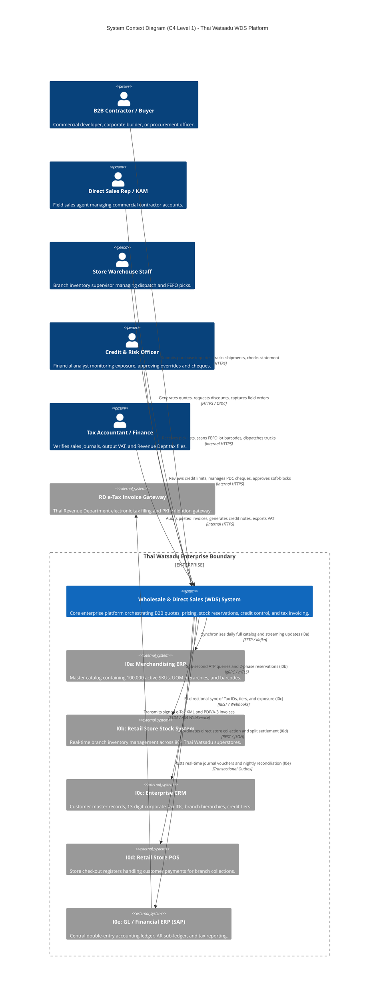

---

### 1.2 C4 Level 2: Container Topology

The WDS platform employs an enterprise NestJS 10 (Fastify, TypeScript 5.x) Modular Monolith architecture deployed in containerized Kubernetes pods. Ingress routing, enterprise security, in-process domain modules, distributed caching, and outbox event streaming are organized to guarantee high throughput, strict transactional consistency, and maintainability for the 9-person engineering team.

#### ASCII Container Topology
```
+----------------------------------------------------------------------------------------------------------------------+
|                                             CLIENT PRESENTATION LAYER                                                |
+----------------------------------------------------------------------------------------------------------------------+
    [ B2B Contractor Web Portal ]          [ Sales & Branch Web Portal ]           [ Store Fulfillment Scanner App ]
    - Next.js 14 / TypeScript SPA         - Next.js 14 / Tailwind CSS             - Android Enterprise Barcode PWA
    - Responsive Commercial UI            - Dynamic Quoting & DOFA Approval       - 1D/2D Industrial Scanner Interop
                  |                                        |                                        |
                  +----------------------------------------+----------------------------------------+
                                                           | HTTPS / TLS 1.3 / WSS
                                                           v
+----------------------------------------------------------------------------------------------------------------------+
|                                            API GATEWAY & INGRESS LAYER                                               |
+----------------------------------------------------------------------------------------------------------------------+
    [ Reverse Proxy / Ingress: Traefik / Nginx ]
    - TLS 1.3 Termination & Strict CORS                 - OAuth2 / OIDC JWT Token Verification (Azure AD)
    - Distributed Rate Limiting (Token Bucket)          - OWASP ModSecurity WAF Core Rule Set
    - Context Propagation (TraceID, TenantID, UserID)   - Gzip / Brotli Payload Compression
                                                           |
                                                           | HTTP / Fastify (JSON)
                                                           v
+----------------------------------------------------------------------------------------------------------------------+
|                                 THAI WATSADU WDS MODULAR MONOLITH CORE (NestJS 10)                                   |
+----------------------------------------------------------------------------------------------------------------------+
  +----------------------+ +----------------------+ +----------------------+ +----------------------+
  | MasterDataModule     | | PricingModule        | | CreditModule         | | InventoryModule      |
  | (E01/E13)            | | (E02)                | | (E03)                | | (E07/E04)            |
  | - Maker-Checker      | | - Stepped Vol Breaks | | - Exposure Calculus  | | - Real-time ATP Map  |
  | - 9 RBAC Roles       | | - Zone Surcharges    | | - Hard/Soft Blocks   | | - FEFO Lot Picker V2 |
  | - Chained Audit Log  | | - Floor Price Guard  | | - PDC Cheque Engine  | | - 2-Phase Redlock    |
  | - Prisma / Kysely    | | - Decimal.js Engine  | | - CreditReservations | | - 15-min Leases      |
  +----------------------+ +----------------------+ +----------------------+ +----------------------+
  +----------------------+ +----------------------+ +----------------------+ +----------------------+
  | OrderModule          | | TaxModule            | | IntegrationModule    | | ReservationReaper    |
  | (E08/E12)            | | (E10)                | | (I0a - I0e)          | | Task (Scheduled)     |
  | - Quote-to-Order     | | - RD 86/4 & 86/9 Gen | | - SFTP Poller Worker | | - 60s Cron Worker    |
  | - State Machine      | | - Credit Notes 86/10 | | - Kafka Consumers    | | - Stock Reclaim      |
  | - Floor Override Link| | - Trigger Lock Guard | | - Circuit Breakers   | | - Credit Reclaim     |
  +----------------------+ +----------------------+ +----------------------+ +----------------------+
                                                           |
                                                           v
+----------------------------------------------------------------------------------------------------------------------+
|                                            DATA & STATE PERSISTENCE LAYER                                            |
+----------------------------------------------------------------------------------------------------------------------+
  +--------------------------------------------+  +--------------------------------------------+
  | PostgreSQL 16 Enterprise Primary (HA Multi-AZ) |  | Redis 7.2 In-Memory Cluster                |
  | - Schema: Master, Orders, Invoices, AR     |  | - Cluster Mode (3 Masters, 3 Replicas)     |
  | - Collation: "th-TH-x-icu" (Pre-posed Vowel)|  | - Redlock Distributed Locking              |
  | - Decimal: NUMERIC(18,4) & NUMERIC(14,4)   |  | - ATP Branch Stock Edge Cache (TTL 5s)     |
  | - Temporal: Strict TIMESTAMPTZ (UTC)       |  | - Soft Reservation Tracker (TTL 900s / 15m)|
  | - Immutability Triggers & Row-Level Audits |  | - User Session & Idempotency Store         |
  +--------------------------------------------+  +--------------------------------------------+
  +--------------------------------------------+  +--------------------------------------------+
  | Apache Kafka 3.6+ Enterprise Event Bus     |  | MinIO / Ceph S3 Compliant Object Storage   |
  | - Partitioned Topics: stock, orders, tax   |  | - Immutable Bucket: RD Signed Tax Invoices |
  | - Transactional Outbox Pattern Engine      |  | - Attached Customer POs & Scanned Cheques  |
  | - Dead-Letter Queues (DLQ) & Poison Retry  |  | - Daily Merchandising Gzip SFTP Batches    |
  +--------------------------------------------+  +--------------------------------------------+
```

#### Mermaid Container Diagram
```mermaid
C4Container
    title Container Diagram (C4 Level 2) - Thai Watsadu WDS Modular Monolith Architecture

    Person(contractor, "B2B Contractor", "Purchasing agent checking quotes and orders")
    Person(sales_rep, "Sales Rep / KAM", "Direct sales quoting, credit override request")
    Person(cashier, "Store Cashier / Fulfilled", "Branch POS cashier and warehouse picker")

    Container(spa_portal, "B2B Contractor Web Portal", "Next.js 14, React, Tailwind", "Self-service quoting, order confirmation, statement viewing.")
    Container(sales_app, "Sales & Branch Web Portal", "Next.js 14, React, Tailwind", "Field quoting, credit monitoring, order desk, pick-list release.")

    Container(api_gateway, "Reverse Proxy / Ingress", "Traefik / Nginx", "TLS 1.3 termination, rate limiting, gzip/brotli compression, OIDC JWT validation.")

    System_Boundary(wds_monolith_boundary, "Thai Watsadu WDS Modular Monolith") {
        Container(app_monolith, "WDS Modular Monolith Engine", "NestJS 10, Fastify, TypeScript", "Modular monolith executing in-process domain modules via NestJS dependency injection and transactional event bus.")
        
        Component(mod_master, "MasterDataModule", "TypeScript / Prisma", "Maker-Checker staging, catalog cache, RBAC authorization, audit triggers.")
        Component(mod_pricing, "PricingModule", "TypeScript / Decimal.js", "Tiered volume breaks, zone freight matrix, floor price guardrails.")
        Component(mod_credit, "CreditModule", "TypeScript / Decimal.js", "Credit exposure ledger, PDC state machine, two-phase credit reservations.")
        Component(mod_inventory, "InventoryModule", "TypeScript / Redis Redlock", "Two-phase stock reservations, ATP routing, FEFO cement lot allocator.")
        Component(mod_order, "OrderModule", "TypeScript", "Order state machine, floor override linking, checkout coordinator.")
        Component(mod_tax, "TaxModule", "TypeScript / Crypto", "Gapless tax sequence allocation, Section 86/10 Credit Notes, e-Tax XML/PDF generation.")
        Component(mod_integration, "IntegrationModule", "TypeScript / Kafka Consumer", "Merchandising I0a worker, POS settlement I0d, SAP ERP GL I0e outbox.")
        Component(task_reaper, "ReservationReaperTask", "NestJS Scheduled Task", "Scans expired 15-min stock and credit reservations every 60s.")
    }

    ContainerDb(db_postgres, "Primary Relational Database", "PostgreSQL 16.2+ (Neon)", "ICU collation 'th-TH-x-icu', TIMESTAMPTZ (UTC), NUMERIC types, row-level locks.")
    ContainerDb(cache_redis, "Distributed Cache & Mutex", "Redis 7.2 Cluster", "Redlock mutexes, ATP edge cache, 15-min reservation lease TTLs.")
    ContainerQueue(event_bus, "Enterprise Event Bus", "Apache Kafka 3.6+", "Transactional Outbox streaming for orders, tax events, ERP integration.")
    ContainerDb(obj_storage, "Document Archive Store", "MinIO / S3 Object Storage", "PAdES signed PDF/A-3 invoices, e-Tax XML digests, cheque scan images.")

    Rel(contractor, spa_portal, "Visits", "HTTPS")
    Rel(sales_rep, sales_app, "Submits quotes", "HTTPS")
    Rel(cashier, sales_app, "Settles & prints", "HTTPS")

    Rel(spa_portal, api_gateway, "REST API Calls", "JSON / HTTPS")
    Rel(sales_app, api_gateway, "REST API Calls", "JSON / HTTPS")

    Rel(api_gateway, app_monolith, "Routes requests", "HTTP / Fastify")
    Rel(app_monolith, db_postgres, "Transactional Reads/Writes", "Prisma / Kysely (PgBouncer)")
    Rel(app_monolith, cache_redis, "Locks & Session Cache", "ioredis")
    Rel(app_monolith, event_bus, "Produces & Consumes Events", "kafkajs")
    Rel(app_monolith, obj_storage, "Archives Invoices & Scans", "S3 SDK")
```

---

### 1.3 C4 Level 3: Component Diagrams for Critical Subsystems

#### 1.3.1 Pricing Engine Subsystem (E02)
The Pricing Engine executes an unyielding, deterministic calculation pipeline. It prevents manual margin dilution while factoring in customer wholesale tiers, order volume breaks, geographic truck freight, and statutory value-added tax.

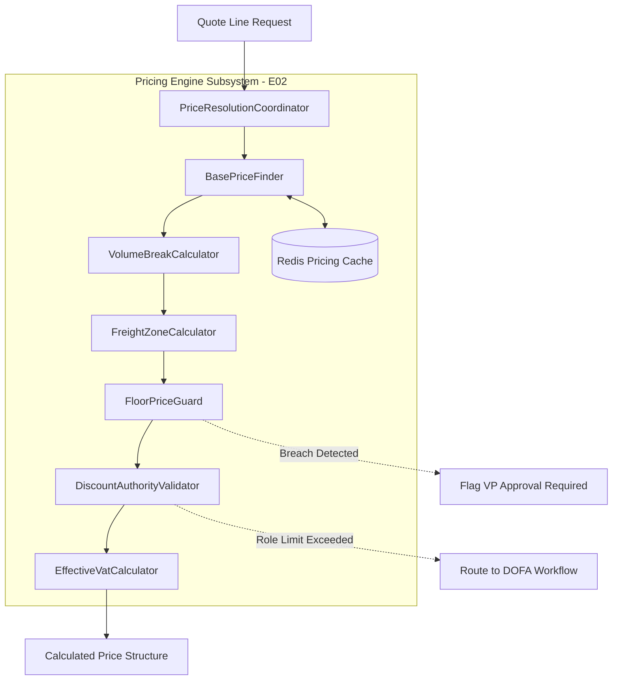

- **PriceResolutionCoordinator**: Orchestrates data flow across sub-components, enforcing execution sequence and validating interim outputs.
- **BasePriceFinder**: Resolves base SKU price mapped to the customer's Wholesale Tier (`TIER_1` to `TIER_4`). If absent, defaults to Standard Wholesale Master.
- **VolumeBreakCalculator**: Evaluates quantity breaks, applying Stepped brackets (marginal quantity discount) or All-Units brackets based on SKU configuration.
- **FreightZoneCalculator**: Determines delivery zone logistics surcharge based on destination Sub-district (`Tambon`), District (`Amphur`), Province, truck classification (4-wheel to 22-wheel trailer), and free freight thresholds.
- **FloorPriceGuard**: Validates line net price against Moving Average Cost (MAC) + minimum category margin floor. Violations halt execution and trigger escalation.
- **DiscountAuthorityValidator**: Evaluates requested discretionary discounts against submitter's Role Limit in the DOFA matrix (Sales Rep 3%, Supervisor 5%, Manager 8%, VP 15%).
- **EffectiveVatCalculator**: Resolves applicable temporal VAT rate (default 7.0000%) matching the transaction Tax Point Date, applying Banker's Rounding to 2 decimal places.

---

#### 1.3.2 Inventory & ATP Subsystem (E07/E04)
The Inventory and Available-to-Promise (ATP) subsystem orchestrates cross-branch visibility and guarantees real-time concurrency protection against inventory overselling.

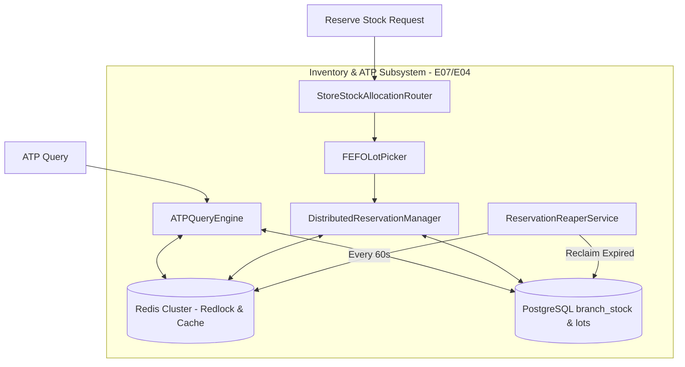

- **ATPQueryEngine**: Aggregates On-Hand, Committed, Soft-Reserved, Safety Stock, and Inbound POs across 80+ branches in sub-second latency ($P99 < 150\text{ ms}$).
- **StoreStockAllocationRouter**: Evaluates delivery proximity, freight cost, and store stock depth to route fulfillment (Single Store Pickup, Multi-Branch Split, or CDC Drop-ship).
- **FEFOLotPicker**: Enforces First-Expired, First-Out for perishable products (cement, chemical sealants, adhesives), ensuring allocated lots preserve full manufacturer pallets.
- **DistributedReservationManager**: Manages Two-Phase stock locking (`RESERVE` with 15-min TTL (900s) -> `COMMIT`) using Redlock and PostgreSQL row-level locks (`FOR UPDATE`).
- **ReservationReaperService**: Dedicated background scheduled task executing every 60 seconds to detect expired 15-minute stock and credit reservations, restoring stock to the available pool and expiring uncommitted credit holds.

---

#### 1.3.3 Credit & Cheque Control Subsystem (E03)
The Credit Control Subsystem protects Thai Watsadu against credit default and insolvency risk across multi-million Baht commercial trades.

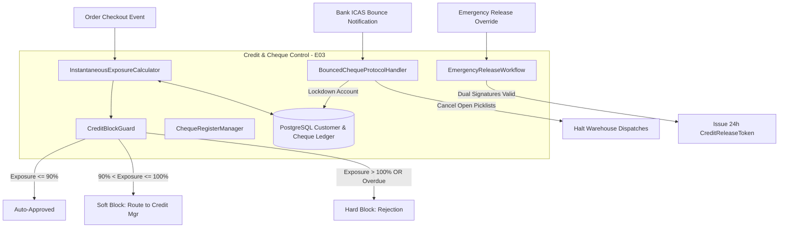

- **InstantaneousExposureCalculator**: Continuously computes total credit utilization using the statutory risk equation:
  $$\text{TotalExposure} = \text{AR}_{\text{Unpaid}} + \text{Orders}_{\text{InFulfillment}} + \text{Credit}_{\text{Reserved}} - \text{PDC}_{\text{Holding}} - \text{CreditNotes}_{\text{Unapplied}}$$
  Where `Credit_Reserved` enforces an atomic two-phase reservation protocol with a 15-minute lease TTL (preventing checkout double-spending), and vaulted post-dated cheques (`PDC_Holding`) offset exposure up to maturity.
- **CreditBlockGuard**: Evaluates exposure against credit limits and payment terms, triggering Hard Block (> 100% or > 30 days overdue) or Soft Block (> 90% or 1–15 days overdue).
- **ChequeRegisterManager**: Manages 6-stage lifecycle for Post-Dated Cheques (PDCs): `RECEIVED`, `VAULT`, `DEPOSITED`, `UNDER_CLEARING`, `HONORED`, `BOUNCED`.
- **BouncedChequeProtocolHandler**: Executes immediate account lockdown on bank dishonor notifications, converting terms to Cash-Before-Delivery (CBD) and revoking warehouse dispatches.
- **EmergencyReleaseWorkflow**: Enforces multi-signature cryptographic authorization (Credit Manager + Finance Director) to issue a single-use, 24-hour emergency release token.

---

#### 1.3.4 Billing & Tax Invoicing Subsystem (E10)
Guarantees absolute compliance with Sections 86/4, 86/5, 86/9, and 86/10 of the Thai Revenue Code.

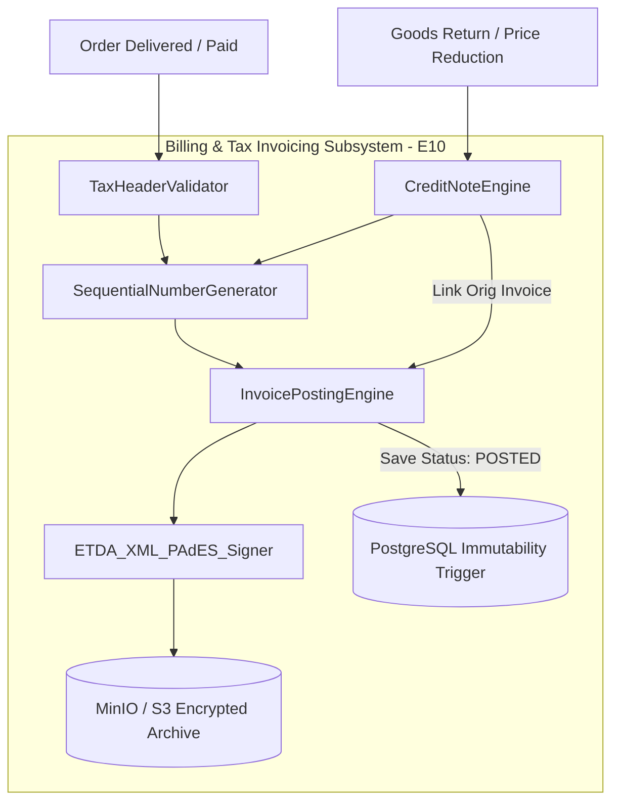

- **SequentialNumberGenerator**: Generates gapless, strictly sequential tax invoice numbers partitioned by Branch Code, Buddhist Year, and Month: `INV-{Branch}-{BE_Year}-{Month}-{Seq6}`.
- **TaxHeaderValidator**: Verifies presence and structure of statutory fields (13-digit Tax ID, 5-digit Branch Code, Registered Address, Tax Point Date).
- **InvoicePostingEngine**: Transitions invoice to `POSTED` status, creating double-entry accounting records.
- **CreditNoteEngine**: Issues Section 86/10 Credit Notes referencing original invoices with legal Thai Revenue Department reason codes.
- **ETDA_PACKAGER**: Generates UN/CEFACT XML and embeds it into digital-signed PDF/A-3 files with SHA-256 PKCS#7 signatures.
- **Immutability Trigger**: Database event trigger enforcing that once an invoice reaches `POSTED`, zero updates or deletions can occur.

---

## 2. Enterprise Integration Architecture (Interfaces I0a – I0e)

### 2.1 Integration Matrix Summary

| Interface ID | Connected Enterprise System | Integration Pattern & Protocol | Payload Format & Compression | Frequency & Target SLA | Resilience & Concurrency Guard |
|---|---|---|---|---|---|
| **I0a** | Merchandising ERP Master Catalog | SFTP Bulk Stream + Kafka Delta Streaming | JSON / Apache Avro (Gzip compressed) | Daily Full (01:00 UTC, 100k items) + Delta every 5 min (SLA < 15s) | Checksum Hash Change Detection; Quarantine Error Staging |
| **I0b** | Retail Store Stock (80+ Branches) | gRPC / HTTPS over mTLS + Local Redis Cache Sync | Protocol Buffers / JSON | Real-time Query (P99 < 150ms); Reservation (P99 < 300ms) | Two-Phase Soft Reservation (15-min TTL / 900s); Redlock Distributed Mutex |
| **I0c** | Enterprise CRM Customer Master | REST API + Outbox Webhooks (mTLS) | JSON (OpenAPI 3.0 Standard) | Bidirectional Near-Realtime (< 5s for limit/tier updates) | Thai Modulo 11 Tax ID validation; Idempotent Event Handlers |
| **I0d** | Retail Store POS Cashier Systems | REST API / WebSocket over Store LAN | Encrypted JSON (JWE / AES-256) | Real-time POS settlement & cashier notification (< 500ms) | Cashier Release Barcode Token; Distributed Saga with Compensating Actions |
| **I0e** | GL / Financial ERP (SAP S/4HANA) | Transactional Outbox + REST API / SFTP | JSON / ISO 20022 Financial XML | Real-time posting (< 2s) + Nightly Batch at 23:59:59 Asia/Bangkok | Double-Entry Balancing Verification; Outbox Exponential Retry |

---

### 2.2 Interface I0a: Merchandising Item Feed (100k SKUs)

The Merchandising ERP feed synchronizes Thai Watsadu's full commercial catalog (100,000 active SKUs across building materials, plumbing, electrical, tiles, and hardware).

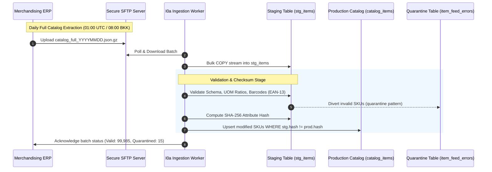

#### Technical Specifications & Schema
- **Catalog Taxonomy**: 4-level deep hierarchy: `Department` -> `Sub-Department` -> `Class` -> `Sub-Class`.
- **Complex UOM Multipliers**: Handles multi-tier conversions (e.g. 1 Bag = 50 kg; 1 Pallet = 40 Bags = 2,000 kg).
- **Attribute Checksum Change Detection**:
  The system computes an attribute checksum to avoid wasteful database updates:
  $$\text{Checksum} = \text{SHA-256}(\text{sku\_code} \parallel \text{uom\_code} \parallel \text{tax\_category} \parallel \text{weight\_kg} \parallel \text{dimensions} \parallel \text{shelf\_life\_days})$$
  If the computed hash matches `catalog_items.attribute_hash`, the update is bypassed.
- **Quarantine Pattern (`item_feed_errors`)**:
  Schema or domain violations (e.g. negative weight, zero UOM conversion ratio, missing tax category) are diverted to a quarantine table without failing the remaining 99,000+ items.

```sql
-- Staging and Production DDL Schema for I0a
CREATE TABLE stg_merchandising_items (
    sku_code VARCHAR(32) NOT NULL,
    barcode VARCHAR(32),
    thai_name VARCHAR(500) NOT NULL,
    english_name VARCHAR(500),
    department_code VARCHAR(16) NOT NULL,
    sub_department_code VARCHAR(16) NOT NULL,
    class_code VARCHAR(16) NOT NULL,
    sub_class_code VARCHAR(16) NOT NULL,
    base_uom VARCHAR(16) NOT NULL,
    sales_uom VARCHAR(16) NOT NULL,
    uom_conversion_ratio NUMERIC(14, 4) NOT NULL,
    gross_weight_kg NUMERIC(14, 4) NOT NULL,
    is_perishable BOOLEAN NOT NULL DEFAULT FALSE,
    shelf_life_days INTEGER DEFAULT 0,
    is_hazardous BOOLEAN NOT NULL DEFAULT FALSE,
    tax_category VARCHAR(16) NOT NULL, -- TAXABLE_7, EXEMPT, ZERO_RATED
    moving_average_cost NUMERIC(18, 4) NOT NULL,
    attribute_hash CHAR(64) NOT NULL,
    raw_payload JSONB NOT NULL,
    created_at TIMESTAMPTZ NOT NULL DEFAULT (NOW() AT TIME ZONE 'UTC')
);

CREATE TABLE item_feed_errors (
    error_id UUID PRIMARY KEY DEFAULT gen_random_uuid(),
    sku_code VARCHAR(32),
    error_code VARCHAR(64) NOT NULL, -- ERR_INVALID_UOM, ERR_MISSING_TAX, ERR_BARCODE_MALFORMED
    error_message TEXT NOT NULL,
    raw_record JSONB NOT NULL,
    quarantined_at TIMESTAMPTZ NOT NULL DEFAULT (NOW() AT TIME ZONE 'UTC'),
    resolved BOOLEAN NOT NULL DEFAULT FALSE
);
```

---

### 2.3 Interface I0b: Retail Store Stock & Real-Time ATP

Connects central WDS to 80+ retail stores and regional CDCs. Concurrency protection guarantees that multi-ton building materials cannot be oversold.

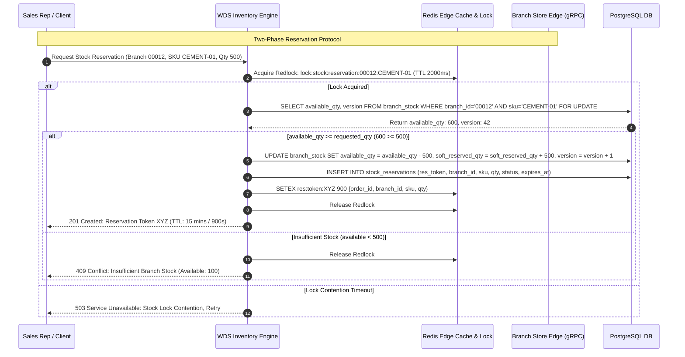

#### Protocol & Two-Phase Lifecycle
1. **Phase 1: Soft Reservation (`RESERVE_STOCK`)**:
   - Triggered during quote confirmation or checkout initiation.
   - Locks required quantity at specified `branch_id`. Decrements `available_qty`, increments `soft_reserved_qty`.
   - Issues a cryptographic `reservation_token` bound to a **15-minute Time-to-Live (TTL / 900 seconds)**.
2. **Phase 2: Hard Commitment (`COMMIT_STOCK`)**:
   - Triggered upon credit clearance or payment authorization.
   - Atomically transitions `soft_reserved_qty` into `hard_committed_qty`. Binds stock directly to the generated Purchase Order.
3. **Rollback & Expiry (`RELEASE_STOCK`)**:
   - Triggered upon quote cancellation or expiration of the 15-minute window.
   - A dedicated background scheduled task (**ReservationReaperTask**) polls every 60 seconds for expired reservation rows:
   ```sql
   -- Scheduled Reaper Query (Every 60s)
   UPDATE branch_stock bs
   SET available_qty = bs.available_qty + sr.reserved_qty,
       soft_reserved_qty = bs.soft_reserved_qty - sr.reserved_qty,
       version = bs.version + 1,
       updated_at = (NOW() AT TIME ZONE 'UTC')
   FROM stock_reservations sr
   WHERE bs.branch_id = sr.branch_id 
     AND bs.sku_code = sr.sku_code
     AND sr.status = 'ACTIVE'
     AND sr.expires_at < (NOW() AT TIME ZONE 'UTC');

   UPDATE stock_reservations
   SET status = 'EXPIRED', updated_at = (NOW() AT TIME ZONE 'UTC')
   WHERE status = 'ACTIVE' AND expires_at < (NOW() AT TIME ZONE 'UTC');
   ```

---

### 2.4 Interface I0c: Enterprise CRM & Corporate Identity

Synchronizes commercial contractor master records, credit limits, assigned tiers, and legal tax identifiers between corporate CRM and WDS.

#### Thai Legal Identity & Modulo 11 Verification
All commercial contractors operating in Thailand possess a **13-digit Corporate Tax ID** or **Citizen Identification Number**. The system enforces real-time Modulo 11 checksum verification before persisting any customer entity.

$$\text{Check Digit} = \left( 11 - \left( \sum_{i=1}^{12} d_i \times (14 - i) \pmod{11} \right) \right) \pmod{10}$$

```typescript
/**
 * validateThaiTaxId implements statutory Modulo 11 checksum verification
 * for 13-digit Thai Corporate Tax IDs and Citizen Identification Numbers.
 */
export function validateThaiTaxId(id: string): boolean {
  if (!/^\d{13}$/.test(id)) {
    return false;
  }
  let sum = 0;
  for (let i = 0; i < 12; i++) {
    sum += parseInt(id.charAt(i), 10) * (13 - i);
  }
  const checkDigit = (11 - (sum % 11)) % 10;
  return checkDigit === parseInt(id.charAt(12), 10);
}
```

#### Branch Code Hierarchy
- `00000`: Denotes Corporate Head Office (สำนักงานใหญ่).
- `00001` through `99999`: Denotes specific regional project branches or construction sites (สาขาย่อย).
- **Credit Evaluation Hierarchy**: Credit limits are assessed at the Parent Corporate Legal Entity level, while Delivery Orders and Tax Invoices bind to the specific 5-digit Branch Code.

---

### 2.5 Interface I0d: Retail Store POS & Settlement

Supports "Order Online/Via Rep, Pick Up and Pay at Branch Cashier" workflows.

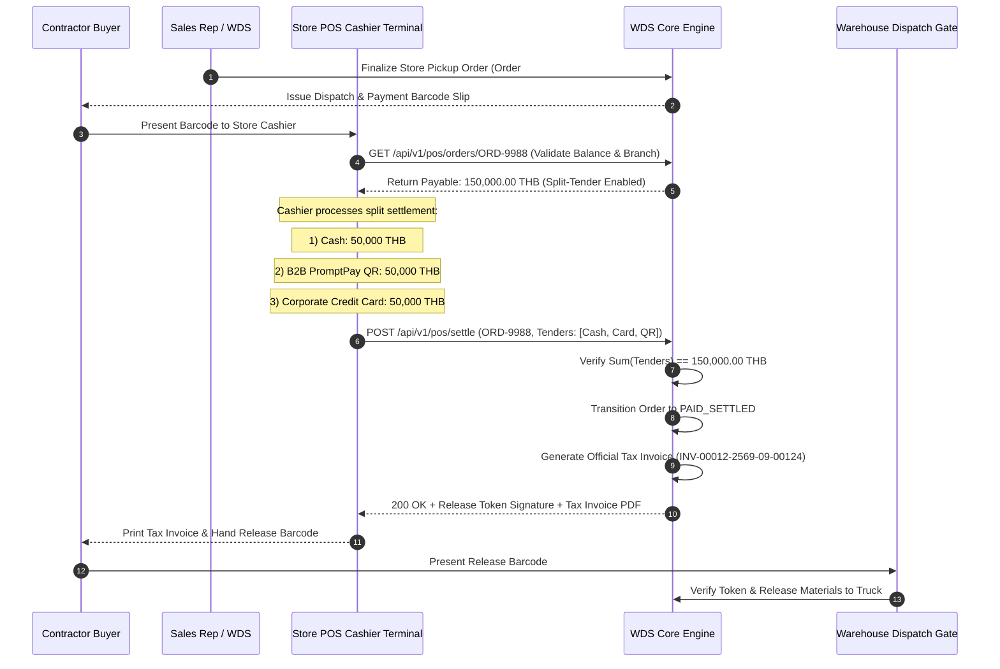

#### Split-Tender Settlement Protocol
The POS integration contract mandates that multiple payment instruments can be applied to satisfy a single invoice. The settlement payload must strictly balance:
$$\sum_{k=1}^{n} \text{TenderAmount}_k = \text{TotalInvoicePayable}$$

Supported tender types: `CASH_THB`, `CREDIT_CARD_VISA_MC`, `B2B_PROMPTPAY_QR`, `BANK_DIRECT_DEBIT`.

---

### 2.6 Interface I0e: GL & Finance ERP Posting

Synchronizes financial sub-ledgers with Central Retail Corporation's SAP ERP financial ledger using the **Transactional Outbox Pattern**.

#### Accounting Double-Entry Journal Specification

##### 1. Sales Order Invoiced (Goods Delivered)
```
DR  113100  Accounts Receivable - Commercial Wholesale   133,803.50 THB
    CR  411200  Revenue - Direct Commercial Sales              125,050.00 THB
    CR  213100  Output VAT - Due (ภาษีขาย)                        8,753.50 THB
```

##### 2. Cheque Cleared / Cash Collected
```
DR  111200  Cash at Bank - Settlement Transit Account    133,803.50 THB
    CR  113100  Accounts Receivable - Commercial Wholesale   133,803.50 THB
```

##### 3. Credit Note Issued (Goods Returned / Price Adjustment)
```
DR  411200  Revenue - Sales Returns & Allowances          10,000.00 THB
DR  213100  Output VAT - Due (ภาษีขายลดหนี้)                    700.00 THB
    CR  113100  Accounts Receivable - Commercial Wholesale    10,700.00 THB
```

#### Nightly Financial Reconciliation Protocol
Every evening at **23:59:59 Asia/Bangkok** (16:59:59 UTC), a reconciliation job computes hash totals across the WDS Tax Invoice Register and verifies them against the SAP GL staging ledger:
- `Total_Invoices_Count`
- `Sum_Gross_Amount`
- `Sum_Net_Taxable_Amount`
- `Sum_Output_VAT_Amount`
Any variance exceeding $\pm 0.00\text{ THB}$ halts the financial day closure and alerts the Finance Operations Center within 15 minutes.

---

## 3. Core Business Domains Deep-Dive

### 3.1 Master Data Management, RBAC & Chained Audit (E01/E13)

#### Maker-Checker Dual-Control Workflow
High-consequence configuration updates—such as altering wholesale price lists, extending credit facilities, overriding discount authority matrices, or modifying customer tier mappings—are strictly prohibited from being applied by a single operator.

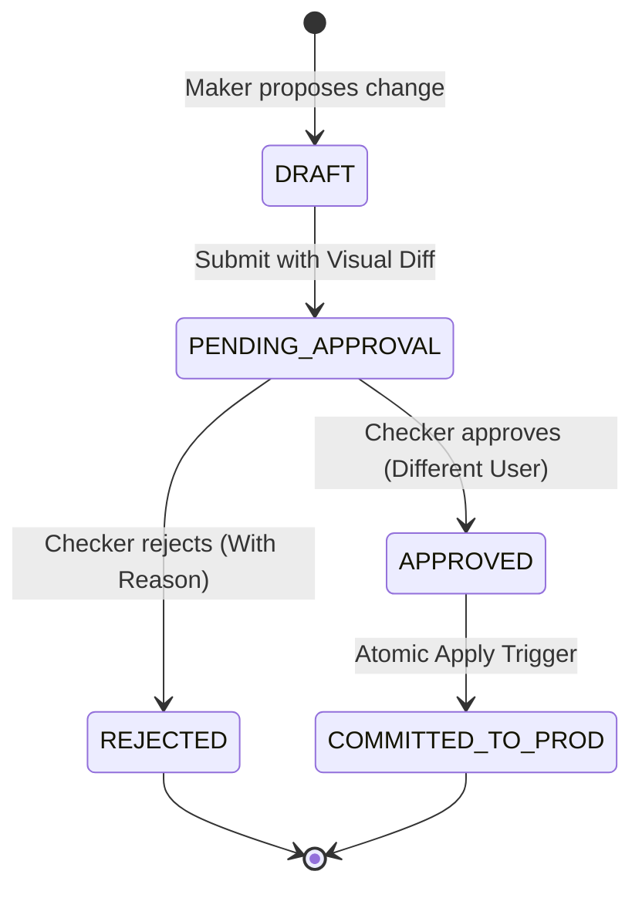

- **Maker**: Submits proposed record in `pending_changes` table in `DRAFT_PENDING_APPROVAL` status, recording `maker_user_id`, timestamp, and a full JSON diff (`pre_image` vs `post_image`).
- **Checker**: Independent user possessing the required supervisory role. Self-approval is physically rejected at the database constraint level (`CHECK (checker_id != maker_id)`).

#### Granular 9-Role RBAC Model
The platform enforces fine-grained permissions via `resource:action:scope`:

| # | Role Identifier | Functional Scope | Max Discretionary Discount | Authority & Capabilities |
|---|---|---|---|---|
| 1 | `SALES_REP` | Assigned Customer Accounts | 3.00% | Create quotes, view stock ATP, submit standard orders. |
| 2 | `SALES_SUPERVISOR` | Store Branch Accounts | 5.00% | Approve quotes <= 5%, monitor branch quotation pipeline. |
| 3 | `REGIONAL_SALES_MGR` | Regional Cluster Accounts | 8.00% | Approve quotes <= 8%, view multi-branch inventory. |
| 4 | `COMMERCIAL_VP` | Company-Wide Wholesale | 15.00% | Approve quotes <= 15%, override Floor Price Guard. |
| 5 | `CREDIT_CONTROLLER` | Financial Exposure Ledger | 0.00% | Maker for credit limit adjustments, log incoming PDCs. |
| 6 | `CREDIT_MANAGER` | Financial Exposure Ledger | 0.00% | Approve credit limits <= 5M THB, approve Soft Block release. |
| 7 | `FINANCE_DIRECTOR` | Executive Finance Board | 0.00% | Approve limits > 5M THB, issue 24h Hard Block release token. |
| 8 | `STORE_DISPATCHER` | Branch Warehouse Gate | 0.00% | Scan lot barcodes, verify release tokens, print gate passes. |
| 9 | `TAX_ACCOUNTANT` | Tax & Regulatory Billing | 0.00% | Issue Section 86/10 Credit Notes, export RD monthly returns. |

#### Cryptographically Chained SHA-256 HMAC Audit Log
To prevent database administrators or attackers from tampering with historical audit trails, every mutation row is cryptographically linked to the preceding row hash:

$$\text{RowHash}_n = \text{HMAC-SHA-256}\left( K_{\text{audit}}, \left( \text{EventID}_n \parallel \text{ActorID}_n \parallel \text{Action}_n \parallel \text{PreImage}_n \parallel \text{PostImage}_n \parallel \text{RowHash}_{n-1} \right) \right)$$

```sql
CREATE TABLE audit_event_logs (
    event_id UUID PRIMARY KEY DEFAULT gen_random_uuid(),
    tenant_id VARCHAR(32) NOT NULL DEFAULT 'THAI_WATSADU',
    entity_name VARCHAR(64) NOT NULL,
    entity_id VARCHAR(64) NOT NULL,
    action VARCHAR(32) NOT NULL, -- INSERT, UPDATE, DELETE, STATE_TRANSITION
    actor_id VARCHAR(64) NOT NULL,
    actor_role VARCHAR(64) NOT NULL,
    client_ip INET NOT NULL,
    pre_image JSONB,
    post_image JSONB,
    prev_row_hash CHAR(64) NOT NULL,
    current_row_hash CHAR(64) NOT NULL,
    created_at TIMESTAMPTZ NOT NULL DEFAULT (NOW() AT TIME ZONE 'UTC')
);

-- Revoke mutation rights from application users
REVOKE UPDATE, DELETE ON audit_event_logs FROM wds_app_user, wds_admin;
```

---

### 3.2 Pricing & Freight Calculation Engine (E02)

#### Unified Price Calculation Formula
$$\text{LineNet} = \left( \text{BasePrice}_{\text{Tier}} \times \left( 1 - \frac{\text{VolDiscountPct}}{100} \right) - \text{ManualDiscountUnit} \right) + \text{FreightSurchargeUnit}$$
$$\text{LineTaxable} = \text{ROUND\_HALF\_UP}(\text{LineNet} \times \text{LineQuantity}, 2)$$
$$\text{LineVAT} = \text{ROUND\_HALF\_UP}(\text{LineTaxable} \times \text{VATRate}, 2)$$
$$\text{DocumentTotalPayable} = \sum_{j=1}^{m} \text{LineTaxable}_j + \sum_{j=1}^{m} \text{LineVAT}_j$$

#### Stepped vs All-Units Volume Breaks
The engine supports two distinct volume discounting models:
1. **Stepped (Marginal Tiering)**: Quantity intervals are priced progressively. (e.g. First 50 units @ 100 THB; next 150 units @ 90 THB; units beyond 200 @ 80 THB).
2. **All-Units (Retroactive Tiering)**: Once total quantity crosses a threshold, that bracket's discount rate applies to every unit purchased.

#### Zone Freight Surcharge Engine
Logistics pricing is calculated by evaluating destination Postal Codes against truck classifications:

| Truck Classification | Maximum Gross Weight | Usable Cargo Volume | Suitable Cargo Type | Island / Mountain Surcharge |
|---|---|---|---|---|
| **4-Wheel Light Truck** | 1.5000 Tons | 8.0000 m³ | Small plumbing, paint, light tools | + 800.00 THB |
| **6-Wheel Medium Truck** | 5.0000 Tons | 20.0000 m³ | Tiles, electrical conduit, sanitaryware | + 1,500.00 THB |
| **10-Wheel Heavy Truck** | 15.0000 Tons | 35.0000 m³ | Bagged cement, timber, steel rebar | + 3,500.00 THB |
| **22-Wheel Trailer** | 32.0000 Tons | 65.0000 m³ | Bulk cement, bulk structural steel | + 6,000.00 THB |

*Free Delivery Threshold*: Wholesale orders exceeding **50,000.00 THB** net within Delivery Zone 1 (Bangkok and Vicinity) receive automated freight fee waiver.

#### Floor Price Guard & Delegation of Financial Authority (DOFA)
- **Floor Price Guard**: Each SKU enforces a minimum threshold:
  $$\text{FloorPrice} = \text{MovingAverageCost} \times (1 + \text{CategoryMinMarginPct})$$
  If $\text{NetUnitPrice} < \text{FloorPrice}$, quotation submission is intercepted. A `FLOOR_PRICE_BREACH` exception is raised, requiring Level 4 DOFA (Commercial VP) sign-off.
- **DOFA Matrix**:
  - `SALES_REP`: $\le 3.00\%$ (Floor Price override: **Prohibited**)
  - `SALES_SUPERVISOR`: $\le 5.00\%$ (Floor Price override: **Prohibited**)
  - `REGIONAL_SALES_MGR`: $\le 8.00\%$ (Floor Price override: **Prohibited**)
  - `COMMERCIAL_VP`: $\le 15.00\%$ (Floor Price override: **Permitted with written justification**)
  - `MANAGING_DIRECTOR`: $> 15.00\%$ (Floor Price override: **Permitted**)

#### Effective-Dated Temporal VAT Resolution
VAT rates are resolved against transaction tax-point dates using temporal validities:
```sql
CREATE TABLE vat_tax_rates (
    tax_category VARCHAR(16) NOT NULL, -- TAXABLE_STANDARD, ZERO_RATED, EXEMPT
    tax_rate NUMERIC(8, 4) NOT NULL,    -- 0.0700 for 7%
    valid_from DATE NOT NULL,
    valid_to DATE NOT NULL,
    CONSTRAINT chk_vat_date_order CHECK (valid_from <= valid_to)
);
-- Default Seed: 7.0000% under Royal Decree
INSERT INTO vat_tax_rates VALUES ('TAXABLE_STANDARD', 0.0700, '1997-08-16', '9999-12-31');
```

---

### 3.3 Credit & Cheque Control Engine (E03)

#### Instantaneous Dynamic Exposure Calculus
Credit utilization is evaluated continuously prior to any quotation approval or order checkout using the authoritative enterprise formula:
$$\text{TotalExposure} = \text{AR}_{\text{Unpaid}} + \text{Orders}_{\text{InFulfillment}} + \text{Credit}_{\text{Reserved}} - \text{PDC}_{\text{Holding}} - \text{CreditNotes}_{\text{Unapplied}}$$

Where:
- $\text{AR}_{\text{Unpaid}}$: Current open ledger balance of posted unpaid tax invoices from the double-entry accounts receivable subledger.
- $\text{Orders}_{\text{InFulfillment}}$: Monetary value of confirmed, committed sales orders currently in pick, pack, staging, or transit prior to formal tax invoice posting.
- $\text{Credit}_{\text{Reserved}}$: Active 15-minute credit reservations from in-flight checkout sessions (`credit_reservations` table), preventing concurrent checkout double-spending.
- $\text{PDC}_{\text{Holding}}$: Verified post-dated cheques received and lodged in store vault awaiting maturity date (`RECEIVED`, `VAULT`, `DEPOSITED`, `UNDER_CLEARING`). Received cheques offset exposure as financial collateral up to their maturity date. Dishonored/bounced cheques are immediately excluded from deductions and trigger mandatory credit freezing.
- $\text{CreditNotes}_{\text{Unapplied}}$: Approved, unapplied Section 86/10 statutory credit notes available for offset against customer debt.

#### Two-Phase Credit Reservation Protocol (`credit_reservations`)
To eliminate race conditions and prevent double-spending during concurrent checkouts (e.g., two sales reps or contractor branch buyers placing simultaneous orders against a shared corporate credit limit):

```sql
CREATE TYPE credit_reservation_status_enum AS ENUM ('ACTIVE', 'COMMITTED', 'EXPIRED', 'RELEASED');

CREATE TABLE credit_reservations (
    reservation_id          UUID PRIMARY KEY DEFAULT uuid_generate_v4(),
    customer_id             UUID NOT NULL REFERENCES customer_master(customer_id),
    order_reference         VARCHAR(64) NOT NULL,
    reserved_amount_thb     NUMERIC(15, 2) NOT NULL,
    status                  credit_reservation_status_enum NOT NULL DEFAULT 'ACTIVE',
    created_at              TIMESTAMPTZ NOT NULL DEFAULT CURRENT_TIMESTAMP,
    expires_at              TIMESTAMPTZ NOT NULL, -- Lease TTL: CURRENT_TIMESTAMP + INTERVAL '15 minutes'
    committed_at            TIMESTAMPTZ,
    released_at             TIMESTAMPTZ,
    CONSTRAINT chk_cred_res_amount_pos CHECK (reserved_amount_thb > 0.00)
);

CREATE INDEX idx_credit_reservations_active ON credit_reservations(customer_id, status)
WHERE status = 'ACTIVE';
```

##### Protocol Execution Lifecycle
1. **Phase 1: Soft Reservation (`POST /api/v1/credit/reserve`)**:
   - Acquires pessimistic row lock on customer profile: `SELECT credit_limit, is_credit_frozen FROM customer_master WHERE customer_id = $1 FOR UPDATE`.
   - Computes current exposure: $\text{TotalExposure} = \text{AR}_{\text{Unpaid}} + \text{Orders}_{\text{InFulfillment}} + \text{Credit}_{\text{Reserved}} - \text{PDC}_{\text{Holding}} - \text{CreditNotes}_{\text{Unapplied}}$.
   - Validates condition: $\text{TotalExposure} + \text{RequestedAmount} \le \text{CreditLimit}$.
   - Inserts active reservation with a **15-minute Time-to-Live (TTL)** (`expires_at = NOW() + INTERVAL '15 minutes'`).
2. **Phase 2: Hard Commitment (`POST /api/v1/credit/commit`)**:
   - Invoked upon checkout completion and order confirmation.
   - Atomically transitions reservation row `status = 'COMMITTED'`, records `committed_at = NOW()`, and registers the order into $\text{Orders}_{\text{InFulfillment}}$.
3. **Phase 3: Rollback & Auto-Release (`POST /api/v1/credit/release`)**:
   - Invoked if checkout is cancelled or payment verification fails, setting `status = 'RELEASED'`.
   - The background **ReservationReaperTask** executes every 60 seconds to scan orphaned reservations (`WHERE status = 'ACTIVE' AND expires_at < NOW()`), transitioning them to `'EXPIRED'` to automatically restore contractor credit capacity.

#### Automated Credit Blocking Rules
- **Soft Block**:
  - Triggered when $\text{TotalExposure} > 90\%$ of Credit Limit **OR** any invoice is **1 to 15 days overdue**.
  - System flags quotation; automated checkouts disabled. Credit Controller can approve release with one click upon review.
- **Hard Block**:
  - Triggered when $\text{TotalExposure} > 100\%$ of Credit Limit **OR** any invoice is **> 30 days overdue** **OR** customer has **$\ge 1$ bounced cheque within the last 90 days**.
  - Order submission, warehouse pick-list generation, and gate dispatches are strictly rejected.

#### 6-Stage Cheque Register Lifecycle
PDC management enforces a strict finite state machine:
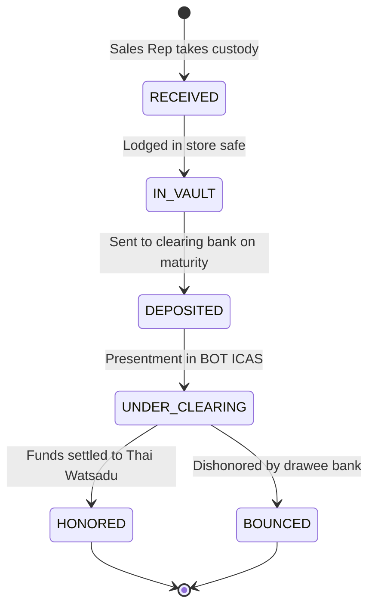

#### Bounced Cheque Emergency Protocol
Upon receiving a dishonor event via Bank ICAS:
1. Customer status transitions instantly to `CREDIT_FROZEN` and `TERMS_REVOKED`.
2. All pending warehouse pick-lists across 80+ branches are revoked within 2 seconds.
3. Terms permanently revert to Cash-Before-Delivery (CBD).
4. System starts legal notice countdown (Thai Cheque Offence Act B.E. 2534: notice within 3 months).

#### 24-Hour Emergency Credit Release Token
High-priority project overrides require dual digital authorization (Credit Manager + Finance Director).
- Upon dual signature verification, system generates an HMAC-signed `CreditReleaseToken`.
- The token expires in **exactly 24 hours** ($T + 86,400\text{ s}$) and is strictly bound to the specific `order_id`. If unused within 24 hours, it is invalidated.

---

### 3.4 Inventory Management: FEFO & Multi-Store ATP (E07/E04)

#### FEFO Lot Allocation for Perishable Building Materials
Products such as Portland cement, grouts, silicone sealants, and chemical adhesives degrade from atmospheric moisture and temperature.
- Each lot maintains `lot_number`, `manufacturing_date`, and `expiry_date`.
- **Shelf-Life Rule**:
  $$\text{RemainingShelfLife} = \text{expiry\_date} - \text{CURRENT\_DATE}$$
  If $\text{RemainingShelfLife} < \text{CustomerMinShelfLife}$ (typically 30 days), the lot is excluded from construction dispatch and marked for store clearance.

#### Full-Pallet Preservation Optimization Algorithm (Aging-Trap Free)
Cement and perishable building material logistics requires minimizing broken pallets to maximize crane and forklift handling speed while strictly enforcing First-Expired, First-Out (FEFO) without leaving older partial pallets to expire in warehouse racks ("Aging Trap") or crashing when partial demand spans multiple lots.

```
Algorithm: FEFO_Pallet_Allocation_V2 (Aging-Trap Free & Multi-Lot Resilient)
Input: SKU, RequiredQuantity, BranchStockLots
Output: AllocatedLotList (list of {lot_id, quantity, is_full_pallet})

1. Filter candidate lots WHERE (expiry_date - CURRENT_DATE) >= 30 days AND available_qty > 0
2. Sort candidate lots ASCENDING by expiry_date (strict FEFO ordering)
3. Initialize:
     AllocatedLotList = []
     pallet_size = SKU.units_per_pallet (e.g. 40 bags)
     remaining_demand = RequiredQuantity

4. PHASE 1: BROKEN-PALLET / ODD-QUANTITY DEPLETION (Prevents Aging Trap)
   // First, check if demand has an odd remainder or if older lots contain broken pallets
   For each lot in candidate lots:
       If remaining_demand == 0: Break
       broken_qty = lot.available_qty % pallet_size
       If broken_qty > 0:
           // Lot has an already opened/partial pallet; deplete it first regardless of full demand
           qty_to_take = MIN(broken_qty, remaining_demand)
           AllocatedLotList.Append({lot: lot.lot_id, quantity: qty_to_take, is_full_pallet: false})
           lot.available_qty = lot.available_qty - qty_to_take
           remaining_demand = remaining_demand - qty_to_take

5. PHASE 2: FULL-PALLET ALLOCATION (In Strict FEFO Order)
   For each lot in candidate lots:
       If remaining_demand < pallet_size: Break
       full_pallets_available = FLOOR(lot.available_qty / pallet_size)
       If full_pallets_available > 0:
           pallets_to_take = MIN(full_pallets_available, FLOOR(remaining_demand / pallet_size))
           qty_to_take = pallets_to_take * pallet_size
           AllocatedLotList.Append({lot: lot.lot_id, quantity: qty_to_take, is_full_pallet: true})
           lot.available_qty = lot.available_qty - qty_to_take
           remaining_demand = remaining_demand - qty_to_take

6. PHASE 3: MULTI-LOT REMAINDER FULFILLMENT (Resolves Partial Demand Failure)
   // If odd quantity remains and no broken pallets exist, break oldest available lot across multiple lots
   For each lot in candidate lots:
       If remaining_demand == 0: Break
       If lot.available_qty > 0:
           qty_to_take = MIN(lot.available_qty, remaining_demand)
           AllocatedLotList.Append({lot: lot.lot_id, quantity: qty_to_take, is_full_pallet: false})
           lot.available_qty = lot.available_qty - qty_to_take
           remaining_demand = remaining_demand - qty_to_take

7. If remaining_demand > 0:
       Raise Exception("INSUFFICIENT_ATP_STOCK: Unable to fulfill requested quantity")

8. Return AllocatedLotList
```

##### Architectural Design Rationale
- **Aging Trap Elimination**: Older partial pallets are drained first in Phase 1, preventing perishable stock from degrading past the 30-day cutoff while newer full pallets are shipped.
- **Multi-Lot Partial Demand Resilience**: Phase 3 satisfies multi-lot fractional demand (e.g. demand of 25 bags with candidate lots containing 15 and 15 bags) without throwing unhandled exceptions or requiring a single lot to hold the entire remainder.

#### Multi-Store ATP Dynamic Routing Engine
$$\text{ATP}_{\text{Branch}} = \text{OnHand} - \text{HardCommitted} - \text{SoftReserved} - \text{SafetyStock} - \text{DamagedStock} + \text{InboundConfirmed}_{\le 24\text{h}}$$

Where $\text{SoftReserved}$ represents active 15-minute lease reservations (TTL 900s) managed via Redis Redlock and the `stock_reservations` ledger.

When a contractor requires large quantities exceeding a single store's ATP, the routing engine calculates:
1. Single Store Fulfillment (Nearest branch with 100% ATP).
2. Multi-Store Split Fulfillment (Divided between 2 neighboring branches within 25 km).
3. CDC Drop-Ship Direct Delivery (Dispatched from Wang Noi or Bangna Central Distribution Centers).

---

### 3.5 Billing & Revenue Department Tax Invoicing (E10)

#### Statutory Compliance (Thai Revenue Code)
WDS adheres strictly to the legal mandates governing Value Added Tax under the Revenue Department of Thailand:
- **Section 86/4**: Mandatory details on Full Tax Invoices (ใบกำกับภาษีเต็มรูป).
- **Section 86/5**: Provisions for issuing combined documents ("ใบเสร็จรับเงิน/ใบกำกับภาษี" or "ใบส่งของ/ใบกำกับภาษี").
- **Section 86/9**: Absolute prohibition against duplicate, fictitious, or gap-numbered tax invoices.
- **Section 86/10**: Credit Note (ใบลดหนี้) statutory parameters and linkage to original invoices.

#### Mandatory Document Header Specification
- **Seller Header**:
  - Registered Name: บริษัท ซีอาร์ซี ไทวัสดุ จำกัด (มหาชน) (Central Retail Corporation / CRC Thai Watsadu PCL)
  - 13-digit Tax ID: `0107553000107` (Verified Valid Thai Corporate Tax ID Modulo 11 Check Digit: 7)
  - Branch Identifier: `สำนักงานใหญ่` (Head Office, Branch Code `00000`) or `สาขาที่ XXXXX`
  - Registered Legal Address matching RD VAT registration certificate (ภ.พ.20).
  - *Modulo 11 Verification Proof*: $\text{Sum} = (0\times 13) + (1\times 12) + (0\times 11) + (7\times 10) + (5\times 9) + (5\times 8) + (3\times 7) + (0\times 6) + (0\times 5) + (0\times 4) + (1\times 3) + (0\times 2) = 191$. $191 \pmod{11} = 4 \implies (11 - 4) \pmod{10} = 7$ (Matches Check Digit 7).
- **Buyer Header**:
  - Corporate Registered Name (or Contractor Full Legal Name).
  - 13-digit Tax ID / Citizen ID.
  - Head Office (`สำนักงานใหญ่`) or Branch Code (`สาขาที่ XXXXX`).
  - Buyer Registered Tax Address.

#### Continuous Gapless Sequence Numbering
Tax invoices are partitioned by Branch, Buddhist Year, and Month:
$$\text{InvoiceNumber} = \text{INV}-\{ \text{BranchCode}_5 \}-\{ \text{YearBE}_4 \}-\{ \text{Month}_2 \}-\{ \text{RunningSeq}_6 \}$$
*(Example: `INV-00012-2569-09-000142`)*

```sql
-- Gapless sequence allocation via row-lock on partition table
CREATE TABLE tax_invoice_sequences (
    branch_code VARCHAR(5) NOT NULL,
    fiscal_year_be INTEGER NOT NULL,
    fiscal_month INTEGER NOT NULL,
    last_assigned_sequence INTEGER NOT NULL DEFAULT 0,
    PRIMARY KEY (branch_code, fiscal_year_be, fiscal_month)
);

CREATE OR REPLACE FUNCTION fn_get_next_tax_invoice_number(
    p_branch VARCHAR(5),
    p_year_be INTEGER,
    p_month INTEGER
) RETURNS VARCHAR(32) AS $$
DECLARE
    v_next_seq INTEGER;
    v_doc_number VARCHAR(32);
BEGIN
    UPDATE tax_invoice_sequences
    SET last_assigned_sequence = last_assigned_sequence + 1
    WHERE branch_code = p_branch 
      AND fiscal_year_be = p_year_be 
      AND fiscal_month = p_month
    RETURNING last_assigned_sequence INTO v_next_seq;
    
    IF NOT FOUND THEN
        INSERT INTO tax_invoice_sequences (branch_code, fiscal_year_be, fiscal_month, last_assigned_sequence)
        VALUES (p_branch, p_year_be, p_month, 1)
        RETURNING 1 INTO v_next_seq;
    END IF;
    
    v_doc_number := 'INV-' || p_branch || '-' || p_year_be || '-' || LPAD(p_month::TEXT, 2, '0') || '-' || LPAD(v_next_seq::TEXT, 6, '0');
    RETURN v_doc_number;
END;
$$ LANGUAGE plpgsql;
```

#### Immutability Enforcement on POSTED Status
Once an invoice transitions to `POSTED`, zero updates or deletions can occur under any circumstance:
```sql
CREATE OR REPLACE FUNCTION trg_prevent_posted_tax_invoice_mutation()
RETURNS TRIGGER AS $$
BEGIN
    IF OLD.status = 'POSTED' THEN
        RAISE EXCEPTION 'ERR-RD-TAX-001: Legally Immutable - Posted Tax Invoices cannot be modified or deleted per Thai Revenue Code Section 86/4'
            USING HINT = 'Issue a Section 86/10 Credit Note instead of updating historical invoices.';
    END IF;
    RETURN NEW;
END;
$$ LANGUAGE plpgsql;

CREATE TRIGGER trg_tax_invoice_immutability
BEFORE UPDATE OR DELETE ON tax_invoices
FOR EACH ROW EXECUTE FUNCTION trg_prevent_posted_tax_invoice_mutation();
```

#### Credit Note Engine (Section 86/10 Compliance)
Credit Notes (ใบลดหนี้) require statutory reason codes recognized by the Revenue Department:
1. `CN_REASON_RETURN`: Return of damaged, substandard, or non-conforming goods.
2. `CN_REASON_PRICE_ADJUST`: Price reduction agreed post-invoice due to defective items.
3. `CN_REASON_COMMERCIAL_DISCOUNT`: Post-invoice trade discount / rebate granted under agreement.
4. `CN_REASON_CALCULATION_ERROR`: Arithmetic or pricing error detected on original invoice.

A Credit Note explicitly references:
- Original Tax Invoice Number and Issue Date.
- Original Gross Amount.
- Corrected Gross Amount.
- Decreased Value Difference (มูลค่าที่ลดลง).
- Output VAT Reduction (7.0000%).
- Thai Baht Text translation of the difference amount.

#### ETDA e-Tax Invoice XML & PAdES-LTV Signature
- Formats e-Tax records conforming to **UN/CEFACT XML (TIS 1102-2559 / ETDA Standard)**.
- Compiles the XML payload and attaches it inside an **ISO 19005-3 PDF/A-3** container.
- Digitally signs the PDF using Thai Watsadu's PKI certificate issued by an approved Certification Authority (CA), embedding **PAdES-LTV (Long-Term Validation)** cryptographic time-stamps.

---

## 4. Security Policies & Non-Functional Requirements (NFRs)

### 4.1 OWASP Top 10 Enterprise Mitigation Matrix

| Threat Category | Specific B2B Vulnerability Scenario | Architectural Mitigation Strategy | Enforcement Mechanism |
|---|---|---|---|
| **A01: Broken Access Control** | Sales rep attempts to approve their own discounts or access another branch's quotes. | ABAC enforced at API Gateway and service boundaries. Validates `Role`, `BranchID`, `CustomerID`, and `DOFA_Level` on every request. | Open Policy Agent (OPA) / NestJS ABAC Guards & CASL. |
| **A02: Cryptographic Failures** | Eavesdropping on commercial pricing agreements, credit limits, or cheque scans. | TLS 1.3 in transit with HSTS; AES-256-GCM encryption at rest for DB and S3; automated KMS key rotation every 90 days. | Cloud KMS, TLS termination at Ingress Gateway (Traefik / Nginx). |
| **A03: Injection** | SQL injection via catalog search filters, contractor name inputs, or reports. | Pure parameterized queries and ORM mappings. Zero string concatenation. Input sanitization with Zod and OWASP JSON sanitizers. | PostgreSQL prepared statements, CI static code analysis. |
| **A04: Insecure Design** | Circumvention of credit limits by rapidly submitting split orders concurrently. | Distributed atomic credit reservations using Redis Redlock and PostgreSQL row-level pessimistic locks (`SELECT FOR UPDATE`). | Centralized Credit Check Coordinator with mandatory idempotency keys. |
| **A05: Security Misconfiguration** | Unhardened container images, exposed debug endpoints, or overly verbose stack traces. | Distroless minimal Docker containers; production profiles strip stack traces; strict CSP and CORS whitelisting of CRC domains. | Trivy container scanning in CI/CD pipeline, Kubernetes security context. |
| **A06: Vulnerable Components** | Known CVEs in open-source third-party dependencies (npm packages, base container images). | Automated Software Composition Analysis (SCA) blocking builds with vulnerabilities $\ge \text{CVSS } 7.0$. | Dependabot, Snyk, and Harbor vulnerability gate. |
| **A07: Identification & Auth** | Credential stuffing against KAM accounts or API token theft. | Corporate Azure AD OIDC integration; mandatory FIDO2/MFA for financial approvals; JWT access tokens with 15-minute TTL. | OAuth 2.0 / OIDC Identity Provider with Okta/Azure AD. |
| **A08: Software & Data Integrity** | Tampering with I0a Merchandising feeds, price masters, or deployment packages. | Cryptographic HMAC-SHA256 checksum verification on SFTP feeds; container image signing with Sigstore/Cosign. | Admission controllers verifying container signatures before deployment. |
| **A09: Logging & Monitoring** | Undetected exfiltration of contractor price lists or unauthorized credit overrides. | Centralized SIEM logging; immutable chained audit trail; real-time alerts on consecutive high discounts or off-hour overrides. | Elastic SIEM / Splunk with automated threshold alerts. |
| **A10: SSRF** | Webhook manipulation in CRM (I0c) or ERP integration triggering internal probes. | Egress gateway proxy enforcing strict allowlists of destination domains/IPs; blocking internal metadata (169.254.169.254) and localhost. | Kubernetes egress network policies, egress proxy. |

---

### 4.2 Non-Production Data Masking Pipeline

In strict compliance with the **Thai Personal Data Protection Act (PDPA B.E. 2562)**, production customer data must never be cloned directly into Development, Staging, or QA environments.

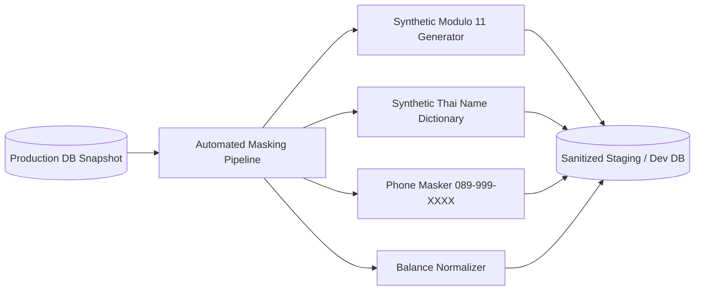

#### Sanitization Rules & Algorithms
- **Thai Corporate Tax IDs & Citizen IDs**:
  Must be replaced with synthetic 13-digit numbers that pass the Modulo 11 check algorithm to prevent breaking client-side validation suites.
  ```typescript
  // generateSyntheticThaiId creates valid synthetic 13-digit IDs for QA/test pipelines
  export function generateSyntheticThaiId(seed: number): string {
    let s = seed;
    const nextRand = () => {
      s = (s * 9301 + 49297) % 233280;
      return Math.floor((s / 233280) * 10);
    };
    const digits: number[] = new Array(13);
    digits[0] = 0; // Synthetic prefix for non-prod
    for (let i = 1; i < 12; i++) {
      digits[i] = nextRand();
    }
    let sum = 0;
    for (let i = 0; i < 12; i++) {
      sum += digits[i] * (13 - i);
    }
    digits[12] = (11 - (sum % 11)) % 10;
    return digits.join('');
  }
  ```
- **Company & Contractor Names**: Replaced with synthetic Thai business names from an anonymization dictionary (e.g. `บริษัท ช่างทองพัฒนา จำกัด`, `หจก. ทรัพย์การช่างรุ่งเรือง`).
- **Phone Numbers**: Formatted to dummy sequences: `089-999-XXXX`.
- **Addresses**: Sanitized to generic Thai provincial addresses while preserving valid Tambon/Amphur/Province combinations to keep the Freight Zone Engine functional.

---

### 4.3 Thai Alphabetical Collation Standard

#### Royal Institute Sorting Rules
Under the Royal Institute Dictionary of the Kingdom of Thailand, sorting operates as follows:
- **Consonants**: ก, ข, ฃ, ค, ฅ, ฆ, ง, จ, ฉ, ช, ซ, ฌ, ญ, ฎ, ฏ, ฐ, ฑ, ฒ, ณ, ด, ต, ถ, ท, ธ, น, บ, ป, ผ, ฝ, พ, ฟ, ภ, ม, ย, ร, ฤ, ฤๅ, ล, ฦ, ฦๅ, ว, ศ, ษ, ส, ห, ฬ, อ, ฮ.
- **Pre-posed Vowels (สระหน้า)**: เ, แ, โ, ใ, ไ are physically written before the initial consonant, but phonetically pronounced after it.
- **Standard Collation**: A word starting with a pre-posed vowel must be collated under its consonant, not before ก.
  *(Example: "เกษม" must sort under "ก", after "กวาด" and before "ขจร")*.

#### Database & Runtime Implementation
```sql
-- Mandated PostgreSQL ICU Collation for all Thai text columns
CREATE COLLATION thai_icu (
    provider = icu,
    locale = 'th-TH-x-icu'
);

ALTER TABLE catalog_items ALTER COLUMN thai_name TYPE VARCHAR(500) COLLATE thai_icu;
ALTER TABLE customer_master ALTER COLUMN legal_name TYPE VARCHAR(500) COLLATE thai_icu;
```

---

### 4.4 Timezone Normalization & Fiscal Day Boundaries

#### Temporal Standards
1. **Database Persistence**: All timestamps strictly use `TIMESTAMPTZ` and are stored in UTC (`+00:00`).
2. **API Communication**: Extended ISO-8601 format with explicit `Z` UTC indicator: `2026-09-09T03:25:00.000Z`.
3. **Client Presentation**: Localized into `Asia/Bangkok` (UTC+07:00).
4. **Buddhist Era (BE) Conversion**: UI and official tax documents render years as $BE = CE + 543$ (e.g. $2026 + 543 = 2569$). Storage remains standard Gregorian.

#### Fiscal Day Boundary Rule
The Thai business and tax day ends at **23:59:59 Asia/Bangkok**, which aligns with **16:59:59 UTC**.
Daily sales summaries, VAT sales registers (รายงานภาษีขาย ภ.พ.30), and nightly GL reconciliation must execute against this exact boundary:
```sql
-- Fiscal Day Boundary Query for 2026-09-09 (Asia/Bangkok)
SELECT * FROM tax_invoices
WHERE created_at >= '2026-09-08 17:00:00.000000+00'
  AND created_at <= '2026-09-09 16:59:59.999999+00'
  AND status = 'POSTED';
```

---

### 4.5 Decimal Precision & Banker's Rounding Standard

#### Absolute Ban on Floating-Point Primitives
The use of IEEE 754 floating-point types (`float`, `double`, `Float32`, `Float64`) is **strictly forbidden** in financial, inventory, and tax calculation code.

#### Precision Matrix

| Field Domain | Database Type | Precision / Scale | Permitted Variance |
|---|---|---|---|
| Unit Prices (Base & Net) | `NUMERIC(18, 4)` | 18 digits, 4 decimals | 0.0000 THB |
| Extended Line Amounts | `NUMERIC(18, 4)` | 18 digits, 4 decimals | 0.0000 THB |
| Document Grand Totals | `NUMERIC(18, 2)` | 18 digits, 2 decimals | 0.00 THB |
| Statutory VAT Amounts | `NUMERIC(18, 2)` | 18 digits, 2 decimals | $\le 0.01$ THB (Reconciled) |
| Discrete Inventory Units | `NUMERIC(14, 4)` | 14 digits, 4 decimals | 0.0000 Units |
| Bulk Weight Quantities | `NUMERIC(14, 4)` | 14 digits, 4 decimals | 0.0000 kg / Tons |
| Percentages & Rates | `NUMERIC(8, 4)` | 8 digits, 4 decimals | 0.0000 % |

#### Line Rounding & Document VAT Reconciliation Algorithm
Intermediate calculations operate at 4 decimal places. Line VAT is rounded to 2 decimal places using `ROUND_HALF_UP` (Banker's Rounding).
To comply with Revenue Department audit inspections, the sum of line VATs must reconcile with the document taxable base $\times 7\%$:

```typescript
import Decimal from 'decimal.js';

// Configure Decimal precision and rounding mode globally (20 digits, Banker's Rounding)
Decimal.set({ precision: 20, rounding: Decimal.ROUND_HALF_UP });

export interface InvoiceLineItem {
  lineNumber: number;
  netPrice: Decimal;    // Strict String Ingestion: new Decimal('155.0000')
  quantity: Decimal;    // Strict String Ingestion: new Decimal('250.0000')
  taxableAmount: Decimal;
  vatAmount: Decimal;
}

/**
 * reconcileDocumentVat adjusts penny rounding discrepancies on the largest line item
 * to strictly reconcile sum of lines with document taxableTotal * 7% per RD audit standards.
 */
export function reconcileDocumentVat(
  taxableTotal: Decimal,
  lines: InvoiceLineItem[],
  vatRateString: string = '0.0700'
): InvoiceLineItem[] {
  const vatRate = new Decimal(vatRateString); // Strict String Ingestion - Zero IEEE 754 float
  const expectedTotalVat = taxableTotal.mul(vatRate).toDecimalPlaces(2, Decimal.ROUND_HALF_UP);

  let computedSumVat = new Decimal('0.00');
  let maxLineIdx = 0;
  let maxLineTaxable = new Decimal('-1.00');

  for (let i = 0; i < lines.length; i++) {
    const lineTaxable = lines[i].netPrice.mul(lines[i].quantity).toDecimalPlaces(2, Decimal.ROUND_HALF_UP);
    const lineVat = lineTaxable.mul(vatRate).toDecimalPlaces(2, Decimal.ROUND_HALF_UP);
    lines[i].taxableAmount = lineTaxable;
    lines[i].vatAmount = lineVat;
    computedSumVat = computedSumVat.plus(lineVat);

    if (lineTaxable.greaterThan(maxLineTaxable)) {
      maxLineTaxable = lineTaxable;
      maxLineIdx = i;
    }
  }

  const diff = expectedTotalVat.minus(computedSumVat);
  if (!diff.isZero()) {
    // Adjust penny difference on the largest line item per RD reconciliation practice
    lines[maxLineIdx].vatAmount = lines[maxLineIdx].vatAmount.plus(diff);
  }

  return lines;
}
```

---

## 5. Architectural Edge Cases & Operational Resilience

| # | Domain Scenario | Boundary / Failure Condition | Mandated Architectural Behavior |
|---|---|---|---|
| 1 | **I0a Batch Corruption** | Merchandising SFTP feed contains 100k items, but 14 items have null UOM ratios. | Staging engine isolates the 14 invalid items to `item_feed_errors` with code `ERR_INVALID_UOM`; remaining 99,986 valid items are upserted to production without halting the batch. Alert routed to Merchandising Operations. |
| 2 | **I0b Stock Contention** | Two sales reps click "Confirm Order" at the exact same millisecond for 500 bags of cement, with only 600 bags available at Bangna branch. | Redlock serializes the requests. Request 1 acquires lock, decrements stock to 100, and commits. Request 2 detects available (100) < requested (500), rejects with `409 Conflict: Insufficient Stock`, and triggers alternative routing suggestions. |
| 3 | **I0b Soft Lock Orphan** | A sales rep soft-reserves 1,000 bags of cement, but the browser crashes and the contractor never pays. | Soft reservation row has `expires_at = NOW() + 15 min` (900s TTL). After 15 minutes, the scheduled **ReservationReaperTask** reclaims the 1,000 bags back to `available_qty`, marks reservation `EXPIRED`, and publishes `stock.reservation.expired`. |
| 4 | **I0c Invalid Tax ID** | CRM attempts to sync a customer with Tax ID `1234567890123` (invalid Modulo 11 check digit). | Inbound validator rejects payload with `422 Unprocessable Entity`. The customer record is blocked from WDS, and an alert is published to the CRM Data Quality topic. |
| 5 | **I0d POS Split Tender Deficit** | Cashier collects 100,000 THB order: 50,000 Cash and 49,990 Card (10 THB deficit). | WDS settlement engine validates `Sum(Tenders) == OrderTotal`. Detects 10.00 THB shortage, rejects settlement, and prompts cashier to collect remaining balance before printing the Tax Invoice. |
| 6 | **I0e Outbox Network Partition** | Central SAP ERP network is severed during end-of-day invoice posting. | Transactional Outbox preserves journal events in `outbox_events`. Outbox worker backs off exponentially (retries up to 10 times). Local WDS orders and invoices remain intact and immutable; queue drains upon connection recovery. |
| 7 | **Pricing Floor Breach** | Sales rep attempts to sell steel rebar at 18.50 THB/kg when Moving Average Cost is 19.20 THB/kg. | Pricing Engine halts quote generation; displays error `FLOOR_PRICE_BREACH`. Quote moves to `REQUIRES_VP_APPROVAL` status; cannot be dispatched without Commercial VP electronic signature. |
| 8 | **Credit Cheque Bounce** | Bank ICAS notifies Thai Watsadu at 11:30 that a 500,000 THB cheque bounced. | Bounced Cheque Handler transitions account to `CREDIT_FROZEN`, cancels open store pick-lists within 2 seconds, locks warehouse gates, and sends urgent notification to Legal and CFO. |
| 9 | **Tax Invoice Direct SQL Edit** | Rogue DBA or developer attempts `UPDATE tax_invoices SET total_amount = 0 WHERE id = 405` on a posted invoice. | PostgreSQL database trigger intercepts the query and raises SQL exception `ERR-RD-TAX-001: Legally Immutable`. Operation aborts; incident logged to security SIEM. |
| 10 | **Midnight Tax Point Boundary** | Order confirmed and paid at 23:55 Asia/Bangkok on 2026-09-30 (which is 16:55 UTC on 2026-09-30). | System records UTC timestamp `2026-09-30T16:55:00Z` but generates sequence number for September 2569 (`INV-XXXXX-2569-09-XXXXXX`) based on `Asia/Bangkok` timezone, ensuring alignment with September's ภ.พ.30 VAT return. |

---

## 6. Traceability Matrix & Cross-Reference Mapping

| Requirement / Epic | Architectural Component | Interface / Domain | Primary Artifacts & Proof |
|---|---|---|---|
| **E01: Customer & Master Data** | MasterDataModule, Maker-Checker Engine | Domain §3.1, Interface I0c | `stg_merchandising_items`, `audit_event_logs`, `validateThaiTaxId` |
| **E02: Pricing & Promotion Engine** | PricingModule, DOFA Validator | Domain §3.2, C4 L3 §1.3.1 | `FloorPriceGuard`, `FreightZoneCalculator`, `vat_tax_rates` |
| **E03: Credit & Cheque Control** | CreditModule, Exposure Engine | Domain §3.3, C4 L3 §1.3.3 | `InstantaneousExposureCalculator`, `CreditBlockGuard`, `credit_reservations`, PDC state machine |
| **E04: Branch Inventory Allocation** | InventoryModule (DistributedReservationManager, ReservationReaperTask) | Domain §3.4, Interface I0b | Redlock mutex, `stock_reservations` 15-min TTL (900s), 60s reaper |
| **E07: Warehouse & FEFO Management** | InventoryModule (FEFOLotPicker) | Domain §3.4, C4 L3 §1.3.2 | `Algorithm: FEFO_Pallet_Allocation_V2`, shelf-life guard |
| **E08: Quotation & Negotiation** | OrderModule, DOFA Engine | Container §1.2, Domain §3.2 | Quote-to-order state machine, DOFA discount matrix |
| **E10: Billing & Tax Invoicing** | TaxModule, ETDA Signer | Domain §3.5, C4 L3 §1.3.4 | `fn_get_next_tax_invoice_number`, `trg_tax_invoice_immutability` |
| **E12: Direct Sales Dispatch** | OrderModule / IntegrationModule (Store POS, Cashier Gate Token) | Interface I0d, Domain §3.5 | Split tender settlement, dispatch release token barcode |
| **E13: RBAC & Audit Governance** | MasterDataModule (Chained Audit Ledger, RBAC Guard) | Domain §3.1, Security §4.1 | 9 RBAC roles, HMAC-SHA256 chained audit triggers |
| **NFR: Security (OWASP Top 10)** | Reverse Proxy / Ingress, OIDC / WAF, NestJS Guards | Security §4.1 | OWASP Top 10 mitigation matrix, ABAC policies |
| **NFR: Synthetic Data Masking** | Automated Masking Pipeline | Security §4.2 | `generateSyntheticThaiId` Modulo 11 generator |
| **NFR: Thai Collation** | PostgreSQL ICU Engine | Security §4.3 | Collation `th-TH-x-icu`, pre-posed vowel reordering |
| **NFR: Timezone & Day Boundary** | Temporal Engine (`TIMESTAMPTZ`) | Security §4.4 | UTC storage, Asia/Bangkok presentation, 16:59:59 UTC fiscal cut |
| **NFR: Decimal Precision** | Arbitrary-Precision Math Engine | Security §4.5 | Absolute float ban, `NUMERIC(18,4)`, `reconcileDocumentVat` (decimal.js) |

---
*End of Specification — Wholesale & Direct Sales (WDS) System Architecture & High-Level Design*
