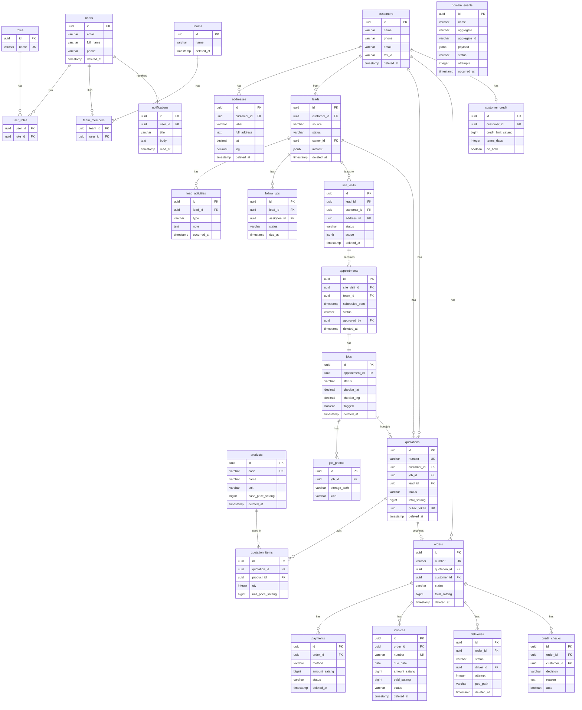

```mermaid
erDiagram
    users {
        uuid id PK
        varchar email
        varchar full_name
        varchar phone
        timestamp deleted_at
    }
    roles {
        uuid id PK
        varchar name UK
    }
    user_roles {
        uuid user_id FK
        uuid role_id FK
    }
    customers {
        uuid id PK
        varchar name
        varchar phone
        varchar email
        varchar tax_id
        timestamp deleted_at
    }
    addresses {
        uuid id PK
        uuid customer_id FK
        varchar label
        text full_address
        decimal lat
        decimal lng
        timestamp deleted_at
    }
    products {
        uuid id PK
        varchar code UK
        varchar name
        varchar unit
        bigint base_price_satang
        timestamp deleted_at
    }
    leads {
        uuid id PK
        uuid customer_id FK
        varchar source
        varchar status
        uuid owner_id FK
        jsonb interest
        timestamp deleted_at
    }
    lead_activities {
        uuid id PK
        uuid lead_id FK
        varchar type
        text note
        timestamp occurred_at
    }
    follow_ups {
        uuid id PK
        uuid lead_id FK
        uuid assignee_id FK
        varchar status
        timestamp due_at
    }
    site_visits {
        uuid id PK
        uuid lead_id FK
        uuid customer_id FK
        uuid address_id FK
        varchar status
        jsonb scope
        timestamp deleted_at
    }
    appointments {
        uuid id PK
        uuid site_visit_id FK
        uuid team_id FK
        timestamp scheduled_start
        varchar status
        uuid approved_by FK
        timestamp deleted_at
    }
    teams {
        uuid id PK
        varchar name
        timestamp deleted_at
    }
    team_members {
        uuid team_id FK
        uuid user_id FK
    }
    jobs {
        uuid id PK
        uuid appointment_id FK
        varchar status
        decimal checkin_lat
        decimal checkin_lng
        boolean flagged
        timestamp deleted_at
    }
    job_photos {
        uuid id PK
        uuid job_id FK
        varchar storage_path
        varchar kind
    }
    quotations {
        uuid id PK
        varchar number UK
        uuid customer_id FK
        uuid job_id FK
        uuid lead_id FK
        varchar status
        bigint total_satang
        uuid public_token UK
        timestamp deleted_at
    }
    quotation_items {
        uuid id PK
        uuid quotation_id FK
        uuid product_id FK
        integer qty
        bigint unit_price_satang
    }
    orders {
        uuid id PK
        varchar number UK
        uuid quotation_id FK
        uuid customer_id FK
        varchar status
        bigint total_satang
        timestamp deleted_at
    }
    payments {
        uuid id PK
        uuid order_id FK
        varchar method
        bigint amount_satang
        varchar status
        timestamp deleted_at
    }
    invoices {
        uuid id PK
        uuid order_id FK
        varchar number UK
        date due_date
        bigint amount_satang
        bigint paid_satang
        varchar status
        timestamp deleted_at
    }
    deliveries {
        uuid id PK
        uuid order_id FK
        varchar status
        uuid driver_id FK
        integer attempt
        varchar pod_path
        timestamp deleted_at
    }
    customer_credit {
        uuid id PK
        uuid customer_id FK
        bigint credit_limit_satang
        integer terms_days
        boolean on_hold
    }
    credit_checks {
        uuid id PK
        uuid order_id FK
        uuid customer_id FK
        varchar decision
        text reason
        boolean auto
    }
    domain_events {
        uuid id PK
        varchar name
        varchar aggregate
        varchar aggregate_id
        jsonb payload
        varchar status
        integer attempts
        timestamp occurred_at
    }
    notifications {
        uuid id PK
        uuid user_id FK
        varchar title
        text body
        timestamp read_at
    }

    users ||--o{ user_roles : has
    roles ||--o{ user_roles : has
    customers ||--o{ addresses : has
    customers ||--o{ leads : "from"
    leads ||--o{ lead_activities : has
    leads ||--o{ follow_ups : has
    leads ||--o{ site_visits : "leads to"
    site_visits ||--o{ appointments : "becomes"
    teams ||--o{ team_members : has
    users ||--o{ team_members : "is in"
    appointments ||--|| jobs : has
    jobs ||--o{ job_photos : has
    leads ||--o{ quotations : has
    jobs ||--o| quotations : "from job"
    customers ||--o{ quotations : has
    quotations ||--o{ quotation_items : has
    products ||--o{ quotation_items : "used in"
    quotations ||--o| orders : "becomes"
    customers ||--o{ orders : has
    orders ||--o{ payments : has
    orders ||--o{ invoices : has
    orders ||--o{ deliveries : has
    customers ||--o| customer_credit : has
    orders ||--o{ credit_checks : has
    users ||--o{ notifications : receives
```
