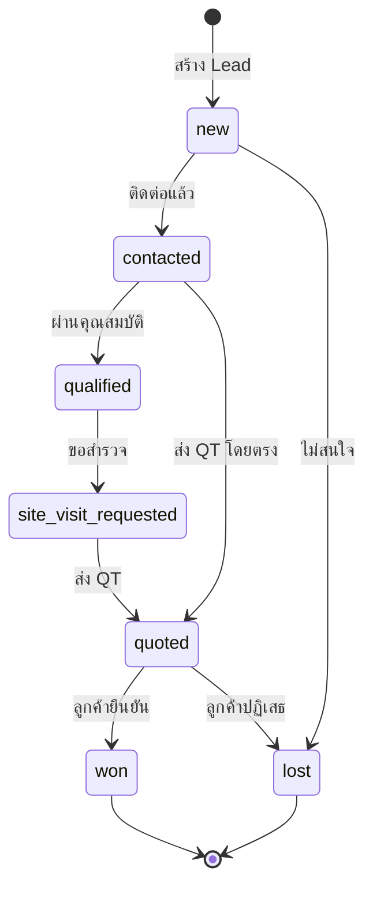
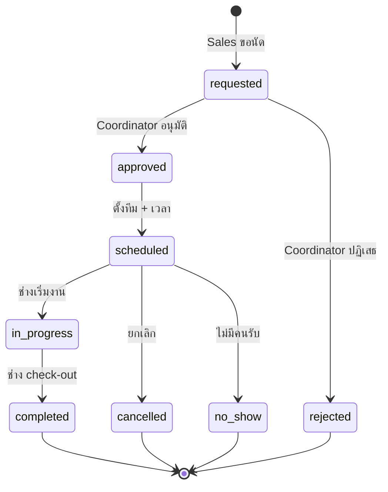
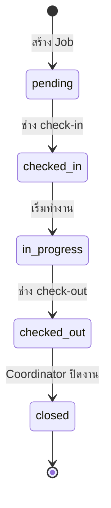
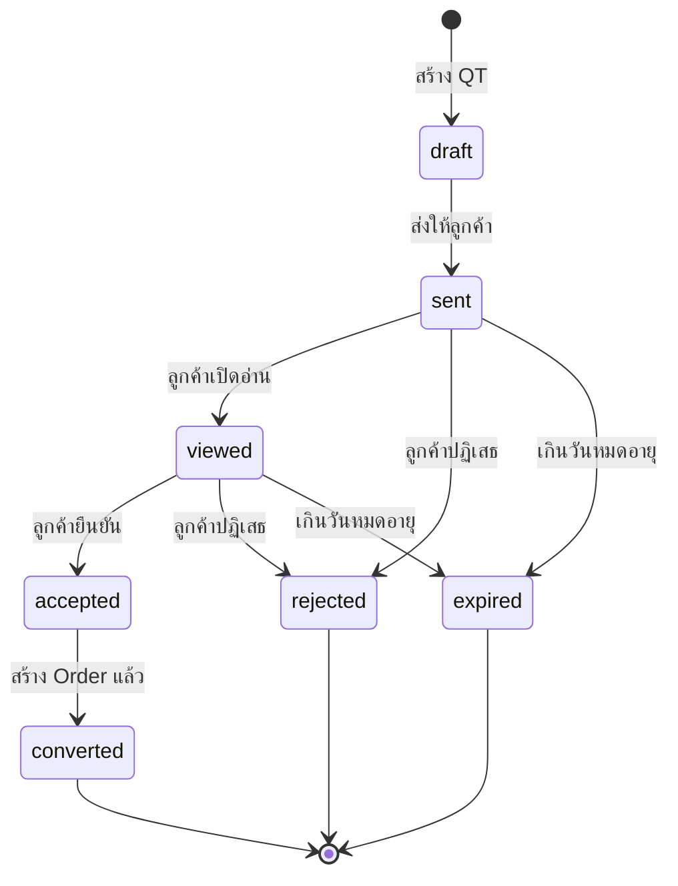
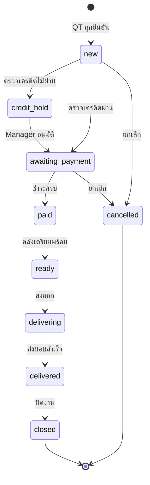
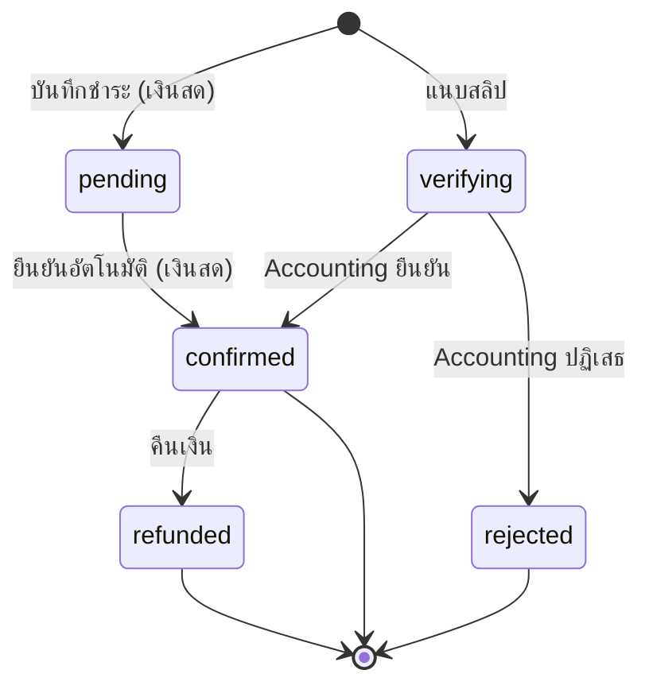
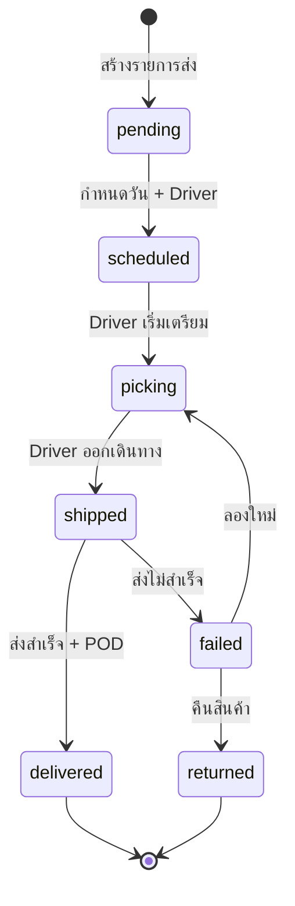

## Lead Status

```mermaid
stateDiagram-v2
    [*] --> new : สร้าง Lead
    new --> contacted : ติดต่อแล้ว
    contacted --> qualified : ผ่านคุณสมบัติ
    qualified --> site_visit_requested : ขอสำรวจ
    site_visit_requested --> quoted : ส่ง QT
    contacted --> quoted : ส่ง QT โดยตรง
    quoted --> won : ลูกค้ายืนยัน
    quoted --> lost : ลูกค้าปฏิเสธ
    new --> lost : ไม่สนใจ
    won --> [*]
    lost --> [*]
```

## Appointment Status

```mermaid
stateDiagram-v2
    [*] --> requested : Sales ขอนัด
    requested --> approved : Coordinator อนุมัติ
    requested --> rejected : Coordinator ปฏิเสธ
    approved --> scheduled : ตั้งทีม + เวลา
    scheduled --> in_progress : ช่างเริ่มงาน
    in_progress --> completed : ช่าง check-out
    scheduled --> cancelled : ยกเลิก
    scheduled --> no_show : ไม่มีคนรับ
    completed --> [*]
    rejected --> [*]
    cancelled --> [*]
    no_show --> [*]
```

## Job Status

```mermaid
stateDiagram-v2
    [*] --> pending : สร้าง Job
    pending --> checked_in : ช่าง check-in
    checked_in --> in_progress : เริ่มทำงาน
    in_progress --> checked_out : ช่าง check-out
    checked_out --> closed : Coordinator ปิดงาน
    closed --> [*]
```

## Quotation Status

```mermaid
stateDiagram-v2
    [*] --> draft : สร้าง QT
    draft --> sent : ส่งให้ลูกค้า
    sent --> viewed : ลูกค้าเปิดอ่าน
    viewed --> accepted : ลูกค้ายืนยัน
    viewed --> rejected : ลูกค้าปฏิเสธ
    sent --> rejected : ลูกค้าปฏิเสธ
    sent --> expired : เกินวันหมดอายุ
    viewed --> expired : เกินวันหมดอายุ
    accepted --> converted : สร้าง Order แล้ว
    converted --> [*]
    rejected --> [*]
    expired --> [*]
```

## Order Status

```mermaid
stateDiagram-v2
    [*] --> new : QT ถูกยืนยัน
    new --> credit_hold : ตรวจเครดิตไม่ผ่าน
    new --> awaiting_payment : ตรวจเครดิตผ่าน
    credit_hold --> awaiting_payment : Manager อนุมัติ
    awaiting_payment --> paid : ชำระครบ
    paid --> ready : คลังเตรียมพร้อม
    ready --> delivering : ส่งออก
    delivering --> delivered : ส่งมอบสำเร็จ
    delivered --> closed : ปิดงาน
    new --> cancelled : ยกเลิก
    awaiting_payment --> cancelled : ยกเลิก
    closed --> [*]
    cancelled --> [*]
```

## Payment Status

```mermaid
stateDiagram-v2
    [*] --> pending : บันทึกชำระ (เงินสด)
    [*] --> verifying : แนบสลิป
    pending --> confirmed : ยืนยันอัตโนมัติ (เงินสด)
    verifying --> confirmed : Accounting ยืนยัน
    verifying --> rejected : Accounting ปฏิเสธ
    confirmed --> refunded : คืนเงิน
    confirmed --> [*]
    rejected --> [*]
    refunded --> [*]
```

## Delivery Status

```mermaid
stateDiagram-v2
    [*] --> pending : สร้างรายการส่ง
    pending --> scheduled : กำหนดวัน + Driver
    scheduled --> picking : Driver เริ่มเตรียม
    picking --> shipped : Driver ออกเดินทาง
    shipped --> delivered : ส่งสำเร็จ + POD
    shipped --> failed : ส่งไม่สำเร็จ
    failed --> picking : ลองใหม่
    failed --> returned : คืนสินค้า
    delivered --> [*]
    returned --> [*]
```
