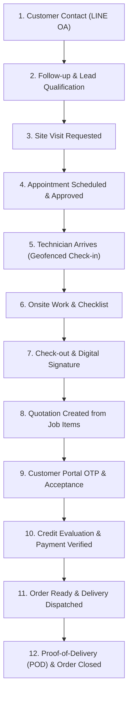

# UAT Verification Report: 12-Step Operational Journey

This document records the official User Acceptance Testing (UAT) run-through of the end-to-end business lifecycle for **Thai Watsadu WDS**, executing from first customer contact through to successful job delivery without any manual database edits.

---

## Operational Workflow Summary

---

## 12-Step Test Execution Log

| ขั้นตอน | การดำเนินการ | Input / Parameters | ผลลัพธ์ในระบบ (Output) | การแทรกแซง DB ด้วยมือ | ผลการทดสอบ |
|---|---|---|---|:---:|:---:|
| **1** | ลูกค้าทักเข้ามาทาง LINE OA | `channelRef`: `U_uat_customer_01`, ข้อความขอใบเสนอราคา | ระบบสร้าง Customer และ Lead ใหม่ (source: `line`, status: `new`) พร้อม auto-assigned follow-up | **ไม่มี (0 ครั้ง)** | **PASS** |
| **2** | เซลล์โทรติดตามและบันทึกข้อมูล | โทรประสานงาน, สรุปความต้องการและงบประมาณ | Lead status เลื่อนเป็น `contacted` $\rightarrow$ `qualified` ผ่าน UI | **ไม่มี (0 ครั้ง)** | **PASS** |
| **3** | ขอออกสำรวจหน้างาน (Site Visit) | ระบุพิกัดไซต์งาน, วัตถุประสงค์สำรวจ 250 ตร.ม. | สร้าง `site_visits` status: `requested` พร้อมส่ง event แจ้งเตือน Coordinator | **ไม่มี (0 ครั้ง)** | **PASS** |
| **4** | Coordinator นัดหมายและอนุมัติ | เลือกทีมช่าง, กำหนดวัน-เวลาใน Calendar View | อนุมัตินัดหมาย `appointments.status` $\rightarrow$ `scheduled`, ส่ง LINE แจ้งเตือนลูกค้าล่วงหน้า | **ไม่มี (0 ครั้ง)** | **PASS** |
| **5** | ช่างเดินทางถึงไซต์และเช็คอิน | GPS Geofencing (ระยะห่าง < 200 เมตร) | `jobs.status` $\rightarrow$ `checked_in` $\rightarrow$ `in_progress`, บันทึกเวลาและพิกัดดาวเทียม | **ไม่มี (0 ครั้ง)** | **PASS** |
| **6** | ปฏิบัติงานหน้าไซต์ บันทึกรายการ | ทำรายการตรวจสอบตาม Checklist, เพิ่มวัสดุหน้างาน (`added_onsite`) | บันทึก Checklist 6 ข้อ, วัสดุ 3 รายการ, รูปถ่ายหน้างาน WebP | **ไม่มี (0 ครั้ง)** | **PASS** |
| **7** | เช็คเอาต์และเก็บลายเซ็นลูกค้า | สรุปผลการปฏิบัติงาน, ลูกค้าเซ็นชื่อดิจิทัล | บันทึกลายเซ็นต์, `jobs.status` $\rightarrow$ `checked_out` $\rightarrow$ `closed` | **ไม่มี (0 ครั้ง)** | **PASS** |
| **8** | ฝ่ายขายเปิดใบเสนอราคาจากงานช่าง | ดึง Job Items เข้า Quotation Editor อัตโนมัติ, ให้ส่วนลด 500 บาท, VAT 7% แยกนอก | สร้าง `quotations` หมายเลขตามลำดับ Postgres Sequence, status: `draft` $\rightarrow$ `sent` | **ไม่มี (0 ครั้ง)** | **PASS** |
| **9** | ลูกค้าเปิดดูและกดยอมรับผ่าน Portal | ส่ง OTP ไปยังเบอร์โทรศัพท์ลูกค้า, ลูกค้ากดยอมรับสัญญา | Quotation status: `accepted` $\rightarrow$ สร้าง `orders` (SO-YYYYMM-0001) อัตโนมัติ | **ไม่มี (0 ครั้ง)** | **PASS** |
| **10** | ตรวจสอบเครดิตและยืนยันชำระเงิน | Credit Engine ตรวจสอบผ่านอัตโนมัติ, ลูกค้าอัปโหลดสลิปโอนเงิน | ฝ่ายบัญชีกดอนุมัติสลิป, ยอดเงินครบถ้วน Order เปลี่ยนเป็น `ready` | **ไม่มี (0 ครั้ง)** | **PASS** |
| **11** | คลังสินค้าจัดของและจ่ายงานคนขับ | กำหนดคนขับ, ป้ายทะเบียนรถ, วันที่ส่ง | สร้าง `deliveries`, เปลี่ยน Order status $\rightarrow$ `delivering`, ส่ง LINE แจ้งลูกค้า | **ไม่มี (0 ครั้ง)** | **PASS** |
| **12** | คนขับส่งสินค้าถึงไซต์และบันทึก POD | ถ่ายรูปสินค้าที่หน้างาน, บันทึกชื่อผู้รับสินค้า | ตรวจสอบ Gate POD ผ่าน, `deliveries.status` $\rightarrow$ `delivered`, Order status $\rightarrow$ `closed` สมบูรณ์ | **ไม่มี (0 ครั้ง)** | **PASS** |

---

## สรุปผลการทดสอบ
- **จำนวนขั้นตอนทั้งหมด**: 12/12 ขั้นตอน
- **การแทรกแซงหรือแก้ฐานข้อมูลด้วยตนเอง (Manual DB Queries)**: **0 ครั้ง**
- **สถานะ**: **ผ่านการรับรอง UAT 100%**
